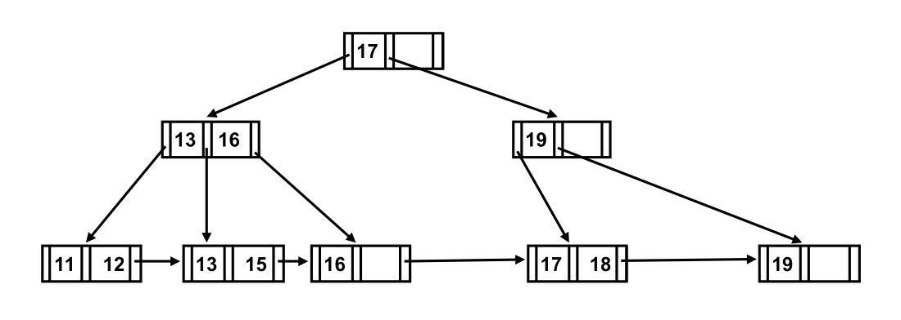
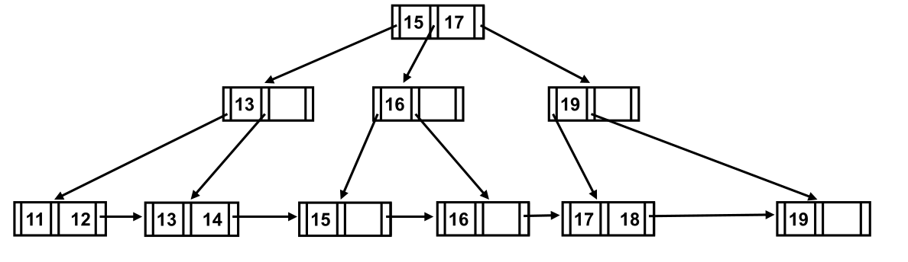
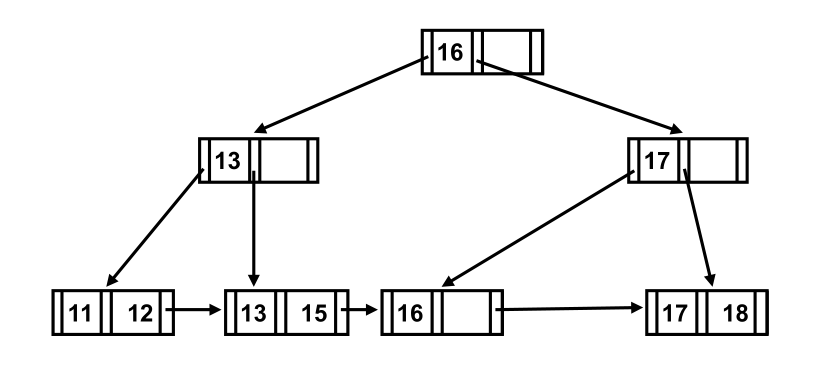

# 浙江大学**2025–2026** 学年春夏季学期

## 《数据库系统》课程课堂测试四

(Quiz 4 for Database Systems)

考生姓名：　　　　　学号：　　　　　专业：　　　　　得分：

**Problem 1.** For the following B+ tree (n=3):

(1) Draw the B+ tree after inserting entry 14 to the original tree. (15 points)

(2) Draw the B+ tree after deleting entry 19 from the original tree. (15 points)

(3) Assume that the B+ tree contains 1000 index items, please estimate the height of the B+ tree. (5 points)

(4) Assume that the B+ tree contains 1000 index items, please estimate the size (i.e. the number of nodes) of the B+ tree. (5 points)

(1) Answers:

(2) Answers:

(3) Answers:

$\left\lceil \log_3 \frac{1000}{2} \right\rceil + 1 \le \text{height} \le \left\lceil \log_{\left\lceil\frac{3}{2}\right\rceil} 1000 \right\rceil + 1$

$8 \le \text{height} \le 11$

Or

$7 \le \text{height} \le 10$

(4) Answers:

$\text{size} \ge 500 + 167 + 56 + 19 + 7 + 3 + 1 = 753$

$\text{size} \le 1000 + 500 + 250 + 125 + 62 + 31 + 15 + 7 + 3 + 1 = 1994$

$753 \le \text{size} \le 1994$

**Problem 2.** A relation *r* has 400 blocks. Available memory is 20 blocks (i.e., M=20). External sort-merge is used to sort *r*. During the external sort-merge:

(1) What are the numbers of created runs for *r*? (15 points)

(2) What are the numbers of merge passes for *r*? (15 points)

(1) Answers: The numbers of created runs are 400/20=20.

(2) Answers: As 20 > M-1, The numbers of merge passes are $\left\lceil \log_{M-1} 20 \right\rceil = 2$.

**Problem 3.** Suppose that a B+-tree index on *building* is available on relation *department* and that no other index is available. What would be the best way to execute the following selections that involve negation based on the B+-tree index? (30 points)

(1)

$$
\sigma_{\neg(\text{build}<\text{"Watson"})}(\mathit{department})
$$

(2)

$$
\sigma_{\neg(\text{building}=\text{"Watson"})}(\mathit{department})
$$

(3)

$$
\sigma_{\neg(\text{build}<\text{"Watson"} \lor \text{budget}<50000)}(\mathit{department})
$$

(1) Use the index to locate the first tuple whose <em>building</em> field has value “Watson”. From this tuple, follow the pointer chains till the end, retrieving all the tuples.

(2) For this query, the index serves no purpose. We can scan the file sequentially and select all tuples whose <em>building</em> field is anything other than “Watson”.

(3) This query is equivalent to the query:

$\sigma_{\text{building}\ge\text{"Watson"} \land \text{budget}\ge50000}(\mathit{department})$

Using the <em>building</em> index, we can retrieve all tuples with <em>building</em> value greater than or equal to “Watson” by following the pointer chains from the first “Watson” tuple. We also apply the additional criteria of budget $\ge$ 50000 on every tuple.
