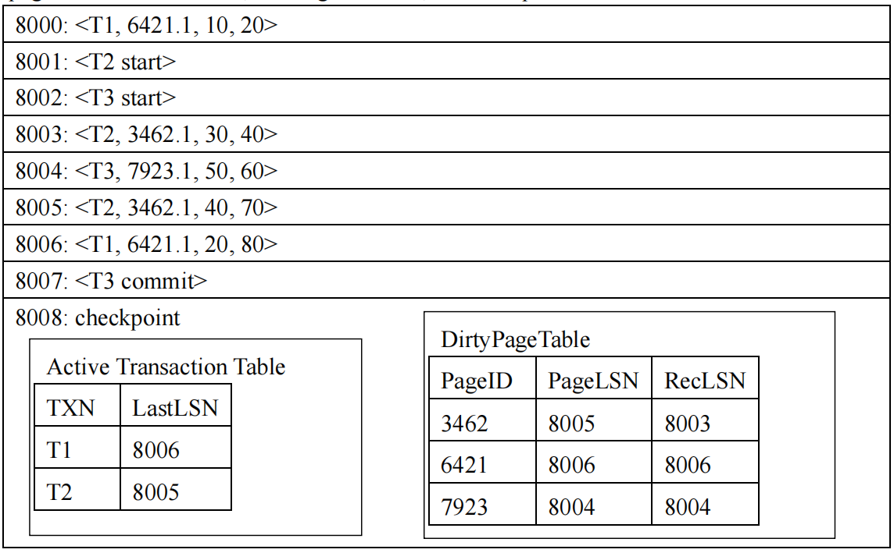
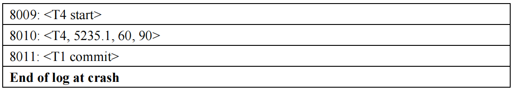

# 浙江大学2025–2026 学年春夏季学期
## 《数据库系统》课程课堂测试五
(Quiz 5 for Database Systems)
考生姓名:
学号:
专业:
得分:

## Problem 1
There are two relations $r$ (100 blocks) and $S$ (20 blocks), and hash-join algorithm is used to perform natural join between these two relations (memory size $M=6$ blocks). Please answer the following questions:

(1) How many partitions can be constructed? Why? (10 points)  
(2) Which relation is best to choose as the build relation? Why? (10 points)  
(3) Is recursive partition needed? Why? (15 points)  
(4) Please compute the cost (numbers of seeks and block transfers) of the hash-join. (15 points)  

- (1) 5 partitions, as the number of partitions is $M-1$.
- (2) Relation $s$, as relation $s$ is smaller than relation $r$.
- (3) Recursive partition is not needed, as the size of the partitions of relation $s$ (i.e., 4) is less than or equal to $M-2$ (i.e., 4).
- (4) Number of block transfers: $3 \times(100+20)+4 \times5$
Note: $4 \times5$ is not necessary, which considers partially filled blocks.
Number of seeks: $2 \times(100+20)+2 \times5$

## Problem 2
Suppose a DBMS uses the ARIES method for crash recovery. You are given part of the log file at the time of a system crash, where each log record may contain the transaction ID, the page ID and slot number, the original value, and the updated value.

Suppose that the PageLSN of each page on disk is less than 8000. Given this information, answer the following questions:

(1) During the analysis pass, what record is added to the DirtyPageTable? (10 points)  
(2) Which log record is the first to be redone in the redo pass? (10 points)  
(3) What log records should be appended to the log file during recovery? For CLR (compensation log records), you should provide the transaction ID, the page ID and slot number, and the original value (i.e., the value to be recovered). (15 points)  
(4) After recovery, what are the values of locations 3462.1 and 6421.1, respectively? (15 points)

- (1) (5235, 8010, 8010). Log 8010 modifies page 5235, which should be added to the DirtyPageTable.
- (2) 8003, which is the smallest RecLSN in the DirtyPageTable.
- (3) $<T4, 5235.1, 60>$, $<T2, 3462.1, 40>$, $<T2, 3462.1, 30>$.
       The active transaction table after the analysis pass contains T2 and T4. The related update records should be undone.
- (4) 30, 80. Location 3462.1 is modified by T2, which is undone. Location 6421.1 is modified by T1, which is committed.