## 数据存储结构

在第 12 章中我们学习了物理存储介质的特性，重点研究了磁盘和固态硬盘，并了解了在 RAID 结构中如何使用多个磁盘来开发快速可靠的存储系统。在本章中，我们重点介绍存储在底层存储介质上的数据的组织，以及如何访问数据。

## 13.1 数据库存储架构

持久性数据存储在非易失性存储器中，正如我们在第12章中看到的，它们通常是磁盘或固态硬盘。磁盘和固态硬盘都是块结构设备，也就是说，以块为单位读或写数据。相反地，数据库则处理记录，它通常比块小很多（尽管在某些情况下记录可能有些非常大的属性）。

大多数数据库使用操作系统文件作为存储记录的中间层，它抽象出底层块的一些细节。可是，为了保证有效访问，同时支持故障恢复（我们将在第19章介绍），数据库也必须了解块。因此，在13.2节中，我们学习单条记录是如何存储在文件中的，并考虑块的结构。

给定一个记录的集合，接下来需要决定如何在文件结构中组织它们；例如，它们可以按顺序存储，比如按它们被创建的时间顺序，或者按任意顺序。13.3节将学习几种备选的文件组织方案。

随后，13.4节将介绍数据库如何组织数据字典中关于关系模式和存储组织的数据。数据字典中的信息对很多任务都至关重要，例如，当给定关系名称时定位并检索此关系的记录。

CPU 要访问的数据必须在主存中，然而持久性数据必须驻留在非易失性存储器上，如磁盘或固态硬盘。对于那些比主存还大的数据库（这是一种常见的情况），数据必须从非易失性存储器中获取，并且如果数据被更新则还要保存回去。13.5节描述了数据库如何利用被称作数据库缓冲区的一块内存区域去存储从非易失性存储器中获取的块。

一种数据存储方法是将特定列的所有值存储在一起，而不是将特定行的所有属性存储在一起，此方法已被发现对于分析型查询处理非常管用。这种想法被称作面向列的存储（column-oriented storage），我们将在13.6节中讨论。

一些应用需要快速访问数据，并且数据规模足够小，使得整个数据库可以放入数据库服务器机的主存中。在这种情况下，我们可以在内存中保存整个数据库的一个副本 $^{①}$ 。能把整个数据库存储在内存中并且能够优化内存数据结构和查询处理以及其他被数据库使用的算法以便利用内存驻留的数据，这种数据库被称为主存数据库（main-memory database）。主存数据库中的存储组织将在13.7节进行讨论。我们注意到，允许直接访问单独字节或者缓存行的非易失性内存被称为存储级内存（storage class memory），它正在开发中。主存数据库架构能针对此存储进行进一步优化。

## 13.2 文件组织

一个数据库被映射为多个不同的文件，这些文件由底层的操作系统来维护。这些文件永久地驻留在磁盘上。一个文件（file）在逻辑上被组织为记录的一个序列。这些记录被映射到磁盘块上。在操作系统中文件被作为一种基本结构来提供，所以我们将假定底层的文件系统（file system）是存在的。我们需要考虑用文件来表示逻辑数据模型的不同方式。

每个文件还从逻辑上被分成定长的存储单元，称为块（block）。块是存储分配和数据传输的单位。大多数数据库在缺省情况下使用4至8 KB的块规模，但是当创建数据库实例时，许多数据库允许指定块的规模。更大的块规模在某些数据库应用中是有用的。

一个块可能包括几条记录；一个块所包含的确切的记录集合是由所使用的物理数据组织形式来决定的。我们假定没有比块更大的记录。这个假定对多数数据处理应用都是现实的，例如我们的大学示例。当然，还有几种大数据项的类型，例如图像，它可能比一个块要大很多。在13.2.2节我们会简要地讨论如何通过单独存储大数据项并在记录中存储指向该数据项的指针来处理这种大的数据项。

此外, 我们还要求每条记录被完全包含在单个块中; 换句话说, 没有记录是一部分包含在一个块中, 另一部分包含在另一个块中的。这个限制简化并加快了对数据项的访问。

在关系数据库中, 不同关系的元组通常具有不同的规模。把数据库映射到文件的一种方法是使用多个文件, 在任意给定的文件中只存储一种固定长度的记录。另一种选择是构造自己的文件, 使之能够容纳多种长度的记录; 然而, 定长记录文件比变长记录文件更容易实现。用于定长记录文件的很多技术可以应用到变长的情况。因此, 我们首先考虑定长记录文件, 随后考虑变长记录的存储。

## 13.2.1 定长记录

作为一个示例，让我们考虑由我们的大学数据库中的 instructor 记录构成的一个文件。此文件中的每条记录（伪码形式）被定义为：

type instructor = record
    ID varchar (5);
    name varchar(20);
    dept_name varchar (20);
    salary numeric (8,2);
end 

假设每个字符占1个字节，numeric(8,2)占8个字节。假设我们为属性ID、name和dept_name分配每个属性可以容纳的最大字节数，而不是分配可变的字节数。那么，instuctor记录占53个字节。一种简单的方法是使用头53个字节来存储第一条记录，接下来的53个字节存储第二条记录，以此类推（见图13-1）。

然而这种简单的方法存在两个问题：

1. 除非块的大小恰好是 53 的倍数（这是不太可能的），否则一些记录会跨过块的边界，即一条记录的一部分存储在一个块中，另一部分存储在另一个块中。于是，读或写这样一条记录就需要两次块访问。

2. 从这种结构中删除一条记录是困难的。被删除记录所占据的空间必须由文件中的其他记录来填充，或者我们必须用一种方式来标记被删除的记录以使得它们可以被忽略。为了避免第一个问题，我们在一个块中只分配它能完整容纳的最多记录的数目（这个数目可以容易地通过将块大小除以记录大小计算出来，并抛弃小数部分)。每个块中余下的字节就不被使用了。

<table><tr><td>记录0</td><td>10101</td><td>Srinivasan</td><td>Comp. Sci.</td><td>65000</td></tr><tr><td>记录1</td><td>12121</td><td>Wu</td><td>Finance</td><td>90000</td></tr><tr><td>记录2</td><td>15151</td><td>Mozart</td><td>Music</td><td>40000</td></tr><tr><td>记录3</td><td>22222</td><td>Einstein</td><td>Physics</td><td>95000</td></tr><tr><td>记录4</td><td>32343</td><td>El Said</td><td>History</td><td>60000</td></tr><tr><td>记录5</td><td>33456</td><td>Gold</td><td>Physics</td><td>87000</td></tr><tr><td>记录6</td><td>45565</td><td>Katz</td><td>Comp. Sci.</td><td>75000</td></tr><tr><td>记录7</td><td>58583</td><td>Califieri</td><td>History</td><td>62000</td></tr><tr><td>记录8</td><td>76543</td><td>Singh</td><td>Finance</td><td>80000</td></tr><tr><td>记录9</td><td>76766</td><td>Crick</td><td>Biology</td><td>72000</td></tr><tr><td>记录10</td><td>83821</td><td>Brandt</td><td>Comp. Sci.</td><td>92000</td></tr><tr><td>记录11</td><td>98345</td><td>Kim</td><td>Elec. Eng.</td><td>80000</td></tr></table>

图 13-1 包含 instructor 记录的文件

当一条记录被删除时, 我们可以把紧跟其后的记录移动到被删记录先前占据的空间中,依此类推, 直到被删记录后面的每条记录都向前做了移动 (见图 13-2)。这种方式需要移动大量的记录。简单地将文件的最后一条记录移到被删记录所占据的空间中可能更容易一些(见图 13-3)。

<table><tr><td>记录0</td><td>10101</td><td>Srinivasan</td><td>Comp. Sci.</td><td>65000</td></tr><tr><td>记录1</td><td>12121</td><td>Wu</td><td>Finance</td><td>90000</td></tr><tr><td>记录2</td><td>15151</td><td>Mozart</td><td>Music</td><td>40000</td></tr><tr><td>记录4</td><td>32343</td><td>El Said</td><td>History</td><td>60000</td></tr><tr><td>记录5</td><td>33456</td><td>Gold</td><td>Physics</td><td>87000</td></tr><tr><td>记录6</td><td>45565</td><td>Katz</td><td>Comp. Sci.</td><td>75000</td></tr><tr><td>记录7</td><td>58583</td><td>Califieri</td><td>History</td><td>62000</td></tr><tr><td>记录8</td><td>76543</td><td>Singh</td><td>Finance</td><td>80000</td></tr><tr><td>记录9</td><td>76766</td><td>Crick</td><td>Biology</td><td>72000</td></tr><tr><td>记录10</td><td>83821</td><td>Brandt</td><td>Comp. Sci.</td><td>92000</td></tr><tr><td>记录11</td><td>98345</td><td>Kim</td><td>Elec. Eng.</td><td>80000</td></tr></table>

图 13-2 针对图 13-1 中的文件，删除记录 3 并且移动其后所有记录

<table><tr><td>记录0</td><td>10101</td><td>Srinivasan</td><td>Comp. Sci.</td><td>65000</td></tr><tr><td>记录1</td><td>12121</td><td>Wu</td><td>Finance</td><td>90000</td></tr><tr><td>记录2</td><td>15151</td><td>Mozart</td><td>Music</td><td>40000</td></tr><tr><td>记录11</td><td>98345</td><td>Kim</td><td>Elec. Eng.</td><td>80000</td></tr><tr><td>记录4</td><td>32343</td><td>El Said</td><td>History</td><td>60000</td></tr><tr><td>记录5</td><td>33456</td><td>Gold</td><td>Physics</td><td>87000</td></tr><tr><td>记录6</td><td>45565</td><td>Katz</td><td>Comp. Sci.</td><td>75000</td></tr><tr><td>记录7</td><td>58583</td><td>Califieri</td><td>History</td><td>62000</td></tr><tr><td>记录8</td><td>76543</td><td>Singh</td><td>Finance</td><td>80000</td></tr><tr><td>记录9</td><td>76766</td><td>Crick</td><td>Biology</td><td>72000</td></tr><tr><td>记录10</td><td>83821</td><td>Brandt</td><td>Comp. Sci.</td><td>92000</td></tr></table>

图 13-3 针对图 13-1 中的文件，删除记录 3 并且移动最后一条记录

移动记录以占据被删记录所释放的空间的做法并不理想，因为这样做需要额外的块访问。由于插入通常比删除更频繁，因此让被删记录所占据的空间空着，一直等到后面的插入操作重新使用这个空间，这样做是可以接受的。仅在被删记录上做一个简单的标记是不够的，因为当执行插入时，很难找到这个可用的空间。因此我们需要引入额外的结构。

在文件的开头, 我们分配特定数量的字节作为文件头 (file header)。文件头将包含有关文件的各种信息。到目前为止, 我们需要在文件头中存储的只有内容被删除的第一条记录的地址。我们用这第一条记录来存储第二条可用记录的地址, 依次类推。我们可以直观地把这些存储的地址看作指针 (pointer), 因为它们指向一条记录的位置。于是, 被删除的记录形成了一条链表, 通常称为自由链表 (free list)。图 13-4 给出的是图 13-1 中的文件在删除第 1、4 和 6 条记录后的自由链表。

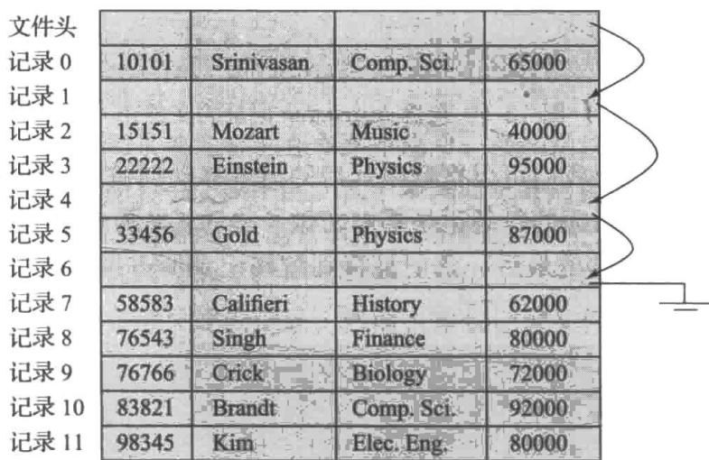

图 13-4 针对图 13-1 中的文件，删除第 1、4 和 6 条记录后的自由链表

在插入一条新记录时，我们使用文件头所指向的记录，并改变文件头的指针以指向下一条可用记录。如果没有可用的空间，我们就把新记录加到文件末尾。

对定长记录文件的插入和删除很容易实现，因为被删除记录留出的空间恰好是插入记录所需要的空间。如果我们允许文件中的记录是变长的，这样的匹配将不再成立。被插入的记录可能无法放入一条被删除记录所释放的空间中，或者它只能占用这个空间的一部分。

## 13.2.2 变长记录

变长记录（variable-length record）在数据库系统中的出现有几个原因。最常见的原因是变长域的出现，比如字符串。其他的原因包括包含重复域的记录类型（比如数组或者多重集合），以及文件中多种记录类型的出现。

实现变长记录存在不同的技术，任何这样的技术都必须解决两个不同的问题：

1. 如何表示单条记录，使得此记录的单个属性能够被轻松地提取，即使这些属性是变长的；

2. 如何在一个块中存储变长的记录，使得一个块中的记录能够被轻松地提取。

具有变长属性的记录的表示通常包含两个部分：首先是带有定长信息的初始部分，其结构对于相同关系的所有记录都是一样的，紧接着是变长属性的内容。诸如数字值、日期或定长字符串那样的固定长度的属性，被分配存储它们的值所需的字节数。诸如可变长字符串类型那样的变长属性，在记录的初始部分中被表示为一个（偏移量，长度）对，其中偏移量表示在记录中该属性的数据开始的位置，而长度表示变长属性的字节长度。在记录的初始定长部分之后，变长属性的值是连续存储的。因此，无论是固定长度还是可变长度，记录的初始部分都存储着有关每个属性的固定长度的信息。

图 13-5 显示了这样一个记录表示的示例。该图显示了一条 instructor 记录，其前三个属性 ID，name 和 dept_name 是变长字符串，其第四个属性 salary 是一个大小固定的数值。我们假设偏移量和长度的值分别存储在 2 个字节中，即每个属性共占 4 个字节。salary 属性假设用 8 个字节存储，并且每个字符串占用与其拥有的字符数同样多的字节数。

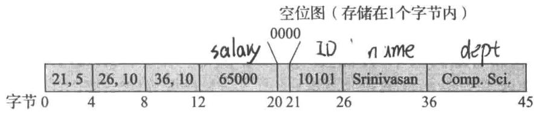

图 13-5 instructor 关系的变长记录表示

这个图也说明了空位图（null bitmap）的使用，它表示记录的哪个属性是空值。在这个特定的记录中，如果 salary 是空值，位图的第四位将被设置为 1，存储在第 12 至 19 字节之间的 salary 值将被忽略。由于记录有四个属性，尽管更多属性可能需要更多字节，但该记录的空位图只占用 1 个字节。在某些表示中，空位图存储在记录的开头，并且对于取空值的属性，根本不存储数据（值或偏移量 / 长度）。这种表示以提取记录属性的额外工作为代价来节省一些存储空间。对于记录拥有大量字段并且大多数字段都是空的某些应用来说，这样的表示特别有用。

我们接下来处理在块中存储变长记录的问题，分槽的页结构（slotted-page structure）一般用于在块中组织记录，如图 13-6 $^{①}$ 所示。每个块的开始处有一个块头，其中包含以下信息：

- 块头中记录项的数量；

- 块中自由空间的末尾处；

- 一个由包含每条记录的位置和大小的项组成的数组。

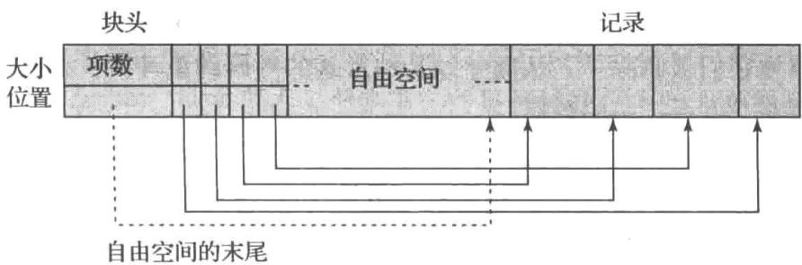

图13-6 分槽的页结构

实际上记录从块的末尾处开始在块中连续分配空间。块中的自由空间是连续的，位于块头数组的最后一项和第一条记录之间。如果插入一条记录，在自由空间的尾部给这条记录分配空间，并且将包含这条记录的大小和位置的项加到块头中。

如果一条记录被删除，它所占用的空间被释放，并且它的项被置为 deleted（比如这条记录的大小被置为 -1）。此外，块中位于被删除记录之前的记录将被移动，使得由删除而产生的自由空间能被重新使用，并且所有自由空间仍然存在于块头数组的最后一项和第一条记录之间。块头中的自由空间末尾指针也要做适当修改。只要块中还有空间，使用类似的技术可以使记录增长或缩短。移动记录的代价并不太高，因为块的大小是有限的：典型的值为4到8 KB。

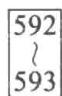

分槽的页结构要求没有指针直接指向记录。取而代之，指针必须指向块头中记有记录实际位置的项。在支持指向记录的间接指针的同时，这种间接层次允许移动记录以防止在块的内部出现碎片空间。

## 13.2.3 大对象存储

数据库常常要存储比磁盘块大得多的数据。例如一张图片或一段音频记录的大小可能是数 MB，而一个视频对象的大小可能达到数 GB。回忆一下，SQL 是支持二进制大对象数据类型（blob）和字符大对象数据类型（clob）的，它们存储二进制和字符型的大对象。

许多数据库内部限制一条记录的规模不能比一个块 $^{①}$ 的规模更大。这些数据库允许记录在逻辑上包含大对象，但是它们将大对象与记录的其他（短）属性分开存储，尽管大对象与这些属性一起出现在记录中。一个指向大对象的（逻辑）指针被存储到包含该大对象的记录中。

大对象（large object）可以以文件形式存储在被数据库管理的一个文件系统区域中，或者作为文件结构存储在数据库中并被数据库管理。在后一种情况下，这种数据库中的大对象可以选用 $\mathbf{B}^{+}$ 树文件组织来表示，以便允许对此对象内任何位置的高效访问，我们将在14.4.1节中讨论 $\mathbf{B}^{+}$ 树。 $\mathbf{B}^{+}$ 树文件组织允许我们读取一个完整的对象，或对象中指定的字节范围，以及插入和删除对象的一部分。

可是，在数据库中存储特别大的对象导致了一些性能问题。通过数据库接口访问大对象的效率就是一个需要关注的问题。第二个问题是关于数据库备份的大小。许多企业周期性地创建“数据库转储”，换句话说，就是其数据库的备份拷贝；在数据库中存储大对象会导致数据库转储规模的大量增长。

许多应用因此选择在数据库之外的文件系统中来存储特别大的对象，比如视频数据。在这种情况下，应用程序可以将文件名（通常是文件系统中的路径）存储为数据库中记录的一个属性。将数据存储在数据库外部的文件中会导致数据库中的文件名所指向的文件并不存在，这可能是因为它们被删除了，从而导致某种形式的外码约束冲突。此外，数据库授权控制不适用于存储在文件系统中的数据。

一些数据库支持文件系统和数据库的集成，以此来保证满足约束（比如，如果数据库有指针指向某个文件，那么对此文件的删除将被阻止），并且确保访问授权被执行。文件能通过文件系统接口和数据库 SQL 接口进行访问。例如，Oracle 通过其 SecureFiles 和数据库文件系统特性来支持这种集成。

## 13.3 文件中记录的组织

迄今为止，我们学习了如何在一个文件结构中表示记录。关系是记录的集合。给定一个记录的集合，下一个问题就是如何在文件中组织它们。在文件中组织记录的几种可能的方式包括：

- 堆文件组织（heap file organization）。任意记录可以放在文件中的任何地方，只要那个地方有空间存放这条记录。记录是没有顺序的。通常每个关系使用一个单独的文件或者一个文件的集合。我们将在 13.3.1 节讨论堆文件组织。

- 顺序文件组织（sequential file organization）。根据每条记录中“搜索码”的值顺序存储记录。13.3.2节描述了这种组织方式。

- 多表聚簇文件组织（multitable clustering file organization）。通常，一个单独的文件或者文件集合被用来存储一个关系的记录。然而，在多表聚簇文件组织中，多个不同关系的记录被存储在相同的文件中，事实上是一个文件中的相同块上，以便减少特定连接操作的代价。13.3.3节描述了多表聚簇文件组织。

- $\mathbf{B}^{+}$ 树文件组织（ $\mathbf{B}^{+}$ -tree file organization）。13.3.2节中描述的传统顺序文件组织的确支持顺序访问，即使存在插入、删除和更新操作，且这些操作可能改变记录的顺序。然而，在面对大量这种操作的时候，顺序访问的效率将大打折扣。在14.4.1节我们将学习另外一种组织记录的方式，称作 $\mathbf{B}^{+}$ 树文件组织。 $\mathbf{B}^{+}$ 树文件组织和第14章描述的 $\mathbf{B}^{+}$ 树索引结构有关，它可以提供对记录的高效顺序访问，即使存在大量插入、删除或更新操作。此外，它支持基于搜索码的、针对特定记录的、非常高效的访问。

- 散列文件组织（hashing file organization）。在每条记录的某些属性上计算一个散列函数。散列函数的结果确定了记录应放到文件的哪个块中。14.5节描述了这种组织方式；它与第14章所描述的索引结构密切相关。

## 13.3.1 堆文件组织

在堆文件组织中，记录可以存储在对应于一个关系的文件中的任何位置。记录一旦被放在特定位置，通常不会被移动 $^{①}$ 。

当一条记录被插入一个文件中时，一种选择位置的方式是总把它加到文件的末尾。可是，如果记录被删除，使用这种释放的空间来存储新记录是有意义的。对于数据库系统来说，不用顺序搜索文件的所有块，就能高效地找到具有自由空间的块是很重要的。

大多数数据库使用一种叫作自由空间图（free-space map）的节省空间的数据结构，以便跟踪具有自由空间来存储记录的块。自由空间图通常被表示成一个数组，对关系中的每个块，该数组都包含一个项。每个项表示一个比例 $f$ ，即在块中至少有比例为 $f$ 的空间是自由的。例如在 PostgreSQL 中，一个项占 1 个字节，并且存储在项中的值必须除以 256 以得到自由空间的比例。数组被存储在文件中，在需要时数组所在的块被读进内存 $^{②}$ 。只要记录被插入、删除或者改变大小，如果占用比例的变化足以影响项的值，那么项必须在自由空间图中被更新。一个针对具有 16 个块的文件的自由空间图的示例如下所示。我们假设用 3 位来存储占有比例；在第 $i$ 个位置的值应该除以 8 以得到块 $i$ 的自由空间比例。

<table><tr><td>4</td><td>2</td><td>1</td><td>4</td><td>7</td><td>3</td><td>6</td><td>5</td><td>1</td><td>2</td><td>0</td><td>1</td><td>1</td><td>0</td><td>5</td><td>6</td></tr></table>

例如，值 7 表示此块中至少有 7/8 的空间是自由的。

为了找到一个可以存储给定大小的新记录的块，数据库可以扫描自由空间图以找到一个具有足够自由空间的块来存储那条记录。如果不存在那样的块，将给关系分配一个新块。

尽管这种扫描比实际获取块来找到自由空间要快得多，但对于大型文件它仍然非常慢。为了进一步加速定位具有足够自由空间的块的任务，我们可以创建二级自由空间图，比如它的每个项表示主自由空间图的100个项。每个项存储了其对应的主自由空间图中100个项之内的最大值。下面的自由空间图是我们之前示例的二级自由空间图，它的每个项对应于主自由空间图的4个项。

596 

<table><tr><td>4</td><td>7</td><td>2</td><td>6</td></tr></table>

利用 1 个项来代表主自由空间图中的 100 项，扫描二级自由空间图只需花费扫描主自由空间图的 1/100 的时间；一旦找到表示足够自由空间的合适的项，就可以检查它所对应的、在主自由空间图中的 100 个项，以找到具有足够自由空间的块。那样的块必然存在，因为二级自由空间图中的项存储了主自由空间图中相应项的最大值。为了处理非常大的关系，我们可以利用相同的思路来创建二级之上的更多级自由空间图。

每当图中一个项被更新就将自由空间图写入磁盘，这将是非常昂贵的。取而代之，自由空间图被周期性地写入磁盘；因此，磁盘上的自由空间图可能是过时的，当数据库启动时，它可能会得到关于自由空间的过时数据。其结果是，自由空间图可能声明一个块具有自由空间，但其实该块并没有；当此块被获取时，这种错误将会被检测出来，然后可以通过进一步搜索自由空间图来处理此错误，以找到另外一个块。另一方面，自由空间图可能声明一个块没有自由空间，但其实该块有；通常这不会导致除了存在未使用的自由空间之外的任何问题。为了修正这些错误，关系被定期扫描，错误空间图被重新计算并写到磁盘。

## 13.3.2 顺序文件组织

顺序文件（sequential file）是为了高效处理按某个搜索码的顺序排序的记录而设计的。搜索码（search key）是任意的属性或者属性的集合。它无须是主码，甚至也无须是超码。为了能够按搜索码的顺序快速检索记录，我们通过指针把记录链接起来。每条记录的指针指向按搜索码顺序排列的下一条记录。此外，为了最大限度地减少顺序文件处理中的块访问数量，我们按搜索码的顺序，或者尽可能地接近搜索码的顺序物理地存储记录。

图 13-7 展示了来自我们大学示例的由 instructor 记录组成的顺序文件。在该例中，记录按搜索码顺序存储，这里使用 ID 作为搜索码。

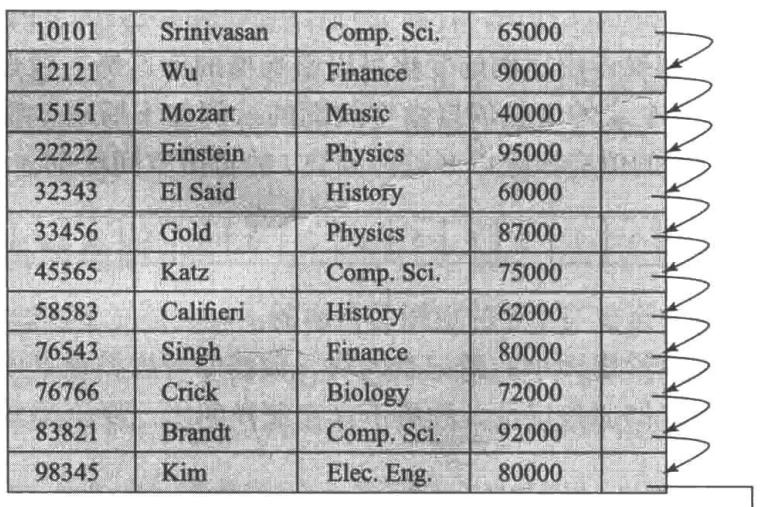

图13-7 instructor记录组成的顺序文件

顺序文件组织形式允许记录按排列的顺序读取；这对于显示目的以及我们将在第15章中学习的特定的查询处理算法都非常有用。

然而，在插入和删除时维护记录的物理顺序是困难的，因为由单个的插入或删除而导致很多记录的移动是代价很高的。我们可以按照前面看到的那样，使用指针链表来管理删除。对于插入操作，我们应用如下两条规则：

1. 在文件中定位按搜索码顺序位于待插入记录之前的那条记录。

2. 如果在这条记录所在块中有一条自由的记录（即删除后留下来的空间），就在这里插入新的记录。否则，将新记录插入一个溢出块（overflow block）中。无论哪种情况都要调整指针，使其能按搜索码顺序把记录链接在一起。

图 13-8 展示了图 13-7 所示文件在插入记录（32222, Verdi, Music, 48000）之后的情况。图 13-8 中的结构允许快速插入新的记录，但是迫使顺序处理文件的应用程序不得不按与记录的物理顺序不一样的顺序来处理记录。

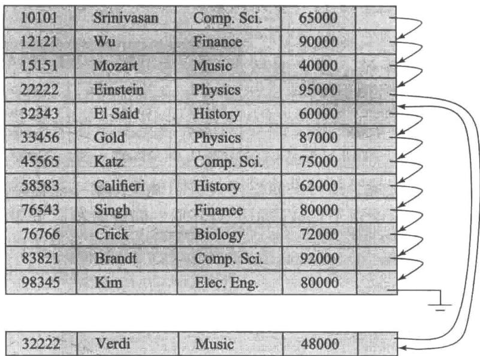

图 13-8 执行插入后的顺序文件

如果需要存储在溢出块中的记录相对较少，这种方式会工作得很好。然而一段时间之后，搜索码顺序和物理顺序之间的相似性最终可能会完全丧失，在这种情况下，顺序处理将变得十分低效。此时，文件应该被重组（reorganized），使得它再次在物理上按顺序存放。这种重组的代价是很高的，并且必须在系统负载低的时候执行。需要重组的频率依赖于新记录插入的频率。在插入很少发生的极端情况下，使文件在物理上总保持有序是可能的。在这种情况下，不需要图 13-7 中的指针域。

我们将在 14.4.1 节描述 B $^{+}$ 树文件组织，即使存在很多插入、删除与更新操作，它也能够提供高效的顺序访问，而不需要昂贵的重组。

## 13.3.3 多表聚簇文件组织

大多数关系数据库系统将每个关系存储在一个单独的文件中，或者一组单独的文件中。因此，在这样的设计中，每个文件以及每个块只存储一个关系的记录。

但是在某些情况下，在单个块中存储不止一个关系的记录会很有用。为了理解在一个块中存储多个关系的记录的好处，考虑针对大学数据库的如下 SQL 查询：

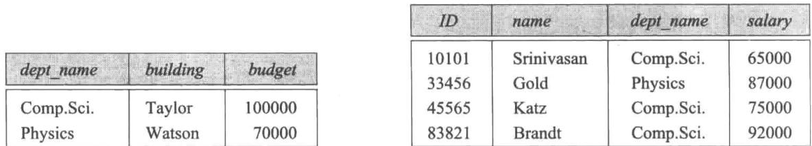

## select dept_name, building, budget, ID, name, salary from department natural join instructor;

这个查询计算 department 和 instructor 关系的连接。因此，对于 department 的每个元组，系统必须找到具有相同 dept_name 值的 instructor 元组。理想情况下，这些记录通过索引（index）的帮助来定位，我们将在第 14 章中讨论索引。然而，不管这些记录如何定位，它们都需要从磁盘传输到主存中。在最坏的情况下，每条记录驻留在不同的块上，迫使我们为查询所需的每条记录执行一次读块操作。

作为一个具体的示例，分别考虑图 13-9 和图 13-10 中的 department 与 instructor 关系（为了简单起见，我们只包括了前面所用到的关系中的元组的一个子集）。在图 13-11 中，我们展示了一个为高效执行涉及 department 和 instructor 的自然连接的查询而设计的文件结构。针对特定 dept_name 的所有 instructor 元组被存储在该 dept_name 所对应的 department 元组的附近。我们说这两个关系在 dept_name 码上是聚簇的。我们假设每条记录包含它所属的关系的标识，尽管这没有在图 13-11 中显示出来。

<table><tr><td>dept_name</td><td>building</td><td>budget</td></tr><tr><td>Comp.Sci.</td><td>Taylor</td><td>100000</td></tr><tr><td>Physics</td><td>Watson</td><td>70000</td></tr></table>

图 13-9 department 关系

<table><tr><td>ID</td><td>name</td><td>dept_name</td><td>salary</td></tr><tr><td>10101</td><td>Srinivasan</td><td>Comp.Sci.</td><td>65000</td></tr><tr><td>33456</td><td>Gold</td><td>Physics</td><td>87000</td></tr><tr><td>45565</td><td>Katz</td><td>Comp.Sci.</td><td>75000</td></tr><tr><td>83821</td><td>Brandt</td><td>Comp.Sci.</td><td>92000</td></tr></table>

图13-10 instructor关系

<table><tr><td>Comp.Sci.</td><td>Taylor</td><td>100000</td><td></td></tr><tr><td>10101</td><td>Srinivasan</td><td>Comp.Sci.</td><td>65000</td></tr><tr><td>45565</td><td>Katz</td><td>Comp.Sci.</td><td>75000</td></tr><tr><td>83821</td><td>Brandt</td><td>Comp.Sci.</td><td>92000</td></tr><tr><td>Physics</td><td>Watson</td><td>70000</td><td></td></tr><tr><td>33456</td><td>Gold</td><td>Physics</td><td>87000</td></tr></table>

图 13-11 多表聚簇文件结构

尽管没有在图中描述，为了减少存储开销，也有可能针对一组元组（来自两个关系）只存储一次 dept_name 属性的值，该属性定义了聚簇。

这种结构允许对连接进行高效处理。当读取 department 关系的一个元组时，将包含这个元组的整个块从磁盘拷贝到主存中。因为相应的 instructor 元组存储在靠近 department 元组的磁盘上，所以包含 department 元组的块也包含了处理查询所需的 instructor 关系的元组。如果一个系有太多教师，以至于 instructor 记录不能存储在一个块中，则其余的记录出现在临近的块中。

如图 13-11 所示，多表聚簇文件组织（multitable clustering file organization）是一种在每个块中存储两个或更多关系的相关记录的文件组织形式 $^{①}$ 。聚簇码（cluster key）是一种属性，它定义了哪些记录被存储在一起；在我们之前的示例中，聚簇码是 dept_name。

尽管多表聚簇文件组织可以加快特定的连接查询，但它也会导致对其他类型的查询的处

理变慢。例如，在我们前面的示例中，

## select * from department;

与将每个关系存储在单独文件中的方案相比，这个查询需要访问更多的块，因为每个块现在包含明显少得多的 department 记录。为了在特定块中高效定位 department 关系的所有元组，我们可以用指针把这个关系的所有记录链接起来；可是读取块的数量并不受使用这种链接的影响。

何时使用多表聚簇依赖于数据库设计者所认为的最频繁的查询类型，多表聚簇的谨慎使用可以在查询处理中产生显著的性能提升。

多表聚簇被 Oracle 数据库系统所支持。聚簇可以通过使用带有特定聚簇码的创建聚簇（create cluster）命令来创建。对创建表（create table）命令的扩展可以用来指定将一个关系存储在特定聚簇中，此命令将特定属性用作聚簇码。这样可以将多种关系分配到一个聚簇上。

## 13.3.4 划分

许多数据库允许将一个关系中的记录划分为更小的关系，这些关系分别进行存储。这种表划分（table partitioning）通常基于一个属性值来完成；例如在一个会计数据库中，transaction 关系中的记录可以根据年份划分成对应于每个年份的更小关系，比如 transaction_2018、transaction_2019 等。查询可以基于 transaction 关系来编写，但是被翻译成面向年份的关系的查询。大多数访问都针对当前年份的记录，并且包含一个基于年份的选择。查询优化器能够重写这种查询，使其仅仅访问对应于所需年份的更小关系，并且查询优化器能够避免读取对应于其他年份的记录。例如，查询

## select * from transaction where year=2019

将只访问 transaction_2019 关系，而忽略其他关系。而一个没有选择条件的查询将读取所有关系。

某些操作的代价随关系的规模一同增长，比如找到一条记录的自由空间；通过缩小每个关系的规模，划分有助于减少这种开销。划分也可以用来将一个关系的不同部分存储到不同的存储设备上；比如，在2019年，transaction_2018和早些年的交易不会被频繁访问，可以存储到磁盘上，而transaction_2019可以存储在SSD上，以便更快速地访问。

## 13.4 数据字典存储

到目前为止，我们只考虑了关系本身的表示。一个关系数据库系统需要维护关于关系的数据，比如关系的模式。一般来说，这种“关于数据的数据”被称为元数据（metadata）。

关系模式和关于关系的其他元数据存储在一种称作数据字典（data dictionary）或系统目录（system catalog）的结构中。系统必须存储的信息类型有：

- 关系的名称；

- 每个关系中属性的名称；

- 属性的域和长度；

- 在数据库上定义的视图的名称，以及这些视图的定义；

- 完整性约束（例如码约束）。

此外，很多系统为系统的用户保存了下列数据：

- 用户的名称、用户的缺省模式、用于认证用户的密码或其他信息；

- 关于每个用户的授权信息。

进一步地，数据库可能还会存储关于关系和属性的统计数据和描述数据。例如，每个关系中元组的数量，或者每个属性上不同值的数量。

数据字典也可能记录关系的存储组织（堆、顺序、散列等），以及每个关系的存储位置：

- 如果关系被存储在操作系统文件中，数据字典将会记录包含每个关系的单个文件（或多个文件）的名称。

- 如果数据库把所有关系存储在单个文件中，数据字典可能将包含每个关系的记录的块记在诸如链表那样的数据结构中。

我们将在第 14 章中学习索引，我们将看到有必要存储关于每个关系的每个索引的信息：

- 索引的名称；

- 被索引的关系的名称；

- 在其上定义索引的属性；

- 构造的索引的类型。

实际上，所有这些元数据信息组成了一个微型数据库。一些数据库系统使用专用的数据结构和代码来存储这些元数据。通常人们更倾向于将关于数据库的数据存储为数据库本身中的关系。通过使用数据库关系来存储系统元数据，我们简化了系统的总体结构，并且利用数据库的全部能力来对系统数据进行快速访问。

关于如何通过关系来表示系统元数据的准确选择必须由系统设计者来决定。我们在图 13-12 中展示了一个小型数据字典的模式图，它存储了上面提到的部分信息。这个模式仅仅是示例性的；真正的实现存储了比此图所展示的多得多的信息。读者可以参阅所使用的数据库的指南，看看系统元数据维护了什么信息。

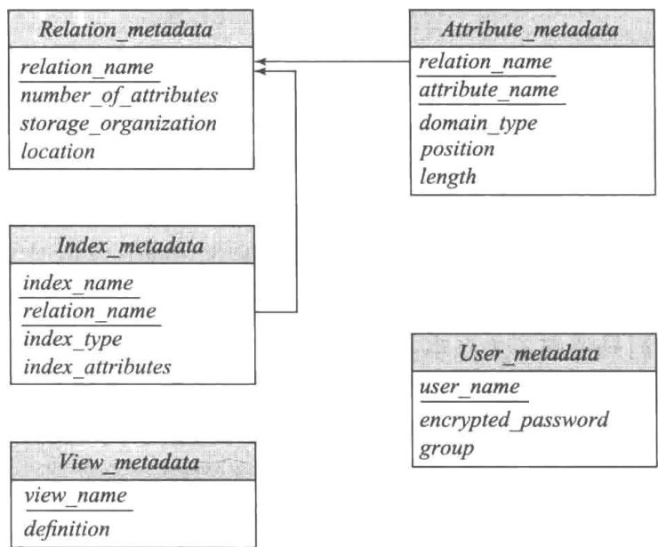

图 13-12 描述部分系统元数据的关系模式

在所展示的元数据表示中，假定 Index_metadata 关系的 index_attributes 属性包含由一个或多个属性组成的列表，它可以表示成诸如“dept_name, building”那样的字符串。因此，Index_metadata关系不符合第一范式；尽管它可以被规范化，但是上面的表示可能对于存取数据而言更加有效。数据字典通常存储为非规范化的形式，以便实现快速存取。

只要数据库系统需要从关系中检索记录，它就必须首先通过 Relation_metadata 关系来查找关系的位置和存储组织，然后使用该信息去获取记录。

但是，Relation_metadata 关系本身的存储组织和位置必须被记录在其他地方（例如，在数据库自身的代码中，或者在数据库中的一个固定位置），因为我们需要这些信息来找到 Relation_metadata 的内容。

因为系统元数据被频繁访问，所以大多数数据库将其从数据库读入内存数据结构中，这种数据结构可被很高效地访问。这是在数据库开始处理任何查询之前作为数据库启动的一部分来完成的。

## 13.5 数据库缓冲区

服务器上的主存规模这些年来增长得很快，很多中等规模的数据库可以被放入内存中。可是，一个服务器有很多对其内存的需求，它能分配给数据库的内存量可能比数据库的规模要小很多，即使是对于中等规模的数据库。很多大型数据库比服务器的可用内存要大得多。

因此, 即使在今天, 在大多数数据库中, 数据库数据仍主要存放在磁盘上, 并且这些数据必须被放入内存以进行读取或者更新; 更新过的数据块必须随后写回磁盘。

因为从磁盘访问数据远比从内存访问数据要慢，所以数据库系统的一个主要目标就是尽量减少在磁盘和内存之间传输的块数量。减少磁盘访问次数的一种方式是在主存中保留尽可能多的块。这样做的目标是最大化要访问的块已经在主存中的概率，这样就不需要访问磁盘。

因为在主存中保留所有块是不可能的，我们需要管理主存中用于存储块的可用空间的分配。缓冲区（buffer）是主存中用于存储磁盘块的拷贝的那部分。每个块总有一份拷贝存放在磁盘上，但是磁盘上的拷贝可能比缓冲区中的版本旧。负责缓冲区空间分配的子系统称为缓冲区管理器（buffer manager）。

## 13.5.1 缓冲区管理器

当数据库系统中的程序需要磁盘上的块时，它向缓冲区管理器发出请求（即调用）。如果这个块已经在缓冲区中，则缓冲区管理器将这个块在主存中的地址传给请求者。如果这个块不在缓冲区中，则缓冲区管理器首先在缓冲区中为这个块分配空间，如果需要，可能会把一些其他块移出主存，为这个新块腾出空间。被移出的块仅当它在最近一次写回磁盘后被修改过才被写回磁盘。然后，缓冲区管理器把被请求的块从磁盘读入缓冲区，并将这个块在主存中的地址传给请求者。缓冲区管理器的内部动作对发出磁盘块请求的程序是透明的。

如果熟悉操作系统的概念，你会发现缓冲区管理器看起来和大多数操作系统中的虚拟存储管理器没有什么不同。它们的一点区别是数据库的规模会比机器的硬件地址空间要大，因此存储器地址不足以对所有磁盘块进行寻址。此外，为了更好地为数据库系统服务，缓冲区管理器必须使用比典型的虚拟存储管理方案更加复杂的技术。

## 13.5.1.1 缓冲区替换策略

当缓冲区中没有剩余空间时，一个块必须被移出（evicted），即在新块读入缓冲区之前，必须把一个块从缓冲区中去除。多数操作系统使用最近最少使用（Least Recently Used, LRU）方案，即最近最少访问的块被写回磁盘，并从缓冲区中移走。这种简单的方式在改进后可用于数据库应用（参见 13.5.2 节）。

## 13.5.1.2 被钉住的块

一旦一个块被读入缓冲区，数据库进程就可以从缓冲存储器中读取该块的内容。然而，当块正在被读取时，如果一个并发进程移出了这个块，并把它替换成另一个不同的块，那么读原来块的内容的读取操作将读到不正确的数据；如果一个块被移出时它正在被写入，那么写入操作将最终损坏被替换的块的内容。

因此，在一个进程从缓冲块中读取数据之前，确保此块不会被移出是很重要的。为此，进程在该块上执行钉住（pin）操作；缓冲区管理器绝不会移出一个被钉住的块。当进程完成数据读取后，它将执行解除钉住（unpin）操作，允许该块在必要时被移出。应该仔细编写数据库代码从而避免钉住太多的块：如果在缓冲区中所有块都被钉住了，那么没有块能被移出，也就没有其他块能被读入缓冲区。如果发生这种情况，那么数据库将不能执行任何进一步的处理！

多个进程能从缓冲区的一个块中读取数据。要求每个进程在访问数据前执行钉住操作，并在完成访问后执行解除钉住操作。直到所有对块执行了钉住操作的进程都解除钉住之后，该块才能被移出。一种简单的方式可以确保这个性质，那就是为每个缓冲块维护钉住计数（pin count）。对每个钉住操作增加该计数，且对每个解除钉住操作减少该计数。仅当一个页面的钉住计数等于0时，它才能被移出。

## 13.5.1.3 缓冲区上的共享排他锁

605 

从页面增加或删除元组的进程可能需要移动此页面的内容；在此期间，任何其他进程都不应读取该页的内容，因为这些内容可能是不一致的。数据库缓冲区管理器允许进程获取缓冲区上的共享排他锁。

我们将在第 18 章学习锁的更多细节, 但是这里我们讨论缓冲区管理器的内容中的一种受限形式的封锁。由缓冲区管理器提供的封锁系统允许数据库进程在访问一个块之前, 以共享模式或者排他模式封锁该缓冲块, 并且在访问完成之后释放封锁。下面是用于封锁的一些规则:

- 任意数量的进程可以在一个块上同时拥有共享锁。

- 每次只允许一个进程获得排他锁，并且当一个进程执有排他锁时，其他进程不能执有此块上的共享锁。因此，只有当没有其他进程在缓冲块上执有封锁的时候排他锁才能被授予。

- 如果一个进程请求块上的排他锁，但此块已经以共享或者排他模式被封锁，那么在早期封锁被释放之前，该请求一直处于等待状态。

- 如果一个进程请求块上的共享锁，而且此块没有被封锁或者已经被共享锁封锁，则此锁可以被授予；但是，如果另一个进程持有该块的排他锁，则共享锁只有在排他锁被释放后才能被授予。

按如下方式获得并释放封锁：

- 在一个块上执行任何操作之前，进程必须钉住这个块，就像我们之前看到的那样。随后获得封锁，且必须在对块解除钉住之前释放封锁。

- 在从缓冲块读数据之前，进程必须获取此块上的共享锁。当完成数据读取时，进程必须释放此锁。

- 在更新缓存块内容之前，进程必须获取此块上的排他锁；该锁必须在更新完成后释放。

这些规则确保当另外的进程在读块时该块不能被更新。反过来说，当另外的进程正在更新块的时候，此块不能被读取。这些规则保证了缓冲区访问的安全。可是，为了保护数据库系统，以及防止并发访问引发的问题，这些措施是不够的：还需要采取进一步的措施。我们将在第17～18章进一步讨论这些问题。

## 13.5.1.4 块写出

仅当另一个块需要缓冲空间时才写出一个块是可能的。但是，不用等到需要缓冲空间时，而是在产生这种需求之前写出更新过的块，这么做是有意义的。然后，当需要缓冲区中的空间时，一个已经被写出过的块可以被移出，只要它当前没有被钉住。

606 

可是，为了数据库系统能够从崩溃中恢复（见第19章），有必要限制一个块能被写回磁盘的时间。例如，大多数恢复系统要求，当块上正在进行更新时，该块不能被写回磁盘。为了满足这个要求，希望将块写回磁盘的进程必须获取块上的共享锁。

大多数数据库有一个进程，可以连续监测更新过的块并将块写回磁盘。

## 13.5.1.5 块的强制写出

某些情况下，需要把块写回磁盘，以确保磁盘上的数据处于一致性状态。这样的写操作称为块的强制写出（forced output）。我们将在第 19 章看到强制写出的原因。

主存的内容乃至缓冲区的内容会在崩溃时丢失，然而磁盘上的数据（通常）在崩溃时得以幸免。将强制写出与日志机制一起使用，以确保当执行更新的事务被提交时，有足够的数据写回磁盘，从而保证事务的更新不会丢失。具体是如何完成的，我们将在第19章细致地介绍。

## 13.5.2 缓冲区替换策略

对缓冲区中的块的替换策略而言，其目标是减少对磁盘的访问。对通用程序来说，精确预言哪些块将被访问是不可能的。因此，操作系统使用过去的块访问模式来预测未来的访问。通常假设最近被访问过的块很可能被再次访问。因此，如果必须替换一个块，则替换最近最少访问的块。这种策略称为最近最少使用（Least Recently Used, LRU）的块替换策略。

在操作系统中，LRU 是一个可以接受的替换策略。然而，数据库系统能够比操作系统更准确地预测未来的访问模式。用户对数据库系统的请求包括若干步。通过查看执行用户请求的操作所需的每一步，数据库系统通常可以预先确定哪些块将是需要的。因此，与依赖过去来预测将来的操作系统不同，数据库系统至少可以得到关于不远的将来的信息。

为了说明未来块访问的相关信息是如何使我们改进 LRU 策略的，考虑如下 SQL 查询的处理：

$$
\begin{array}{l} \text {select} ^ {*} \\ \text {from instructor natural join department;} \end{array}
$$

607 

假设我们所选择的处理这个请求的策略由图 13-13 所示的伪码程序给出。(我们将在第 15 章学习其他更高效的策略。)

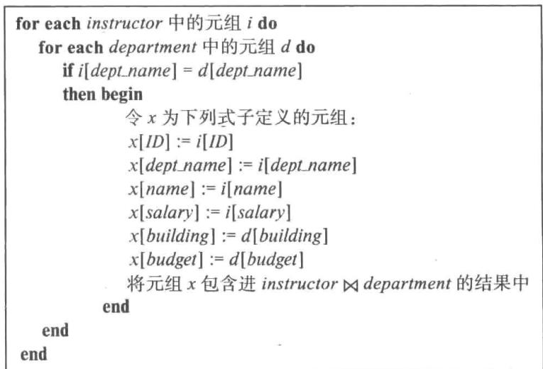

图 13-13 计算连接的过程

假设此例中的两个关系存储在不同的文件中。在这个示例中，我们可以看到，一旦 instructor 中的一个元组被处理过，就不再需要这个元组了。因此，一旦处理完 instructor 元组构成的一个完整块，这个块就不再需要存储在主存中了，尽管它刚刚被使用过。一旦 instructor 块中最后一个元组被处理完毕，就应该命令缓冲区管理器释放这个块所占用的空间。这种缓冲区管理策略称为立即丢弃（toss-immediate）策略。

现在考虑包含department元组的块。对instructor关系的每个元组，我们需要检查department元组的每个块。当一个department块处理完毕后，我们知道在所有其他department块被处理完之前，这个块是不会被访问的。因此，最近最常使用的department块将是最后一个要被再次访问的块，而最近最少使用的department块会是接着要访问的块。这个假设正好与构成LRU策略基础的假设相反。实际上，在上述过程中块替换的最优策略是最近最常使用（Most Recently Used，MRU）策略。如果必须从缓冲区中移出一个department块，MRU策略将选择最近最常使用的块（当块正在被使用时不能被替换）。

在我们的示例中，要使 MRU 策略正确工作，系统必须把当前正在处理的 department 块钉住。在块中最后一个 department 元组处理完毕后，这个块就被解除钉住，并成为最近最常使用的块。

除了使用系统所拥有的关于被处理的请求的知识，缓冲区管理器还可以使用有关一个请求将访问特定关系的概率的统计信息。例如，我们在13.4节见过的数据字典是数据库中最常被访问的部分之一，因为每个查询的处理都需要访问数据字典。因此，缓冲区管理器应尽量不把数据字典从主存中移出，除非有其他因素决定了它非这样做不可。在第14章中，我们将讨论文件的索引。因为对文件索引的访问可能比文件本身更频繁，所以除非迫不得已，缓冲区管理器一般不会把索引块从主存中移出。

理想的数据库块替换策略需要关于数据库操作的知识，包括正在执行的操作和将来会执行的操作。没有哪个策略能够很好地处理所有可能的情况。实际上，绝大多数数据库系统都使用 LRU 策略，尽管这种策略有其缺点。在实践问题和习题中我们将探究其他可选择的策略。

除了块被再次访问的时间以外，缓冲区管理器所使用的块替换策略还受其他因素的影响。如果系统并发地处理来自多个用户的请求，并发控制子系统（见第18章）可能需要延迟某些请求，以保证数据库的一致性。如果缓冲区管理器从并发控制子系统获得了关于哪些请求被延迟的信息，它就可以使用这些信息来改变它的块替换策略。具体地说，活跃的（非延迟的）请求所需要的块可以保留在缓冲区中，以牺牲被延迟的请求所需要的块为代价。

崩溃－恢复子系统（见第19章）对块替换施加了严格的约束。如果一个块被修改过，则不允许缓冲区管理器将这个块在缓冲区中的新版本写回磁盘，因为这将破坏旧的版本。取而代之的做法是，块管理器在写出块之前，必须向崩溃－恢复子系统寻求许可。崩溃－恢复子系统在允许缓冲区管理器写出所需的块之前，可能要求将另一些特定的块强制写出。在第19章中，我们将精确定义缓冲区管理器与崩溃－恢复子系统之间的交互。

## 13.5.3 写操作的重排序与恢复

数据库缓冲区允许在内存中执行写操作，并在以后将其输出到磁盘，输出的顺序可能与执行写出的顺序不同。文件系统也经常对写操作重新排序。但是，这种重新排序可能会导致在发生系统崩溃时磁盘上的数据不一致。

609 

为了理解文件系统背景下的问题，假设文件系统使用链表跟踪哪些块是文件的一部分。另外假设它在链表末尾插入一个新节点的方式是：首先为新节点写入数据，然后更新前一个节点的指针。进一步假设写操作被重新排序，因此指针先被更新，并且在写入新节点之前系统崩溃。那么节点的内容将和之前磁盘上曾写入的内容一样，这就导致了数据结构的损坏。

为了应对这种数据结构损坏的可能性，早期的文件系统必须在系统重新启动时执行文件系统一致性检查，以确保数据结构是一致的。如果不一致，就必须采取额外的措施把它们恢复到一致状态。这些检查会导致崩溃后系统重启的长时间延迟，随着磁盘系统容量的增加，这种延迟会变得更长。

如果文件系统按精心选择的顺序更新元数据，那么在许多情况下，它可以避免不一致的问题。但是这样做意味着诸如磁盘臂调度之类的优化无法完成，从而影响更新的效率。如果有可用的非易失性写缓冲区，可以用它来对非易失性 RAM 执行顺序的写操作，然后在写入磁盘时再重新排序。

然而，大多数磁盘没有非易失性写缓冲区；相反，现代文件系统分配一个磁盘，用于按执行顺序存储写操作的日志。这样的磁盘称为日志磁盘（log disk）。对于每次写操作，日志都包含待写入的块的编号和要写入的数据，日志的顺序与执行写操作的顺序一致。对日志磁盘的所有访问都是顺序的，基本上消除了寻道时间，并且多个连续的块可以一次性写入，使得写入日志磁盘的速度比随机写入快好几倍。和以前一样，数据还必须写到它们在磁盘上的实际位置，但是对实际位置的写操作可以之后完成；可以对写操作进行重新排序，以最小化磁盘臂的移动。

如果在对实际磁盘位置的某些写操作完成之前系统崩溃，当系统恢复时，它会读取日志磁盘，以找到尚未完成的那些写操作，然后执行这些操作。在执行写操作后，记录将从日志磁盘中删除。

支持上述日志磁盘的文件系统称为日志文件系统（journaling file system）。即使没有单独的日志磁盘，也可以通过将数据和日志保存在同一个磁盘上来实现日志文件系统。这样做会以更低性能为代价来降低资金成本。

大多数现代文件系统在写入诸如文件分配信息那样的文件系统元数据时实现日志并使用日志磁盘。日志文件系统允许快速重启，无须进行此类文件系统的一致性检查。

但是，应用程序执行的写操作通常不会被写入日志磁盘。相反，数据库系统实现了自己的日志形式，以确保在发生故障时，即使对写操作进行了重新排序，也可以安全地恢复出数

610 据库的内容，我们将在第 19 章中学习数据库日志。

## 13.6 面向列的存储

传统数据库把元组的所有属性存储在一条记录中，再把元组存放在如我们刚才看到的文件中。这种存储设计被称为面向行的存储（row-oriented storage）。

相反，在面向列的存储（column-oriented storage）中，关系的每个属性都被单独存储，来自相邻元组的属性值存储在文件中相邻的位置上，面向列的存储也被称为柱状存储（columnar storage）。图 13-14 展示了 instructor 关系如何被存储在面向列的存储中，其每个属性被分别存储。

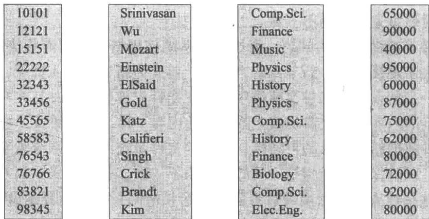

图 13-14 instructor 关系的柱状表示

在面向列的存储的最简单形式中，每个属性都存储在一个单独的文件中。此外，每个文件都被压缩（compressed）以减小其规模。（我们将在本节后面讨论在单个文件中连续存储列的更复杂的方案。）

如果查询需要访问表中第 i 行的全部内容，则检索出每列中第 i 个位置的值，并使用这些值来重构该行。因此，面向列的存储的缺点是：获取单个元组的多个属性需要多次 I/O 操作。因此，它不适用于从关系的几行中获取多个属性的查询。

然而，面向列的存储非常适合于数据分析查询，这种查询处理关系的许多行，但通常只访问一些属性。原因如下：

- 减少 I/O。当查询只需要访问具有大量属性的关系的几个属性时，其余属性并不需要从磁盘提取到内存中。相反，在面向行的存储中，无关的属性也从磁盘提取到内存中。减少 I/O 可以显著降低查询执行的代价。

- 提高CPU缓存性能。当查询处理器获取特定属性的内容时，在现代CPU架构中，多个连续的字节（称为缓存线）被从内存提取到CPU缓存中。以后要访问这些字节，如果它们在缓存中，访问速度要比必须从主存中提取它们快得多。但是，如果这些相邻的字节包含查询不需要的属性值，那么将它们提取到缓存中会浪费内存带宽，并耗尽可能用于其他数据的缓存空间。面向列的存储不存在这个问题，因为相邻的字节来自同一列，数据分析查询通常连续访问所有这样的值。

- 提高压缩效率。与压缩以行格式存储的数据相比，将同一类型的值存储在一起显著提高了压缩的效率；在按行存储的情况下，相邻属性的类型不同，从而降低了压缩的效率。压缩大大减少了从磁盘检索数据所花费的时间，磁盘通常是许多查询中代价最高的组件。如果压缩后的文件存储在内存中，那么内存存储空间也相应减少，这一点尤其重要，因为主存比磁盘存储要昂贵很多。

- 向量处理。许多现代的 CPU 体系结构支持向量处理（vector processing），它允许 CPU 操作并行地应用于一个数组的多个元素上。通过按列存储数据，可以对操作进行向量处理，例如将属性与常量进行比较，这对于在关系上应用选择条件很重要。

向量处理还可以用于并行计算多个值的聚集，而不是一次聚集一个值。

因为这些优点，面向列的存储被越来越多地用于数据仓库应用中，其中的查询主要是数据分析查询。应该注意的是，需要仔细设计索引和查询处理技术以获得面向列的存储的性能优势。我们在14.9节中概述了基于位图表示的索引和查询处理技术，它们非常适合于面向列的存储；我们还在24.3节中提供了进一步的细节。

使用面向列的存储的数据库称为列存储（column store），而使用面向行的存储的数据库称为行存储（row store）。

值得注意的是，面向列的存储确实有几个缺点，这使得它们不适用于事务处理。

- 元组重构的代价。正如我们前面所看到的，从单独的列中重构元组可能代价高昂，如果需要重构许多列，则会抵消列表示的优势。尽管元组重构在事务处理应用中很常见，但是数据分析应用通常只从数据仓库中存储在“事实表”内的许多列中输出几列。

- 元组删除和更新的代价。在压缩表示中删除或更新单个元组需要对被压缩为一个单元的整个元组序列进行重写。由于更新和删除在事务处理应用中很常见，因此，如果将大量元组压缩为一个单元，那么面向列的存储将导致这些操作的昂贵代价。

相反，数据仓库系统通常不支持元组的更新，而只支持插入新的元组和一次性批量删除大量旧的元组。插入是在关系表示的末尾完成的，也就是说，新的元组将被追加到关系中。由于数据仓库中不会出现小的删除和更新，因此可以将属性值的大型序列存储和压缩为一个单元，从而实现比小序列更好的压缩。

- 解压的代价。从压缩表示中提取数据需要解压（decompression），在最简单的压缩表示中，解压需要从文件开头读取所有数据。事务处理查询通常只需要获取少量记录；在这种情况下，顺序访问很昂贵，因为许多不相关的记录都可能需要解压，以访问少量的相关记录。

由于数据分析查询倾向于访问许多连续的记录，因此在解压上花费的时间通常不会被浪费。但是，其实数据分析查询并不需要访问不满足选择条件的记录，应该跳过这些记录的属性以减少磁盘 I/O。

为了能够跳过这些记录的属性值，列存储的压缩表示允许从文件中的任意点开始解压，跳过文件的前面部分。这可以通过在每10 000个值（例如）之后重新开始压缩来实现。通过跟踪文件中每组10 000个值的数据起始位置，可以访问第i个值，方法是转到组 $[i / 10000]$ 的起始位置并从那里开始解压。

ORC 和 Parquet 是许多大数据处理应用中使用的柱状文件表示。在 ORC 中，面向行的表示被转换成面向列的表示：占用数百兆字节的元组序列被分解成被称为拆分（stripe）的列表示。一个 ORC 文件包含几个这样的拆分，每个拆分占用大约 250 MB。

图 13-15 说明了 ORC 文件格式的一些细节。每个拆分都有索引数据，后跟行数据。行数据区域为第一列存储值序列的压缩表示，后面是第二列的压缩表示，依此类推。拆分的索

613 引数据区域为每个属性存储该属性的每组（比如说）10 000个值的拆分内的起始点 $^{①}$ 。该索引

613 引数据区域为每个属性存储该属性的每组（比如说）对于快速访问所需的元组或元组序列是有用的；如果包含选择的查询确定在某些组中没有满足选择条件的元组，则该索引允许查询跳过这些组。ORC 文件在拆分页脚和文件页脚中存储了其他几条信息，我们在这里跳过这些信息。

有些列存储系统允许经常一起访问的多个列存储在一起，而不是将每个列拆分到不同的文件中。因此，这样的系统允许一系列的选择，范围从纯粹的面向列的存储（其中每个列都单独存储）到纯粹的面向行的存储（其中所有列存储在一起）。选择将哪些属性存储在一起取决于查询的工作负载。

即使在面向行的存储系统中，也可以通过将关系从逻辑上分解为多个关系来获得面向列的存储的某些好处。例如，instructor 关系可以分解为三个关系，分别为（ID, name）、（ID, dept_name）和（ID, salary）。然后，只访问姓名的查询不需要获取 dept_name 和 salary 属性。但是，在这种情况下，相同的 ID 属性出现在三个元组中，导致了空间的浪费。

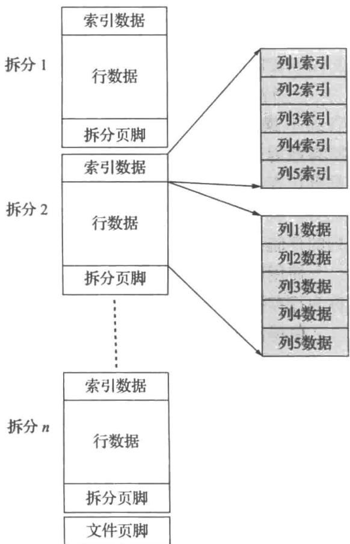

一些数据库系统在不使用压缩的情况下，对磁盘块内的数据使用面向列的表示方式 $^{②}$ 。因此，一个

图13-15 ORC文件格式中的柱状数据表示

块包含一组元组的数据，该组元组的所有属性都存储在同一个块中。这种方案在事务处理系统中很有用，因为检索所有属性值不需要多次磁盘访问。同时，在块中使用面向列的存储提供了更高效的内存访问和缓存使用的优势，以及在数据上使用向量处理的可能性。但是，此方案不允许在只检索少量属性时跳过不相关的磁盘块，也不提供压缩的好处。因此，这种表示介于纯粹的面向行的存储和纯粹的面向列的存储之间。

一些数据库（如 SAP HANA）支持两个底层存储系统，一个是为事务处理而设计的面向行的，另一个是为数据分析而设计的面向列的。元组通常是在面向行的存储中创建的，但当之后不再可能以面向行的方式访问它们时，它们会被迁移到面向列的存储中。这种系统称为混合的行 / 列存储（hybrid row/column store）。

在其他情况下，应用将事务性数据存储在面向行的存储中，但要定期（例如，每天一次或每天几次）将数据复制到数据仓库，数据仓库可能使用面向列的存储系统。

Sybase IQ 是使用面向列的存储的早期产品之一，但是现在有几个研究项目和公司已经开发了基于列存储的数据库系统，包括 C-Store、Vertica、MonetDB、VectorWise 等。更多详细信息请参阅本章末尾的延伸阅读。

## 13.7 主存数据库的存储组织

如今，主存规模足够大，并且主存足够便宜，许多组织机构的数据库能完全放入内存。这样大量主存可以通过给数据库缓冲区分配大量内存来使用，这将允许整个数据库被加载到缓冲区中，避免读取数据的磁盘 I/O 操作；更新后的块仍然需要写回磁盘以供持久使用。因此，这样的设置能够比只有数据库的一部分能放入缓冲区中的方式提供好得多的性能。

但是，如果整个数据库都能放进内存，则可以通过定制存储组织和数据库数据结构，来利用数据全部在内存中这一事实，从而显著提升性能。主存数据库（main-memory database）是所有数据都驻留在内存中的数据库；主存数据库系统通常利用这一事实来优化性能。特别是，它们完全不使用缓冲区管理器。

作为一个可以对内存驻留的数据进行优化的示例，考虑在给定记录指针的情况下访问记录的代价。对于基于磁盘的数据库，记录存储在块中，指向记录的指针由块标识符和块内的偏移量或槽号组成。要跟随这样的记录指针需要检查相应的块是否在缓冲区中（通常通过使用内存散列索引来完成），如果在缓冲区中，则找到它所在的位置，如果不在缓冲区中，则必须读取它。所有这些动作都会占用大量的 CPU 周期。

相反，在主存数据库中，可以保留指向内存中记录的直接指针，对记录的访问只是对内存指针的遍历，这是一种非常高效的操作。只要记录不被移动，保留这种直接指针就是可能的。事实上，这种移动的一个原因（即加载到缓冲区和从缓冲区中移出）已经不再是问题。

如果记录存储在块内分槽的页结构中，则在删除其他记录或调整其他记录的大小时，记录可能会在块内移动。在这种情况下，用直接指针指向记录是不可能的，尽管可以通过分槽页头部中的项对记录进行一种间接访问。可能需要锁定块，以确保在另一个进程读取其数据

时记录不会被移动。为了避免这些开销，许多主存数据库不使用分槽的页结构来分配记录。相反，它们直接在主存中分配记录，并确保记录不会因为其他记录的更新而被移动。但是，直接分配记录的一个问题是：如果重复插入和删除变长记录，内存可能会变得碎片化。数据库必须确保主存不会随着时间的推移而碎片化，无论是使用适当设计的内存管理方案，还是通过定期执行内存压缩；后一种方案将导致记录移动，但可以在不获取块上的锁的情况下完成。

如果在主存中使用了面向列的存储模式，那么列的所有值会存储在连续的内存位置上。但是，如果有对关系的追加，要确保连续分配将重新分配现有数据。为了避免这种开销，列的逻辑数组可以被划分为多个物理数组。用间接表来存储指向所有物理数组的指针。该模式如图13-16所示。为了找到逻辑数组的第i个元素，先使用间接表来定位包含第i个元素的物理数组，然后计算适当的偏移量并在该物理数组中进行查找。

还有其他一些方式可以对主存数据库的处理进行优化，我们将在后面的章节中看到。

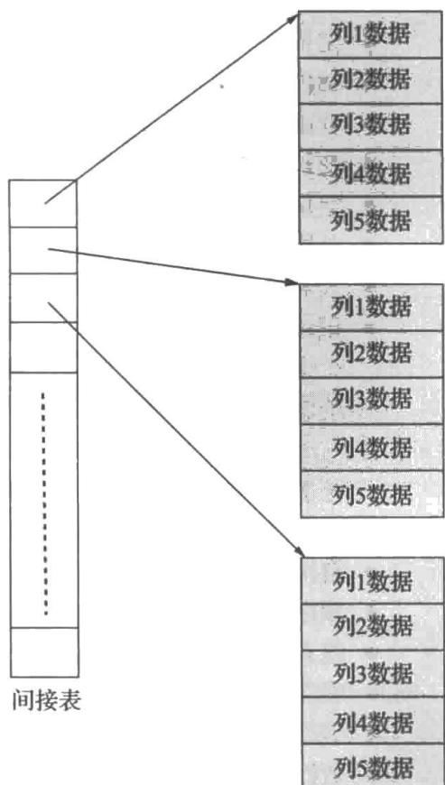

图 13-16 内存柱状数据表示

## 13.8 总结

- 我们可以把一个文件逻辑地组织成映射到磁盘块上的记录序列。把数据库映射到文件的一种方式是使用多个文件，在任意给定文件中只存储一种固定长度的记录。另一种方式是构造文件，使之能适应多种长度的记录。分槽页的方法被广泛应用于在磁盘块中处理变长记录。

- 因为数据以块为单位在磁盘存储器和主存之间传输，所以让一个单独的块包含相关联的记录并将文件记录分配到不同的块中是可取的。如果仅通过一次块访问就可以存取所需的几条记录，我们就节省了磁盘访问次数。因为磁盘访问通常是数据库系统性能的瓶颈，将记录仔细分配到块中可以获得显著的性能提升。

- 数据字典也称为系统目录，用于记录元数据，元数据是关于数据的数据，例如关系名、属性名和类型、存储信息、完整性约束以及用户信息。

- 减少磁盘访问数量的一种方式是在主存中保留尽可能多的块。因为在主存中保留所有的块是不可能的，我们需要为块的存储而管理主存中可用空间的分配。缓冲区（buffer）是主存的一部分，可用于存储磁盘块的拷贝。负责分配缓冲区空间的子系统称为缓冲区管理器（buffer manager）。

- 面向列的存储系统给很多数据仓库应用提供了良好的性能。

## 术语回顾

- 文件组织
    ○ 文件
    ○ 块
- 定长记录
- 文件头
- 自由链表
- 变长记录
- 空位图
- 分槽的页结构
- 大对象
- 记录的组织
    ○ 堆文件组织
    ○ 顺序文件组织
    ○ 多表聚簇文件组织
    ○ B $^{+}$ 树文件组织
    ○ 散列文件组织
- 自由空间图
- 顺序文件
- 搜索码
- 聚簇码
- 表划分
- 数据字典存储
    ○ 元数据
    ○ 数据字典

- 系统目录
- 数据库缓冲区
    ○ 缓冲区管理
    ○ 被钉住的块
    ○ 被移出的块
    ○ 块的强制写出
    ○ 共享排他锁

- 缓冲区替换策略
    ○ 最近最少使用（LRU）
    ○ 立即丢弃
    ○ 最近最常使用（MRU）

- 块的写出
    ● 块的强制写出
    ● 日志磁盘
    ● 日志文件系统
    ● 面向列的存储
    ○ 柱状存储
    ○ 向量处理
    ○ 列存储
    ○ 行存储
    ○ 拆分
    ○ 混合行 / 列存储

- 主存数据库

## 实践习题

13.1 考虑从图 13-3 的文件中删除记录 5。比较下列实现删除的技术的相对优点：
a. 将记录 6 移到记录 5 所占用的空间，并将记录 7 移到记录 6 所占用的空间。
b. 将记录 7 移到记录 5 所占用的空间。
c. 标记记录 5 被删除，不移动任何记录。

13.2 给出经过下面每一步后图 13-4 中文件的结构：
a. 插入 (24556, Turnamian, Finance, 9800)。
b. 删除记录 2。
c. 插入 (34556, Thompson, Music, 67000)。

13.3 考虑 section 和 takes 关系。给出这两个关系的一个实例，包括 3 个课程段，每个课程段有 5 名学生选课。给出对这些关系使用多表聚簇的一种文件结构。

13.4 考虑自由空间图的位图表示，其中对文件中的每个块，在位图中维护两个比特位。如果块的0%～30%是满的，则这两位用00表示；如果块的30%～60%是满的，则这两位用01表示；如果块的60%～90%是满的，则这两位用10表示；如果块内90%以上是满的，则这两位用11表示。即使对于很大的文件这样的位图也可以保存在内存中。
a. 概括对一个块使用两位而不是本章前面描述的一位的两个优点和一个缺点。
b. 描述在插入和删除记录时如何保持位图的更新。
c. 概括位图技术与自由链表相比在搜索自由空间和更新自由空间信息方面的优势。

13.5 能够快速发现一个块是否存在于缓冲区中，假如存在则找到它驻留在缓冲区中的具体位置，这样做是很重要的。假设数据库缓冲区的规模非常庞大，针对这个任务，你该使用什么样的（内存）数据结构？

13.6 假设你们的大学有非常大量的 takes 记录，这些记录是多年来积累的。解释该如何对 takes 关系进行表分区，以及它可以提供哪些好处。并解释该技术的一个潜在缺陷。

619 

13.7 对于下面的每种情况，给出一个关系代数表达式和一个查询处理策略的示例：
a. MRU 优于 LRU。
b. LRU 优于 MRU。

13.8 PostgreSQL 通常使用一个小的缓冲区，并让操作系统的缓冲区管理器来管理其余可用于文件系统缓冲的主存。(a) 这种方式的好处是什么？(b) 请解释这种方式的一个重大局限。

## 习题

13.9 在变长记录表示中，用空位图来表示属性是否为空值。
a. 对于变长字段，如果值为空，那么偏移量字段和长度字段中应该存储什么？
b. 在一些应用中，元组拥有非常大量的属性，其中大多数属性为空。你能否更改记录表示，使得一个空值属性的开销仅为空位图中的一个位？
13.10 请解释为什么在磁盘块上分配记录会显著影响数据库系统的性能。

13.11 列出下列存储关系数据库的每种策略的两个优点和两个缺点：
a. 在一个文件中存储一个关系。
b. 在一个文件中存储多个关系（甚至可能是整个数据库）。

13.12 在顺序文件组织中，为什么即使当前只有一条溢出记录，也要使用一个溢出块？

13.13 给出 Index_metadata 关系的规范化形式，并解释为什么使用规范化的形式会导致更差的性能。

13.14 标准的缓冲区管理器假定每个块的大小和读取代价都是相同的。设想一个缓冲区管理器使用对象引用率而不是LRU，对象引用率是指一个对象在此前的 $n$ 秒内被访问的频率。假设我们要在缓冲区中存储变长和读取代价可变（例如网页，它的读取代价取决于它从哪个站点被获取）的对象。试建议缓冲区管理器可以如何选择要从缓冲区中移出哪个块。

## 延伸阅读

[Hennessy et al. (2017)] 是一本流行的计算机体系结构方面的教科书，其内容涵盖了地址变换缓冲器、高速缓冲存储器以及内存管理单元的硬件特性。

特定数据库系统的存储结构都记录在它们各自的系统使用手册中，例如 IBM DB2、Oracle、Microsoft SQL Server 以及 PostgreSQL。这些手册可以在线访问。

[Chou and Dewitt (1985)] 给出了数据库系统中缓冲区管理的算法，以及一种性能评估算法。大部分操作系统教材（包括 [Silberschatz et al. (2018)]) 都讨论了操作系统中的缓冲区管理。

[Abadi et al. (2008)] 给出了面向列和面向行的存储的比较，包括与查询处理和优化相关的问题。

Sybase IQ 是 20 世纪 90 年代中期开发的第一个成功商用的面向列的数据库，它是为分析而设计的。MonetDB 和 C-Store 是作为学术研究项目而开发的、面向列的数据库。面向列的数据库 Vertica 是从 C-Store 发展而来的商用数据库，而 VectorWise 是从 MonetDB 发展而来的商用数据库。顾名思义，VectorWise 支持数据的向量处理，因此对许多分析查询有着非常高的处理率。[Stonebraker et al. (2005)] 描述了 C-store，[Idreos et al. (2012)] 概述了 MonetDB 项目，而 [Zukowski et al. (2012)] 描述了 VectorWise。

ORC 和 Parquet 柱状文件格式的开发是为了支持在 Apache Hadoop 平台上运行的大数据应用的数据压缩存储。

## 参考文献

[Abadi et al. (2008)] D. J. Abadi, S. Madden, and N. Hachem, "Column-Stores vs. Row-Stores: How Different Are They Really?", In Proc. of the ACM SIGMOD Conf. on Management of Data (2008), pages 967-980. 

[Chou and Dewitt (1985)] H. T. Chou and D. J. Dewitt, "An Evaluation of Buffer Management Strategies for Relational Database Systems", In Proc. of the International Conf. on Very Large Databases (1985), pages 127-141. 

[Hennessy et al. (2017)] J. L. Hennessy, D. A. Patterson, and D. Goldberg, Computer Architecture: A Quantitative Approach, 6th edition, Morgan Kaufmann (2017). 

[Idreos et al. (2012)] S. Idreos, F. Groffen, N. Nes, S. Manegold, K. S. Mullender, and M. L. Kersten, "MonetDB: Two Decades of Research in Column-oriented Database Architectures", IEEE Data Engineering Bulletin, Volume 35, Number 1 (2012), pages 40-45. 

[Silberschatz et al. (2018)] A. Silberschatz, P. B. Galvin, and G. Gagne, Operating System Concepts, 10th edition, John Wiley and Sons (2018). 

[Stonebraker et al. (2005)] M. Stonebraker, D. J. Abadi, A. Batkin, X. Chen, M. Cherniack, M. Ferreira, E. Lau, A. Lin, S. Madden, E. J. O'Neil, P. E. O'Neil, A. Rasin, N. Tran, and S. B. Zdonik, "C-Store: A Column-oriented DBMS", In Proc. of the International Conf. on Very Large Databases (2005), pages 553-564. 

[Zukowski et al. (2012)] M. Zukowski, M. van de Wiel, and P. A. Boncz, "Vectorwise: A Vectorized Analytical DBMS", In Proc. of the International Conf. on Data Engineering (2012), pages 1349-1350. 

