## 索引

许多查询只涉及文件中的一小部分记录。例如，类似“找出物理系中的所有教师”或者“找出 ID 是 22201 的学生的总学分”这样的查询，就只涉及 instructor 或 student 记录的一小部分。如果系统读取 instructor 关系中的每一个元组去检查 dept_name 值是否为“物理”，那么这样的操作方式是低效的。类似地，只是为了查找对应于 ID 是“22201”的一个元组而读取整个 student 关系也是低效的。在理想情况下，系统应该能够直接定位这些记录。为了允许这种访问方式，我们设计了与文件相关联的附加结构。

## 14.1 基本概念

数据库系统中文件索引的工作方式非常类似于本书中的索引。如果我们希望了解本书中某个特定主题（用一个词或者短语指定）的内容，可以在书后的索引中查找该主题，找到它所出现的页，然后阅读这些页，寻找我们需要的信息。索引中的词是按顺序排列的，因此，要找到我们所需要的词就容易了。而且，索引比书小得多，这进一步减少了所需的精力。

数据库系统中的索引与图书馆中书的索引所起的作用一样。例如，为了检索一条具有给定 ID 的 student 记录，数据库系统会查找索引，找到相应记录所在的磁盘块 $^{①}$ ，然后取出该磁盘块以得到所需的 student 记录。

索引对于数据库中查询的高效处理至关重要。如果没有索引，每个查询最终都将读取它所使用的每个关系的全部内容；对于仅获取几条记录的查询（例如，单条 student 记录，或者 takes 关系中对应于单个学生的记录）来说，这样做的代价将是高得离谱的。

623 

通过维护学生 ID 的有序列表来实现 student 关系上的索引在非常大的数据库上不会非常管用，因为：（i）索引本身会非常庞大；（ii）即使保持有序索引减少了搜索时间，但查找一名学生仍然会相当耗时；（iii）在学生从数据库中添加或删除时更新有序列表可能代价非常昂贵。在数据库系统中使用了更复杂的索引技术。我们将在本章中讨论其中几种技术。

有两种基本的索引类型。

- 顺序索引（ordered index）：基于值的顺序排序。

- 散列索引（hash index）：基于将值平均分布到若干桶中。一个值所属的桶是由一个函数决定的，该函数称为散列函数（hash function）。

我们将考虑用于顺序索引的几种技术。没有哪一种技术是最好的，只能说某种技术对特定的数据库应用是最适合的。对每种技术的评价必须基于下面这些因素。

- 访问类型（access type）：能有效支持的访问类型。访问类型可以包括找到具有特定属性值的记录，以及找到属性值落在某个特定范围内的记录。

- 访问时间（access time）：在查询中使用该技术找到一个特定数据项或数据项集所花费的时间。

- 插入时间（insertion time）：插入一个新数据项所花费的时间。该值包括找到插入这个新数据项的正确位置所花费的时间，以及更新索引结构所花费的时间。

- 删除时间（deletion time）：删除一个数据项所花费的时间。该值包括找到待删除项所花费的时间，以及更新索引结构所花费的时间。

- 空间开销（space overhead）：索引结构所占用的额外空间。倘若这种额外空间的规模适度，通常值得牺牲一定的空间来换取性能的提升。

我们通常希望在一个文件上建立多个索引。例如，我们可能按作者、主题或者书名来查找一本书。

用于在文件中查找记录的属性或属性集被称为搜索码（search key）。请注意这种码（key）的定义与主码（primary key）、候选码（candidate key）以及超码（superkey）中使用的定义不同。（遗憾的是）码在实践中具有广为接受的重复含义。使用搜索码的概念，我们认为，如果一个文件上有多个索引，那么它就有多个搜索码。

## 14.2 顺序索引

为了能够快速、随机地访问文件中的记录，我们可以使用索引结构。每个索引结构与一个特定的搜索码相关联。正如书的索引或者图书馆目录一样，顺序索引（ordered index）按照排好的顺序存储搜索码的值，并将每个搜索码与包含该搜索码的记录关联起来。

被索引的文件中的记录本身也可以按照某种排序顺序存储，正如图书馆中的书按某些属性（如杜威十进制数）存放一样。一个文件可以有多个索引，分别基于不同的搜索码。如果包含记录的文件按顺序排列，则聚集索引（clustering index）是这样一种索引：其搜索码还定义了文件的次序。聚集索引也称为主索引（primary index）；主索引这个术语可能看起来表示建立在主码上的索引，但实际上这种索引可以建立在任何搜索码上。聚集索引的搜索码常常是主码，但也并非必须如此。搜索码指定的次序与文件的排列次序不同的索引被称为非聚集索引（nonclustering index）或辅助索引（secondary index）。经常使用术语“聚集的”（clustered）和“非聚集的”（nonclustered）来代替“聚集”（clustering）和“非聚集”（nonclustering）。

在14.2.1至14.2.3节中，我们假定所有文件都按照某种搜索码顺序存储。这种在搜索码上有聚集索引的文件称作索引顺序文件（index-sequential file）。它们代表了在数据库系统中最早采用的索引模式之一。它们是针对既需要顺序处理整个文件又需要随机访问单条记录的应用而设计的。在14.2.4节中我们将介绍辅助索引。

图14-1显示了取自我们大学示例中instructor记录的一个顺序文件。在图14-1所示的示例中，记录按照教师 $ID$ 的次序顺序存储，教师 $ID$ 被用作搜索码。

## 14.2.1 稠密索引和稀疏索引

索引项（index entry）或索引记录（index record）由一个搜索码值和指针构成。这些指针指向具有该搜索码值的一条或多条记录。指向一条记录的指针由磁盘块的标识和标识出块内记录的磁盘块内偏移量所组成。

我们可以使用的顺序索引有两类。

- 稠密索引（dense index）：在稠密索引中，对于文件中的每个搜索码值都有一个索引项。在稠密聚集索引中，索引记录包括搜索码值以及指向具有该搜索码值的第一条数据记录的指针。具有相同搜索码值的其余记录会顺序地存储在第一条记录之后，由于该索引是聚集索引，因此记录是根据相同的搜索码值排序的。

在稠密非聚集索引中，索引必须存储指向具有相同搜索码值的所有记录的指针列表。

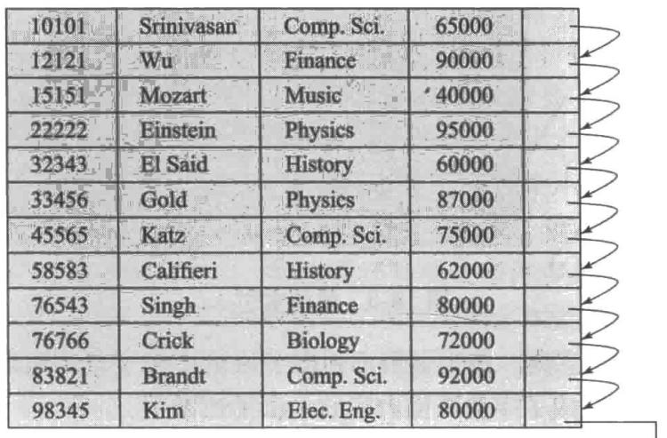


图 14-1 instructor 记录的顺序文件


- 稀疏索引（sparse index）：在稀疏索引中，只为某些搜索码值建立索引项。只有当关系按搜索码排列次序存储时才能使用稀疏索引。换句话说，只有索引是聚集索引时才使用稀疏索引。和稠密索引中的情况一样，每个索引项也包括一个搜索码值和指向具有该搜索码值的第一条数据记录的指针。为了定位一条记录，我们找到所具有的最大搜索码值小于或等于我们所找记录的搜索码值的索引项。我们从该索引项指向的记录开始，然后沿着文件中的指针查找，直到找到所需记录为止。

图 14-2 和图 14-3 分别显示了为 instructor 文件建立的稠密索引和稀疏索引。假如我们现在要查找 ID 是 “22222” 的教师记录。利用图 14-2 的稠密索引，我们可以顺着指针直接找到所需记录。因为 ID 是主码，所以只存在一条这样的记录，于是搜索完成。如果我们使用稀疏索引（见图 14-3），就找不到对于 “22222” 的索引项。因为 “22222” 之前的最后一项是 “10101”（按数字排序），于是我们循着该指针查找。然后我们按顺序读取 instructor 文件，直到找到所需记录。

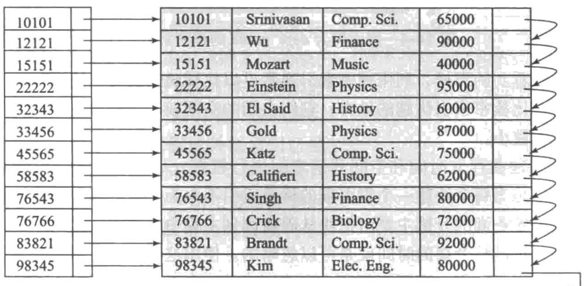


图14-2 稠密索引


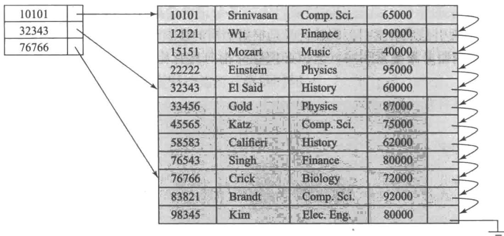


图14-3 稀疏索引


考虑一本（印刷好的）字典。每页页眉都列出了该页中按字母序出现的第一个单词。字典的每页顶部的单词共同构成了字典页面内容的一个稀疏索引。

作为另一个示例，假设搜索码值并不是主码。图 14-4 展示了对于以 dept_name 为搜索码的 instructor 文件的稠密聚集索引。请注意在这种情况下，instructor 文件按照搜索码 dept_name 排序，而不是 ID，否则在 dept_name 上的索引将成为非聚集索引。假设我们正在查找历史系的记录。利用图 14-4 的稠密索引，我们沿着指针直接找到第一条历史系记录。我们处理此记录，并沿着该记录中的指针定位到按搜索码 dept_name 排序的下一条记录。我们继续处理记录，直到遇到一条不是历史系的记录。

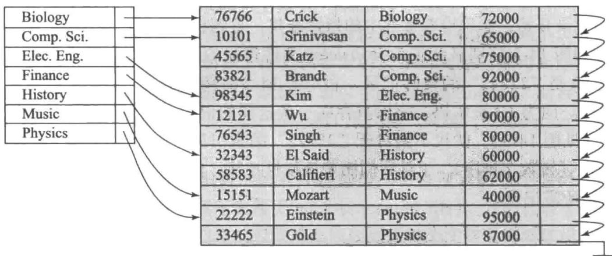


图14-4 搜索码为dept_name的稠密索引


正如我们已经看到的那样，利用稠密索引通常可以比稀疏索引更快地定位一条记录。但是，稀疏索引也有比稠密索引优越的地方：它们占用的空间较小，并且它们所需的插入和删除时的维护开销也较小。

系统设计者必须在存取时间和空间开销之间进行权衡。尽管有关这一权衡的决策依赖于具体的应用，但是为每个块建一个索引项的稀疏索引不失为一种较好的折中方案。原因在于，处理一个数据库查询的开销主要由把块从磁盘读到主存中所花费的时间来决定。一旦我们将块放入主存，扫描整个块的时间就是可以忽略的。使用这样的稀疏索引，可以定位包含所要查找的记录的块。这样，只要记录不在一个溢出块（参见13.3.2节）中，就能使块访问次数最小，同时能保持索引的规模（以及空间开销）尽可能小。

要使上述技术完全通用，必须考虑具有相同搜索码值的记录跨多个块的情况。可以很容易地修改我们的方案来处理这样的情况。

## 14.2.2 多级索引

假设我们在具有 1 000 000 个元组的关系上建立了稠密索引。索引项比数据记录要小，因此我们假设一个 4 KB 的块中可以容纳 100 个索引项。这样，我们的索引需要占用 10 000 个块。假如该关系具有 100 000 000 个元组，那么索引就需要占用 1 000 000 个块，或者 4 GB 的空间。这样大型的索引以顺序文件的方式存储在磁盘上。

如果索引足够小且可以完全放在主存中，那么查找一个索引项的搜索时间就会很短。但是，如果索引过大而不能完全放在主存中，那么当需要时，就必须从磁盘中获取索引块。（即便一个索引比一台计算机的主存小，但主存还需要处理许多其他任务，因此有可能不能将整个索引放在主存中。）于是搜索索引中的一个项就需要多次读取磁盘块。

可以在索引文件上使用二分法搜索来定位一个索引项，但是搜索的开销依然很大。如果索引会占据 $b$ 个块，二分法搜索需要读取 $\lceil \log_2(b) \rceil$ 个块。（ $[x]$ 表示大于或等于 $x$ 的最小整数，即向上取整。）请注意被读取的块彼此不相邻，所以每次读取需要一次随机（即非顺序）的 I/O 操作。对于有 10000 个块的索引，二分法搜索需要 14 次随机读块操作。在读一个随机块平均花费 10 毫秒的磁盘系统上，索引搜索将耗时 140 毫秒。这也许看上去不是很长，但是一秒钟内我们在单张磁盘上只能进行 7 次索引搜索，而一会儿我们将会看到，一种更高效的搜索机制可以让我们一秒钟内执行更多次搜索。请注意，如果使用了溢出块，那么二分法搜索就只能在非溢出块上使用，并且实际成本甚至可能高于上面的对数界限。一次顺序搜索需要读取 $b$ 个顺序块，这将耗费更长的时间（尽管在某些情况下，顺序块读取的较低成本可能导致顺序搜索比二分法搜索要快）。因此，搜索一个大型索引可能是一个相当耗时的过程。

为了处理这个问题，我们像对待其他任何顺序文件那样对待索引，并且在原始的索引上构造一个稀疏的外层索引，现在我们把原始索引称为内层索引，如图 14-5 所示。请注意索

引项总是有序排列的，这使得外层索引可以是稀疏的。为了定位一条记录，我们首先在外层索引上使用二分法搜索来找到其最大搜索码值小于或等于我们所需搜索码值的记录。指针指向一个内层索引块。我们扫描这个块，直到找到其最大搜索码值小于或等于所需搜索码值的记录。这条记录里的指针指向包含我们所查找记录的文件的块。

在我们的示例中，具有 10 000 个块的内层索引需要外层索引中有 10 000 个索引项，这些索引项仅占用 100 个块。如果我们假设外层索引已经在主存中，那么当使用多级索引时，一次搜索只需要读取一个索引块，而不像使用二分法搜索时读取 14 个块。其结果是，我们每秒可以执行 14 倍那么多的索引查找。

如果我们的文件极其庞大，甚至外层索引也可能大到不能放进主存。对于一个具有100 000 000个元组的关系，内层索引将占用1 000 000个块，且外层索引将占用10 000个块，或者40 MB。因为在主存中有很多需求，所以有可能不能为这个特定的外层索引预留出那么多的主存。在这种情况下，可以再创建另一级索引。事实上，可以根据需要多次重复此过程。具有两级或两级以上的索引称为多级索引（multilevel indices）。利用多级索引搜索记录与用二分法搜索记录相比所需要的I/O操作要少得多 $^{①}$ 。

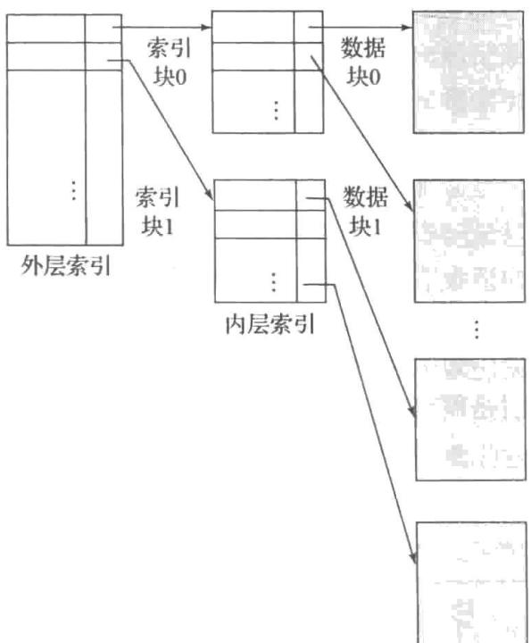


图 14-5 二级稀疏索引


多级索引和树型结构紧密相关，比如用于内存索引的二叉树。稍后我们将在14.3节中讨论这种关系。

## 14.2.3 索引更新

无论采用何种形式的索引，每当文件中有记录插入或删除时，每个索引都必须更新。进而，在文件中的记录被更新的情况下，其搜索码属性受更新影响的任何索引也必须更新。例如，如果一位教师所在的系发生了变化，那么在 instructor 的 dept_name 属性上的索引也必须相应地更新。这种记录更新可以被设计为删除一条旧记录，然后插入一条具有新值的记录，这会导致对索引的一次删除后接对索引的一次插入。其结果是，我们只需要考虑在索引上的插入和删除，不需要显式地考虑更新。

我们首先介绍单级索引的更新算法。

## 14.2.3.1 插入

系统首先用出现在待插入记录中的搜索码值执行查找。系统根据索引是稠密的还是稀疏的来进行下一步操作。

- 稠密索引：

1. 如果该搜索码值并未出现在索引中，系统就在索引中适当的位置插入带有该搜索码值的索引项。

2. 否则执行如下操作。

a. 如果索引项存储的是指向具有相同搜索码值的所有记录的指针，那么系统就在索引项中增加一个指向新记录的指针。

b. 否则，索引项存储一个仅指向具有相同搜索码值的第一条记录的指针，系统把待插入的记录放到具有相同搜索码值的其他记录之后。

- 稀疏索引：我们假设索引为每个块保存一个索引项。如果系统创建了一个新的块，它会将出现在新块中的第一个搜索码值（按照搜索码的次序）插入索引中。另一方面，如果这条新插入的记录具有它所在块中的最小搜索码值，那么系统就更新指向该块的索引项；否则，系统对索引不做任何改动。

## 14.2.3.2 删除

为了删除一条记录，系统首先要找到待删除的记录。系统下一步要执行的操作取决于索引是稠密的还是稀疏的。

- 稠密索引：

1. 如果待删除的记录是具有这个特定搜索码值的唯一的一条记录，则系统就从索引中删除相应的索引项。

2. 否则执行如下操作。

a. 如果索引项存储的是指向具有相同搜索码值的所有记录的指针，那么系统就从索引项中删除指向待删除记录的指针。

b. 否则，索引项存储一个仅指向具有该搜索码值的第一条记录的指针。在这种情况下，如果待删除的记录是具有该搜索码值的第一条记录，系统就更新索引项，使其指向下一条记录。

- 稀疏索引：

1. 如果索引中并不包含具有待删除记录搜索码值的索引项，则索引不必做任何改动。

2. 否则系统执行如下操作。

a. 如果待删除记录是具有该搜索码值的唯一记录，则系统用下一个搜索码值（按搜索码次序）的索引记录来替换相应的索引记录。如果下一个搜索码值已经有了一个索引项，则删除而不是替换该索引项。

631 

b. 否则，如果该搜索码值的索引项指向待删除的记录，系统就更新索引项，使其指向具有相同搜索码值的下一条记录。

多级索引的插入和删除算法是对上述算法的一个简单扩展。在插入或删除时，系统对最底层索引进行如上所述的更新。而对于第二层而言，最底层索引不过是一个包含记录的文件。因此，如果在最底层索引中发生了任何改变，系统就对第二层索引进行如上所述的更新。如果还有更高层的索引，可以采用同样的技术来对其进行更新。

## 14.2.4 辅助索引

辅助索引必须是稠密的，对每个搜索码值都有一个索引项，并且对文件中的每条记录都有一个指针。而聚集索引可以是稀疏的，只存储部分搜索码值，因为正如前面所描述的那样，通过顺序访问文件的一部分，总可以找到带有中间搜索码值的记录。如果辅助索引只存储部分搜索码值，则具有中间搜索码值的记录可能存在于文件中的任何位置，我们通常只能通过扫描整个文件才能找到它们。

候选码上的辅助索引看起来就像是稠密聚集索引，只不过索引中由连续值所指向的记录并不是顺序存放的。然而，一般来说，辅助索引的结构可能和聚集索引不同。如果聚集索引的搜索码不是候选码，则索引只要指向具有该搜索码的特定值的第一条记录就足够了，因为其他的记录可以通过对文件进行顺序扫描而获得。

反之，如果辅助索引的搜索码不是候选码，则仅仅指向具有每个搜索码值的第一条记录是不够的。具有相同搜索码值的其余记录可能分布在文件的任何位置，因为记录是按聚集索引的搜索码而不是按辅助索引的搜索码次序存放的。因此，辅助索引必须包含指向所有记录的指针。

如果一种关系可以有不止一条包含相同搜索码值的记录（即两条或多条记录对于索引属性可以具有相同的值），则搜索码被称为非唯一性搜索码（nonunique search key）。

在非唯一性搜索码上实现辅助索引的一种方式如下：与主索引的情况不同，这种辅助索引中的指针并不直接指向记录。相反，索引中的每个指针都指向一个桶，该桶继而又包含指向文件的指针。图 14-6 显示了一个辅助索引的结构，该索引在 instructor 文件的 dept_name 搜索码上使用了一个附加的间接指针层。

然而，这种方式有几个缺点。首先，由于附加的间接指针层可能需要随机 I/O 操作，因此索引访问需要花费更长的时间；其次，如果一个码很少或没有重复，那么将整个块分配给

632 

其关联的桶会浪费大量的空间。在本章的后面，我们将学习更有效的实现辅助索引的可替代方案，它们避免了这些缺点。

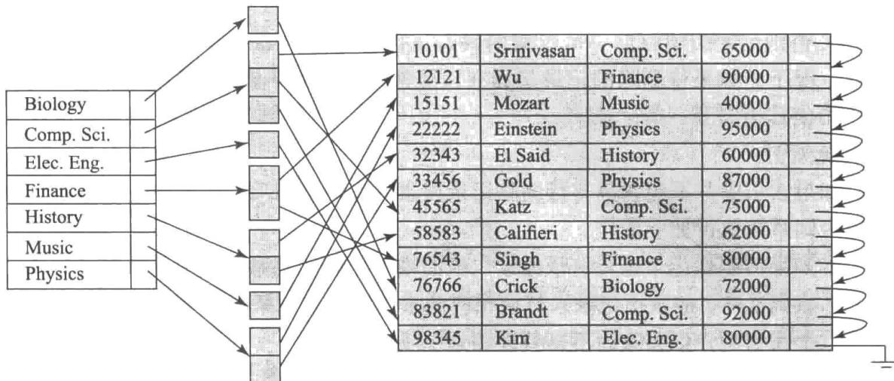


图14-6 instructor文件上的辅助索引，基于dept_name非候选码


按照聚集索引的顺序进行顺序扫描是高效的，因为文件中记录的物理存储顺序和索引的顺序是一致的。但是，我们不能（除了极少数特殊情况外）使存储文件的物理顺序既和聚集索引的搜索码顺序一致，又和辅助索引的搜索码顺序一致。由于辅助码的顺序和物理码的顺序不同，如果我们想要按辅助码的顺序对文件进行顺序扫描，那么每读一条记录都可能需要从磁盘读入一个新的块，这是非常慢的。

前面介绍的删除和插入过程也适用于辅助索引；所采取的操作是所介绍的那些针对稠密索引的操作，稠密索引对于文件中的每条记录都存储一个指针。如果一个文件有多个索引，则无论何时修改该文件，都必须更新每个索引。

辅助索引提高了使用除了聚集索引的搜索码之外的码的查询性能。但是，它们会给修改数据库带来很大的开销。数据库的设计者可根据对查询与修改的相对频率的估计来决定哪些辅助索引是可取的。

## 14.2.5 多码索引

虽然我们迄今所看到的示例在搜索码中只有单个属性，但一般来说，一个搜索码可以有多个属性。包含多个属性的搜索码被称为复合搜索码（composite search key）。这种索引的结构和任何其他索引都相同，唯一的区别在于搜索码不是单个属性，而是一个属性列表。这种搜索码可以表示为形如 $(a_{1},\cdots,a_{n})$ 的值的元组，其中索引属性是 $A_{1},\cdots,A_{n}$ 。搜索码值按字典序（lexicographic ordering）排列。例如，对于具有两个属性的搜索码的情况，如果 $a_{1}<b_{1}$ ，或 $a_{1}=b_{1}$ 且 $a_{2}<b_{2}$ ，则 $(a_{1},a_{2})<(b_{1},b_{2})$ 。字典序和单词的字母次序基本一致。

作为一个示例，考虑 takes 关系上的一个索引，并且其复合搜索码为 (course_id, semester, year)。这样一个索引对于查找在特定学期 / 学年注册了特定课程的所有学生是有用的。复合码上的有序索引还可以用来高效地回答几种其他类型的查询，就如我们将在 14.6.2 节中见到的那样。

## 14.3 $\mathrm{B}^{+}$ 树索引文件

索引顺序文件组织主要的缺点在于，随着文件的增大，索引查找的性能和数据顺序扫描

instructor文件

的性能都会下降。虽然这种性能下降可以通过对文件的重新组织来弥补，但是我们不希望频繁地进行重组。

$\mathbf{B}^{+}$ 树索引（ $\mathbf{B}^{+}$ -tree index）结构是使用最广泛的、在数据插入和删除的情况下仍能保持其执行效率的几种索引结构之一。 $\mathbf{B}^{+}$ 树索引采用平衡树（balanced tree）结构，其中从树根到树叶的每条路径的长度都是相同的。树中每个非叶节点（除根节点之外）有 $[n/2]$ 到 $n$ 个孩子，其中 $n$ 对于特定的树是固定的；根节点有2到 $n$ 个孩子。

我们将看到 $B^{+}$ 树结构会增加文件插入和删除的性能开销，同时会增加空间开销。但是即使对于频繁更新的文件来说，这种开销也是可接受的，因为避免了文件重组的代价。此外，由于节点有可能是半空的（如果它们具有最少孩子节点数），这将造成一些空间的浪费。但是，考虑到 $B^{+}$ 树结构所带来的性能优势，这种空间开销也是可以接受的。

## 14.3.1 B $^{+}$ 树的结构

B $^{+}$ 树索引是一种多级索引，但是其结构不同于多级索引顺序文件。我们目前假设没有重复的搜索码值，也就是说，每个搜索码都是唯一的，并且最多出现在一条记录中；我们稍后将考虑非唯一性搜索码的问题。

典型的 B $^{+}$ 树节点如图 14-7 所示。它最多包含 n-1 个搜索码值 $K_{1}, K_{2}, \cdots, K_{n-1}$ ，以及 n 个指针 $P_{1}, P_{2}, \cdots, P_{n}$ 。一个节点内的搜索码值是有序存放的，因此，如果 i < j，那么 $K_{i} < K_{j}$ 。

<table><tr><td><eq>P_{1}</eq></td><td><eq>K_{1}</eq></td><td><eq>P_{2}</eq></td><td>...</td><td><eq>P_{n-1}</eq></td><td><eq>K_{n-1}</eq></td><td><eq>P_{n}</eq></td></tr></table>


图 14-7 典型的 B $^{+}$ 树节点


我们首先考察叶节点（leaf node）的结构。对 $i = 1, 2, \cdots, n-1$ ，指针 $P_{i}$ 指向具有搜索码值 $K_{i}$ 的一条文件记录。指针 $P_{n}$ 有特殊的作用，我们将稍后讨论。

图 14-8 是 instructor 文件的 B $^{+}$ 树的一个叶节点，其中我们设 n 等于 4，且搜索码是 name。

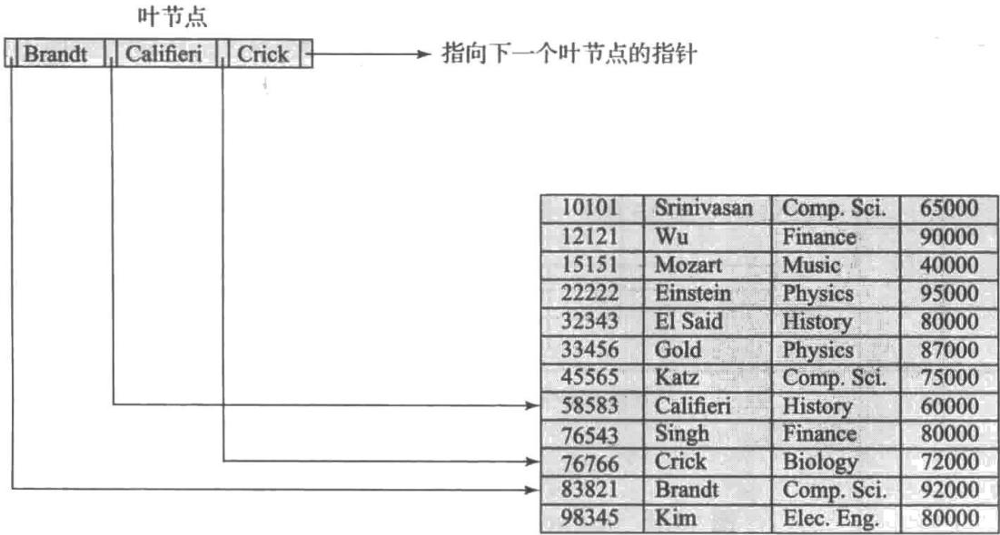


图14-8 instructor的 $\mathbf{B}^{+}$ 树索引（ $n = 4$ ）的一个叶节点


现在我们已经知道了叶节点的结构，下面来看一看搜索码值是如何赋给特定节点的。每个叶节点最多可有 $n - 1$ 个值。我们允许叶节点包含最少 $\lceil (n - 1) / 2\rceil$ 个值。在我们的 $\mathbf{B}^{+}$ 树示例中 n=4，每个叶节点必须包含最少 2 个并且最多 3 个值。

如果 $L_{i}$ 和 $L_{j}$ 是叶节点且 i < j （即在树中 $L_{i}$ 位于 $L_{j}$ 的左边），则 $L_{i}$ 中的每个搜索码值 $v_{i}$ 均小于 $L_{j}$ 中的每个搜索码值 $v_{j}$ 。

如果 $\mathbf{B}^{+}$ 树索引被用作稠密索引（这是通常情况），每个搜索码值都必须出现在某个叶节点中。

现在我们可以来解释指针 $P_{n}$ 的作用了。因为按照叶节点所包含的搜索码值，在叶节点上有一个线性的次序，我们用 $P_{n}$ 将叶节点按搜索码次序链接在一起。这种次序有利于对文件进行高效的顺序处理。

B $^{+}$ 树的非叶节点（nonleaf node）形成叶节点之上的一个多级（稀疏）索引。非叶节点的结构和叶节点的结构相同，只不过非叶节点中所有指针都是指向树节点的。一个非叶节点可以最多容纳 $n$ 个指针，同时必须至少容纳 $[n/2]$ 个指针。一个节点中的指针数称为该节点的扇出（fanout）。非叶节点也被称为内部节点（internal node）。

让我们考虑一个包含 m 个指针的节点 $(m \leqslant n)$ 。对于 $i = 2, 3, \cdots, m-1$ ，指针 $P_{i}$ 指向的子树所包含的搜索码值均小于 $K_{i}$ 且大于或等于 $K_{i}-1$ 。指针 $P_{m}$ 指向子树中所包含搜索码值大于或等于 $K_{m}-1$ 的那部分，而指针 $P_{1}$ 指向子树中所包含搜索码值小于 $K_{1}$ 的那部分。

根节点与其他非叶节点不同，它包含的指针数可以少于 $[n / 2]$ ；但是，除非整棵树只由一个节点组成，否则根节点必须至少包含两个指针。对任意的 $n$ ，总可以构造出满足上述要求的 $\mathbf{B}^{+}$ 树。

图 14-9 展示了对于 instructor 文件（n = 4）的一棵完整的 B $^{+}$ 树。为了简化起见，我们省略了空指针。图中不包含箭头的任何指针区域都可理解为具有空值。

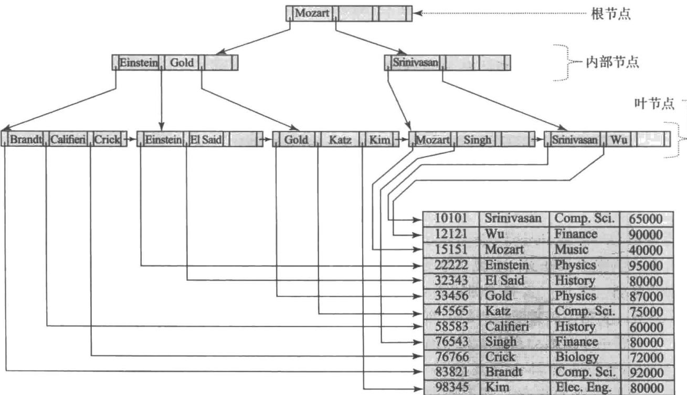


图 14-9 instructor 文件的 B $^{+}$ 树 (n = 4)


图14-10展示了instructor文件的另一棵 $\mathbf{B}^{+}$ 树，这次 $n = 6$ 。可以观察到这棵树的高度小于前面 $n = 4$ 的树。

这些示例的 $B^{+}$ 树都是平衡的。也就是说，从根到叶节点的每条路径的长度都相同。对于 $B^{+}$ 树来说这是一个必需的性质。实际上， $B^{+}$ 树中的 “B” 就表示 “平衡”（balanced）的意思。正是 $\mathbf{B}^{+}$ 树的这一平衡性质保证了对于查找、插入和修改的良好性能。

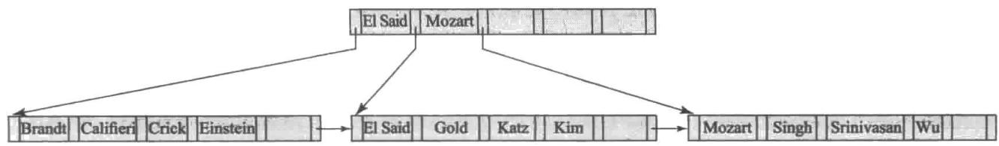


图 14-10 instructor 文件的 B $^{+}$ 树 (n = 6)


一般来说，搜索码可能有重复项。处理非唯一性搜索码情况的一种方式是修改树结构，使得每个搜索码在叶节点处存储的次数与它在记录中出现的次数相同，并且每个副本指向一条记录。如果 $i < j$ 则 $K_{i} < K_{j}$ 的条件需要修改为 $K_{i} \leqslant K_{j}$ 。但是，这种方式会导致内部节点处的搜索码值重复，使得插入和删除过程更加复杂且代价昂贵。另一种可选方案是存储一个带每个搜索码值的记录指针的集合（或桶），正如我们在前面所看到的。这种方式更为复杂，并可能导致访问效率低下，特别是在对于特定码的记录指针数量非常多的情况下。

大多数数据库实现按照如下方式使得搜索码是唯一的：假设 r 关系所需的搜索码属性 $a_{i}$ 是非唯一的。令 $A_{p}$ 为 r 的主码。那么在建立索引时使用唯一性复合搜索码 $(a_{i}, A_{p})$ 来代替 $a_{i}$ 。（能与 $a_{i}$ 一起保证唯一性的任何一组属性都可以用来代替 $A_{p}$ 。）例如，如果我们希望在 instructor 关系的 name 属性上创建一个索引，那么我们实际将在复合搜索码（name, ID）上创建一个索引，因为 ID 是 instructor 的主码。使用此索引可以高效地处理仅在 name 上进行的索引查找，正如我们很快将看到的那样。14.3.5 节将更详细地介绍处理非唯一性搜索码的问题。

在我们的示例中，我们展示了在一些非唯一性搜索码上的索引，例如 instructor.name。为简单起见，假定不存在重复项；实际上，大多数数据库会自动在内部添加额外的属性，以确保不存在重复项。

## 14.3.2 B $^{+}$ 树的查询

让我们考虑如何处理 $\mathbf{B}^{+}$ 树上的查询。假设我们要找出搜索码具有给定值 $v$ 的记录。图14-11给出了执行这项任务的函数 $find(v)$ 的伪码，在此假设没有重复项，也就是说，最多有一条记录具有特定的搜索码。我们将在本小节的后面讨论非唯一性搜索码的问题。

function find(v)
/* 假设没有重复码，并且如果存在这样一条搜索码值为 v 的记录，
* 则返回指向该记录的指针，否则返回空 */
置 C = 根节点
while (C 不是叶节点) begin
    令 i = 满足 $v \leqslant C.K_{i}$ 的最小值
    if 没有这样的 i then begin
    令 $P_{m}$ = 该节点中最后一个非空指针
    置 $C = C.P_{m}$ end
    else if $(v = C.K_{i})$ then 置 $C = C.P_{i+1}$ else 置 $C = C.P_{i} / * v < C.K_{i} */$ end
    /* C 是叶节点 */
    if 有某个 i，满足 $K_{i} = v$ then 返回 $P_{i}$ else 返回空；/* 不存在码值等于 v 的记录 */


图 14-11 B $^{+}$ 树的查询


直观地看，如果树中存在指定的值，那么该函数就从树的根节点开始，并向下遍历树直到到达包含指定值的叶节点为止。具体地说，开始时以根节点作为当前节点，该函数重复如下步骤直到到达一个叶节点。首先，检查当前节点，查找最小的 $i$ 使得搜索码值 $K_{i}$ 大于或等于 $\nu$ 。假设找到了这样的值，那么，如果 $K_{i} = \nu$ ，则将当前节点置为由 $P_{i + 1}$ 指向的节点，否则如果 $K_{i} > \nu$ ，则将当前节点置为由 $P_{i}$ 指向的节点；如果没有找到这样的 $K_{i}$ 值，那么 $\nu > K_{m - 1}$ ，其中 $P_{m}$ 是节点中的最后一个非空指针。在这种情况下，将当前节点置为由 $P_{m}$ 指向的节点。重复上述过程，向下遍历树直至到达叶节点为止。

在叶节点处，如果存在 $K_{i} = v$ 的搜索码值，则我们沿着指针 $P_{i}$ 找到具有搜索码值 $K_{i}$ 的记录。然后此函数返回指向该记录的指针 $P_{i}$ 。如果在叶节点中没有找到等于 $v$ 值的搜索码，即在该关系中不存在具有码值为 $v$ 的记录，则函数 find 返回空值以表明查找失败。

$\mathbf{B}^{+}$ 树也可以用于查找搜索码值在特定区间 $[lb, ub]$ 内的所有记录。例如，利用在instructor的salary属性上的 $\mathbf{B}^{+}$ 树，我们可以查找工资在特定范围（比如[50000, 100000]，换句话说，即介于50000和100000之间的所有工资）内的所有instructor记录。这样的查询称作范围查询（range query）。

我们可以创建一个 findRange(lb, ub) 过程来执行这样的查询，如图 14-12 所示。该过程执行以下操作。它首先以类似于 find(lb) 的方式遍历至一个叶节点；该叶节点可能包含值 lb，也可能不包含值 lb。然后该过程遍历该叶节点以及随后的叶节点中的记录，以收集指向具有码值 $C.K_{i}$ 且满足 $lb \leqslant C.K_{i} \leqslant ub$ 的所有记录的指针，并将这些指针放入一个 resultSet 结果集。当 $C.K_{i} > ub$ 或树中没有更多码时，此过程停止。

```javascript
function findRange(lb, ub)
/* 返回具有搜索码值 V 且满足 lb ≤ V ≤ ub 的所有记录 */
置 resultSet = {};
置 C = 根节点
while (C 不是叶节点 ) begin
    令 i = 满足 lb ≤ C.K_i 的最小值
    if 没有这样的 i then begin
    令 P_m = 节点中最后一个非空指针
    置 C = C.P_m
    end
    else if (lb = C.K_i) then 置 C = C.P_{i+1}
    else 置 C = C.P_i /* lb < C.K_i */
end
/*C 是叶节点 */
令 i 是满足 K_i ≥ lb 的最小值
if 不存在这样的 i
    then 置 i = 1 + C 中码的数量 /* 强制移动至下一个叶节点 */
置 done = false;
while (not done) begin
    令 n = C 中码的数量
    if (i ≤ n 且 C.Ki ≤ ub) then begin
    把 C.P_i 加入 resultSet
    置 i = i + 1
    end
    else if (i ≤ n 且 C.K_i > ub)
    then 置 done = true;
    else if (i > n 且 C.P_{n+1} 不为空)
    then 置 C = C.P_{n+1} 并且 i = 1 /* 移至下一个叶节点 */
    else 置 done = true; /* 右侧没有更多的叶节点 */
end
return resultSet;
```


图 14-12 B $^{+}$ 树上的范围查询


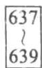


一种实际的实现可能提供 findRange 的一个版本以支持迭代接口，迭代接口类似于我们在 5.1.1 节中看到的由 JDBC ResultSet 所提供的那种。这种迭代接口会提供一个 next() 方法，该方法可以被反复调用以获取连续记录。next() 方法可以通过与 findRange 相似的方式在叶节点级别进行遍历，但是每次调用只执行一步，并记录它停止的位置，这样连续的 next() 调用将遍历相继的项。为了简单起见，我们省略了细节，并将迭代接口的伪码作为练习留给感兴趣的读者。

现在我们考虑在 $\mathbf{B}^{+}$ 树索引上查询的代价。在处理一个查询的过程中，我们需要遍历树中从根到某个叶节点的一条路径。如果文件中有 $N$ 个搜索码值，那么这条路径的长度不超过 $\lceil \log_{[n / 2]}(N) \rceil$ 。

典型的节点规模被选为和磁盘块的规模一样大，磁盘块的规模通常为 4 KB。如果搜索码的规模为 12 字节，并且磁盘指针的规模为 8 字节，那么 n 大约为 200。即使采用更保守的估计——搜索码规模为 32 字节，n 也大约为 100。在 n = 100 的情况下，如果在文件中我们有 100 万个搜索码值，那么一次查找也只需要访问 $\left[\log_{50}(1\ 000\ 000)\right] = 4$ 个节点。因此，为遍历从根到叶的路径最多只需要从磁盘读 4 个块。树中的根节点通常被频繁访问，很可能就在缓冲区中，因此通常只要从磁盘读取 3 个或更少的块。

$\mathrm{B}^{+}$ 树结构与内存中树结构（如二叉树）之间的一个重要区别在于节点的规模及其所导致的树的高度的不同。在二叉树中，每个节点都很小且最多有两个指针。在 $\mathbf{B}^{+}$ 树中，每个节点都很大，通常是一个磁盘块的规模，并且一个节点可以有大量的指针。因此， $\mathbf{B}^{+}$ 树一般胖而矮，不像二叉树那样瘦而高。在平衡二叉树中，用于查找的路径长度可达 $[\log_2(N)]$ ，其中 $N$ 是待索引文件中的记录数。当 $N = 1000000$ 时，这与上例中的情况一样，平衡二叉树大约需要访问20个节点。如果每个节点在不同的磁盘块上，那么处理一次查找就需要读20个块，相比之下 $\mathbf{B}^{+}$ 树只需读4个块。这样的差别对于磁盘来说是显著的，因为一次块读取可能要求一次磁盘臂寻道，一张磁盘上的一次磁盘臂寻道再加上块读取需要花费大约10毫秒。对于闪存来说，这一差异并没有那么明显，在闪存中4KB页面的一次读取需要花费10到100微秒，但仍然存在差异。

在向下遍历到叶子层之后，在唯一搜索码的单个值上的查询需要再执行一次随机 I/O 操作来获取任何匹配的记录。

在向下遍历到叶子层之后，范围查询还有额外的代价：必须检索给定范围内的所有指针。这些指针位于连续的叶节点中，因此，如果要检索 M 个这样的指针，则最多需要访问 $\left[M/(n/2)\right]+1$ 个叶节点来检索指针（因为每个叶节点至少有 n/2 个指针，即使是两个指针也可能被拆分到两个页面上）。除此代价之外，我们还需要增加访问实际记录的成本。对于辅助索引，每条这样的记录可能位于不同的块上，这可能在最坏的情况下导致 M 次随机 I/O 操作。对于聚集索引，这些记录将在连续的块中，且每个块包含多条记录，从而会显著降低成本。

现在，让我们考虑非唯一码的情况。如前所述，如果我们希望在不是候选码的属性 $a_{i}$ 上创建索引，并因此可能具有重复项，那么我们实际上将在无重复项的一个复合码上创建索引。复合码是通过向 $a_{i}$ 添加额外的属性（如主码）来创建的，以确保唯一性。假设我们在复合码 $(a_{i}, A_{p})$ 上创建一个索引，而不是在 $a_{i}$ 上创建索引。

那么，一个重要的问题是：我们如何使用上述索引来检索出对于 $a_{i}$ 具有给定值 $\nu$ 的所有元组？通过使用函数findRange(lb, ub)可以容易地回答这个问题，其中 $lb = (v, -\infty)$ 且 $ub =$ 

640 $(v, \infty)$ ，这里 $-\infty$ 和 $\infty$ 表示 $A_{p}$ 可能的最小值和最大值。通过上面的函数调用将返回具有 $a_{i} = v$ 的所有记录。 $a_{i}$ 上的范围查询也可以类似地处理。这些范围查询能非常高效地检索指向记录的指针，尽管检索记录可能代价很昂贵，正如前面所述。

## 14.3.3 $\mathbf{B}^{+}$ 树的更新

当从一个关系中插入或者删除一条记录时，该关系上的索引必须相应地更新。请回想一下，对记录的更新可以被建模为对旧记录的删除，后接对新记录的插入。因此我们仅考虑插入和删除的情况即可。

插入和删除要比查找更加复杂，因为一个节点可能由于插入而变得过大导致需要拆分（split），或变得过小（少于 $[n / 2]$ 个指针）而需要合并（coalesce）（即组合节点）。此外，当一个节点被拆分或一对节点被合并时，我们必须保持树的平衡性。为了揭示 $\mathbf{B}^{+}$ 树的插入和删除背后的思想，我们暂时假设节点从来不会变得过大或过小。在这种假设下，插入和删除将按如下定义的方式执行。

- 插入：使用与 find() 函数查找（见图 14-11）相同的技术，我们首先找到搜索码值将出现的叶节点。然后在叶节点中插入一项（即一个搜索码值和记录指针对），使得插入后搜索码仍然有序。

- 删除：使用和查找相同的技术，我们通过在待删除记录的搜索码值上执行查找，找到包含待删除项的叶节点；如果存在具有相同搜索码值的多个项，就遍历所有这些具有相同搜索码值的项，直到找到指向待删除记录的项。然后我们从叶节点中移除该项。该叶节点中位于待删除项右边的所有项都左移一个位置，以便在删除该项后不会留下空隙。

现在我们通过处理节点拆分和节点合并来考虑插入和删除的一般情况。

14.3.3.1 插入

现在我们考虑在插入时一个节点必须被拆分的一个示例。假设要往 instructor 关系中插入一条 name 值为 “Adams” 的记录。然后我们需要往图 14-9 的 B $^{+}$ 树中插入一个对应于 “Adams” 的项。按照查找算法，我们发现 “Adams” 应出现在包含 “Brandt” “Califieri” 和 “Crick” 的叶节点中。该叶节点中已没有插入搜索码值 “Adams” 所需的空间。因此，该节点被拆分（split）为两个节点。图 14-13 表示在插入 “Adams” 时由于叶节点拆分而形成的两个叶节点。其中一个叶节点中的搜索码值为 “Adams” 和 “Brandt”，而另一个为 “Califieri” 和 “Crick”。一般说来，我们将这 n 个搜索码值（叶节点中原有的 n-1 个值再加上待插入的值）分为两组，将前 [n/2] 个值放在原来的节点中，并将剩下的值放在一个新创建的节点中。

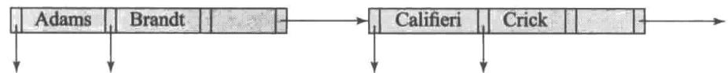


图 14-13 插入 “Adams” 时叶节点的拆分


在拆分一个叶节点后，我们必须将新的叶节点插入 $\mathbf{B}^{+}$ 树结构中。在我们的示例中，新节点以“Califieri”作为其最小搜索码值。我们需要将具有此搜索码值以及指向新节点的指针的项插入被拆分的叶节点的父节点中。图14-14中的 $\mathbf{B}^{+}$ 树展示了插入后的结果。因为在父节点中有空间来容纳新项，所以可以执行此插入而无须进一步拆分节点。若没有空间，则父节点必须被拆分，并需要在父节点的父节点中再插入一项。在最坏情况下，到根节点的路径上的所有节点都必须被拆分。如果根节点本身也被拆分，那么整棵树就变得更深了。

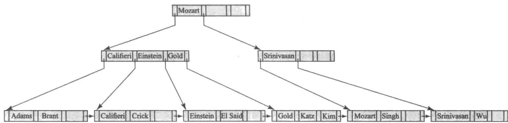


图 14-14 在图 14-9 的 B $^{+}$ 树中插入 “Adams”


非叶节点的拆分与叶节点的拆分略有不同。图14-15展示了在图14-14所示的树中插入具有搜索码“Lamport”的记录的结果。将要插入“Lamport”的叶节点已经含有“Gold”“Katz”和“Kim”项，因此叶节点需要被拆分。从拆分中产生的新的右侧节点含有搜索码值“Kim”和“Lamport”。必须把一个（Kim, n1）项添加到父节点中，其中n1是指向新节点的指针。然而，父节点中没有空间来增加新的项，因此父节点必须被拆分。为此，父节点在概念上被临时扩张，新的项被添加，然后过满节点被立刻拆分。

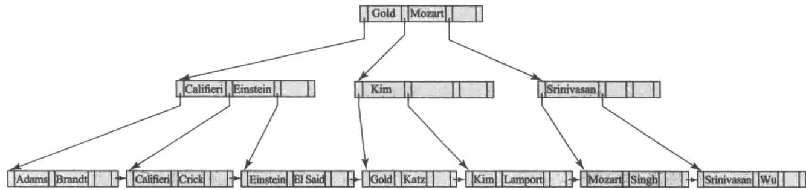


图 14-15 在图 14-14 的 B $^{+}$ 树中插入 “Lamport”


当拆分一个过满的非叶节点时，孩子指针将在原始节点和新创建的节点之间进行划分。在我们的示例中，原始节点保留了前三个指针，且右边新创建的节点得到了剩下的两个指针。但是，对搜索码值的处理略有不同。位于移动到右边节点的指针之间的搜索码值（在我们的示例中，该值为“Kim”）和指针一起移动，而位于留在左边的指针之间的搜索码值（在我们的示例中是“Califieri”和“Einstein”）保持不变。

但是，对位于留在左边的指针和移动到右边节点的指针之间的搜索码值要区别对待。在我们的示例中，搜索码值 “Gold” 位于三个移动到左边节点的指针以及两个移动到右边节点的指针之间。因此 “Gold” 值不会被添加到任意一个拆分节点中。相反，（Gold, n2）项被添加到父节点中，其中 n2 是指向拆分所产生的新创建的节点的指针。在本例中，父节点就是根节点，并且它有足够的空间来插入新项。

往 $\mathbf{B}^{+}$ 树中进行插入的通用技术是确定必须发生插入的叶节点 $l$ 。如果产生拆分，则将新节点插入节点 $l$ 的父节点中。如果这一插入导致拆分，就沿着树向上递归处理，直到一个插入不再产生拆分或创建了一个新的根节点为止。

图 14-16 以伪码形式概述了插入算法。insert 过程用两个辅助过程 insert_in_leaf 和 insert_in_parent 将一个码值 - 指针对插入索引中，这两个辅助过程如图 14-17 所示。在伪码中，L、N、P 和 T 表示指向节点的指针，而 L 被用于代表叶节点。 $L.K_{i}$ 和 $L.P_{i}$ 分别表示节点 L 中的第 i 个值和第 i 个指针； $T.K_{i}$ 和 $T.P_{i}$ 也是类似含义。该伪码还利用 parent(N) 函数来找出节点 N 的父节点。在最初寻找叶节点时，我们可以计算从根到叶的路径中的节点列表，并且以后可以利用它来高效地寻找这条路径中任何节点的父节点。

```prolog
procedure insert(value K, pointer P)
    if（树为空）创建一个空的叶节点 L，同时它也是根节点
    else 找到应该包含码值 K 的叶节点 L
    if (L 具有不到 n-1 个码值)
    then insert_in_leaf (L, K, P)
    else begin /*L 已经具有 n-1 个码值了，拆分 L*/
    创建节点 L'
    把 L.P₁, …, L.Kₙ₋₁ 复制到可以容纳 n 个（指针，码值）
    对的内存块 T 中
    insert_in_leaf (T, K, P)
    令 L'.Pₙ = L.Pₙ; 令 L.Pₙ = L'
    从 L 中删除 L.P₁ 到 L.Kₙ₋₁
    把 T.P₁ 到 T.K_{[n/2]} 从 T 复制到 L 中，L 以 L.P₁ 作为开始
    把 T.P_{[n/2]+1} 到 T.Kₙ 从 T 复制到 L' 中，L' 以 L'.P₁ 作为开始
    令 K' 为 L' 中的最小码值
    insert_in_parent(L, K', L')
end
```


图14-16 在 $\mathbf{B}^{+}$ 树中插入项


procedure insert_in_leaf (node L, value K, pointer P)
    if (K 比 $L.K_{1}$ 小)
    then 把 P、K 插入 L 中，紧接在 $L.P_{1}$ 前面
    else begin
    令 $K_{i}$ 表示 L 中小于或等于 K 的最大值
    把 P、K 插入 L 中，紧跟在 $L.K_{i}$ 后面
    end
procedure insert_in_parent(node N, value $K'$ , node $N'$ )
    if (N 是树的根节点)
    then begin
    创建一个新的，包含 N、 $K'$ 、 $N'$ 的节点 R /*N 和 $N'$ 都是指针 */
    令 R 为树的根节点
    return
    end
    令 P = parent(N)
    if (P 有不到 n 个指针)
    then 将 $(K', N')$ 插入 P 中，紧跟在 N 后面
    else begin /* 拆分 $P^{*}$ /
    将 P 复制到可以容纳 P 和 $(K', N')$ 的内存块 T 中
    将 $(K', N')$ 插入 T 中，紧跟在 N 后面
    删除 P 中所有项；创建节点 $P'$ 把 $T.P_{1}, \cdots, T.P_{[(n+1)/2]}$ 复制到 P
    令 $K'' = T.K_{[(n+1)/2]}$ 把 $T.P_{[(n+1)/2]+1}, \cdots, T.P_{n+1}$ 复制到 $P'$ insert_in_parent( $P, K'', P'$ )
    end

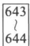


图 14-17 用于往 B $^{+}$ 树中插入项的辅助过程


insert_in_parent 过程的接收参数为 $N$ 、 $K'$ 、 $N'$ ，其中节点 $N$ 已被拆分为 $N$ 和 $N'$ ，而 $K'$ 是 $N'$ 中最小的值。该过程修改 $N$ 的父节点以记录此拆分。insert_into_index 和 insert_in_parent 过程都使用一块临时内存区 T 来存储即将被拆分的节点的内容。这些过程可以修改为把被拆分节点的数据直接复制到新创建的节点，以减少数据复制的时间。然而，临时内存区 T 的使用简化了这些过程。

## 14.3.3.2 删除

现在我们来考虑导致树节点包含过少指针的删除操作。首先，让我们从图14-14的 $\mathbf{B}^{+}$ 树中删除“Srinivasan”。得到的 $\mathbf{B}^{+}$ 树如图14-18所示。现在我们来考虑删除是怎样执行的。首先通过使用我们的查找算法来定位“Srinivasan”的项。当我们从叶节点中把“Srinivasan”的项删除时，叶节点就只剩下一个“Wu”项了。因此，在我们的示例中，由于 $n = 4$ 且 $1 < [(n - 1) / 2]$ ，要么必须将该节点同一个兄弟节点合并，要么必须在节点之间重新分配项，以保证每个节点至少是半满的。在我们的示例中，具有“Wu”项的太空的节点可以同它的左兄弟节点进行合并。我们通过把两个节点中的项移动到左兄弟节点并且删除现在为空的右兄弟节点来合并节点。节点一旦被删除，我们也必须删除父节点中指向刚刚删除的节点的项。

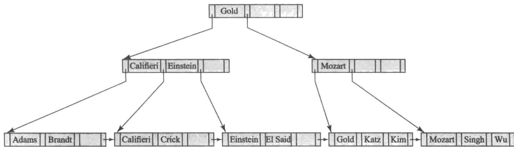


图 14-18 从图 14-14 的 B $^{+}$ 树中删除 “Srinivasan”


在我们的示例中，（Srinivasan，n3）是要被删除的项，其中 n3 是指向包含 “Srinivasan” 的叶节点的指针。（在这种情况下，在非叶节点中将要删除的项和已经从叶节点中删除的项正好具有相同的值；对于大多数删除情况并不是这样）。在删除上述项以后，具有搜索码值 “Srinivasan” 和两个指针的父节点现在只有一个指针（节点中最左边的指针）并且没有搜索码值。因为对于 n=4 来说， $1<\lceil n/2\rceil$ ，父节点就太空了。（对于较大的 n，一个变得太空的节点将仍然具有一些值以及指针。）

在这种情况下，我们考虑一个兄弟节点，在我们的示例中，唯一的兄弟节点就是包含搜索码“Califieri”“Einstein”和“Gold”的非叶节点。如果可能，我们会尝试将该节点与其兄弟节点合并。但是在这种情况下，合并是不可能的，因为该节点和它的兄弟节点一共拥有5个指针，超过了最大数量4。这种情况下的解决方案是在该节点和它的兄弟节点之间重新分配（redistribute）指针，使得每个节点至少含有 $[n / 2] = 2$ 个孩子指针。为此，我们将最右边的指针从左兄弟节点（指向包含“Gold”的叶节点的节点）移动到太空的右兄弟节点。但是，太空的右兄弟节点现在拥有两个指针，即其最左边的指针和新移进来的指针，而没有值将它们分开。事实上，将它们分开的值不会出现在这两个节点的任意一个中，而是出现在父节点中，位于从父节点指向该节点的指针从父节点指向其兄弟节点的指针之间。在我们的示例中，“Mozart”值分开了这两个指针，并且在重新分配后出现在右兄弟节点中。指针的重新分配也意味着父节点中的“Mozart”值将不再正确地分开两个兄弟节点中的搜索码值。事实上，现在正确分开两个兄弟节点中搜索码值的值是 “Gold”，它在重新分配之前在左兄弟节点中。

其结果是，正如图 14-18 中的 B $^{+}$ 树所示，在兄弟节点之间重新分配指针之后，“Gold”值被移动到父节点，而原先父节点中的 “Mozart” 值下移到右兄弟节点。

接下来我们从图 14-18 的 B $^{+}$ 树中删除搜索码值 “Singh” 和 “Wu”。其结果在图 14-19 中展示。删除这些值中的第一个值不会使叶节点太空，但是删除第二个值会使叶节点太空。将此太空的节点同它的兄弟节点进行合并是不可能的，因此执行值的重新分配：将搜索码值 “Kim” 移动到包含 “Mozart” 的节点中，其结果如图 14-19 中的树所示。分开两个兄弟节点的值在父节点中被更新了，从 “Mozart” 变成了 “Kim”。

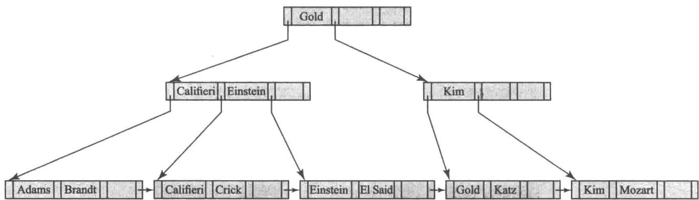


图14-19 从图14-18的 $\mathbf{B}^{+}$ 树中删除“Singh”和“Wu”


现在我们从上述树中删除 “Gold”，其结果如图 14-20 所示。此结果导致了一个太空的叶节点，它现在可以同它的兄弟节点合并。从父节点（包含 “Kim” 的非叶节点）中删除一个项致使父节点太空（该节点仅剩下一个指针）。这一次父节点可以同它的兄弟节点合并。这次合并使得搜索码值 “Gold” 从父节点下移到合并的节点中。作为此次合并的结果，从其父节点中删除了一项，而该父节点正好是树的根节点。这次删除导致根节点仅剩下一个孩子指针，且没有搜索码值，违反了根节点必须至少有两个孩子的要求。其结果是，根节点被删除，其唯一的孩子节点成为根节点，并且 B $^{+}$ 树的深度减 1。

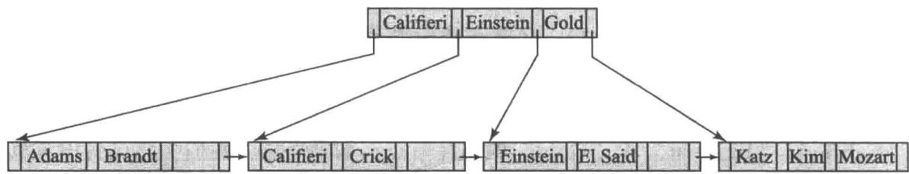


图14-20 从图14-19的 $\mathbf{B}^{+}$ 树中删除“Gold”


值得注意的是，在进行删除操作后，在 B $^{+}$ 树的非叶节点中出现的码值可能在树的任何叶节点中都不存在。例如，在图 14-20 中，“Gold”值已经从叶子层被删除，但是它仍存在于非叶节点中。

一般地，为了在 $\mathbf{B}^{+}$ 树中删除一个值，我们在该值上执行查找并进行删除。如果节点太小，我们把它从它的父节点中删除。这种删除会导致删除算法的递归应用，直至到达树的根节点。在删除后父节点要保持足够满，否则要进行重新分配。

图 14-21 给出了从 B $^{+}$ 树进行删除的伪码。过程 swap_variables(N, N') 仅仅交换两个（指针）变量 $N$ 和 $N'$ 的值，这种交换对树本身毫无影响。伪码使用条件“指针/值太少”。对于非叶节点，这个条件意味着少于 $[n / 2]$ 个指针；对于叶节点，这个条件意味着少于 $[(n - 1) / 2]$ 个值。伪码通过从相邻节点借一个项来实现项的重新分布。我们也可以通过在两个节点间平均划分项来实现项的重新分布。伪码涉及从一个节点中删除一个项 $(K, P)$ 。对于叶节点，指向一个项的指针实际上在码值前面，因此指针 $P$ 在码值 $K$ 的前面。而对于内部节点， $P$ 则跟在码值 $K$ 的后面。

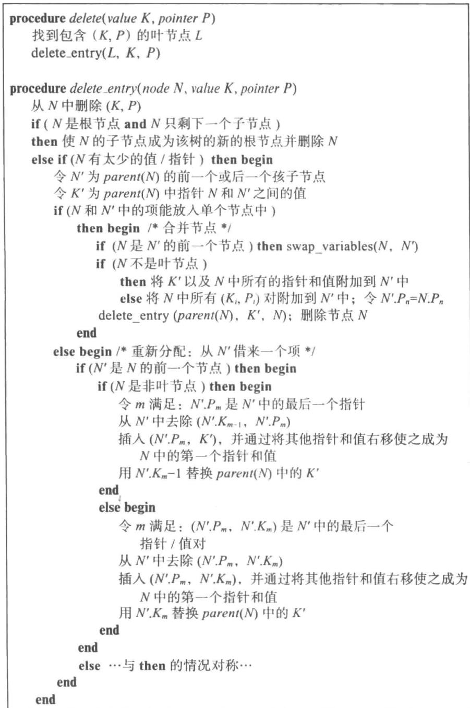


图14-21 从 $\mathbf{B}^{+}$ 树中删除项


## 14.3.4 $\mathbf{B}^{+}$ 树更新的复杂度

虽然 $\mathbf{B}^{+}$ 树上的插入和删除操作比较复杂，但它们需要的I/O操作相对较少，这是一个重要的优点，因为I/O操作很昂贵。可以看出，在最坏情况下一次插入所需的I/O操作数与$\log_{[n / 2]}(N)$ 成正比，其中 $n$ 是节点中指针的最大数量，而 $N$ 是被索引文件中的记录数量。

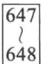


只要搜索码没有重复值，在最坏情况下删除过程的复杂度也与 $\log_{[n / 2]}(N)$ 成正比；我们将在本章的后面讨论非唯一性搜索码的情况。

换言之，从 I/O 操作这方面来说，插入和删除操作的代价与 $B^{+}$ 树的高度呈正比，因此代价较低。正是 $B^{+}$ 树上的操作速度使它成为数据库实现中常用的索引结构。

实际上，对 $\mathbf{B}^{+}$ 树的操作所导致的 I/O 操作比最坏边界情况下要少。如果扇出为 100，并且假设对叶节点的访问是均匀分布的，那么叶节点的父节点被访问的可能性是叶节点的 100 倍。相反，在相同扇出的情况下， $\mathbf{B}^{+}$ 树中的非叶节点总数比叶节点数的 1/100 略多。其结果是，对于经常使用的 $\mathbf{B}^{+}$ 树来说，如今内存规模为几个 GB 是很常见的，即使关系非常大，在访问非叶节点时，大多数非叶节点很可能已经在数据库缓冲区中了。因此，执行一次查找通常只需要一次或两次 I/O 操作。对于更新来说，发生节点拆分的概率相应地也非常小。根据插入的顺序，扇出为 100 时，只有 1/100 到 1/50 的插入会导致节点拆分，并需要写不止一个块。因此，平均来说，一次插入操作只需要略多于一次的 I/O 操作就可以写出更新后的块。

尽管 $\mathbf{B}^{+}$ 树只保证节点至少是半满的，但如果按随机顺序插入项，则平均来说节点可能超过三分之二是满的。另一方面，如果有序地插入项，则节点将仅为半满的。（我们把它作为一个练习留给读者，弄清楚在后一种情况下，为什么节点应该只是半满的。）

## 14.3.5 非唯一性搜索码

到目前为止，我们假设搜索码是唯一的。还记得我们之前在14.3.1节中描述过如何通过创建包含原始搜索码和额外属性的复合搜索码来使搜索码唯一，原始搜索码和额外属性一起可以在所有记录中是唯一的。

额外的属性可以是记录 ID，它是指向该记录的指针，也可以是主码，或者是在具有相同搜索码值的所有记录中其值具备唯一性的任何其他属性。这种额外的属性称为唯一化（uniquifier）属性。

可以使用我们在 14.3.2 节中看到的范围搜索来执行具有原始搜索码属性的搜索；另一种可替代方案是，我们可以创建 findRange 函数的变体，该变体仅以原始搜索码值作为参数，并且在比较搜索码值时忽略唯一化属性的值。

还可以修改 B $^{+}$ 树结构以支持重复的搜索码。插入、删除和查询方法都必须进行相应的修改。

- 一种可替代方法是每个码值只在树中存储一次，并且维护一个带有搜索码值的记录指针的桶（或列表），以处理非唯一性搜索码。这种方法节省空间，因为它只存储一次码值；但是，当实现 $\mathbf{B}^{+}$ 树时，它会产生一些复杂的问题。如果桶保存在叶节点中，那么需要额外的代码来处理可变规模的桶，以及处理增长得比叶节点规模还大的桶。如果桶存储在单独的块中，则可能需要一次额外的I/O操作来获取记录。

- 另一种选项是每条记录存储一次搜索码值；如果在插入过程中发现叶节点已满，则此方法允许以通常的方式拆分叶节点。然而，这种方法使得在内部节点上处理拆分和搜索要复杂得多，因为两个叶节点可能包含相同的搜索码值。它还有更高的空间开销，因为码值的存储次数与包含该值的记录数量相同。

与唯一性搜索方法相比，这两种方法的主要问题在于记录删除的效率。（这两种方法的查找和插入的复杂度与唯一性搜索码方法是相同的。）假设一个特定的搜索码值出现了很多次，并且要删除其中一条具有该搜索码的记录。该删除可能需要搜索具有相同搜索码值的多个项，还可能需要跨多个叶节点，才能找到与待删除的特定记录相对应的项。因此，删除操作在最坏情况下的复杂度可能与记录的数量呈线性关系。

相比之下，使用唯一性搜索码方法可以高效地删除记录。当要删除一条记录时，根据该记录来计算复合搜索码值，然后用于查找索引。由于该值是唯一的，因此可以利用从根到叶的单趟遍历来找到相应的叶子层项，而无须对叶子层的进一步访问。最差情况下的删除代价是记录数的对数，正如我们在前面所看到的。

由于删除效率低下，以及重复的搜索码所导致的其他复杂问题，大多数数据库系统中的 $\mathrm{B}^{+}$ 树实现都只处理唯一性搜索码，并且它们会自动添加记录ID或其他属性，以使非唯一性搜索码变得唯一。

## 14.4 $\mathrm{B}^{+}$ 树扩展

本节讨论对 $B^{+}$ 树索引结构的几种扩展和变种。

## 14.4.1 B $^{+}$ 树文件组织

正如在 14.3 节中所提到的，索引顺序文件组织的主要缺点是随着文件的增大性能会下降：随着文件的增大，变得无序的索引项和实际记录所占的比例越来越高，并且被存储在溢出块中。我们通过在文件上使用 B $^{+}$ 树索引来解决索引查找时性能下降的问题。我们通过使用 B $^{+}$ 树的叶子层来组织包含实际记录的磁盘块，可以解决存储实际记录的性能下降问题。我们不仅把 B $^{+}$ 树结构作为索引来使用，而且把它作为一种文件中记录的组织方式来使用。在 B $^{+}$ 树文件组织（B $^{+}$ -tree file organization）中，树的叶节点存储的是记录而不是指向记录的指针。图 14-22 给出了一个 B $^{+}$ 树文件组织的示例。由于记录通常比指针大，一个叶节点中能存储的最多记录数量比一个非叶节点中能存储的指针数量要少。然而，叶节点仍然要求至少是半满的。

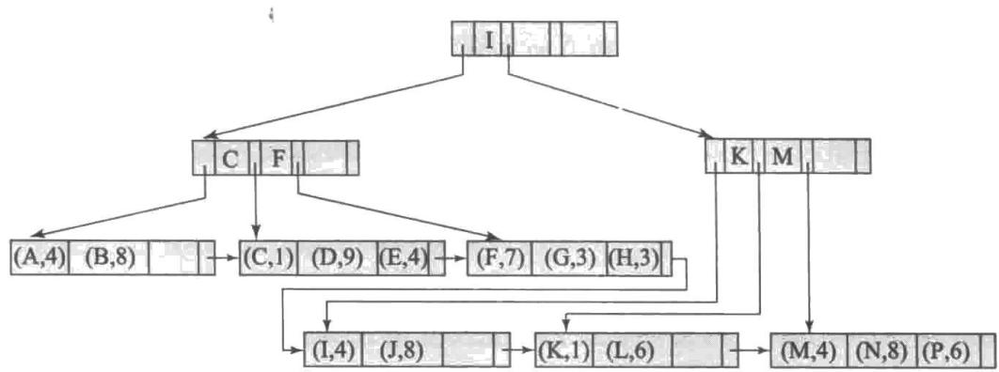


图 14-22 B $^{+}$ 树文件组织


从一个 $\mathbf{B}^{+}$ 树文件组织中插入和删除记录的处理与 $\mathbf{B}^{+}$ 树索引中项的插入和删除的处理方式是一样的。当插入一条具有给定码值 $\nu$ 的记录时，系统通过 $\mathbf{B}^{+}$ 树搜索来找到树中 $\leqslant \nu$ 的最大码，并定位到应该包含该记录的块。如果定位到的块有足够的自由空间来存放记录，则系统就将该记录存放在该块中。否则，就像 $\mathbf{B}^{+}$ 树的插入那样，系统将该块拆分成两个，重新分配其中的记录（按 $\mathbf{B}^{+}$ 树码的次序），以给新记录创造空间。这种拆分以通常的形式在 $\mathbf{B}^{+}$ 树中向上传播。当我们删除一条记录时，系统首先从包含它的块中将它删除。如果一个块 B 由此变得不到半满，则将 B 中的记录和一个相邻块 $B'$ 中的记录重新分配。假定记录大小固定，每个块所包含的记录数至少应是它所能包含的最大记录数的一半。系统按照通常的方式更新 $B^{+}$ 树的非叶节点。

当我们用 $B^{+}$ 树作为文件组织方式时，空间的利用尤为重要，因为记录所占的空间很可能比码和指针所占的空间要多得多。通过在拆分和合并时在重新分配的过程中涉及更多的兄弟节点，我们可以提高 $B^{+}$ 树中的空间利用率。这种技术对于叶节点和非叶节点都适用，并且它的工作方式如下。

在插入时，如果一个节点已满，系统就尝试把它的一些项重新分配到与它相邻的一个节点中，以给新项腾出空间。如果因为相邻节点本身已满而导致这种尝试失败，系统就要拆分该节点，并在一个相邻节点和通过拆分原始节点而得到的两个节点这三者之间均匀分配所有的项。由于这三个节点总共包含的项比两个节点所能容纳的项多1个，因此每个节点将大约为三分之二满。更确切地说，每个节点至少有 $\lfloor2n/3\rfloor$ 个项，其中n是此节点能容纳的最多项数。（ $\lfloor x\rfloor$ 表示小于或等于x的最大整数，即忽略它的小数部分（如果有的话）。）

在删除一条记录时，如果节点中的项数少于 $\lfloor 2n / 3\rfloor$ ，系统就试图从一个兄弟节点借来一个项。如果两个兄弟节点中都有 $\lfloor 2n / 3\rfloor$ 个记录，那么系统就不是借来一项，而是把这个节点和两个兄弟节点中的所有项均匀地重新分配到其中两个节点中，并删除第三个节点。我们能用这种方法是因为项的总数是 $3\lfloor 2n / 3\rfloor -1$ ，它小于 $2n$ 。当使用三个相邻节点来进行重新分配时，每个节点中能保证有 $\lfloor 3n / 4\rfloor$ 个项。一般地，如果重新分配过程涉及 $m$ 个节点（ $m - 1$ 个兄弟节点），每个节点能保证包含至少 $\lfloor (m - 1)n / m\rfloor$ 个项。然而，随着参与到重新分配过程中的兄弟节点的增多，更新的代价也变得更高。

请注意在 $\mathbf{B}^{+}$ 树索引或 $\mathbf{B}^{+}$ 树文件组织中, 树中彼此相邻的叶节点可能位于磁盘上的不同位置。当在一个记录集合上新创建一个文件组织的时候, 可以把磁盘上基本连续的块分配给树中连续的叶节点。由此, 对叶节点的顺序扫描就相当于磁盘上几乎是顺序的扫描。随着树中插入和删除操作的发生, 这种顺序性逐渐丧失, 并且对叶节点的顺序访问需要越来越频繁地等待磁盘寻道。为了恢复这种顺序性, 可能需要对索引进行重建。

$\mathbf{B}^{+}$ 树文件组织可用于存储大型对象，如SQLclob类型以及blob类型，这些对象可能比磁盘块还大，甚至达到好几个GB。这么大型的对象可以通过将它们拆分成更小的记录序列并组织成 $\mathbf{B}^{+}$ 树文件组织的形式来进行存储。拆分的记录可以按序编号，或者根据记录在大型对象中的字节偏移量来进行编号，并且记录的编号可以被用作搜索码。

## 14.4.2 辅助索引和记录重分配

一些文件组织（比如 $\mathrm{B}^{+}$ 树文件组织）可能改变记录的位置，即使记录并没有被更新。作为一个示例，当在 $\mathrm{B}^{+}$ 树文件组织中拆分一个叶节点时，一些记录会被移动到新的节点中。在这种情况下，存储了指向被重新分配过的记录的指针的所有辅助索引都必须被更新，即使记录中的值可能并没有改变。每个叶节点可能包含相当多的记录，而每条记录都可能在每个辅助索引上的不同位置。因此，一个叶节点的拆分可能需要数十甚至数百次I/O操作来更新所有被影响到的辅助索引，从而导致这个操作的代价极其高昂。

对于这个问题的一种广泛使用的解决方案如下：在辅助索引中，我们不存储指向被索引记录的指针，而是存储主索引搜索码属性的值。例如，假设我们有一个建立在 instructor 关系的 ID 属性上的主索引；还有一个建立在 dept_name 上的辅助索引，这个辅助索引中与每个系的名称存放在一起的是相应记录中教师的 ID 值所构成的列表，而不是指向这些记录的指针。

于是，由于叶节点拆分而导致的记录的重新分配就不需要对任何这样的辅助索引进行任何更新了。然而，用辅助索引来定位一条记录现在就需要两步：首先用辅助索引找到主索引搜索码的值，然后用主索引来找到对应的记录。

上述方法大大降低了由文件重组导致的索引更新的代价，尽管它也增加了使用辅助索引访问数据的代价。

## 14.4.3 对字符串的索引

在字符串属性上创建 $\mathbf{B}^{+}$ 树索引会引起两个问题。第一个问题是字符串可能是变长的。第二个问题是字符串可能会很长，导致节点扇出较少，并相应地增加了树的高度。

对于变长搜索码，即使节点都是满的，不同的节点也可能会有不同的扇出。如果一个节点已满，则它必须被拆分，也就是说，这个节点已经没有空间来增加一个新的搜索项，不管原来它有多少项。同样地，节点的合并或者项的重新分配取决于节点中所使用空间的比例，而不是根据节点所能容纳的最大项数。

通过使用一种称作前缀压缩（prefix compression）的技术可以增加节点的扇出。利用前缀压缩，不用在非叶节点处存储整个搜索码值。只存储每个搜索码值的一个前缀，使得这个前缀足以在由该搜索码分开的两棵子树中的码值之间进行区分。例如，如果我们有一个建立在姓名上的索引，则非叶节点的码值可以是姓名的一个前缀；如果由搜索码分开的两棵子树中跟“Silberschatz”最相近的值分别是“Silas”和“Silver”，则在非叶节点处存储“Silb”就足够了，而不用存储全名“Silberschatz”。

## 14.4.4 $\mathbf{B}^{+}$ 树索引的批量加载

如我们先前看到的，在 $B^{+}$ 树中插入一条记录需要一些 I/O 操作，并且 I/O 操作数在最坏情况下与树的高度成比例，树的高度通常还比较小（即便对于大型关系，一般为 5 或者更少）。

现在考虑在大型关系上构建 $\mathbf{B}^{+}$ 树的情况。假设关系比主存大很多，并且我们在关系上构建一个非聚集索引，而该索引也比主存要大。在这种情况下，当我们扫描关系并且往 $\mathbf{B}^{+}$ 树中添加项时，要访问的每个叶节点很可能在它被访问时并不在数据库缓冲区中，因为对项没有特定的排序。在这种对块的随机访问中，每次给叶节点添加一个项，就需要一次磁盘寻道来获取包含叶节点的块。当另一个项被加到该块中之前，该块有可能已从磁盘缓冲区中被逐出，导致需要另一次磁盘寻道来将该块写回到磁盘。这样，对于每次插入的项可能都需要一次随机读操作和一次随机写操作。

653 

例如，如果关系包含 1 亿条记录，并且磁盘上的每次 I/O 操作大约需要花费 10 毫秒，那么将至少需要花费 100 万秒的时间来创建索引，这仅仅是读叶节点的开销，甚至还没有计算将更新后的节点写回到磁盘的开销。很明显，这样的时间开销非常巨大；相反，如果每条记录占用 100 个字节，并且磁盘子系统可以以每秒 50 MB 的速度传输数据，那么仅需要花费 200 秒的时间来读取整个关系。

将大量的项一次性插入一个索引中被称为索引的批量加载（bulk loading）。对一个索引执行批量加载的一种高效的方式如下：首先，为关系创建一个包含索引项的临时文件，然后，在待构建索引的搜索码上对文件进行排序，最后，扫描排好序的文件并且将项插入索引中。后面的 15.4 节描述了对大型关系进行排序的高效算法，即使对于一个很大的文件也可以用这些算法来排序，并且其 I/O 代价相当于几次文件读取的代价，前提是有合理数量的主存可用。

在将项插入 $\mathbf{B}^{+}$ 树之前先对它们进行排序具有明显的优势。当把项按次序进行插入时，进入一个特定叶节点的所有项将会连续出现，并且叶节点只需要被写出一次。如果 $\mathbf{B}^{+}$ 树开始时为空，在批量加载期间就不需要从磁盘中读取节点。因此，即便可能有许多项要插入一个节点中，每个叶节点也只需要一次I/O操作。如果每个叶节点包含100个项，则叶子层将包含100万个节点，导致创建叶子层只需100万次I/O操作。如果连续的叶节点被分配到连续的磁盘块，并且只需要很少的磁盘寻道，那么这些I/O操作甚至也可以是顺序进行的。对于磁盘来说，相比于随机I/O操作需要每块10毫秒，大部分顺序I/O操作估计只需要每块1毫秒。

我们将在后面的 15.4 节中研究大型关系排序的代价，但是作为一种粗略的估计，通过在把项插入 B $^{+}$ 树之前先对它们进行排序，索引可以在远少于 1000 秒的时间内就被构建好，否则需要花费 1 000 000 秒的时间来构建磁盘上的索引。

如果 $\mathbf{B}^{+}$ 树初始时是空的, 那么就可以从叶子层自底向上来更快地构建它, 而不是使用常规的插入过程。在自底向上的 $\mathbf{B}^{+}$ 树构建 (bottom-up $\mathbf{B}^{+}$ -tree construction) 中, 像我们刚描述的那样对项进行排序之后, 我们将排序好的项拆分到块中, 并保持一个块中有该块能容纳的那么多项, 由此产生的块形成了 $\mathbf{B}^{+}$ 树的叶子层。每个块中的最小值以及指向该块的指针被用来构建 $\mathbf{B}^{+}$ 树下一层中的项, 并且指向叶子块。树的每个更高一层可以类似地利用与下一层的每个节点相关联的最小值来构建, 直到创建根节点为止。我们把具体细节留给读者作为练习。

在一个关系上创建索引时，大多数数据库系统实现了基于项排序和自底向上构建的高效技术，尽管在向已带有索引的关系一次添加一个元组时，它们使用常规的插入程序。如果一次添加非常多的元组到一个已经存在的关系中，那么一些数据库系统会建议应该删除该关系上的索引（除了主码上的任何索引），并且在插入元组后重新构建这些索引，以利用高效的批量加载技术。

## 14.4.5 B 树索引文件

B 树索引（B-tree index）和 B $^{+}$ 树索引是类似的。这两种方法的主要区别在于 B 树去除了搜索码值的冗余存储。在图 14-9 的 B $^{+}$ 树中，搜索码 “Einstein” “Gold” “Mozart” 和 “Srinivasan” 在非叶节点和叶节点中均出现了。每个搜索码值都出现在某些叶节点中，有的还在非叶节点中重复出现。

在 $\mathbf{B}^{+}$ 树中，搜索码值可能同时出现在非叶节点和叶节点中。与 $\mathbf{B}^{+}$ 树不同，B树只允许搜索码值出现一次（如果它们是唯一的）。图14-23所示的B树表示了与图14-9中的 $\mathbf{B}^{+}$ 树相同的搜索码值。由于B树中的搜索并不重复，我们可以比相应的 $\mathbf{B}^{+}$ 树索引使用更少的树节点来存储索引。然而，由于出现在非叶节点中的搜索码不会出现在B树中的其他地方，我们不得不在非叶节点中为每个搜索码包含一个额外的指针域。这些额外的指针要么指向文件记录，要么指向相应搜索码所对应的桶。

值得注意的是，许多数据库系统手册、行业文献中的文章以及行业专家都使用术语 B 树来指代我们称作 $B^{+}$ 树的数据结构。事实上，在当前的用法中这样定义也是合理的，因为术语 B 树和 $B^{+}$ 树被认为是同义词。尽管如此，在本书中我们还是按照它们原本的定义来使用 B 树和 $B^{+}$ 树，以避免这两种数据结构之间的混淆。

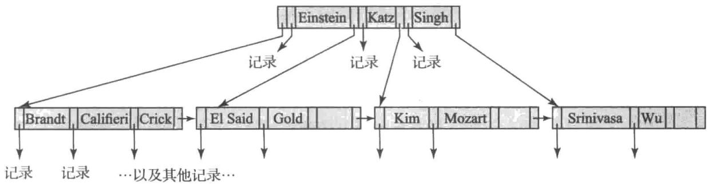


图14-23 等价于图14-9中的 $\mathbf{B}^{+}$ 树的B树


一种广义的 B 树叶节点如图 14-24a 所示；非叶节点出现在图 14-24b 中。叶节点和 $B^{+}$ 树中的叶节点一样。在非叶节点中，指针 $P_{i}$ 与我们在 $B^{+}$ 树中使用的树指针一样，而指针 $B_{i}$ 是桶或文件记录的指针。在图 14-24 的广义 B 树中，叶节点中有 n-1 个码，而非叶节点中有 m-1 个码。这种差异的出现是因为非叶节点必须包含指针 $B_{i}$ ，这样就减少了这些节点所能容纳的搜索码个数。显然 m < n，但 m 和 n 的具体关系取决于搜索码和指针的相对规模。

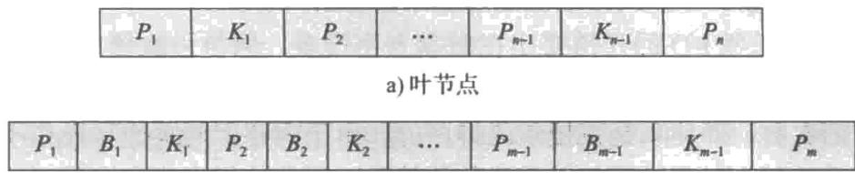


b) 非叶节点


图14-24 典型的B树节点


在 B 树中进行一次查找所访问的节点数取决于搜索码所在的位置。 $B^{+}$ 树上的一次查找需要遍历从树根到某个叶节点的一条路径。相反，在 B 树中有时在到达叶节点之前就能找到想要的值。然而，B 树中存储在叶子层的码大约是存储在非叶子层的码的 n 倍，并且，由于 n 一般很大，因此较快找到特定值的优势会相对小一些。而且比起 $B^{+}$ 树来，B 树的非叶节点中出现的搜索码较少，这一事实意味着 B 树的扇出较少，因而比相应的 $B^{+}$ 树的深度可能要大。因此，在 B 树中查找某些值会更快，而查找另一些值则会更慢，虽然总的来说查找时间仍然与搜索码数量的对数成正比。

B 树中的删除更加复杂。在 $B^{+}$ 树中，被删除的项总会出现在叶节点中。在 B 树中，被删除的项可能出现在非叶节点中。必须从包含被删除项的节点所在的子树中选择正确的值来作为替代。具体来说，如果搜索码 $K_{i}$ 被删除，则出现在指针 $P_{i+1}$ 的子树中的最小搜索码必须被移到原先被 $K_{i}$ 所占用的字段中。如果叶节点现在包含的项太少，还需采取进一步的操作。与此相比，B 树中的插入只比 $B^{+}$ 树中的插入稍微复杂一点。

B 树在空间上的优势对于大型索引而言意义不大，并且通常不能抵消我们已提到的那些不足。因此，差不多所有的数据库系统实现都采用 B $^{+}$ 树数据结构，即使（正如我们先前讨论过的那样）它们将此数据结构称为 B 树。

## 14.4.6 闪存上的索引

到目前为止，我们对于索引的描述都假设数据是驻留在磁盘上的。虽然这种假设在大部分情况下仍然是事实，但是闪存容量已急速增长，并且每 GB 的闪存价格已相应下跌，使得对于许多应用来说，基于闪存的 SSD 存储现在已经替代了磁盘存储。

标准的 $B^{+}$ 树索引甚至可以在 SSD 上继续使用，与磁盘存储相比，SSD 具有可接受的更新性能和显著提升的查找性能。

闪存存储器以页面为结构，并且 $\mathrm{B}^{+}$ 树索引结构可以在基于闪存的 SSD 上使用。SSD 和磁盘相比，提供了快得多的随机 I/O 操作，对于一次随机页面读操作只需要 20 到 100 微妙，而磁盘则需要 5 到 10 毫秒。因此，与查找磁盘上的数据相比，查找 SSD 上的数据要快得多。

在使用闪存时，写操作的性能更为复杂。闪存和磁盘之间的一个重要区别是：闪存并不允许在物理级别上对数据进行就地更新，尽管它看起来在逻辑上是这样做的。每次更新都会变成对整个闪存页面的拷贝和写入，并要求随后擦除该页的旧拷贝。写一个新的页面可以在20到100微秒内完成，但最终旧页面需要被擦除，以释放页面供进一步的写操作。擦除是在包含多个页面的块级别进行的，并且擦除一个块需要花费2到5毫秒。

对于闪存来说，最佳的 $B^{+}$ 树节点规模要小于磁盘，因为闪存页面比磁盘块要小；树节点规模与闪存页面相匹配是有意义的，因为在更新节点时，较大的节点会导致多次的页面写操作。虽然较小的页面会导致更高的树和更多的 I/O 操作来访问数据，但使用闪存时随机页面读取的速度要快得多，以致对读取性能的总体影响相当小。

尽管在 SSD 上随机 I/O 的开销要比在磁盘上小很多，但与一次插入一个元组相比，批量加载仍然具有显著的性能优势。特别是，自底向上的构造与一次插入一个元组相比，减少了页面写操作的次数，即使项是按搜索码排序的。由于闪存上的页面写操作不能就地完成，并且需要在之后的某个时间进行相对昂贵的块擦除，因此使用自底向上的 B $^{+}$ 树构建方式减少了页面写操作的数量，提供了显著的性能优势。

已经提出了对 $\mathbf{B}^{+}$ 树的几种扩展和替代方案来用于闪存，其重点放在减少由于页面重写而导致的擦除操作的次数。一种方案是将缓冲区添加到 $\mathbf{B}^{+}$ 树的内部节点上，并在较高级别的缓冲区中临时记录更新，再以惰性方式将更新下推到更低级别。其关键思想是：当一个页面被更新时，多个更新将一起执行，从而减少每次更新的页面写操作次数。另一种方案是创建多棵树并将它们合并；日志结构合并树及其变体正是基于这种思想的。事实上，这两种方案对于降低磁盘上写操作的代价也是有用的；我们将在14.8节中概述这两种方案。

## 14.4.7 主存上的索引

如今的主存容量足够大，价格也足够便宜，以至于许多组织机构都能买得起足够的主存，以将它们的所有操作数据都装入内存。B $^{+}$ 树可以用于对内存中的数据进行索引，而无须更改结构。但是，有些优化还是能进行的。

首先，由于内存比磁盘空间昂贵，因此必须设计主存数据库中的内部数据结构以减少空间需求。我们在14.4.1节中看到的提高 $\mathbf{B}^{+}$ 树存储利用率的技术可以用来减少 $\mathbf{B}^{+}$ 树的内存使用。

对于内存中的数据来说，需要遍历多个指针的数据结构是可以接受的，这与基于磁盘的数据不同。在基于磁盘的数据中，遍历多个页面的 I/O 代价会过于昂贵。因此，主存数据库中的树结构可以相对较深，这与 B $^{+}$ 树不同。

高速缓存和主存之间的速度差以及数据在主存和高速缓存之间以缓冲行（cache-line）（通常约为64字节）为单位进行传输的事实，导致了这样的情况：高速缓存和主存之间的联系与主存和磁盘之间的联系是不同的（尽管速度差异较小）。当读取一个内存位置时，如果它存在于高速缓存中，则CPU可以在1或2个纳秒内完成读取，而一次高速缓存未命中将导致从主存读取数据的延迟为50至100纳秒。

带有能存放进一个高速缓存行的小节点的 $\mathbf{B}^{+}$ 树已被发现能够提供对于内存数据的非常好的性能。这样的 $\mathbf{B}^{+}$ 树完成索引操作的高速缓存未命中数比高而瘦的树结构（比如二叉树）少得多，因为每次节点遍历都可能导致一次高速缓存未命中。与具有与高速缓存行相匹配的节点的 $\mathbf{B}^{+}$ 树相比，具有大型节点的树往往具有更多的高速缓存未命中数，因为在一个节点内定位数据要么需要跨多个高速缓存行对该节点内容进行完全扫描，要么需要进行二分搜索，二分搜索也会导致多次高速缓存未命中。

对于数据并不能完全放入内存但是经常使用的数据通常驻留内存的数据库，下面的思想可用于创建 $\mathbf{B}^{+}$ 树结构，该结构在磁盘上和内存中都能提供良好的性能。大型节点可用于优化基于磁盘的访问，但不是将一个节点中的数据视为码与指针的单个大型数组，而是将一个节点中的数据结构化为树，树中具有与高速缓存行的规模相匹配的较小节点。与线性扫描数据或在节点内使用二分搜索不同，大型 $\mathbf{B}^{+}$ 树节点内的树结构可用于以最少的高速缓存未命中次数来访问数据。

## 14.5 散列索引

散列是在主存中构建索引的一种广泛使用的技术；可以临时创建这种索引以处理连接运算（正如我们将在15.5.5节中看到的那样），它也可以是主存数据库中的永久性结构。尽管散列文件组织形式并没有被广泛使用，但散列已经被用作文件中记录的一种组织方式。我们最初只考虑内存中的散列索引，在本节的后面我们将考虑基于磁盘的散列。

在对散列的描述中，我们将使用术语桶（bucket）来表示可以存储一条或多条记录的存储单元。对于内存中的散列索引，桶可以是索引项或记录的链表。对于基于磁盘的索引，桶可以是磁盘块的链表。在散列文件组织（hash file organization）中，桶存储实际的记录，而不是记录的指针；这种结构只对驻留在磁盘上的数据才有意义。我们下面的描述并不依赖于桶存储的是记录指针还是实际记录。

形式化地，令 K 表示所有搜索码值的集合，并令 B 表示所有桶地址的集合。散列函数（hash function）h 是从 K 到 B 的函数。令 h 表示一个散列函数。对于内存中的散列索引，桶的集合只是一个指针数组，其中第 i 个桶位于偏移量为 i 的位置。每个指针存储包含该桶中的项的链表的头。

为了插入一条带有搜索码 $K_{i}$ 的记录，我们计算 $h(K_{i})$ ，它给出了该记录的桶的地址。我们将该记录的索引项添加到偏移量为 $i$ 处的列表中。请注意散列索引的其他变种以不同的方式来处理一个桶中有多条记录的情况；这里描述的是使用最广泛的变种，称为溢出链(overflow chaining)。

使用溢出链的散列索引也称为闭寻址（closed addressing）（或者，不太常见的说法是，闭散列（closed hashing））。在某些应用程序中使用了另一种称为开寻址的可替代散列方案，但由于开寻址并不支持高效的删除，因此不适用于大多数数据库索引应用。我们不再进一步考虑它。

散列索引能高效地支持搜索码上的相等查询。要对搜索码值 $K_{i}$ 执行查找，我们只需计算 $h(K_{i})$ ，然后搜索具有该地址的桶。假设两个搜索码 $K_{5}$ 和 $K_{7}$ 具有相同的散列值，即 $h(K_{5}) = h(K_{7})$ 。如果我们对 $K_{5}$ 执行查找，那么桶 $h(K_{5})$ 包含了具有搜索码值 $K_{5}$ 的记录以及具有搜索码值 $K_{7}$ 的记录。因此，我们必须检查桶中每条记录的搜索码值，以验证该记录是不是我们想要的记录。

与 $\mathbf{B}^{+}$ 树索引不同，散列索引并不支持范围查询；例如，对于一条希望检索出满足

$l \leqslant v \leqslant u$ 的所有搜索码值 v 的查询，就无法使用散列索引来高效地回答。

删除也同样简单。如果待删除的记录的搜索码值是 $K_{i}$ ，则我们计算 $h(K_{i})$ ，然后搜索对应的桶以找到该记录并从桶中删除该记录。如果使用链表表示法，从链表中进行删除是很简单的。

在基于磁盘的散列索引中，当我们插入一条记录时，如前所述，我们通过在搜索码上使

用散列来定位桶。现在假设桶中有存储记录的空间，那么，记录可以被存储在那个桶中。如果该桶没有足够的空间，就说发生了桶溢出（bucket overflow），我们通过使用溢出桶（overflow bucket）来处理桶的溢出。如果一条记录必须被插入桶 $b$ 中，并且 $b$ 已经满了，则系统会给 $b$ 提供一个溢出桶，并将该记录插入溢出桶中。如果溢出桶也满了，则系统将提供另一个溢出桶，依此类推。一个给定桶的所有溢出桶都链接在一起并存放在链表中，如图14-25所示。对于溢出链，给定搜索码 $k$ ，那么查找算法不仅必须搜索桶 $h(k)$ ，还要搜索链接到桶 $h(k)$ 的溢出桶。

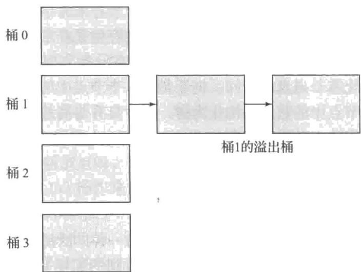


图 14-25 基于磁盘的散列结构中的溢出链


如果对于给定数量的记录没有足够的桶，则可能发生桶溢出。如果事先知道被索引记录的数量，则可以分配所需数量的桶；我们将很快看到如何处理记录数量变得明显超过最初预期的情况。如果给某些桶分配的记录比其他桶要多，那么也可能发生桶溢出，从而导致即使在其他桶仍有大量自由空间的时候仍有一个桶溢出。

如果多条记录可能具有相同搜索码，则可能会在记录的分布中发生这种偏斜（skew）。但是，即使每个搜索码只有一条记录，如果所选择的散列函数导致搜索码的分布不均匀，则偏斜也可能发生。通过仔细选择散列函数，可以将此问题的可能性降到最低，以确保码在桶之间的分布是均匀和随机的。然而，某些偏斜仍可能出现。

为了降低桶溢出的概率，桶的数量被选择为 $(n_r / f_r)^*(1 + d)$ ，其中 $n_r$ 表示记录的数量， $f_r$ 表示每个桶容纳的记录的数量， $d$ 是一个避让因子，通常约为 0.2。当避让因子为 0.2 时，桶中大约 $20\%$ 的空间将是空的。但好处是减少了溢出的概率。

尽管分配的桶比所需的多一些，但是桶溢出仍然可能发生，特别是在记录的数量因增加而超过了最初的预期的情况下。

如上所述的散列索引称为静态散列（static hashing），在创建这种索引时，桶的数量是固定的。静态散列的一个问题是：我们需要知道有多少条记录将存储在索引中。如果随着时间的推移添加了大量的记录，导致记录远远多于桶，则查找将不得不搜索存储在单个桶中或者在一个或多个溢出桶中的大量记录，并因而变得低效。

为了处理这个问题，可以使用可增长数量的桶来重建散列索引。例如，如果记录数变为桶数的两倍，则可以使用比以前多一倍的桶来重建索引。但是，重建索引的缺点是：如果关系很大，则可能需要花费很长时间来重建，从而导致正常处理的中断。一些已经被提出的方案允许以更增量的方式来增加桶的数量。此类方案称为动态散列（dynamic hashing）技术，线性散列（linear hashing）技术和可扩展散列（extendable hashing）技术就是两种这样的方案，有关这些技术的更多详细信息请参阅 24.5 节。

## 14.6 多码访问

到现在为止，我们都隐式地假设只使用建立在一个属性上的一个索引来处理关系上的查询。但是对于特定类型的查询来说，如果存在多个索引则使用多个索引，或者使用建立在多属性搜索码上的一个索引，这样才是比较有利的。

## 14.6.1 使用多个单码索引

假设 instructor 文件有两个索引: 一个建立在 dept_name 上, 一个建立在 salary 上。考虑如下查询: “找出金融系中工资为 $80 000 的所有教师。” 我们写作:

$$
\begin{array}{l} \text {select ID} \\ \text {from instructor} \\ \text {where dept\_name = 'Finance' and salary = 80000;} \end{array}
$$

有三种策略可用于处理这个查询：

1. 利用 dept_name 上的索引来找出属于金融系的所有记录。再检查每条这样的记录看是否满足 salary = 80000。

2. 利用 salary 上的索引来找出工资等于 $80 000 的教师的所有记录。再检查每条这样的记录看是否满足 dept_name 是 "Finance"。

661 

3. 利用 dept_name 上的索引来找出指向属于金融系的所有记录的指针。类似地，利用 salary 上的索引来找出指向工资为 $80 000 的教师的所有记录的指针。计算这两个指针集合的交集。交集中的那些指针指向金融系中工资等于 $80 000 的教师的记录。

上面三种策略中只有第三种利用了多个索引的优势。然而，如果下面所有条件都成立，则即使这种策略也可能是一种糟糕的选择：

- 金融系的记录有很多。

- 工资为 $80 000 的教师的记录有很多。

- 金融系中工资为 $80 000 的教师的记录只有几条。

如果这些条件都成立，为了得到一个很小的结果集，我们必须扫描大量的指针。一种被称为“位图索引”的索引结构在某些情况下可以极大地加速在第三种策略中使用的交运算。我们将在14.9节中概述位图索引。

## 14.6.2 多码索引

在这种情况下另一种可选的策略是在复合搜索码（dept_name, salary）上建立和使用索引，也就是说，该搜索码由系名和教师工资的串接组成。

我们可以使用前述复合搜索码上的有序（ $\mathbf{B}^{+}$ 树）索引来高效地回答具有如下形式的查询：

$$
\begin{array}{l} \text {select ID} \\ \text {from instructor} \\ \text {where dept\_name = 'Finance' and salary = 80000;} \end{array}
$$

如下查询也能被高效地处理，因为它们对应于搜索属性上的一个范围查询。这样的查询在搜索码的第一个属性（dept_name）上指定一个相等条件并在搜索码的第二个属性（salary）上指定一个范围。

$$
\begin{array}{l} \text {select ID} \\ \text {from instructor} \\ \text {where dept\_name = 'Finance' and salary <   80000;} \end{array}
$$

我们甚至可以使用搜索码（dept_name, salary）上的顺序索引来高效地回答下面这种单个属性上的查询：

$$
\begin{array}{l} \text {select ID} \\ \text {from instructor} \\ \text {where dept\_name = 'Finance';} \end{array}
$$

相等条件 dept_name = "Finance" 等价于一个范围查询，该范围查询的下界是（Finance, -∞），上界是 (Finance, +∞)。仅在 dept_name 属性上进行的范围查询也能以类似的方式来处理。

然而，使用单个复合搜索码上的顺序索引结构是有一定缺点的。作为示例，考虑下面的查询：

$$
\begin{array}{l} \text {select ID} \\ \text {from instructor} \\ \text {where dept\_name <   'Finance' and salary <   80000;} \end{array}
$$

通过使用搜索码（dept_name, salary）上的顺序索引，我们可以回答这个查询：对于按字母次序小于"Finance"的每个dept_name值，系统定位出salary值为80000的那些记录。然而，由于文件中记录的次序，每条记录可能位于不同的磁盘块中，从而导致大量I/O操作。

这个查询和前面两个查询的区别在于：在第一个属性（dept_name）上的条件是比较条件而不是相等条件。这个条件不能对应于该搜索码上的一个范围查询。

为了加快一般的复合搜索码查询处理（它可以有一个或多个比较运算），我们可以使用若干特殊结构。我们将在14.9节中考虑位图索引（bitmap index）。另外一种称为R树（R-tree）的结构也可用于这一目的。R树是 $\mathbf{B}^{+}$ 树的一种扩展，用于处理多个维度上的索引，我们将在14.10.1节中进行讨论。

## 14.6.3 覆盖索引

覆盖索引（covering index）存储了一些属性（但不是搜索码属性）的值，以及指向记录的指针的索引。存储额外的属性值对于辅助索引是有用的，因为它们使我们仅仅使用索引就能够回答一些查询，甚至不需要查找实际的记录。

例如，假设我们有一个在 instructor 关系的 ID 属性上的非聚集索引。如果把 salary 属性的值与记录指针一起存储，我们就可以回答那些对 salary 值（但不是对另一个属性 dept_name）的查询，而不需要访问 instructor 记录。

通过在搜索码（ID, salary）上创建索引能够达到同样的效果，但是一个覆盖索引能够减小搜索码的规模，它允许非叶节点中有更大的扇出，从而可能降低索引的高度。

## 14.7 索引的创建

尽管 SQL 标准并没有指定用于创建索引的任何特定语法，但大多数数据库都支持创建和删除索引的 SQL 命令。正如我们在 4.6 节中所看到的，可以使用以下语法来创建索引，大多数数据库都支持这种语法。

$$
\text { create   index } <   \text { index - name } > \text { on } <   \text { relation - name } > (<   \text { attribute - list } >);
$$

属性列表（attribute-list）是构成索引搜索码的关系的属性列表。可以使用如下形式的命令来删除索引：

$$
\text { drop   index } <   \text { index - name } >;
$$

例如，要在 instructor 关系上定义一个名为 dept_index 的索引，并将 dept_name 作为搜索码，我们写作：

$$
\text { create   index   dept\_index   on   instructor   (dept\_name); }
$$

要声明一个属性或属性列表是候选码，我们可以使用语法 create unique index 代替上面的 create index。支持多种索引类型的数据库还允许将索引类型指定为索引创建命令的一部分。请参阅你的数据库系统手册，以了解可用的索引类型以及指定索引类型的语法。

当用户提交可以从使用一个索引中获益的一条 SQL 查询时，SQL 查询处理器会自动使用该索引。

索引对于参与到查询的选择条件或连接条件中的属性非常有用，因为它们可以显著降低查询的代价。请考虑一个查询：检索 ID 为 12345 的特定学生的 takes 记录（用关系代数表示为 $\sigma_{\mathrm{ID}=12345}(\mathrm{takes})$ ）。如果在 takes 的 ID 属性上存在索引，那么只需几次 I/O 操作就可以获得指向所需记录的指针。由于学生通常只选修几十门课程，因此即使获取实际的记录也只需要几十次 I/O 操作。相反，如果没有这个索引，数据库系统将被迫读取所有 takes 记录并选择那些具有匹配的 ID 值的记录。如果有大量学生，读取一个完整的关系的代价可能会非常昂贵。

但是，索引确实是有代价的，因为每当更新底层关系时，都必须更新索引。创建太多索引会减慢更新处理的速度，因为每次更新还必须更新所有受影响的索引。

有时性能问题在测试过程中很明显，例如，如果一个查询需要花费数十秒，那么很明显它是相当慢的。但是，假设每个查询需要花费1秒来扫描一个没有索引的大型关系，而使用索引来检索相同记录只需要10毫秒。如果测试人员一次运行一个查询，即使没有索引，查询响应也很快。但是，假设这些查询是一个注册系统的一部分，有1000名学生在1小时内使用该系统，并且每名学生的操作需要执行10个这样的查询。对于在1小时（即3600秒）内提交的查询，总执行时间将为10000秒。这样学生可能会发现注册系统非常慢，甚至完全没有响应。相比之下，如果存在所需的索引，那么1小时内提交的查询所需的执行时间将是100秒，并且注册系统的性能将会非常好。

因此，在构建应用程序时，重要的是找出哪些索引对于性能是重要的，并在应用程序启动之前创建它们。

如果一个关系被声明为具有主码，大多数数据库系统会自动在主码上创建索引。每当向关系中插入一个元组时，可以使用该索引来检查是否违反主码约束（即在主码值上有没有重复项）。如果在主码上没有索引，则每当插入一个元组时，就必须扫描整个关系以确保满足主码约束。

尽管大多数数据库系统不会自动创建索引，但通常在外码属性上创建索引也是一个好主意。大多数连接运算都在外码和主码属性之间进行，并且包含此类连接的查询（在被引用表上还有选择条件）并不少见。请考虑一个查询：takes $\otimes$ $\sigma_{name=Shankar(student)}$ ，其中 takes 的外码属性 ID 引用 student 的主码属性 ID。由于可能很少有学生名叫 Shankar，因此可以使用外码属性 takes.ID 上的索引来高效地检索与这些学生相对应的 takes 元组。

许多数据库系统提供了工具来帮助数据库管理员跟踪在系统上执行的是什么样的查询和更新，并根据查询和更新的频率来推荐要创建的索引。这些工具被称为索引优化向导或顾问。

最近，一些基于云的数据库系统还支持完全自动地创建索引而无须数据库管理员干预，只要系统发现这样做可以避免重复的关系扫描。

## 14.8 写优化索引结构

B $^{+}$ 树索引结构的一个缺点是：随机写操作会导致性能非常差。请考虑一个索引太大而无法放入内存的情况；由于大部分空间都在叶子层，而且现在内存规模都相当大，为了简单起见，我们假设索引的更高层可以放入内存。

现在假设写或插入的执行顺序与索引的排列顺序并不匹配。那么，每次写/插入可能会接触到不同的叶节点；如果叶节点的数量明显大于缓冲区的规模，那么大多数这样的叶节点访问将需要一次随机读操作以及随后的写操作来把更新后的叶子页面写回到磁盘。在具有磁盘的系统上，如果访问时间为10毫秒，则索引将支持每张磁盘每秒不超过100次的写/插入；这是一种乐观的估计，它假设寻道占用了大部分时间，并且磁头没有在读与写叶子页面之间进行移动。在带有基于闪存的SSD的系统上，随机I/O速度要快得多，但是一次页面写操作仍然有很高的代价，因为它（最终）需要一次页面擦除，这是一种昂贵的操作。因此，对于每秒需要支持非常大量的随机写/插入的应用来说，基本的 $\mathbf{B}^{+}$ 树结构并不理想。

已经提出了几种可替代的索引结构来处理具有高的写/插入速率的工作负载。日志结构合并树（log-structured merge tree）或LSM树及其变体是写优化的索引结构，它们已被非常广泛地采用。缓冲树是一种可替代方法，它可用于多种搜索树结构。我们将在本节的剩余部分概述这些结构。

## 14.8.1 LSM 树

一棵 LSM 树由几棵 B $^{+}$ 树组成，从称作 $L_{0}$ 的内存树开始，然后是对于某个 k 值的磁盘树 $L_{1}, L_{2}, \cdots, L_{k}$ ，其中 k 称为级。图 14-26 描述了对于 k = 3 的一棵 LSM 树的结构。

索引查找是通过在每棵树 $L_{0}, \cdots, L_{k}$ 上使用单独的查找操作并归并这些查找的结果来执行的。（目前我们假设只有插入，没有更新或删除；更新 / 删除情况下的索引查找更加复杂，我们将在稍后讨论。）

当一条记录被首次插入一棵 LSM 树中时，它被插入内存中的 $B^{+}$ 树结构 $L_{0}$ 中。会为这棵树分配相当大的内存空间。随着插入处理的增多，树会增长，直到填满分配给它的内存。

此时，我们需要将数据从内存结构移动到磁盘上的 $B^{+}$ 树中。

666 树中。

如果 $L_{1}$ 树为空，则将整棵内存树 $L_{0}$ 写到磁盘以创建初始树 $L_{1}$ 。但是，如果 $L_{1}$ 不为空，则按码的递增次序扫描 $L_{0}$ 的叶子层，并将这些项与 $L_{1}$ 的叶子层项进行归并（也按码的递增次序扫描）。采用自底向上的构建过程来用归并的项创建新的 $B^{+}$ 树。然后，用带有归并项的新树去替换旧的 $L_{1}$ 。在这两种情况下， $L_{0}$ 中的项被移动到 $L_{1}$ 之后， $L_{0}$ 中的所有项以及旧的 $L_{1}$ （如果存在）都将被删除。然后可以对内存中现在为空的 $L_{0}$ 进行插入。

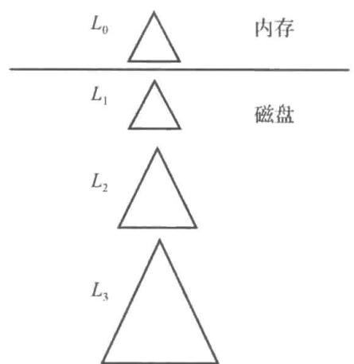


图 14-26 三级的日志结构合并树


请注意，旧 $L_{1}$ 树的叶子层中的所有项（包括叶节点中那些没有任何更新的项）都将被复

制到新树中，而不是在现有 $L_{1}$ 树的节点上执行更新。这样做有以下好处：

1. 新树的叶子是按顺序分配的，避免了后续归并过程中的随机 I/O 操作。

2. 叶子是满的，避免了页面拆分时可能出现的部分占用叶子的开销。

但是，使用如上所述的 LSM 结构是有代价的：每次将 $L_{0}$ 中的一组项复制到 $L_{1}$ 时，都会复制树的全部内容。有两种技术可用于降低这种代价：

1. 使用多个级别， $L_{i+1}$ 级树的最大规模是 $L_{i}$ 级树的最大规模的 k 倍。因此，每条记录在一个特定级别上最多被写 k 次。级别数与 $\log_{k}(I/M)$ 成比例，其中 I 是项数，M 是能放入内存树 $L_{0}$ 中的项数。

2. 每个级别（除 $L_{0}$ 之外）最多可以有 $b$ 棵树，而不是只有1棵树。当把 $L_{0}$ 树写到磁盘时，将创建一棵新的 $L_{1}$ 树，而不是将 $L_{0}$ 与现有的 $L_{1}$ 树归并。当有 $b$ 棵这样的 $L_{1}$ 树时，它们被归并到一棵单独的新的 $L_{2}$ 树中。类似地，当在 $L_{i}$ 级有 $b$ 棵树时，它们被归并到一棵新的 $L_{i+1}$ 树中。

LSM 树的这种变体称为阶梯式合并索引（stepped-merge index）。与每个级别只有一棵树相比，阶梯式合并索引显著降低了插入的代价，但由于可能需要搜索多棵树，因此它可能导致查询代价的增加。24.1 节中描述的基于位图的结构称为布隆过滤器（Bloom filter），用于通过高效地检测在一棵特定树中不存在某个搜索码来减少查找的次数。布隆过滤器占用的空间非常小，但它们在降低查询成本方面非常有效。

所有关于这些 LSM 树的变体的详细信息可以在 24.2 节中找到。

到目前为止，我们只描述了插入和查找。删除是以一种有趣的方式来处理的。删除并不是直接查找一个索引项并删除它，而是插入一个新的删除项（deletion entry），该项指明要删除的是哪个索引项。插入一个删除项的过程与插入一个普通索引项的过程是相同的。

但是，查找必须执行额外的步骤。如前所述，查找操作从所有树中检索出项，并按码值的顺序来归并它们。如果某个项有一个删除项，则这两个项具有相同的码值。因此，查找操作将找到该码的删除项和待删除的原始项。如果找到一个删除项，则过滤掉要删除的项，不将其作为查找结果的一部分返回。

当归并树时，如果其中一棵树包含一个项，而另一棵树包含一个匹配的删除项，则在合并过程中会匹配这些项（这两个项有相同的码），并且这两个项都会被丢弃。

通过插入更新项，更新的处理方式与删除类似。查找操作需要将更新项与原始项进行匹配并返回最新的值。当一棵树有一个项，而另一棵树有其匹配的更新项时，更新实际上是在合并过程中进行的；合并过程会找到具有相同码的记录和更新记录，然后应用更新并丢弃更新项。

LSM 树最初是为了减少磁盘的写和寻道的开销而设计的。基于闪存的 SSD 对于随机 I/O 操作的开销相对较低，因为它们并不需要寻道，所以 LSM 树的变体所提供的避免随机 I/O 的优势对于 SSD 来说并不是特别重要。

但是，请回想一下：闪存并不允许就地更新，并且即便将单个字节写到一个页面也需要将整个页面重写到一个新的物理位置；最终需要擦除该页面的原始位置，这是一种相对昂贵的操作。与传统的 B $^{+}$ 树相比，使用 LSM 树的变体来减少写的次数，可以在 LSM 树与 SSD 一起使用时提供显著的性能优势。

在 Google 的 BigTable 系统以及在 Apache Hbase（BigTable 的开源克隆版）中，使用了 LSM 树的一种变体，它类似于阶梯式归并索引，每层中有多棵树。这些系统构建在分布式文件系统之上，分布式文件系统允许追加文件，但不支持对现有数据的更新。LSM 树并不执行就地更新的事实使得 LSM 树非常适合于这些系统。

随后，大量的 BigData 存储系统（比如 Apache Cassandra、Apache AsterixDB 和 MongoDB）都增加了对 LSM 树的支持，大多数实现版本在每一层中都有多棵树。在 MySQL（使用 MyRocks 存储引擎）和嵌入式数据库系统 SQLite4 和 LevelDB 中也支持 LSM 树。

## 14.8.2 缓冲树

缓冲树是日志结构归并树方法的一种可替代方案。缓冲树（buffer tree）背后的关键思想是：将一个缓冲区与 $\mathrm{B}^{+}$ 树的每个内部节点（包括根节点）相关联；这在图14-27中有形象的描述。我们首先概述如何处理插入和查找，然后概述如何处理删除和更新。

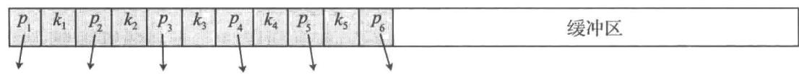


图14-27 缓冲树中一个内部节点的结构


当一条索引记录被插入缓冲树时，该索引记录将被插到根的缓冲区，而不是遍历树直至叶节点。如果该缓冲区已满，则将缓冲区中的每条索引记录推到树的下一层的相应孩子节点中。如果孩子节点是内部节点，则索引记录被添加到孩子节点的缓冲区中；如果缓冲区已满，则该缓冲区中的所有记录都将被类似地向下推。一个缓冲区中的所有记录在被下推之前都已按搜索码排序。如果子节点是叶节点，则索引记录以通常的方式插入叶节点中。如果该插入导致叶节点过满，则将按通常的 $\mathbf{B}^{+}$ 树方式拆分该节点，拆分可能会传播到父节点。对一个过满的内部节点的拆分是以通常的方式完成的，另外还有一个步骤是拆分缓冲区；缓冲项可根据它们的码值在两个拆分节点之间进行划分。

查找是通过以通常的方式遍历 $\mathbf{B}^{+}$ 树结构来完成的，以找到包含与查找码相匹配的记录的叶节点。但是还有一个额外的步骤：在查找遍历的每个内部节点处，必须检查节点的缓冲区，以查看是否有与查找码相匹配的任何记录。范围查找与在普通 $\mathbf{B}^{+}$ 树中一样进行，但它们还必须检查在被访问的任何叶节点之上的所有内部节点的缓冲区。

假设一个内部节点的缓冲区所容纳的记录数是孩子节点的 k 倍。那么，平均说来，每次将把 k 条记录下推到每个孩子节点（不管孩子节点是内部节点还是叶节点）。在下推之前对记录进行排序可以确保所有这些记录都是连续推送的。用于插入的缓冲树方式的好处是：从存储器访问孩子节点以及将更新的节点写回的代价是在 k 条记录之间平均分摊（分担）的。当 k 足够大时，与常规 $B^{+}$ 树中的插入相比，节省的开销是相当可观的。

可以使用删除项或更新项以类似于 LSM 树的方式来处理删除和更新。另一种可替代方案是：使用普通的 $B^{+}$ 树算法来处理删除和更新。但其风险是：与使用删除 / 更新项时的代价相比，每次删除 / 更新的 I/O 代价更高。

缓冲树在 I/O 操作数上提供了比 LSM 树的变体更好的、最坏情况下的复杂度边界。在读代价方面，缓冲树明显快于 LSM 树。但是，缓冲树上的写操作涉及随机 I/O，与使用 LSM 树的变体的顺序 I/O 操作相比需要更多次寻道。对于磁盘存储器而言，寻道的高代价导致缓冲树在写密集型工作负载上的性能比 LSM 树要差。因此，LSM 树更广泛地适用于对于存储在磁盘上的数据的写密集型工作负载。但是，由于随机 I/O 操作在 SSD 上是非常高效的，而且缓冲树与 LSM 树相比，总体上执行的写操作更少，因此缓冲树可以在 SSD 上提供更好的写性能。几种为闪存而设计的索引结构都利用了缓存树所引入的缓冲区概念。

缓冲树的另一种好处是：将缓冲区与内部节点相结合以减少写操作次数的关键思想可以用于任何类型的树结构索引。例如，缓冲区被用来支持诸如 R 树（我们将在 14.10.1 节中学习）那样的空间索引以及其他类型的索引的批量加载，而对于这些类型的索引来说，排序和自底向上的构建是不适用的。

缓冲树已被实现为 PostgreSQL 中通用搜索树（Generalized Search Tree，GiST）索引结构的一部分。GiST 索引允许执行用户自定义代码来实现节点上的搜索、更新和拆分操作，并已用于实现 R 树和其他空间索引结构。

## 14.9 位图索引

位图索引是为多码上的简单查询而设计的一种特殊类型的索引，尽管每个位图索引都是建立在单个码之上的。我们在本节中描述位图索引的关键特性，并将在24.3节中提供进一步的详细信息。

为了使用位图索引，关系中的记录必须被顺序编号，比如从0开始顺序编号。对于给定的一个 $n$ 值，必须能容易地检索到编号为 $n$ 的记录。如果记录是规模固定的并且位于文件的连续块上，则实现这一点特别容易。这样的话，记录号就可以容易地转化为一个块编号和一个用于识别块内记录的编号。

请考虑具有这样一个属性的关系，该属性只能从少量值（例如从2到20）中取一个值。例如，请考虑instructor_info关系，它（除了ID属性外）有一个gender属性，它只能取m（男）或f（女）值。假设这个关系还有一个income_level属性，它存储收入级别，这里的收入被分成5级：L1为0～9999，L2为10 000～19 999，L3为20 000～39 999，L4为40 000～74 999，L5为75 000～∞。在这里，原始数据可以取很多值，但是数据分析者将这些值划分成少数几个区间以简化数据分析。图14-28的左侧展示了此关系的一个实例。

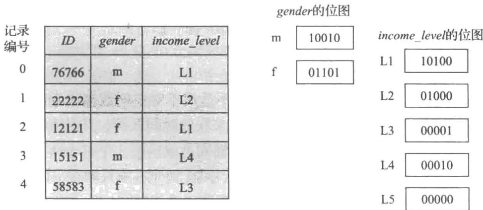


图 14-28 instructor_info 关系上的位图索引


位图（bitmap）就是位的一个简单数组。在其最简单的形式中，r关系在A属性上的位图索引（ bitmap index）是由A能取的每个值所对应的位图构成的。每个位图都有和关系中的记录数相等数量的位。如果编号为i的记录在A属性上的值为 $v_{j}$ ，则值为 $v_{j}$ 的位图中的第i个位被置为1，而该位图上的其他所有位被置为0。

在我们的示例中，对于值 m 和 f 分别有一个位图。如果编号为 i 的记录的 gender 值为m，则 m 的位图中的第 i 位被置为 1，而 m 的位图中的其他所有位被置为 0。类似地，f 的位图中取值为 1 的位对应于在 gender 属性上取值为 f 的记录，而其他所有位都取值为 0。图 14-28 展示了在 instructor_info 关系的 gender 与 income_level 属性上的位图索引，以及对应的关系实例。

我们现在考虑什么时候位图索引是有用的。检索具有值 m（或者值 f）的所有记录的最简单方式是：简单地读取该关系中的所有记录，并选出那些值为 m（或者 f）的记录。位图索引实际上并不能有助于加快这种选择的速度。尽管它可以让我们只读取具有一种特定性别的那些记录，但是有可能文件的每个磁盘块最终都需要被读取。

事实上，位图索引主要在对多个码进行选择操作时才有用。假设我们除了 gender 上的位图索引之外，还创建了 income_level 属性上的位图索引，正如我们在前面描述的那样。

现在请考虑选择收入在 10 000～19 999 区间的女性的一个查询。这个查询可以表示为：

select * 

from instructor_info 

where gender = 'f' and income_level = 'L2'; 

为了计算这个选择，我们取 gender 值为 f 的位图和 income_level 值为 L2 的位图，并执行这两个位图的交（intersection）（逻辑与）运算。换句话说，我们计算出了一个新的位图，如果前面两个位图的第 i 位都取值为 1，则新位图的第 i 位也取值为 1；否则取值为 0。在图 14-28 的示例中，gender=f 的位图（01101）和 income_level=L2 的位图（01000）的交得到位图 01000。

因为第一个属性可以取 2 个值，并且第二个属性可以取 5 个值，我们可以认为平均 10 条记录中只有 1 条记录能满足这两个属性上的组合条件。如果有更多的条件，则满足所有条件的记录在所有记录中所占的比例可能就相当小了。这样，系统可通过如下方式来计算出查询结果：在交操作得到的位图中找出取值为 1 的所有位，然后检索出相应的记录。如果满足条件的记录所占比例很大，则扫描整个关系仍然是代价更低的一种可选方案。

有关位图索引的更多详细介绍（包括如何高效实现聚集运算、如何加快位图运算以及将 $B^{+}$ 树与位图相结合的混合索引）可以在24.3节中找到。

## 14.10 时空数据索引

诸如散列索引和 $B^{+}$ 树那样的传统索引结构不适用于对空间数据的索引，空间数据通常具有两个或多个维度。类似地，当元组具有与其关联的时间区间，并且查询可能指定时间点或时间区间时，传统的索引结构可能导致较差的性能。

## 14.10.1 空间数据索引

在本小节中，我们将提供对空间数据的索引技术的概览。更多详情可以在24.4节中找到。空间数据是指二维或更高维空间中的点或区域的数据。例如，餐厅的位置由（纬度，经度）对进行标识，它是空间数据的一种形式。类似地，一个农场或湖泊的空间范围可以用多边形来标识，且每个角落都由（纬度，经度）对来标识。

空间数据上的查询有多种形式，需要使用索引来高效地支持这些查询。可以通过在复合属性（纬度，经度）上创建一棵 $\mathbf{B}^{+}$ 树来回答这样一个查询：查找在精确指定的（纬度，经度）对处的餐馆。然而，这样的 $\mathbf{B}^{+}$ 树索引却不能高效地回答这样一个查询：查找在一个用户所在位置方圆 500 米范围内的所有餐馆，这些餐馆是由（纬度，经度）对来标识的。这样的索引也不能高效地回答这样一个查询：查找位于感兴趣的矩形区域内的所有餐馆。这两种都是范围查询（range query），范围查询检索指定区域内的对象。这样的索引也不能高效地回答这样的查询：查找离一个指定位置最近的餐馆；这样的查询是最近邻（nearest neighbor）查询的一个示例。

空间索引的目标是支持不同形式的空间查询，特别是范围查询和最近邻查询，因为它们被广泛使用。

为了理解如何索引由两个或多个维度组成的空间数据，我们首先考虑对一维数据中的点进行索引。诸如二叉树和 $\mathbf{B}^{+}$ 树那样的树结构是通过将空间分成更小的部分来操作的。例如，二叉树的每个内部节点都将一个一维区间一分为二。位于左边分区中的点进入左子树；位于右边分区中的点进入右子树。在一棵平衡的二叉树中，分区的选择使得存储在子树中的大约一半的点落在每个分区中。类似地， $\mathbf{B}^{+}$ 树的每一层都将一个一维区间拆分成多个部分。

我们可以利用这种直觉来为二维空间以及更高维的空间创建树结构。一种称为 k-d 树（k-d tree）的树结构是早期用于多维索引的结构之一。一棵 k-d 树的每一层都把空间分成两

个部分。在树顶层的节点处分区是沿着一个维度进行的，在下一层节点中则沿着另一个维度进行，依此类推，各维循环往复。分区的进行方式是这样的：在每个节点处，存储在子树中的大约一半的点落在一边，且另一半落在另一边。当一个节点的点数少于给定的最大点数时，分区停止。

图 14-29 显示了二维空间中的一组点，以及代表这一组点的 k-d 树，其中叶节点中的最大点数被设置为 1。图中的每条线（外部框除外）对应于 k-d 树中的一个节点。图中线的编号表示相应节点出现在树中的层级。

矩形范围查询是查找在指定的矩形区域内的点，可以使用 k-d 树来高效地回答：这种查询本质上指定了每个维度上的区间。例如，一个范围查询可能查找所有 x 维度在

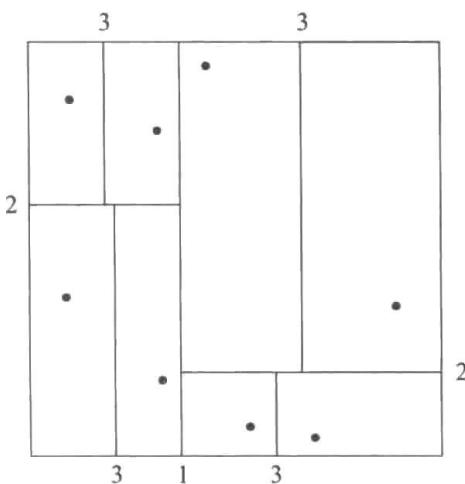


图14-29 由k-d树划分的空间


50 到 80 之间并且 y 维度在 40 到 70 之间的所有点。请回想一下，每个内部节点都在一个维度上划分空间，就像在 B $^{+}$ 树中一样。从根节点开始，可以通过以下递归过程来执行范围搜索：

1. 假设节点是一个内部节点，令它在点 $x_{i}$ 处按一个特定的维度（比如说 $x$ ）被拆分。左子树中的项所具有的 $x$ 值 $< x_{i}$ ，且右子树中的项所具有的 $x$ 值 $\geqslant x_{i}$ 。如果查询范围包含 $x_{i}$ ，则在两个孩子上递归地执行搜索。如果查询范围在 $x_{i}$ 的左侧，则只对左孩子执行递归搜索，否则只在右子树上执行搜索。

2. 如果节点是叶节点，则检索查询范围中包含的所有项。

最近邻搜索更为复杂，我们在这里不做描述，但使用 k-d 树也可以相当高效地回答最近邻查询。

k-d-B 树（k-d-B tree）对 k-d 树进行了扩展，允许每个内部节点有多个孩子节点以降低树的高度，就像 B 树扩展了二叉树一样。k-d-B 树比 k-d 树更适合辅助存储器。如上所述的范围搜索可以容易地扩展到 k-d-B 树，并且使用 k-d-B 树也可以相当高效地回答最近邻查询。

对于空间数据有许多可供选择的索引结构。四叉树（quadtree）不是一次按一个维度对数据进行划分，而是在树的每个节点处将一个二维空间分为四个象限。具体细节可以在

24.4.1 节中找到。

对诸如线段、矩形和其他多边形那样的空间区域进行索引带来了新的问题。用于此项任务的有 k-d 树和四叉树的扩展方法。一个关键的思想是：如果一条线段或一个多边形穿越一条分割线，则它会沿着分割线被分割，并在其各部分所在的每棵子树中进行表示。一条线段或一个多边形的多次出现可能导致存储效率以及查询效率低下。

一种称为 R 树（R-tree）的存储结构对于跨越空间区域的对象（比如线段、矩形和其他多边形）以及点进行索引是有用的。R 树是一种平衡树结构，索引对象存储在叶节点中，这很像 B⁺ 树。但是，与每个树节点关联的不是值的范围，而是矩形边框（bounding box）。叶节点的边框是与包含叶节点中存储的所有对象的轴平行的最小矩形。类似地，内部节点的边框是与包含其孩子节点边框的轴平行的最小矩形。一个对象（比如多边形）的边框被类似地定义为与包含该对象的轴平行的最小矩形。

每个内部节点存储孩子节点的边框以及指向孩子节点的指针。每个叶节点存储被索引的对象。

图 14-30 显示了一组矩形（用实线绘制）和对应于该组矩形的 R 树节点的边框（用虚线绘制）。请注意为了在图中突出边框，被显示的边框内留有额外的空间。实际上，这些框应该更小一些，并紧密围住它们所包含的对象。也就是说，边框 B 的每条边应紧接 B 中包含的至少一个对象或边框。

R 树本身位于图 14-30 的右侧。图中边框 i 的坐标被表示为 $BB_{i}$ 。有关 R 树的更多详细信息（包括如何使用 R 树来回答范围查询的详细信息）可以在 24.4.2 节中找到。

与一些用于存储多边形和线段的、诸如 $\mathbb{R}^*$ 树和区间树那样的可替代结构不同，R树只存储每个对象的一个副本，并且可以轻松地保证每个节点至少是半满的。但是，由于必须搜索多条路径，因此查询可能比使用某些可替代方案要慢。然而，由于R树具有更好的存储效率以及它们与 $B$ 树相似，R树及其变体在支持空间数据的数据库系统中得到了广泛的应用。

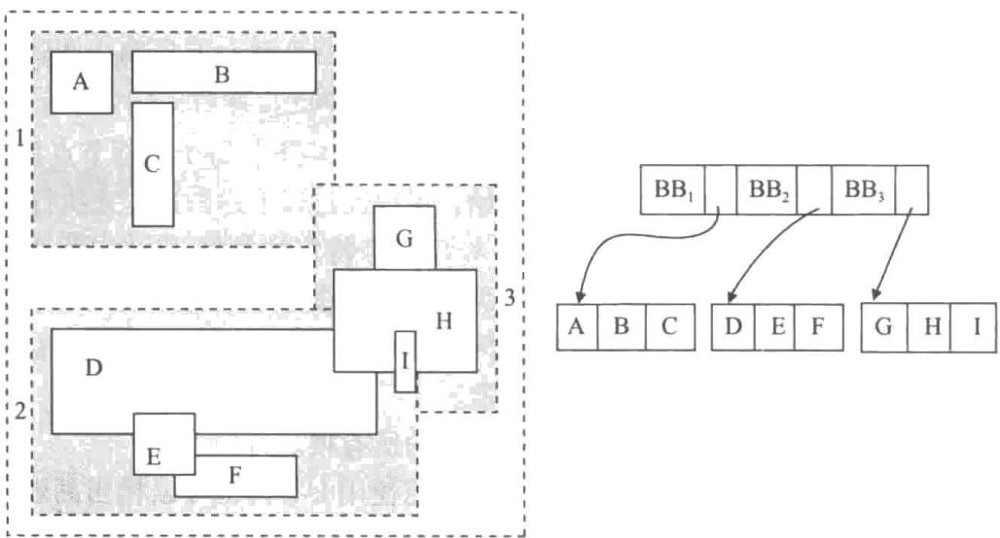


图14-30 一棵R树


## 14.10.2 时态数据索引

时态数据是指具有一个关联的时间段的数据，如 7.10 节所述。与一个元组关联的时间段表示在这段时间内元组是有效的。例如，一个特定的课程标识可能在某个时间点更改其主题。因此，在给定的时间区间内，一个课程标识与一个主题相关联，在这段时间区间之外，相同的课程标识就与不同的主题相关联。这可以通过在 course 关系中拥有两个或更多元组来建模，这些元组具有相同的 course_id，但有不同的 title 值，每个元组都有它自己的有效时间区间。

一个时间区间（time interval）有一个开始时间和一个结束时间。另外，一个时间区间还指示该区间是在开始时间处开始，还是在开始时间之后开始，即该区间在开始时间处是闭的还是开的。类似地，时间区间指示它在结束时间处是闭的还是开的。为了表示元组当前有效这样的事实，在它下次被更新之前，结束时间在概念上被设置为无穷（可以用一个适当大的时间来表示它，比如9999-12-31的午夜）。

675 

一般说来，一个特定事实的有效期不可能只由一个时间区间组成；例如，一名学生可以一个学年在一所大学注册，下一学年休假，再下一学年再注册。学生在大学注册的有效期显然不是单个时间区间。但是，任何有效期都可以用多个区间来表示，因此，一个具有任意有效期的元组可以用多个元组来表示，每个元组都有一个有效期且该有效期为单个时间区间。因此当建模时态数据时，我们只考虑时间区间。

假设给定属性 a 的值 v 和一个时间点 $t_{1}$ ，我们希望检索一个元组的值。可以在 a 上创建一个索引，并使用它来检索对于属性 a 取值为 v 的所有元组。如果搜索码值的时间区间数量很少，这样一个索引可能是足够的，但通常来说该索引可以检索出大量的元组，它们的时间区间并不包括时间 $t_{1}$ 。

更好的解决方案是使用诸如 R 树那样的空间索引，将被索引元组视为具有两个维度，一个是被索引的属性 a，另一个是时间维度。在这种情况下，元组形成了一条线段，维度 a 具有值 v，并且元组的有效时间区间被作为时间维度中的区间。

导致诸如 R 树之类的空间索引的使用复杂化的一个问题是：结束时间可以是无限的（可能由一个非常大的值来表示），而空间索引通常假定边框是有限的，并且如果边框非常大，则性能可能很差。这个问题可以用下述方式来处理：

- 所有当前元组（即那些结束时间无穷大的元组，结束时间可能由一个大的时间值来表示）与结束时间有限的那些元组分开存储在单独的索引中。当前元组上的索引可以是（a, start_time）上的 $\mathbf{B}^{+}$ 树索引，其中 $a$ 是被索引的属性且start_time是开始时间，而非当前元组上的索引将会是诸如R树那样的空间索引。

- 查找在时间点 $t_i$ 处码值为 $\nu$ 的元组需要搜索这两个索引；当前元组索引上的搜索将针对 $a = \nu$ 且 $start\_ts \leqslant t_i$ 的元组，这可以通过简单的范围查询来完成。可以类似地处理具有时间范围的查询。

与使用针对多维数据而设计的空间索引不同，我们可以使用专门的索引，例如区间 $\mathbf{B}^{+}$ 树，这些索引被设计用于在单个维度中对区间进行索引，并提供比R树索引更好的复杂度保证。然而，大多数数据库实现发现对于时间区间使用R树索引比实现另一种类型的索引更为简单。

请回想一下，对于时态数据，只要具有相同主码值的元组具有不重叠的时间区间，就可能有不止一个元组对于主码具有相同的值。在插入一个新元组或更新现有元组的有效时间区间时，可以使用主码属性上的时态索引来高效地确定时态主码约束是否被违反。

## 14.11 总结

- 许多查询只涉及文件中的少部分记录。为了减少搜索这些记录的开销，我们可以为

存储数据库的文件创建索引（index）。

- 我们可以使用的索引有两种类型：稠密索引和稀疏索引。稠密索引对每个搜索码值都包含索引项，而稀疏索引只对某些搜索码值包含索引项。

- 如果搜索码的排列次序和关系的排列次序相匹配，则该搜索码上的索引被称为聚集索引（clustering index）。其他的索引被称为非聚集索引（nonclustering index）或辅助索引（secondary index）。辅助索引提高了这种查询的性能：查询使用的搜索码不是聚集索引的搜索码。但是，辅助索引增加了修改数据库的开销。

- 索引顺序文件是数据库系统中使用的最古老的索引模式之一。为了允许按照搜索码次序快速检索记录，记录被顺序存储，并且无序记录被链接在一起。为了允许快速的随机访问，我们使用一种索引结构。

- 索引顺序文件组织的主要缺陷是：随着文件的增大，性能会下降。为了克服这个缺陷，我们可以使用 $\mathrm{B}^{+}$ 树索引（ $\mathrm{B}^{+}$ -tree index）。

- $\mathbf{B}^{+}$ 树索引采用平衡（balanced）树的形式，在平衡树中从树根到树叶的每条路径的长度都相等。 $\mathbf{B}^{+}$ 树的高度与以 $N$ 为底取关系中记录数的对数成正比，其中每个非叶节点存储 $N$ 个指针， $N$ 的值通常约为50或100。 $\mathbf{B}^{+}$ 树比诸如AVL树那样的其他平衡二叉树结构要矮得多，因此定位记录所需的磁盘访问也较少。

- $\mathbf{B}^{+}$ 树上的查找是直接而且高效的。然而，插入和删除要更复杂一些，但仍然是高效的。在 $\mathbf{B}^{+}$ 树上进行查找、插入和删除所需的操作数与以 $N$ 为底取关系中记录数的对数成正比，其中每个非叶节点存储 $N$ 个指针。

- 我们可以用 $\mathbf{B}^{+}$ 树来索引一个包含记录的文件，也可以用它来组织文件中的记录。

- B 树索引和 $\mathrm{B}^{+}$ 树索引类似。B 树的主要优点在于它去除了搜索码值的冗余存储。主要缺点在于整体的复杂性以及对于给定的节点规模减小了扇出。在实践中，系统设计者几乎无一例外地倾向于选择 $\mathrm{B}^{+}$ 树索引而不是 B 树索引。

- 散列是在主存中和基于磁盘的系统中构建索引的一种广泛使用的技术。

- 诸如 $\mathbf{B}^{+}$ 树那样的顺序索引可用于基于相等条件的选择，并且该条件只涉及单个属性。当一个选择条件涉及多个属性时，我们可以对根据多个索引检索到的记录标识进行交运算。

- 对于每秒需要支持非常大量的随机写 / 插入的应用来说，基本的 B $^{+}$ 树结构并不理想。已经提出了几种备选的索引结构，以处理具有较高的写 / 插入率的工作负载，包括日志结构归并树和缓冲树。

- 对于索引属性只有非常少量的几个可区分值的情况，位图索引提供了一种非常紧凑的表达形式。位图上的交运算相当快，这使得它成为支持多属性上的查询的一种理想方式。

- R 树是 B 树的一种多维扩展；随着诸如 $R^{+}$ 树和 $R^{*}$ 树这样的变体的出现，它们已在空间数据库中得到了广泛应用。以常规方式划分空间的索引结构（比如四叉树）有助于处理空间连接查询。

- 有许多用于索引时态数据的技术，包括使用空间索引和区间 $\mathbf{B}^{+}$ 树专用索引。

## 术语回顾

- 索引类型

○ 顺序索引

- 散列索引
- 评估因子
    - 访问类型
    - 访问时间
    - 插入时间
    - 删除时间
    - 空间开销
- 搜索码
- 顺序索引
    - 顺序索引
    - 聚集索引
    - 主索引
    - 非聚集索引
    - 辅助索引
    - 索引顺序文件
- 索引项
- 索引记录
- 稠密索引
- 稀疏索引
- 多级索引
- 非唯一性搜索码
- 复合搜索码
- B $^{+}$ 树索引文件
    - 平衡树
    - 叶节点
    - 非叶节点
    - 内部节点
    - 范围查询
    - 节点拆分
    - 节点合并
    - 指针重分布
    - 唯一化
- B $^{+}$ 树扩展
    - 前缀压缩

- 批量加载
    - 自底向上的B $^{+}$ 树构建
- B树索引
    - 散列文件组织
    - 散列函数
    - 桶
    - 溢出链
    - 闭寻址
    - 闭散列
    - 桶溢出
    - 偏斜
    - 静态散列
    - 动态散列
- 多码访问
- 覆盖索引
- 写优化索引结构
    - 日志结构归并（LSM）树
    - 阶梯式归并索引
    - 缓冲树
- 位图索引
- 位图交
- 空间数据索引
    - 范围查询
    - 最近邻查询
    - k-d树
    - k-d-B树
    - 四叉树
    - R树
    - 边框
- 时态索引
- 时间区间
- 闭区间
- 开区间

678 

## 实践习题

14.1 索引加快了查询处理，但是在作为潜在搜索码的每个属性上或者每个属性组合上创建索引，通常是个坏主意，请解释为什么。

14.2 在同一个关系的不同搜索码上建立两个聚集索引一般来说是否可行？请解释你的答案。

14.3 用下面的码值集合建立一棵 $\mathbf{B}^{+}$ 树：

(2,3,5,7,11,17,19,23,29,31) 

假设树初始为空，按升序添加这些值。当一个节点所能容纳的指针数是下列情况时，请分别构造 $\mathbf{B}^{+}$ 树：a.4 b.6 c.8

14.4 对于实践习题 14.3 中的每一棵 B $^{+}$ 树，请给出下列各操作后树的形状：
a. 插入 9。
b. 插入 10。
c. 插入 8。
d. 删除 23。
e. 删除 19。

14.5 考虑 14.4.1 节描述的修改后的 B $^{+}$ 树重分布模式。请问树的预期高度与 n 之间的函数关系是什么？

14.6 请给出 B $^{+}$ 树函数 findRangeIterator() 的伪码，该伪码类似于函数 findRange()，只不过它返回的是如 14.3.2 节所述的一个迭代对象。另外，请给出迭代类的伪码，包括迭代对象中的变量和 next() 方法。

14.7 如果按照已排好的次序插入索引项，那么 $\mathbf{B}^{+}$ 树的每个叶节点的占用率如何？请解释为什么。

14.8 假设你有一个具有 $n_r$ 个元组的关系 $r$ ，需要在 $r$ 上建立一个辅助的 $\mathbf{B}^+$ 树索引。
a. 请给出通过一次插入一条记录的方式来建立 $\mathbf{B}^+$ 树索引的代价公式。假设每个块平均可容纳 $f$ 个索引项，并且树的叶子层之上的所有层都在内存中。
b. 假设一次随机磁盘访问要花费 10 毫秒，在一个具有 1000 万条记录的关系上建立索引的代价是多大？
c. 请写出 14.4.4 节中概述的自底向上构建 $\mathbf{B}^+$ 树的伪码。你可以假设存在一个可以高效排序大型文件的函数。

14.9 为什么在一系列插入之后， $\mathbf{B}^{+}$ 树文件组织的叶节点可能会丧失顺序性？

680 

a. 请解释为什么会丧失顺序性。

b. 为了最大限度地减少顺序扫描中的寻道次数，对于一个相当大的 $n$ ，很多数据库在 $n$ 个块的范围内分配叶子页面。当分配 $\mathbf{B}^{+}$ 树的第一个叶子时， $n$ 块单元中只有一块被使用，并且剩下的页都是空闲的。如果有一个页面被拆分，并且它的 $n$ 块单元中有空闲页面，则新的页可以使用该空间。如果 $n$ 块单元满了，则分配另一个 $n$ 块单元，并且前 $n / 2$ 个叶子页面被放入一个 $n$ 块单元中，剩余的放入第二个 $n$ 块单元中。为了简单起见，假设没有删除操作。
i. 假设没有删除操作，在第一个 $n$ 块单元存满之后，已分配空间的占用率在最坏情况下是多少？
ii. 有没有可能出现这样的情况：分配给一个 $n$ 节点块单元的叶节点是不连续的，也就是说，有可能有两个叶节点被分配到一个 $n$ 节点块中，但是二者之间的另一个叶节点被分配给了另一个不同的 $n$ 节点块？
iii. 在缓冲空间对于存储一个 $n$ 页的块来说是足够的这一合理假设下， $\mathbf{B}^{+}$ 树的叶子层扫描在最坏情况下需要多少次寻道？请把该数字和每次只为叶子页面分配一个块的最坏情况进行比较。

iv. 为了提高空间利用率而将值重新分配给兄弟节点的技术如果与前述用于叶子块的分配方案一起使用可能会更有效。请解释为什么。

14.10 假设给你一个数据库模式和一些经常执行的查询。你将如何利用这些信息来决定要创建什么样的索引？

14.12 与 LSM 树相比，缓存树做了哪些权衡？

14.13 请考虑如图 14-1 所示的 instructor 关系。
a. 在 salary 属性上构建一个位图索引，把 salary 的值分成 4 个区间：小于 50 000 的，50 000 到 60 000 以下的，60 000 到 70 000 以下的，70 000 及以上的。
b. 请考虑一个查询：查找在金融系中工资为 80 000 或更高的所有教师。概述回答该查询的步骤，并给出为回答这个查询而构建的最终位图和中间位图。

681 14.14 假设你有一个包含 $x$ 、 $y$ 坐标和餐馆名称的关系。还假设要询问的查询的唯一形式如下：指定一

个点，并询问该点处是否正好有餐厅。那么哪种类型的索引比较好，R树还是B树？为什么？14.15 假设你有一个空间数据库，它支持圆形区域的区域查询，但不支持最近邻查询。请给出一种利用多个区域查询来找到最近邻的算法。

## 习题

14.16 什么时候使用稠密索引比使用稀疏索引更可取？请解释你的答案。

14.17 聚集索引和辅助索引之间有何区别?

14.18 对于实践习题 14.3 中的每棵 B $^{+}$ 树，请给出下列查询中涉及的步骤：
a. 找出搜索码值为 11 的记录。
b. 找出搜索码值在 7 和 17 之间（包括 7 和 17）的记录。

14.19 14.3.5节中提出的处理非唯一性搜索码的解决方案是给搜索码增加一个额外的属性。这种变化会给 $\mathbf{B}^{+}$ 树的高度带来什么样的影响？

14.20 假设有一个关系 $r(A, B, C)$ ，带有一个搜索码 $(A, B)$ 上的 $\mathbf{B}^{+}$ 树索引。a. 用这个索引来查找满足 $10 < A < 50$ 的记录，最坏情况下的代价是多少？请用获取的记录数目 $n_{1}$ 和树的高度 $h$ 来度量。b. 用这个索引来查找满足 $10 < A < 50 \wedge 5 < B < 10$ 的记录，最坏情况下的代价是多少？请用满足此选择的记录数目 $n_{2}$ 以及上面定义的 $n_{1}$ 和 $h$ 来度量。c. 当 $n_{1}$ 和 $n_{2}$ 满足什么条件的时候，此索引是查找满足 $10 < A < 50 \wedge 5 < B < 10$ 的记录的一种高效方式。

14.21 假设你必须在大量的名称上建立一个 $\mathbf{B}^{+}$ 树索引，这些名称的最大长度可能相当大（比如40个字符），并且这些名称长度的平均值本身也大（比如10个字符）。请解释如何使用前缀压缩来最大化非叶节点的平均扇出。

14.22 假设一个关系以 $\mathbf{B}^{+}$ 树文件组织的形式存储。假设辅助索引存储的记录标识是指向磁盘上记录的指针。a.如果在文件组织中发生了节点拆分，则会对辅助索引产生什么影响？b.更新辅助索引中所有被影响到的记录，代价是什么？c.如何通过将文件组织的搜索码作为逻辑记录标识来解决这个问题？d.使用这样的逻辑记录标识会带来何种附加的代价？

682 

14.23 与 B $^{+}$ 树索引相比，写优化索引做了哪些权衡？

14.24 一个存在位图（existence bitmap）对于每个记录位置都有一个位，如果记录存在，则该位被置为1；如果该位置没有记录（例如，如果记录被删除了），则该位被置为0。请说明如何根据其他位图来计算出存在位图。通过对空（null）值使用位图，确保你的技术即使在存在空值的情况下也能工作。

14.25 通过将有效时间视为时间区间，在概念上可以使用能够索引空间区间的空间索引来索引时态数据。这样做有什么问题，该如何解决此问题？

14.26 关系的某些属性可能包含敏感数据，并且可能需要以加密的方式存储。数据加密是如何影响索引方案的？特别是，它会如何影响试图按排列次序存储数据的方案？

## 延伸阅读

B 树索引最早由 [Bayer and McCreight (1972)] 和 [Bayer (1972)] 引入。 $B^{+}$ 树在 [Comer (1979)]、[Bayer and Unterauer (1977)] 和 [Knuth (1973)] 中讨论。[Gray and Reuter (1993)] 对 $B^{+}$ 树实现中的问题提供了很好的描述。

日志结构归并（LSM）树在 [O'Neil et al. (1996)] 中介绍，而阶梯归并树由 [Jagadish et al. (1997)] 提出。缓冲树在 [Arge (2003)] 中提出。[Vitter (2001)] 提供了对外存数据结构和算法的全面综述。

位图索引在 [O'Neil and Quass (1997)] 中描述。它们最先是在 AS 400 平台上的 IBM Model 204 文件管理器中引入的。它们在特定类型的查询上提供了非常大的加速比，并且现在已在大多数数据库系统上实现了。

[Samet (2006)] 和 [Shekhar and Chawla (2003)] 提供了介绍空间数据结构和空间数据库的教科书。[683] [Bentley (1975)] 描述了 k-d 树，并且 [Robinson (1981)] 描述了 k-d-B 树。R 树最初出现在 [Guttman (1984)] 中。

## 参考文献


[Arge (2003)] L. Arge, "The Buffer Tree: A Technique for Designing Batched External Data Structures", Algorithmica, Volume 37, Number 1 (2003), pages 1-24. 


[Bayer (1972)] R. Bayer, "Symmetric Binary B-trees: Data Structure and Maintenance Algorithms", Acta Informatica, Volume 1, Number 4 (1972), pages 290-306. 


[Bayer and McCreight (1972)] R. Bayer and E. M. McCreight, "Organization and Maintenance of Large Ordered Indices", Acta Informatica, Volume 1, Number 3 (1972), pages 173-189. 


[Bayer and Unterauer (1977)] R. Bayer and K. Unterauer, "Prefix B-trees", ACM Transactions on Database Systems, Volume 2, Number 1 (1977), pages 11-26. 


[Bentley (1975)] J. L. Bentley, "Multidimensional Binary Search Trees Used for Associative Searching", Communications of the ACM, Volume 18, Number 9 (1975), pages 509-517. 


[Comer (1979)] D. Comer, "The Ubiquitous B-tree", ACM Computing Surveys, Volume 11, Number 2 (1979), pages 121-137. 


[Gray and Reuter (1993)] J. Gray and A. Reuter, Transaction Processing: Concepts and Techniques, Morgan Kaufmann (1993). 


[Guttman (1984)] A. Guttman, "R-Trees: A Dynamic Index Structure for Spatial Searching", In Proc. of the ACM SIGMOD Conf. on Management of Data (1984), pages 47-57. 


[Jagadish et al. (1997)] H. V. Jagadish, P. P. S. Narayan, S. Seshadri, S. Sudarshan, and R. Kanneganti, "Incremental Organization for Data Recording and Warehousing", In Proceedings of the 23rd International Conference on Very Large Data Bases, VLDB '97 (1997), pages 16-25. 


[Knuth (1973)] D. E. Knuth, The Art of Computer Programming, Volume 3, Addison Wesley, Sorting and Searching (1973). 


[O'Neil and Quass (1997)] P. O'Neil and D. Quass, "Improved Query Performance with Variant Indexes", In Proc. of the ACM SIGMOD Conf. on Management of Data (1997), pages 38-49. 


[O'Neil et al. (1996)] P. O'Neil, E. Cheng, D. Gawlick, and E. O'Neil, "The Log-structured Merge-tree (LSM-tree)", Acta Inf., Volume 33, Number 4 (1996), pages 351–385. 


[Robinson (1981)] J. Robinson, "The k-d-B Tree: A Search Structure for Large Multidimensional Indexes", In Proc. of the ACM SIGMOD Conf. on Management of Data (1981), pages 10-18. 


[Samet (2006)] H. Samet, Foundations of Multidimensional and Metric Data Structures, Morgan Kaufmann (2006). 


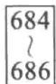


[Shekhar and Chawla (2003)] S. Shekhar and S. Chawla, Spatial Databases: A TOUR, Pearson (2003). 


[Vitter (2001)] J. S. Vitter, "External Memory Algorithms and Data Structures: Dealing with Massive Data", ACM Computing Surveys, Volume 33, (2001), pages 209-271. 

