## 查询优化

为了处理一个给定的查询，尤其是复杂查询，通常会有许多种可能的策略，查询优化（query optimization）就是从这许多策略中选出最高效的查询执行计划的处理过程。我们并不期望用户编写出能够被高效处理的查询。相反，我们期望系统构造一个能够让查询执行代价最小化的查询执行计划。这正是查询优化起作用的地方。

优化一方面发生在关系代数级别，在关系代数中系统尝试找到一个与给出的表达式等价但执行起来更为高效的表达式；另一方面是为查询处理选择一种详细的策略，比如对一种运算的执行选择所用的算法，选择所使用的特定索引，等等。

一种好的查询策略和一种差的查询策略在代价（从执行时间的角度看）方面通常会有相当大的区别，并且可能会相差好几个数量级。因此，即使查询只执行一次，系统为查询处理选择一种好的策略而花费一定量的时间是值得的。

## 16.1 概述

请考虑下面对于查询“找出音乐系中所有教师的姓名以及每位教师所教授的课程的名称”的关系表达式 $^{①}$ ：

$$
\Pi_ {n a m e, t i t l e} \left(\sigma_ {d e p t \_ n a m e = “ M u s i c ”} (i n s t r u c t o r \bowtie (t e a c h e s \bowtie \Pi_ {c o u r s e \_ i d, t i t l e} (c o u r s e))\right))
$$

上述表达式中的子表达式 instructor $\bowtie$ teaches $\bowtie$ $\Pi_{course\_id, title}(course)$ 能产生一个非常庞大的中间结果。然而，我们只对这个中间结果的少数元组感兴趣，也就是那些与音乐系的教师有关的元组，并且只对这个关系的九个属性中的两个感兴趣。由于我们只关心在 instructor 关系中与音乐系有关的那些元组，因此没有必要考虑不满足 dept_name=“Music”条件的那些元组。通过减少需要访问的 instructor 关系的元组数量，我们也就减小了中间结果的规模。现在我们将查询表示为如下的关系代数表达式：

$$
\Pi_ {n a m e, t i t l e} \left(\left(\sigma_ {d e p t, n a m e = “ M u s i c ”} (i n s t r u c t o r)\right) \bowtie (t e a c h e s \bowtie \Pi_ {c o u r s e, i d, t i t l e} (c o u r s e))\right)\tag{743}
$$

它与我们原先的代数表达式等价，但它产生的中间关系更小。初始表达式以及转换后的表达式如图 16-1 所示。

一个执行计划确切地定义了每种运算应使用的算法，以及运算之间的执行应该如何协调。图16-2说明了图16-1b的表达式的一个可能的执行计划。正如我们已看到的，对于每种关系运算可以使用几种不同的算法，从而产生可替代的执行计划。在图16-2中，对于其中一个连接运算选择了散列－连接，而对于另一个则在连接属性ID上将关系排序后，选用归并－连接。假定所有边都是流水线化的，除了被标记为物化的边之外。对于流水线化的边，生产者的输出直接送给消费者，而不会被写出到磁盘；另一方面，对于物化的边，输出将被写到磁盘，然后再由消费者从磁盘读取。在图 16-2 的执行计划中不存在物化的边，尽管一些运算符（如排序和散列－连接）可以使用其间有物化的边的子运算符来表示，正如我们在 15.7.2.2 节中所看到的。

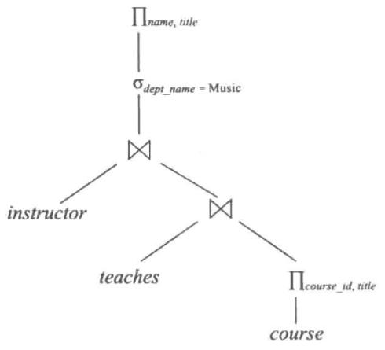


a) 初始表达式树


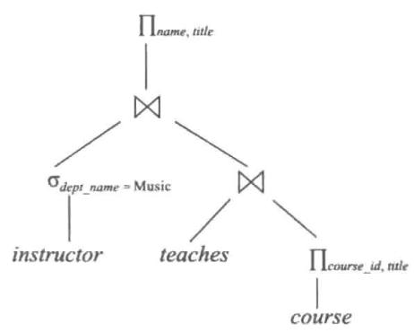


b) 转换后的表达式树


图 16-1 等价的表达式


给定一个关系代数表达式，查询优化器的任务是产生一个查询执行计划，该计划能计算出与给定表达式相同的结果，并且以代价最小的方式（或至少是不比最小执行代价大多少的方式）来产生结果。

我们在图 16-1 中看到的表达式未必会产生对于计算结果具有最低代价的执行计划，因为它仍然计算整个 teaches 关系与 course 关系的连接。下面的表达式给出了相同的最终结果，但是产生了更小的中间结果，因为它只将 teaches 与对应于音乐系的 instructor 元组进行连接，然后将此结果再与 course 进行连接。

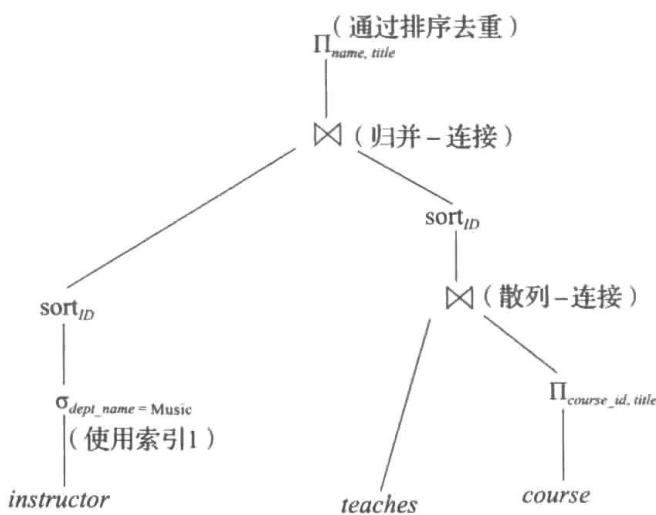


图16-2 一个执行计划


$$
\Pi_ {n a m e, t i l t e} \left(\left(\sigma_ {d e p t, n a m e = “ M u s i c ”} (i n s t r u c t o r) \bowtie t e a c h e s\right) \bowtie \Pi_ {c o u r s e, i d, t i l t e} (c o u r s e)\right)
$$

不管查询是如何编写的，优化器的工作就是为查询找到代价最小的计划。

为了找到代价最小的查询执行计划，查询优化器需要产生一些能与给定表达式得到相同结果的备选计划，并选出代价最小的一个。查询执行计划的产生涉及三个步骤：（1）产生逻辑上与给定表达式等价的表达式；（2）以可替代的方式对所产生的表达式做注释，以产生备选的查询计划；（3）估计每个执行计划的代价，并选择估计代价最小的那一个。

在查询优化器中步骤（1）～（3）是交叉的：先产生一些表达式并加以注释从而产生执行计划，然后进一步产生一些表达式并加以注释，依此类推。随着执行计划的产生，通过使用关于关系的统计信息（比如关系的规模和索引的深度）来估计它们的代价。

为了实现第一步，查询优化器必须产生与给定表达式等价的表达式。这是通过等价规则的形式来实现的，等价规则说明了如何将一个表达式转换成逻辑上等价的另一个表达式。我们将在16.2节中描述这些规则。

在 16.3 节中，我们将描述如何估计一个查询计划中每种运算的结果的统计规模。将这些统计结果应用到第 15 章中的代价公式就可以估计出单个运算的代价。把这些单个运算的代价合并起来就能够确定出执行给定关系代数表达式的代价估计，就如在 15.7 节中概述的那样。

745 

在 16.4 节中，我们将讲述如何选择一个查询执行计划。可以基于执行计划的代价估计来进行选择。由于代价是一种估计值，故所选计划未必是代价最小的计划；但是，只要估计得好，该计划很可能就是代价最小的计划，或其代价并不比最小代价大多少。

最后，物化视图有助于加速对特定查询的处理。在 16.5 节中，我们将学习如何 “维护” 物化视图（即，使它们保持最新）以及如何利用物化视图来执行查询优化。

## 注释 16-1 查看查询执行计划

许多数据库系统都提供了一种方式来查看为了执行给定查询而选择的执行计划。通常最好使用由数据库系统提供的 GUI 来查看执行计划。但是，如果你使用的是命令行界面，有许多数据库都支持 “explain <query>” 命令的变体，该命令的变体可以显示为指定的查询 <query> 而选择的执行计划。其确切的语法随不同的数据库而异：

- PostgreSQL 使用如上所示的语法。

- Oracle 采用 explain plan for 语法。但是，该命令将生成的计划存储在一个称为 plan_table 的表中，而不是直接显示它。查询 “select * from table (dbms_xplan.display);” 将显示存储的计划。

- DB2 使用与 Oracle 类似的方法，但需要执行程序 db2exfmt 来显示存储的计划。

- SQL Server 需要在提交查询之前执行命令 set showplan_text on；然后，当提交查询而不是执行查询时，显示执行计划。

- MySQL 使用与 PostgreSQL 相同的 explain <query> 语法，但输出的是一个其内容并不容易理解的表。但是，在 explain 命令之后执行 show warnings 会以更具可读性的格式来显示执行计划。

计划的估计代价也与计划一起显示。值得注意的是：代价通常并不以有任何外部意义的单位来表示，比如秒或I/O操作，而是以优化器所采用的任何代价模型的单位来表示。诸如PostgreSQL之类的某些优化器显示两个代价估计数字：第一个表示输出第一个结果的估计代价，第二个表示输出所有结果的估计代价。

## 16.2 关系表达式的转换

一个查询可以被表示成几种不同的形式，每种形式具有不同的执行代价。在这一节里，我们不仅考虑给定的关系表达式，而且考虑可选的等价表达式。

如果两个关系代数表达式在每个合法的数据库实例上都会产生相同的元组集，则称这两个表达式是等价的（equivalent）。（请回忆一下，一个合法的数据库实例是指满足数据库模式中指定的所有完整性约束的数据库实例。）请注意：元组的顺序是无关紧要的；两个表达式可能以不同的顺序产生元组，但只要元组集是一样的，就认为它们是等价的。

在 SQL 中，输入和输出都是元组的多重集合，并且关系代数的多重集版本（已在注释 3-1、注释 3-2 以及注释 3-3 中描述）被用于执行 SQL 查询。如果在每个合法的数据库上，关系代数多重集（multiset）版本中的两个表达式产生相同的元组多重集合，则称这两个表达式是等价的。本章中的讨论是基于关系代数的。我们将对关系代数的多重集版本的扩充留给读者作为练习。

## 16.2.1 等价规则

等价规则（equivalence rule）说明两种不同形式的表达式是等价的。既然这两种表达式在任何有效的数据库上都产生相同的结果，那么我们可以用第二种形式的表达式代替第一种形式的表达式，或者反之，用第一种形式的表达式代替第二种形式的表达式。优化器利用等价规则来将表达式转换成逻辑上等价的其他表达式。

下面描述关系代数表达式上的一些等价规则。图 16-3 展示了某些等价式。我们用 $\theta$ 、 $\theta_{1}$ 、 $\theta_{2}$ 等来表示谓词，用 $L_{1}$ 、 $L_{2}$ 、 $L_{3}$ 等来表示属性列表，并且用 E、 $E_{1}$ 、 $E_{2}$ 等来表示关系代数表达式。关系名 r 是关系代数表达式的一个特例，并且可以用在 E 出现的任何地方。

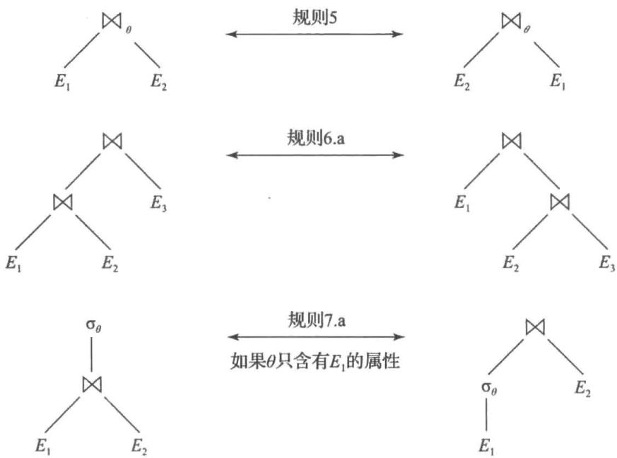


图 16-3 等价表达式的图形化表示


1. 合取选择运算可分解为单个选择运算的序列。该变换称为 $\sigma$ 的级联：

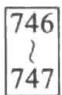


$$
\sigma_ {\theta_ {1} \wedge \theta_ {2}} (E) \equiv \sigma_ {\theta_ {1}} (\sigma_ {\theta_ {2}} (E))
$$

2. 选择运算满足交换律（commutative）:

$$
\sigma_ {\theta_ {1}} (\sigma_ {\theta_ {2}} (E)) \equiv \sigma_ {\theta_ {2}} (\sigma_ {\theta_ {1}} (E))
$$

3. 在一系列投影运算中只有最后一个运算是必需的，其余的可以省略。该转换也可称为 $\Pi$ 的级联：

$$
\Pi_ {L _ {1}} (\Pi_ {L _ {2}} (\dots (\Pi_ {L _ {n}} (E)) \dots)) \equiv \Pi_ {L _ {1}} (E)
$$

其中 $L_{1} \subseteq L_{2} \subseteq \cdots \subseteq L_{n}$ 

4. 选择运算可与笛卡儿积以及 $\theta$ 连接相结合：

a. $\sigma_{\theta}(E_{1}\times E_{2})\equiv E_{1}\bowtie_{\theta}E_{2}$ 

该表达式就是 $\theta$ 连接的定义。

b. $\sigma_{\theta_1}(E_1 \bowtie_{\theta_2} E_2) \equiv E_1 \bowtie_{\theta_1 \wedge \theta_2} E_2$ 

5. $\theta$ 连接运算满足交换律：

$$
E _ {1} \bowtie_ {\theta} E _ {2} \equiv E _ {2} \bowtie_ {\theta} E _ {1}
$$

请回忆一下：自然连接算子就是 $\theta$ 连接算子的一个特例；因此自然连接也满足交换律。

交换律规则的左右两端的属性顺序是不同的，因此如果考虑属性顺序，该等式是不成立的。由于我们使用的关系代数版本中每个属性都必须有一个名称以便被引用，因此属性的顺序实际上并不重要，除非在最终显示结果的时候。当顺序确实重要时，可以对等价规则的其中一端增加一个投影运算以对属性进行适当的重排。但是为了简化起见，我们省略了该投影并且在我们所有的等价规则中都忽略属性的顺序。

6. a. 自然连接运算满足结合律 (associative):

$$
(E _ {1} \bowtie E _ {2}) \bowtie E _ {3} \equiv E _ {1} \bowtie (E _ {2} \bowtie E _ {3})
$$

b. $\theta$ 连接满足以下方式的结合律：

$$
(E _ {1} \bowtie_ {\theta_ {1}} E _ {2}) \bowtie_ {\theta_ {2} \wedge \theta_ {3}} E _ {3} \equiv E _ {1} \bowtie_ {\theta_ {1} \wedge \theta_ {3}} (E _ {2} \bowtie_ {\theta_ {2}} E _ {3})
$$

其中 $\theta_{2}$ 只涉及 $E_{2}$ 与 $E_{3}$ 的属性。由于其中的任意一个条件都可为空，因此这说明笛卡儿积（×）运算也满足结合律。连接运算满足交换律和结合律对于查询优化中连接的重新排序是很重要的。

7. 选择运算在如下两个条件下对 $\theta$ 连接运算满足分配律：

a. 当选择条件 $\theta_{1}$ 中的所有属性只涉及被连接的其中一个表达式（比如 $E_{1}$ ）的属性时，选择运算对 $\theta$ 连接运算满足分配律：

$$
\sigma_ {\theta_ {1}} (E _ {1} \bowtie_ {\theta} E _ {2}) \equiv (\sigma_ {\theta_ {1}} (E _ {1})) \bowtie_ {\theta} E _ {2}
$$

b. 当选择条件 $\theta_{1}$ 只涉及 $E_{1}$ 的属性，并且 $\theta_{2}$ 只涉及 $E_{2}$ 的属性时，选择运算对 $\theta$ 连接运算满足分配律：

$$
\sigma_ {\theta_ {1} \wedge \theta_ {2}} (E _ {1} \bowtie_ {\theta} E _ {2}) \equiv (\sigma_ {\theta_ {1}} (E _ {1})) \bowtie_ {\theta} (\sigma_ {\theta_ {2}} (E _ {2}))
$$

8. 投影运算在如下条件下对 $\theta$ 连接运算满足分配律：

a. 令 $L_{1}$ 与 $L_{2}$ 分别代表 $E_{1}$ 与 $E_{2}$ 的属性。假设连接条件 $\theta$ 只涉及 $L_{1} \cup L_{2}$ 中的属性，那么：

$$
\prod_ {L _ {1} \cup L _ {2}} (E _ {1} \bowtie_ {\theta} E _ {2}) \equiv (\prod_ {L _ {1}} (E _ {1})) \bowtie_ {\theta} (\prod_ {L _ {2}} (E _ {2}))
$$

b. 请考虑连接 $E_{1} \bowtie_{\theta} E_{2}$ 。令 $L_{1}$ 与 $L_{2}$ 分别代表 $E_{1}$ 与 $E_{2}$ 的属性集；令 $L_{3}$ 是 $E_{1}$ 中出现在连接条件 $\theta$ 中但不在 $L_{1}$ 中的属性；令 $L_{4}$ 是 $E_{2}$ 中出现在连接条件 $\theta$ 中但不在 $L_{2}$ 中的属性。那么：

$$
\prod_ {L _ {1} \cup L _ {2}} (E _ {1} \bowtie_ {\theta} E _ {2}) \equiv \prod_ {L _ {1} \cup L _ {2}} ((\prod_ {L _ {1} \cup L _ {3}} (E _ {1})) \bowtie_ {\theta} (\prod_ {L _ {2} \cup L _ {4}} (E _ {2})))
$$

对于外连接运算 $\mathfrak{M}$ 、 $\mathfrak{M}$ 与 $\mathfrak{M}$ ，类似的等价规则也成立。

9. 集合的并与交运算满足交换律：

a. $E_{1} \cup E_{2} \equiv E_{2} \cup E_{1}$ 

b. $E_{1} \cap E_{2} \equiv E_{2} \cap E_{1}$ 

集合的差运算不满足交换律。

10. 集合的并与交运算满足结合律：

$$
(E _ {1} \cup E _ {2}) \cup E _ {3} \equiv E _ {1} \cup (E _ {2} \cup E _ {3})
$$

$$
\mathsf {b}. (E _ {1} \cap E _ {2}) \cap E _ {3} \equiv E _ {1} \cap (E _ {2} \cap E _ {3})
$$

11. 选择运算对并、交和集差运算满足分配律：

$$
\sigma_ {\theta} (E _ {1} \cup E _ {2}) \equiv \sigma_ {\theta} (E _ {1}) \cup \sigma_ {\theta} (E _ {2})
$$

$$
\sigma_ {\theta} (E _ {1} \cap E _ {2}) \equiv \sigma_ {\theta} (E _ {1}) \cap \sigma_ {\theta} (E _ {2})
$$

$$
\mathrm{c.} \sigma_ {\theta} (E _ {1} - E _ {2}) \equiv \sigma_ {\theta} (E _ {1}) - \sigma_ {\theta} (E _ {2})
$$

$$
\mathrm{d.} \sigma_ {\theta} (E _ {1} \cap E _ {2}) \equiv \sigma_ {\theta} (E _ {1}) \cap E _ {2}
$$

$$
\sigma_ {\theta} (E _ {1} - E _ {2}) \equiv \sigma_ {\theta} (E _ {1}) - E _ {2}
$$

如果将“-”替换成“∪”，则上述等价规则不成立。

12. 投影运算对并运算满足分配律：

$$
\prod_ {L} (E _ {1} \cup E _ {2}) \equiv (\prod_ {L} (E _ {1})) \cup (\prod_ {L} (E _ {2}))
$$

前提是 $E_{1}$ 与 $E_{2}$ 具有相同的模式。

13. 在如下条件下，选择运算对聚集运算满足分配律。令 G 是一组属性的集合，并且 A 是一组聚集表达式的集合。当 $\theta$ 仅涉及 G 中的属性时，下面的等价规则成立：

$$
\sigma_ {\theta} (_ {G} \gamma_ {A} (E)) \equiv {} _ {G} \gamma_ {A} (\sigma_ {\theta} (E))
$$

14. a. 全外连接满足交换律：

$$
E _ {1} \mathbb {X} E _ {2} \equiv E _ {2} \mathbb {X} E _ {1}
$$

b. 左外连接与右外连接不满足交换律。但是，左外连接和右外连接可以按如下方式交换：

$$
E _ {1} \bowtie E _ {2} \equiv E _ {2} \bowtie E _ {1}
$$

15. 在某些情况下，选择运算对左外连接和右外连接满足交换律。具体而言，当选择条件 $\theta_{1}$ 只涉及被连接的其中一个表达式（比如 $E_{1}$ ）中的属性时，下面的等价规则成立：a. $\sigma_{\theta_1}(E_1 \bowtie_\theta E_2) \equiv (\sigma_{\theta_1}(E_1)) \bowtie_\theta E_2$ b. $\sigma_{\theta_1}(E_2 \bowtie_\theta E_1) \equiv (E_2 \bowtie_\theta (\sigma_{\theta_1}(E_1)))$ 

16. 在某些情况下，外连接可以被替换为内连接。具体而言，如果每当 $E_{2}$ 的属性为空时， $\theta_{1}$ 都有能够计算出假值或未知值这样的性质，那么以下等价规则成立：

$$
\sigma_ {\theta_ {1}} (E _ {1} \bowtie_ {\theta} E _ {2}) \equiv \sigma_ {\theta_ {1}} (E _ {1} \bowtie_ {\theta} E _ {2})
$$

$$
\mathbf {b}. \sigma_ {\theta_ {1}} (E _ {2} \bowtie_ {\theta} E _ {1}) \equiv \sigma_ {\theta_ {1}} (E _ {2} \bowtie_ {\theta} E _ {2})
$$

满足上述性质的谓词 $\theta_{1}$ 被称为在 $E_{2}$ 上是空拒绝（null rejecting）的。例如，如果 $\theta_{1}$ 具有 A<4 这样的形式，其中 A 是 $E_{2}$ 的一个属性，那么每当 A 为空时， $\theta_{1}$ 将被计算出未知值，并且其结果是：在 $E_{1} \bowtie_{\theta} E_{2}$ 中但不在 $E_{1} \bowtie_{\theta} E_{2}$ 中的任何元组都将被 $\sigma_{\theta_{1}}$ 拒绝。因此，我们可以将外连接替换为内连接（反之亦然）。

更一般地，如果 $\theta_{1}$ 形如 $\theta_{1}^{1}\wedge\theta_{1}^{2}\wedge\cdots\wedge\theta_{1}^{k}$ ，则条件成立，并且至少有一个项 $\theta_{1}^{i}$ 是形如 $e_{1}$ relop $e_{2}$ 的，其中 $e_{1}$ 和 $e_{2}$ 是涉及 $E_{2}$ 的至少一个属性的算术或字符串表达式，且 relop 是 $<、\leqslant、=、\geqslant、>$ 中的一个。

这只列出了等价规则的一部分。更多的等价规则将在习题中讨论。

一些对于连接成立的等价规则对于外连接并不成立。例如，当规则 15.a 或规则 15.b 中指定的条件成立时，选择运算对外连接不满足分配律。为了了解这一点，我们看如下表达式：

$$
\sigma_ {y e a r = 2 0 1 7} (i n s t r u c t o r \bowtie t e a c h e s)
$$

并考虑一位无论在哪一年都根本不授课的教师的情况。在上面的表达式中，左外连接为每位这样的教师保留一个元组，它对于 year 取空值。然后选择运算移除这些元组，因为谓词 null=2017 的执行结果为 unknown，并且这样的教师不会出现在结果中。但是，如果我们将选择运算下推至 teaches，则产生的表达式为：

$$
\text { instructor } \mathbb {1} \sigma_ {\text { year } = 2 0 1 7} (\text { teaches })
$$

此表达式在语法上是正确的，因为选择谓词只包含 teaches 的属性，但结果是不同的。对于一位根本不授课的教师，instructor 元组出现在 instructor $\otimes\sigma_{year=2017}(teaches)$ 的结果中，但不出现在 $\sigma_{year=2017}(instructor\otimes teaches)$ 的结果中。然而，下面的等价规则确实成立：

$$
\sigma_ {y e a r = 2 0 1 7} (\text { instructor } \bowtie \text { teaches }) \equiv \sigma_ {y e a r = 2 0 1 7} (\text { instructor } \bowtie \text { teaches })
$$

751 

作为另一个示例，与内连接不同，外连接不满足结合律。我们使用一个自然左外连接的示例来展示这一点。对于自然右外连接和自然全外连接，以及对于外连接运算的相应 $\theta$ 连接版本，也可以构造出类似的示例。

设关系 $r(A, B)$ 是由单个元组 (1, 1) 构成的关系, $s(B, C)$ 是由单个元组 (1, 1) 构成的关系, 并且 $t(A, C)$ 是没有元组的空关系。对于这个示例,

$$
(r \bowtie s) \bowtie t \not \equiv r \bowtie (s \bowtie t)
$$

要明白这一点，首先请注意 $(r \bowtie s)$ 生成了一个模式为 $(A, B, C)$ 的结果，其中具有一个元组 $(1, 1, 1)$ 。计算该结果与关系 $t$ 的左外连接将生成一个模式为 $(A, B, C)$ 且具有一个元组 $(1, 1, 1)$ 的结果。接下来，我们看表达式 $r \bowtie (s \bowtie t)$ ，并注意到 $s \bowtie t$ 产生一个模式为 $(A, B, C)$ 且具有一个元组 $(null, 1, 1)$ 的结果。计算这个结果与 $r$ 的左外连接会产生一个模式为 $(A, B, C)$ 且具有一个元组 $(1, 1, null)$ 的结果。

## 16.2.2 转换示例

下面来说明等价规则的用法。使用我们的大学示例，其关系模式为：

$$
\begin{array}{l} \text {instructor(ID, name, dept\_name, salary)} \\ \text {teaches(ID, course\_id, sec\_id, semester, year)} \\ \text {course(course\_id, title, dept\_name, credits)} \end{array}
$$

在 16.1 节的示例中，表达式：

$$
\Pi_ {n a m e, t i t l e} \left(\sigma_ {d e p t \_ n a m e = “ M u s i c ”} (i n s t r u c t o r \bowtie (t e a c h e s \bowtie \Pi_ {c o u r s e \_ i d, t i t l e} (c o u r s e))\right))
$$

被转换成以下表达式：

$$
\Pi_ {n a m e, t i t l e} \left(\left(\sigma_ {d e p t \_ n a m e = “ M u s i c ”} (i n s t r u c t o r)\right) \bowtie (t e a c h e s \bowtie \Pi_ {c o u r s e \_ i d, t i t l e} (c o u r s e))\right)
$$

转换后的表达式等价于原始代数表达式，但产生较小规模的中间关系。我们可以使用规则7.a来实现这一转换。请记住，规则只说明两个表达式是等价的，并未说明孰优孰劣。

针对一个查询或查询的一部分，可以一条接一条地连续使用多条等价规则。作为一个示例，假设对我们原先的查询加以修改，将注意力限制在2017年讲授一门课程的那些教师上。新的关系代数查询为：

$$
\begin{array}{l} \Pi_ {n a m e, t i t l e} (\sigma_ {d e p t \_ n a m e = “ M u s i c ” \wedge y e a r = 2 0 1 7} \\ (i n s t r u c t o r \bowtie (t e a c h e s \bowtie \Pi_ {c o u r s e \_ i d, t i t l e} (c o u r s e)))) \end{array}
$$

752 

我们不能把选择谓词直接应用到 instructor 关系上，因为该谓词同时牵涉 instructor 和 teaches 两个关系的属性。然而，我们可以先应用规则 6.a（自然连接的结合律）把连接 instructor ⊗ (teaches ⊗ Π $_{course\_id, title}$ (course)) 转换成 (instructor ⊗ teaches) ⊗ Π $_{course\_id, title}$ (course):

$$
\begin{array}{l} \Pi_ {\text { name,title }} (\sigma_ {\text { dept\_name } = \text { ``Music'' } \wedge \text { year } = 2 0 1 7} \\ ((\text { instructor } \bowtie \text { teaches }) \bowtie \Pi_ {\text { course\_id }, \text { title }} (\text { course }))) \end{array}
$$

然后使用规则 7.a，可将我们的查询改写为：

$$
\begin{array}{c} \Pi_ {n a m e, t i t l e} ((\sigma_ {d e p t \_ n a m e = “ M u s i c ” \wedge y e a r = 2 0 1 7} \\ (i n s t r u c t o r \bowtie t e a c h e s)) \bowtie \Pi_ {c o u r s e \_ i d, t i t l e} (c o u r s e)) \end{array}
$$

让我们检查这个表达式内的选择子表达式。利用规则 1，我们可以把选择条件分解为两个选择条件，以得到以下子表达式：

$$
\sigma_ {d e p t \_ n a m e} = \text { ``Music'' } (\sigma_ {y e a r} = 2 0 1 7 (i n s t r u c t o r \bowtie t e a c h e s))
$$

上述两个表达式均选出满足 dept_name="Music" 及 course_id=2017 的元组。但是，后一种表达式形式提供了进一步应用规则 7.a（“尽早执行选择”）的机会，并得到如下子表达式：

$$
\sigma_ {d e p t \_ n a m e = “ M u s i c ”} (i n s t r u c t o r) \bowtie \sigma_ {y e a r = 2 0 1 7} (t e a c h e s)
$$

初始表达式以及经过上述所有转换后的最终表达式的图形化表示如图 16-4 所示。我们也可以应用规则 7.b 来直接得到等价的最终表达式，而不必用规则 1 将选择条件分解为两个选择条件。事实上，规则 7.b 本身可由规则 1 及规则 7.a 推导出来。

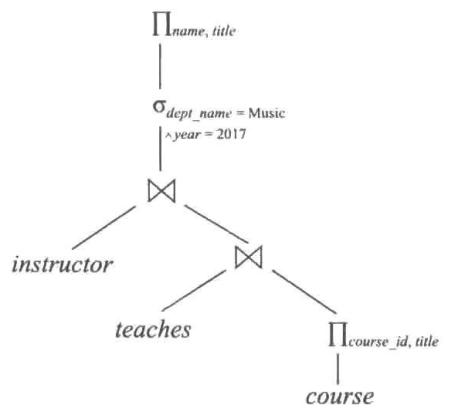


a) 初始表达式树


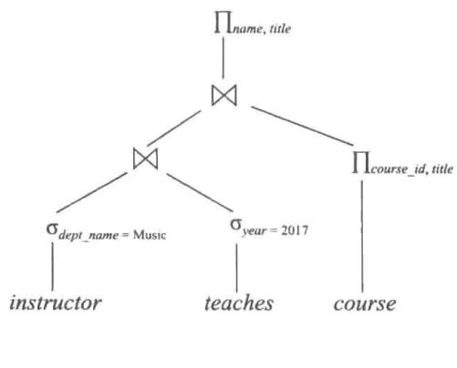


b) 多次转换后的表达式树


753 


图16-4 多次转换


若一组等价规则中的任意一条规则都不能由其他规则的组合推导出来，则称这组等价规则为最小的（minimal）等价规则集。上例表明16.2.1节中的等价规则集不是最小的。与原始表达式等价的表达式可以用不同的方式来产生。当我们使用非最小化等价规则集时，产生表达式的不同方式的数量也会增加。因此，查询优化器使用最小的等价规则集。

现在请考虑我们的示例查询的如下形式：

$$
\Pi_ {n a m e, t i t l e} \left(\left(\sigma_ {d e p t, n a m e = “ M u s i c ”} (i n s t r u c t o r) \bowtie t e a c h e s\right) \bowtie \Pi_ {c o u r s e, i d, t i t l e} (c o u r s e)\right)
$$

当计算如下子表达式时：

$$
(\sigma_ {d e p t \_ n a m e} = \text { ``Music'' } (i n s t r u c t o r) \bowtie t e a c h e s)
$$

我们得到具有如下模式的一个关系：

$$
(I D, \text { name }, \text { dept\_name }, \text { salary }, \text { course\_id }, \text { sec\_id }, \text { semester }, \text { year })
$$

通过基于等价规则8.a及8.b的投影下推，我们可以从该模式中去除几个属性。必须保留的属性只是那些要么出现在查询结果中要么需要在后续运算中处理的属性。通过去除不必要的属性，减少了中间结果的列数，从而减小了中间结果的规模。在我们的示例中，我们所需要的instructor与teaches的连接的属性只有name和course_id，因此可将表达式修改为：

$$
\begin{array}{c} \Pi_ {n a m e, t i t l e} \left(\left(\Pi_ {n a m e, c o u r s e \_ i d} \left(\left(\sigma_ {d e p t \_ n a m e = “ M u s i c ”} (i n s t r u c t o r)\right) \bowtie t e a c h e s\right)\right) \right. \\ \left. \bowtie \Pi_ {c o u r s e \_ i d, t i t l e} (c o u r s e)\right) \end{array}
$$

投影 $\Pi_{name,course\_id}$ 减小了中间连接结果的规模。

## 16.2.3 连接次序

一种好的连接运算次序对于减小临时结果的规模很重要。因此，大多数查询优化器在连接次序上花费了很多工夫。正如等价规则6.a中提到的，自然连接运算满足结合律。所以，对于任意关系 $r_{1}$ 、 $r_{2}$ 和 $r_{3}$ ：

$$
(r _ {1} \bowtie r _ {2}) \bowtie r _ {3} \equiv r _ {1} \bowtie (r _ {2} \bowtie r _ {3})
$$

虽然这两个表达式是等价的，但计算它们的代价可能不同。请再次考虑表达式：

$$
\Pi_ {n a m e, t i t l e} \left(\left(\sigma_ {d e p t \_ n a m e = “ M u s i c ”} (i n s t r u c t o r)\right) \bowtie t e a c h e s \bowtie \Pi_ {c o u r s e \_ i d, t i t l e} (c o u r s e)\right)
$$

754 

我们可以选择先计算 teaches $\bowtie$ $\Pi_{course\_id,title}(course)$ ，然后再将结果与

$$
\sigma_ {d e p t \_ n a m e} = \text { ``Music'' } (i n s t r u c t o r)
$$

进行连接。

但是，teaches $\bowtie$ $\Pi_{course\_id, title}(course)$ 可能是一个大型关系，因为对于每门课程该关系都包含一个元组。相反，

$$
\sigma_ {d e p t \_ n a m e} = \text {"Music"} (i n s t r u c t o r) \bowtie t e a c h e s
$$

可能是一个小型关系。为了说明这一点，我们注意到：一所大学拥有的教师数量比课程数量少，并且由于一所大学拥有很多系，因此很可能只有一小部分大学教师和音乐系相关联。这样，在前述表达式得到的结果中，对于音乐系教师所讲授的每门课程有一个元组。因此，我们需要保存的临时关系将比先计算 teaches $\bowtie$ $\Pi_{course\_id, title}(course)$ 而要保存的临时关系要小。

为了执行我们的查询还需要考虑其他因素。我们并不关心属性在连接中出现的次序，因为在显示结果之前改变这种次序很容易。因此，对于任何关系 $r_1$ 、 $r_2$ ：

$$
r _ {1} \bowtie r _ {2} \equiv r _ {2} \bowtie r _ {1}
$$

也就是说，自然连接满足交换律（等价规则5）。

利用自然连接的交换律与结合律（等价规则 5 与等价规则 6），请考虑如下关系代数表达式：

$$
(i n s t r u c t o r \bowtie \Pi_ {c o u r s e \_ i d, t i t l e} (c o u r s e)) \bowtie t e a c h e s
$$

请注意，在 $\Pi_{course\_id, title}(course)$ 与 instructor 之间没有公共属性，所以此连接就是笛卡儿积。若在 instructor 中有 $a$ 个元组，并且在 $\Pi_{course\_id, title}(course)$ 中有 $b$ 个元组，这个笛卡儿积将产生 $a*b$ 个元组，对于每个可能的教师元组和课程元组对都有一个元组（无须考虑该教师是否讲授该课程）。这个笛卡儿积会产生一个非常庞大的临时关系。然而，如果用户输入的是上述表达式，我们可以用自然连接的结合律与交换律把这个表达式转换成更高效的表达式：

$$
(i n s t r u c t o r \bowtie t e a c h e s) \bowtie \Pi_ {c o u r s e \_ i d, t i t l e} (c o u r s e)
$$

## 16.2.4 等价表达式的枚举

查询优化器可以使用等价规则来系统地产生与给定的查询表达式等价的表达式。表达式的代价是根据 16.3 节中讨论的统计信息来计算的。16.4 节中描述的基于代价的查询优化器可以计算每种备选方案的代价，并挑选出代价最低的备选方案。

从概念上讲，对等价表达式的枚举可以通过图 16-5 中概述的方式来实现。其处理过程如下：给定一个查询表达式 E，其等价表达式集合 EQ 最初只包含 E。现在，将 EQ 中的每个表达式与每条等价规则匹配。如果任何表达式 $E_{i} \in EQ$ 的一个子表达式 $e_{j}$ （作为一种特例， $e_{j}$ 可以是 $E_{i}$ 本身）与一条等价规则的一边相匹配，那么优化器就产生 $E_{i}$ 的一个拷贝 $E_{k}$ ，其中 $e_{j}$ 被替换成与该规则的另一边相匹配，并将 $E_{k}$ 加入 $EQ$ 中。该过程不断进行，直到不再有新表达式产生为止。通过适当选择一组等价规则，等价表达式的集合是有限的，并且可以保证该过程能够终止。

procedure genAllEquivalent (E)
EQ = {E}
repeat
    将 EQ 中的每个表达式 $E_{i}$ 与每条等价规则 $R_{j}$ 进行匹配
    if $E_{i}$ 的任何子表达式 $e_{i}$ 与 $R_{j}$ 的一边相匹配
    创建一个与 $E_{i}$ 等价的新表达式 $E'$ ，其中 $e_{i}$ 被替换成与 $R_{j}$ 的另一边相匹配
    如果 $E'$ 尚未在 EQ 中，则将其添加到 EQ 中
until 不再有新的表达式可以被添加到 EQ 中


图 16-5 产生所有等价表达式的过程


例如，给定一个表达式 $r \bowtie (s \bowtie t)$ ，交换律可以与子表达式 $(s \bowtie t)$ 相匹配，并将创建一个新的表达式 $r \bowtie (t \bowtie s)$ 。交换律也与 $r \bowtie (s \bowtie t)$ 的根处的连接相匹配，并创建一个新的表达式 $(s \bowtie t) \bowtie r$ 。结合律和交换律可以继续应用于所生成的新的表达式。但是应用任何等价规则最终都只会生成先前已经生成的表达式，因此该过程将终止。

上述过程无论在空间上还是在时间上代价都极其昂贵。但是采用如下两种关键思想，优化器可以很大程度地减少空间和时间上的开销。

1. 如果在子表达式 $e_i$ 上使用等价规则把表达式 $E_1$ 转换成表达式 $E'$ ，那么除了 $e_i$ 及其转换之外， $E'$ 与 $E_1$ 有相同的子表达式。即使是 $e_i$ 及其转换形式通常也共享许多相同的子表达式。表达式表示技术允许两个表达式指向共享的子表达式，这样可以显著减少对空间的需求。

2. 不必总是用等价规则产生所有可以产生的表达式。正如我们将在 16.4 节中看到的那样，如果优化器考虑执行的代价估计，那么它可以避免检查某些表达式。通过使用诸如此类的技术，可以减少优化所需的时间。

通过利用这些技术和其他技术来减少优化时间，等价规则可以用来枚举可替代计划，这些计划的代价可以计算出来；然后从这些备选计划中选出代价最低的计划。在16.4.2节中，我们将讨论基于等价规则和代价的查询优化的高效实现。

一些查询优化器以启发式的方式来使用等价规则。通过这种方法，如果一条等价规则的左侧与查询计划中的一棵子树相匹配，则该子树被重写为与该规则的右侧相匹配。重复这个过程直到查询计划不能再被进一步重写为止。必须谨慎挑选规则，使得在应用一条规则时代价能降低，并且重写必须是最终能终止的。虽然这种方法可以用执行得相当快的方式来实现，但不能保证它会找到最优的计划。

还有一种查询优化器侧重于连接次序的选择，它通常是查询代价的一个关键因素。我们将在16.4.1节中讨论连接次序的优化算法。

## 16.3 表达式结果的统计信息估计

一种运算的代价依赖于它的输入的规模和其他统计信息。给定一个表达式，比如 $r \bowtie (s \bowtie t)$ ，为了估计 r 与 $(s \bowtie t)$ 连接的代价，我们需要有一些统计信息的估计值，比如 $s \bowtie t$ 的规模。

在这一节中，我们首先列出存储在数据库系统目录中的关于数据库关系的一些统计信息，然后展示如何使用这些存储的统计信息去估计各种关系运算结果的统计信息。

给定一个查询表达式，我们把它看作一棵树；可以从底层运算开始估计它们的统计信息，并继续对高层运算进行处理，直到到达树的根为止。计算出的规模估计被作为这些统计数据的一部分，并可以用来计算树中单个运算的算法的代价，可以将这些代价加到一起来找到整个查询计划的代价，正如我们在第15章中看到过的。

在这一节的后面有件事情将会变得清晰：这样的估计并不十分精确，因为估计基于一种可能并不严谨的假设。因此，一个具有最小执行代价估计的查询执行计划可能事实上并不具有最小的实际执行代价。然而，实践经验告诉我们：即使估计并不精确，具有最小代价估计的计划通常具有与实际最小执行代价相等或接近的代价。

757 

## 16.3.1 目录信息

数据库系统目录存储了有关数据库关系的下列统计信息：

- $n_r$ ，关系 $r$ 中的元组数。

- $b_{r}$ , 包含关系 $r$ 中元组的块数。

- $l_{r}$ , 关系 $r$ 中一个元组的字节数。

- $f_{r}$ , 关系 $r$ 的块因子——一个块中能容纳的关系 $r$ 的元组数。

- $V(A, r)$ , 关系 $r$ 中出现的对于属性 $A$ 的非重复值的数量。该值与 $\Pi_A(r)$ 的规模相同。如果 $A$ 是关系 $r$ 的码，则 $V(A, r)$ 等于 $n_r$ 。

如果需要，最后一个统计值 $V(A, r)$ 也可以针对属性集合进行维护，而不仅仅针对单个属性。因此，对于一个给定的属性集 A， $V(A, r)$ 就是 $\Pi_{A}(r)$ 的规模。

如果我们假设关系 $r$ 的元组在物理上被共同存储在一个文件中，则下面的等式成立：

$$
b _ {r} = \left\lceil \frac {n _ {r}}{f _ {r}} \right\rceil
$$

关于索引的统计信息（比如 $B^{+}$ 树索引的高度和索引中叶节点的页数）也在目录中维护。

如果我们希望维护准确的统计信息，那么在每次修改关系时，都必须同时更新这些统计信息。这种更新导致了大量的开销。因此，许多系统并不在每次修改时都更新统计信息，而是当系统处于轻负载时才进行更新。其结果是，用于选择一种查询处理策略的统计信息可能并不完全精确。然而，如果在统计信息更新的间隔内并没有发生太多的更新，那么统计信息

将足够精确，以对不同计划的相对代价进行良好评估。

这里提到的统计信息是简化过的。现实的优化器经常维护更深入的统计信息，以提高执行计划的代价评估的精确度。例如，大多数数据库将每个属性的取值分布存储成一张直方图（histogram）：在直方图中，属性的取值被拆分成若干个区间，并且对于每个区间，直方图将属性值落在每个区间中的元组个数与该区间相关联。图16-6展示了一个对于整数型属性取值在1到25之间的直

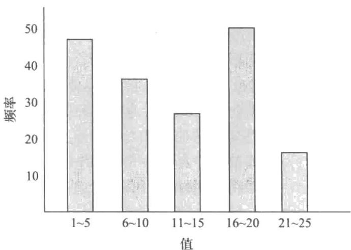


图16-6 直方图示例


方图示例。

作为直方图的一个示例，person 关系的 age 属性的取值范围可分成 0～9, 10～19, …, 90～99（假设最大年龄是 99 岁）。对于每个区间，我们存储一个计数，用于统计那些 age 值落在该区间的 person 元组的个数。

图 16-6 所示的直方图是等宽直方图（equi-width histogram），因为它将值的范围划分为规模相等的区间。相反，等深直方图（equi-depth histogram）调整了区间的边界，使得每个区间具有相同数量的值。因此，等深直方图仅存储区间划分的边界，而不需要存储值的数量。例如，以下是对于图 16-6 中的等宽直方图的数据的等深直方图：

## (4, 8, 14, 19)

该直方图显示有 1/5 的元组年龄 <4 岁，另外 1/5 的元组年龄 $\geqslant$ 4 岁但 <8 岁，依此类推，最后 1/5 的元组年龄 $\geqslant$ 19 岁。有关元组总数的信息也存储在等宽直方图中。等深直方图要优于等宽直方图，因为它们提供更好的估计信息，并占用更少的空间。

数据库系统中使用的直方图还可以记录每个区间中不同值的数量，以及该区间中具有某些属性值的元组数量。在我们的示例中，直方图可以存储位于每个区间中的不同年龄值的数量。如果没有这样的直方图信息，优化器就必须假定值的分布是均匀的；也就是说，每个区间具有相同数量的不同值。

在许多数据库应用中，与其他值相比，某些值出现得非常频繁。为了更好地评估指定了这些值的查询，许多数据库对于某个 n 值（比如 5 或 10）存储了 n 个最频繁值的列表，以及每个值出现的次数。在我们的示例中，如果 4、7、18、19 和 23 是五个最常出现的值，那么数据库就可以存储每个这样的年龄的人数。然后直方图只存储这五个年龄值以外的相关统计数据，因为我们已经对这些值有了确切的计数。

直方图只占用很少的空间，因此几个不同属性上的直方图可以存储在系统目录中。

## 16.3.2 选择规模估计

对一个选择运算的结果规模的估计依赖于选择谓词。我们首先考虑单个的相等谓词，然后考虑单个的比较谓词，最后考虑谓词的组合。

- $\sigma_{A = a}(r)$ ：如果 $a$ 是一个出现次数有可用统计值的频繁出现的值，则可以直接使用该值作为选择的规模估计。

否则，如果没有可用的直方图，我们假设取值是均匀分布的（即每个值以同样的概率出现），并假设 $r$ 的一些记录在属性 $A$ 上的取值为 $a$ ，则选择结果估计有 $n_r / V(A, r)$ 个元组。关于选择中的值 $a$ 出现在一些记录中的假设通常是成立的，而且代价估计总是默认这一假设。然而，假设每个值以同样的概率出现通常是不现实的，takes关系中的course_id属性就是此假设不成立的一个示例。我们有理由预期一门受欢迎的本科生课程比小专业的研究生课程有更多的学生。因此，某些course_id值出现的可能性要比其他值大。尽管事实上均匀分布假设通常不成立，但在许多情况下它是对现实的一种合理的近似，并且它能使我们的阐述相对简单。

如果在属性 A 上有一个直方图可用，则可以定位出包含值 a 的区间，然后用该区间的频率计数代替 $n_{r}$ 并用该区间中出现的不同值的数量代替 $V(A, r)$ 来修改上面提到的估算公式 $n_{r} / V(A, r)$ 。

- $\sigma_{A \leqslant v}(r)$ : 请考虑形如 $\sigma_{A \leqslant v}(r)$ 的选择。假设属性的最小值和最大值（ $\min(A, r)$ 和 $\max(A, r)$ ）

都存储在目录中。假设值是均匀分布的，我们可以对满足条件 $A \leqslant v$ 的记录数进行如下估计：

○ 若 $v < \min(A, r)$ ，则为 0；

○ 若 $v \geqslant \max(A, r)$ ，则为 $n_{r}$ ;

○ 否则，为 $n_{r} \cdot \frac{v - \min(A, r)}{\max(A, r) - \min(A, r)}$ 。

如果在属性 A 上有一个直方图可用，就可以得到更精确的估计，我们将细节留给读者作为练习。

在某些情况下，比如查询是存储过程的一部分，在对查询进行优化时无法得到v的值。在这种情况下，我们假设大约有一半的记录将满足比较条件。也就是说，我们假设结果具有 $n_{r}/2$ 个元组；这个估计可能非常不精确，但这是在没有任何进一步信息的情况下所能采取的最好办法了。

## 注释 16-2 计算与维护统计信息

从概念上讲，关系上的统计信息可以被理解为物化视图，当关系被修改时统计信息应该被自动维护。遗憾的是，如果对于数据库的每一次插入、删除和更新都保持最新的统计信息，开销是非常昂贵的。另一方面，优化器一般并不需要准确的统计信息：百分之几的误差可能导致选出一个不是完全最优的计划，但是这个被选出的备选计划的代价可能比最优计划的代价仅高出不到百分之几。因此，近似的统计信息是可以接受的。

利用统计信息可以近似这一事实，数据库系统减少了生成和维护统计信息的代价，如下所示：

- 统计信息通常是从基础数据的样本计算出的，而不用检查整个数据集合。例如，一个相当准确的直方图可以通过数千个元组的样本计算出来，尽管一个关系包含百万或亿万条记录。然而，所使用的样本必须是随机样本（random sample）。不是随机抽样的样本可能过度表现关系的一部分，并给出误导的结果。例如，如果我们采用教师的样本来计算工资的直方图，如果样本过于表现低工资的教师，则直方图就会导致错误的估计。目前的数据库系统经常使用随机抽样来生成统计信息。关于抽样的文献请参见在线的参考文献。

- 不是对于每次数据库更新都维护统计信息。事实上，一些数据库系统从不自动更新统计信息。它们依靠数据库管理员定期运行一条命令来更新统计信息。Oracle 和 PostgreSQL 提供了一条称作 analyze 的 SQL 命令来产生指定关系或所有关系上的统计信息。IBM DB2 提供了一条称作 runstats 的等价命令。相关细节请查阅系统手册。你应该意识到：由于不正确的统计信息，优化器有时会选出非常糟糕的计划。许多数据库系统（比如 IBM DB2、Oracle 和 SQL Server）会在特定的时间点自动更新统计信息。例如，系统可以近似跟踪一个关系中有多少个元组，并且当元组数量显著变化时重新计算统计信息。另一种方法是将关系扫描所估计的基数和执行查询时的实际基数进行比较，并且如果它们差异显著，则对该关系启动统计信息的更新。

- 复杂选择：

- 合取（conjunction）：合取选择是形如

$$
\sigma_ {\theta_ {1} \wedge \theta_ {2} \wedge \dots \wedge \theta_ {n}} (r)
$$

的选择运算。我们可以这样来估计这种选择的结果规模：对于每个 $\theta_{i}$ ，我们按照之前描述的那样估计选择运算 $\sigma_{\theta_i}(r)$ 的规模，记为 $s_i$ 。这样，关系中一个元组满足选择条件 $\theta_{i}$ 的概率就是 $s_i / n_r$ 。

上述概率称为选择运算 $\sigma_{\theta_{i}}(r)$ 的中选率（selectivity）。假设各条件是相互独立的，则一个元组满足全部条件的概率就是所有这些概率的简单乘积。因此，我们可以将满足全部选择条件的元组数量估计为：

$$
n _ {r} * \frac {S _ {1} * S _ {2} * \cdots * S _ {n}}{n _ {r} ^ {n}}
$$

- 析取（disjunction）：析取选择是形如

$$
\sigma_ {\theta_ {1} \vee \theta_ {2} \vee \dots \vee \theta_ {n}} (r)
$$

的选择运算。满足单个简单条件 $\theta_{i}$ 的所有记录的并集满足析取条件。

如前所述，令 $s_i / n_r$ 代表一个元组满足条件 $\theta_{i}$ 的概率。那么该元组满足整个析取式的概率为1减去该元组不满足任何一个条件的概率：

$$
1 - \left(1 - \frac {s _ {1}}{n _ {r}}\right) * \left(1 - \frac {s _ {2}}{n _ {r}}\right) * \dots * \left(1 - \frac {s _ {n}}{n _ {r}}\right)
$$

我们将该值乘以 $n_{r}$ 就得到满足该选择条件的元组数的估计。

- 否定（negation）：在没有空值的情况下，选择运算 $\sigma_{-\theta}(r)$ 的结果就简单地由不在 $\sigma_{\theta}(r)$ 中的 $r$ 的元组组成。我们已知如何估计 $\sigma_{\theta}(r)$ 中的元组数，因此 $\sigma_{-\theta}(r)$ 中的元组数被估计为 $n_r$ 减去 $\sigma_{\theta}(r)$ 中的估计元组数。

我们可以通过估计对条件 $\theta$ 的求值结果为未知的元组数量然后从上面忽略空值的估算中减去该数量的方式来考虑空值。对该数量的估计需要在目录中维护额外的统计信息。

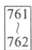


## 16.3.3 连接规模估计

在本小节中，我们考虑如何估计连接结果的规模。

笛卡儿积 $r \times s$ 包含 $n_r * n_s$ 个元组。 $r \times s$ 中的每个元组占用 $l_r + l_s$ 个字节，据此我们可以计算出笛卡儿积的规模。

估计自然连接的规模在某种程度上要比估计选择或笛卡儿积的规模更复杂一些。令 $r(R)$ 和 $s(S)$ 为两个关系。

- 若 $R \cap S = \emptyset$ ——两个关系没有共同的属性——则 $r \bowtie s$ 与 $r \times s$ 的结果是一样的，并且我们可以使用估算笛卡儿积的技术。

- 若 $R \cap S$ 是 $R$ 的码，则我们可知 $s$ 的一个元组至多与 $r$ 的一个元组相连接。因此， $r \bowtie s$ 中的元组数不会超过 $s$ 中的元组数。 $R \cap S$ 是 $S$ 的码的情况同刚刚描述的情况相对称。若 $R \cap S$ 构成了 $S$ 中引用 $R$ 的外码，则 $r \bowtie s$ 中的元组数正好与 $s$ 中的元组数相等。

- 最困难的情况是当 $R \cap S$ 既不是 $R$ 的码也不是 $S$ 的码的时候。在这种情况下，与进行选择运算的情况一样，我们假定每个值是等概率出现的。考虑 $r$ 的元组 $t$ ，并假定 $R\cap S = \{A\}$ 。我们估计元组 $t$ 在 $r\times s$ 中产生

$$
\frac {n _ {s}}{V (A , s)}
$$

个元组，因为该值就是 s 中对于属性 A 取给定值的平均元组数。请考虑 r 中的所有元组，我们估计在 $r \bowtie s$ 中有

$$
\frac {n _ {r} * n _ {s}}{V (A , s)}
$$

个元组。请注意，如果在前述估算中将 $r$ 与 $s$ 的角色颠倒，那么我们估计在 $r \bowtie s$ 中有

$$
\frac {n _ {r} * n _ {s}}{V (A , r)}
$$

个元组。在 $V(A,s) \neq V(A,r)$ 时，这两种估计是不同的。若发生这种情况，就可能有未参与到连接中的悬摆元组存在。因此这两个估计值中的较小者可能更加准确。

如果对于 r 中属性 A 的 $V(A,r)$ 值与对于 s 中属性 A 的 $V(A,s)$ 值相等的情况较少，则前述连接规模的估计可能太高。然而，在真实世界中这种情形很少发生，因为在大部分现实关系中，悬摆元组要么并不存在，要么只占元组总数的一小部分。

更重要的是，前面的估计取决于这样的假设：每个值是等概率出现的。若这个假设不成立，则必须采用更复杂的技术来估算结果的规模。例如，如果我们在两个关系的连接属性上都有直方图，并且两个直方图都有相同的区间，那么我们就可以在每个区间内使用上述估计技术，用值落入该区间的行数来代替 $n_r$ 或 $n_s$ ，并用该区间中不同取值的个数来代替 $V(A, r)$ 或 $V(A, s)$ 。然后我们把得到的每个区间的规模估计值加到一起就得到总的规模估计值。我们把两个关系在连接属性上都有直方图但直方图的区间不一样的情况留给读者作为练习。

对于 $\theta$ 连接 $r \bowtie_{\theta} s$ ，我们可以通过把它重写成 $\sigma_{\theta}(r \times s)$ 的形式，并利用笛卡儿积的规模估计和 16.3.2 节中的选择规模估计，来估计它的规模。

为了说明对连接规模的所有这些估计方式，请考虑表达式：

$$
s t u d e n t \bowtie t a k e s
$$

假设有关这两个关系的目录信息如下：

- $n_{student} = 5000$ ; 

- $n_{takes} = 10000$ ; 

- $V(ID, takes) = 2500$ ，这意味着只有一半的学生选过课（这是不现实的，但是我们用它来表明即使在这种情况下我们的规模估计也是正确的），并且在平均情况下，选课的学生每人选了四门课。

请注意，因为 ID 是 student 的主码，所以 $V(ID, student) = n_{student} = 5000$ 。

takes 中的 ID 属性是 student 上的外码，并且 takes.ID 上没有空值，因为 ID 是 takes 主码的一部分。因此，student ≈ takes 的规模恰好是 $n_{takes}$ ，这个值就是 10 000。

现在，我们在不使用外码信息的情况下计算 student $\triangleright$ takes 的规模估计值。由于 $V(ID, \text{takes}) = 2500$ 并且 $V(ID, \text{student}) = 5000$ ，我们得到的两个估计值是 $5000 * 10000 / 2500 = 20000$ 以及 $5000 * 10000 / 5000 = 10000$ ，并且我们取较小的值。在这种情况下，这些估计值的较小者与我们早先用外码信息计算出的结果是相同的。

## 16.3.4 其他运算的规模估计

接下来我们概述如何估计其他关系代数运算的结果规模。

- 投影（projection）：形如 $\Pi_A(r)$ 的投影的估计规模（记录数或元组数）为 $V(A, r)$ ，因为投影去除了重复元组。

- 聚集（aggregation）： $_{G}\gamma_{A}(r)$ 的规模就是 $V(G, r)$ ，因为对于 G 的每一个不同取值，在 $_{G}\gamma_{A}(r)$ 中都有一个元组与之对应。

- 集合运算（set operation）：如果一个集合运算的两个输入是对同一个关系的选择，我们可以将该集合运算重写成析取、合取或否定。例如， $\sigma_{\theta_1}(r) \cup \sigma_{\theta_2}(r)$ 可以重写成 $\sigma_{\theta_1 \vee \theta_2}(r)$ 。类似地，只要参与集合运算的两个关系是对同一个关系的选择，我们就可以把交集重写成合取，并且可以使用否定来重写集差。这样我们就可以使用 16.3.2 节中对涉及合取、析取和否定的选择的估计方法。

如果输入并不是对相同关系的选择，我们可以按这样的方式进行规模的估计：将 $r \cup s$ 的规模估计为 $r$ 与 $s$ 的规模之和；将 $r \cap s$ 的规模估计为 $r$ 与 $s$ 的规模的最小值；将 $r - s$ 的规模估计为与 $r$ 的规模相同。所有这三种估计可能都不精确，但提供了规模的上界。

- 外连接（outer join）：将 $r \bowtie s$ 的规模估计为 $r \bowtie s$ 的规模加上 $r$ 的规模；对 $r \bowtie s$ 的估计与对 $r \bowtie s$ 的估计是对称的；将 $r \bowtie s$ 的规模估计为 $r \bowtie s$ 的规模加上 $r$ 和 $s$ 的规模。所有这三种估计可能都不精确，但提供了规模的上界。

## 16.3.5 不同取值个数的估计

前面讨论的规模估计取决于诸如直方图之类的统计信息，或者至少依赖于一个属性不同取值的数量。虽然这些统计信息可以预先计算并存储在数据库中的关系中，但是我们需要为中间结果而计算它们。请注意，在中间结果 $E_{i}$ 中对不同属性值的数量的估计和对结果规模数量的估计有助于我们在使用 $E_{i}$ 的下一级中间结果中估计规模和不同属性值的数量。

对于选择来说，选择结果中的一个属性（或属性集） $A$ 的不同取值数量 $V(A, \sigma_{\theta}(r))$ 可以按如下方式进行估计。

- 若选择条件 $\theta$ 强制 $A$ 取一个特定值（例如 $A = 3$ ），则 $V(A, \sigma_{\theta}(r)) = 1$ 。

- 若 $\theta$ 强制 $A$ 取一个指定值的集合中的一个值（例如 $A = 1 \lor A = 3 \lor A = 4$ ），则 $V(A, \sigma_{\theta}(r))$ 为这些指定值的个数。

- 若选择条件 $\theta$ 形如 $A op v$ ，其中 $op$ 为一个比较运算符，则 $V(A, \sigma_{\theta}(r))$ 可估计为 $V(A, r) * s$ ，这里 $s$ 是该选择运算的中选率。

- 对于选择的所有其他情况，我们假设 $A$ 值的分布独立于选择条件所指定的值的分布，那么可以得到 $\min (V(A,r),n_{\sigma_\theta (r)})$ 这样的近似估计值。对于这种情况，可以使用概率理论推导出更精确的估计，但上述近似估计已经相当好了。

对于连接来说，连接结果中的一个属性（或属性集） $A$ 的不同取值个数 $V(A, r \bowtie s)$ 可以按如下方式进行估计。

- 若 $A$ 中的所有属性全来自 $r$ ，则 $V(A, r \bowtie s)$ 可估计为 $\min(V(A, r), n_{r \bowtie s})$ 。并且类似地，若 $A$ 中的所有属性全来自 $s$ ，则 $V(A, r \bowtie s)$ 可估计为 $\min(V(A, s), n_{r \bowtie s})$ 。

- 若 $A$ 包含 $r$ 的属性 $A1$ 和 $s$ 的属性 $A2$ ，则 $V(A, r \bowtie s)$ 可估计为：

$$
\min (V (A 1, r) * V (A 2 - A 1, s), V (A 1 - A 2, r) * V (A 2, s), n _ {r \bowtie s})
$$

请注意有些属性可能既在 $A1$ 中又在 $A2$ 中，并且令 $A1 - A2$ 和 $A2 - A1$ 分别代表只来自 $r$ 的 $A$ 中的属性和只来自 $s$ 的 $A$ 中的属性。同上，通过使用概率理论可以推导出更精确的估计，但上述近似估计已经相当好了。

对于投影来说不同取值的估计是直截了当的：它们在 $\Pi_A(r)$ 中是和在 $r$ 中一样的。这一点对于聚集的分组属性也同样成立。为了简便起见，对于sum、count和average的结果，我们可以假设所有的聚集值各不相同。对于 $\min(A)$ 和 $\max(A)$ ，不同取值的个数可估计为 $\min(V(A, r), V(G, r))$ ，这里的 $G$ 代表分组属性。我们略去对其他运算的不同取值估计的详细介绍。

## 16.4 执行计划的选择

由于表达式中的每种运算都可用不同的算法来实现，所以产生表达式仅仅是查询优化过程的一部分。一个执行计划准确定义了对于每种运算应该使用什么算法以及应该如何协调各运算的执行。

利用通过 16.3 节中的技术估计的统计信息以及对于第 15 章中描述的各种算法和执行方法的代价估计，我们可以对一个给定的执行计划进行代价评估。

基于代价的优化器（cost-based optimizer）搜索与给定查询等价的所有查询执行计划的空间，并选择估计代价最小的那一个。我们已经看到如何使用等价规则来产生等价计划。然而，采用任意等价规则的基于代价的优化是相当复杂的。我们首先在16.4.1节中介绍基于代价的优化的一个较简单的版本，其中仅涉及连接次序和连接算法的选择。然后，在16.4.2节中我们将简要描述如何创建一个基于等价规则的通用的优化器，而不过多深入细节。

对于复杂查询来说，搜索所有可能计划的空间的代价过于昂贵。大多数优化器采用启发式方法来降低查询优化的代价，同时承担找不到最优计划的潜在风险。我们将在16.4.3节中学习一些这样的启发式方法。

766 

## 16.4.1 基于代价的连接次序选择

SQL中最常见的查询类型是由数个关系的连接构成的，并带有连接谓词以及在where子语中指定的选择。在本小节中，我们考虑如何为这类查询选择最优的连接次序的问题。

对于一个复杂的连接查询，等价于该查询的不同查询计划的数量可能很多。作为一个示例，请考虑表达式：

$$
r _ {1} \bowtie r _ {2} \bowtie \dots \bowtie r _ {n}
$$

其中的连接是以没有指定任何次序的方式来表示的。当 n=3 时，存在 12 种不同的连接次序：

$$
\begin{array}{l l l l} r _ {1} \bowtie (r _ {2} \bowtie r _ {3}) & r _ {1} \bowtie (r _ {3} \bowtie r _ {2}) & (r _ {2} \bowtie r _ {3}) \bowtie r _ {1} & (r _ {3} \bowtie r _ {2}) \bowtie r _ {1} \\ r _ {2} \bowtie (r _ {1} \bowtie r _ {3}) & r _ {2} \bowtie (r _ {3} \bowtie r _ {1}) & (r _ {1} \bowtie r _ {3}) \bowtie r _ {2} & (r _ {3} \bowtie r _ {1}) \bowtie r _ {2} \\ r _ {3} \bowtie (r _ {1} \bowtie r _ {2}) & r _ {3} \bowtie (r _ {2} \bowtie r _ {1}) & (r _ {1} \bowtie r _ {2}) \bowtie r _ {3} & (r _ {2} \bowtie r _ {1}) \bowtie r _ {3} \end{array}
$$

一般而言，对于 $n$ 个关系来说，存在 $(2(n - 1))! / (n - 1)!$ 种不同的连接次序。（我们将此表达式的计算留到实践习题16.12中完成）。对于涉及少量关系的连接而言，此数量还是可以接受的。例如对于 $n = 5$ ，此数量是1680。然而，随着 $n$ 的增加，这个数量迅速增长。对于 $n = 7$ ，此数量是665280；对于 $n = 10$ ，此数量大于176亿！

幸运的是，不必产生与给定表达式等价的所有表达式。例如，假设我们希望找到以下表

达式的最佳连接次序：

$$
\left(r _ {1} \bowtie r _ {2} \bowtie r _ {3}\right) \bowtie r _ {4} \bowtie r _ {5}
$$

该表达式表示： $r_{1}$ 、 $r_{2}$ 和 $r_{3}$ 首先进行连接（以某种次序），其结果再与 $r_{4}$ 和 $r_{5}$ 进行连接（以某种次序）。计算 $r_{1} \bowtie r_{2} \bowtie r_{3}$ 有 12 种不同的连接次序，而计算其结果再与 $r_{4}$ 和 $r_{5}$ 的连接又有 12 种次序。因此，看起来需要检查 144 种连接次序。然而，一旦我们为关系子集 $\{r_{1}, r_{2}, r_{3}\}$ 找到了最佳的连接次序，就可以用这种次序来进一步与 $r_{4}$ 和 $r_{5}$ 进行连接，并且可以忽略 $r_{1} \bowtie r_{2} \bowtie r_{3}$ 的代价更大的所有连接次序。这样，我们就不必检查 144 种连接次序，而只需检查 12+12 种次序。

利用这种思想，我们可以开发一个动态规划（dynamic-programming）算法来寻找最佳连接次序。动态规划算法存储计算结果并将其重用，这个过程能大大减少执行时间。

我们现在考虑如何找到对于 n 个关系的集合 $S=\{r_{1}, r_{2}, \cdots, r_{n}\}$ 的最佳连接次序，其中每个关系都可能有选择条件，并且提供了关系 $r_{i}$ 之间的一组连接条件。我们假设关系都有唯一的名称。

图16-7给出了实现动态规划算法的一个递归过程，并且作为FindBestPlan(S)来调用，其中 $S$ 是上面的关系集合。该过程在可能的最早时刻就在单个关系上使用选择，也就是当关系被访问时。理解该过程最容易的方式是假设所有连接都是自然连接，尽管对于任何连接条件该过程无须改变就能工作。对于任意的连接条件，两个子表达式的连接可以被理解为包含与两个子表达式的属性相关的所有连接条件。

procedure FindBestPlan(S)
    if (bestplan[S].cost ≠ ∞) /* bestplan[S] 已经计算好了 */
    return bestplan[S]
    if (S 只包含一个关系)
    使用 S 上的选择条件（如果有），根据访问 S 的最佳方式设置 bestplan[S].plan 和 bestplan[S].cost
    else for each S 的非空子集 S1，且 S1 ≠ S
    P1 = FindBestPlan(S1)
    P2 = FindBestPlan(S - S1)
    for each 连接 P1 和 P2 的结果的算法 A
    // 对于索引嵌套 - 循环连接，外层关系可以是 P1 或 P2
    // 类似地，对于散列 - 连接，构造关系可以是 P1 或 P2
    // 假设备选方案被视为单独的算法
    // 假设 A 的成本并不包括读取输入的成本
    if 算法 A 是索引嵌套 - 循环
    令 $P_o$ 和 $P_i$ 表示 A 的外层和内层输入
    if $P_i$ 有单个关系 $r_i$ ，并且 $r_i$ 在连接属性上有一个索引
    plan = “执行 $P_o$ .plan；使用 A 对 $P_o$ 和 $r_i$ 进行连接的结果”，将 $P_i$ 上的任何选择条件作为连接条件的一部分执行
    cost = $P_o$ .cost + A 的代价
    else /* 不能使用索引嵌套 - 循环连接 */
    cost = ∞
    else
    plan = “执行 P1.plan，P2.plan；使用 A 对 P1 和 P2 进行连接的结果”
    cost = P1.cost + P2.cost + A 的代价
    if cost < bestplan[S].cost
    bestplan[S].cost = cost
    bestplan[S].plan = plan
return bestplan[S]


图 16-7 用于连接次序优化的动态规划算法


此过程将它计算出的执行计划存储在一个以关系集为索引的关联数组 bestplan 中。该关联数组的每个元素包含两部分：S 的最佳计划的代价和该计划本身。如果尚未计算过 bestplan[S]，则假设 bestplan[S].cost 的值被初始化为 $\infty$ 。

该过程首先检查是否已经算出对于给定关系集 S 计算连接的最佳执行计划（并将其存储在关联数组 bestplan 中）；若是，则它返回已经计算出的计划。

如果 S 只包括一个关系，则访问 S（将 S 上的选择也考虑在内，如果有的话）的最佳方式被记录在 bestplan 中。这个过程可能涉及用一个索引来标识元组，然后取出元组（通常称为索引扫描（index scan）），或者扫描整个关系表（通常称为关系扫描（relation scan））。如果除了通过索引扫描保证的那些选择条件之外，S 上还存在其他选择条件，则往计划中添加一个选择运算以确保 S 上的所有选择都被满足。

否则，如果 S 包括不止一个关系，该过程会尝试将 S 划分成两个不相交子集的每一种方式。对于每一种划分，该过程对每个子集递归地找出最佳计划，然后考虑所有可能的算法来连接这两个子集的结果。请注意，由于索引嵌套－循环连接可能要么使用输入 P1 要么使用 P2 来作为内层输入，因此我们将这两种备选方案视为两种不同的算法。构建与探查输入的选择也使我们将散列－连接的两种选择视作两种不同的算法。

考虑每种备选方案的代价，并选择代价最低的方案。所考虑的连接代价不应包括读取输入的代价，因为我们假设输入是从前面的算子流水线过来的，该算子可以是关系/索引扫描，或者是前面的连接。请回想诸如散列-连接那样的一些算子，它们可以看作具有子算子，这些子算子之间具有阻塞（物化）的边，但是连接的输入和输出边是流水线化的。我们在第15章中看到的连接代价公式可以先进行适当的修改以忽略读取输入关系的代价，然后再来使用。请注意，索引嵌套-循环连接的处理方式与其他连接技术不同：在这种情况下，计划和代价都是不同的，因为我们并不对内层输入执行关系/索引扫描，并且索引查找代价已包含在索引嵌套-循环连接的代价中。

该过程从将 S 划分成两个集合的所有可选方案中选出代价最低的计划以及用于连接这两个集合的结果的算法，代价最低的计划及其代价被存放在数组 bestplan 中并由该过程返回。该过程的时间复杂度可被证明为 $O(3^{n})$ （请参见实践习题 16.13）。

由关系集的连接而生成的元组的次序对于找到总体上最佳的连接次序也很重要，因为它可以影响进一步连接的代价。例如，如果使用归并－连接，则需要对输入执行潜在的代价高昂的排序运算，除非该输入已在连接属性上排过序。

若一种特定的元组排序次序对于后面的运算可能有用，我们称其为有趣的排序次序（interesting sort order）。例如， $r_{1} \bowtie r_{2} \bowtie r_{3}$ 所产生的结果在 $r_{4}$ 或 $r_{5}$ 的公共属性上进行排序可能有用，但若产生的结果仅仅在 $r_{1}$ 与 $r_{2}$ 的公共属性上进行排序就没有什么用处。在计算 $r_{1} \bowtie r_{2} \bowtie r_{3}$ 时，使用归并－连接可能比使用其他一些连接技术的代价要高，但它可以提供以有趣的排序次序排好序的输出。

因此，仅为有 n 个给定关系的集合的每个子集找出最佳连接次序是不够的。相反，我们必须为每个子集、为该子集连接结果的每种有趣的排序次序找出最佳连接次序。bestplan 数组现在可以由 $[S, o]$ 来索引，其中 S 是一组关系，o 是一种有趣的排序次序。然后可以修改 FindBestPlan 函数以考虑有趣的排序次序；我们将细节留给读者作为练习（参见实践习题 16.11）。

n 个关系的子集总数是 $2^{n}$ ，但有趣的排序次序的数量一般不多。因此，约有 $2^{n}$ 个连接表达式需要存储。用于寻找最佳连接次序的动态规划算法可以加以扩展来处理排序次序。具体来说，在考虑排序－归并连接时，如果一个输入（可能是一个关系，或者是一个连接运算的结果）未在连接属性上排序，则必须添加排序代价，但如果已排过序则不必添加排序代价。

扩展算法的代价取决于关系的每个子集的有趣排序次序的数量；由于在实践中已发现这个数量很少，因此代价仍保持在 $O(3^{n})$ 。当 n=10 时，该数量约为 59 000，相比于 176 亿种不同的连接次序来说好多了。更重要的是，所需的存储比原先少得多，因为对于 $r_{1}, \cdots, r_{10}$ 的 1024 个子集的每种有趣排序次序，我们只需保存一种连接次序。虽然这两个数据仍随 n 迅速增长，但是通常发生的连接一般不到 10 个关系参与，因而可以很容易地处理。

图 16-7 所示的代码实际上对将 S 划分为两个不相交子集的每种可能的方式考虑了两次，因为这两个子集中的每一个都可以扮演 S1 的角色。两次考虑划分并不影响正确性，但浪费时间。这部分代码可以按如下方式进行优化：找到 S1 中按字母次序最小的关系 $r_{i}$ ，以及 S-S1 中按字母次序最小的关系 $r_{j}$ ，并且仅当 $r_{i}<r_{j}$ 时执行循环。这样做可以确保每个划分只考虑一次。

此外，该代码还考虑了所有可能的连接次序，包括包含笛卡儿积的那些；例如，如果两个关系 $r_1$ 和 $r_3$ 并不具有连接这两个关系的任何连接条件，该代码仍会考虑 $S = \{r_1, r_3\}$ 的情况，这会产生笛卡儿积。考虑到连接条件是有可能的，并且可以修改代码只生成不会导致笛卡儿积的划分。这种优化可以为许多查询节省大量的时间。更多关于非笛卡儿积连接次序枚举的详细信息，请参阅本章末尾的延伸阅读部分。

## 16.4.2 采用等价规则的基于代价的优化

我们刚才看到的连接次序优化技术可以处理最常见的查询类型，这些查询执行一组关系的内连接。然而，许多查询使用其他的功能，例如聚集、外连接以及嵌套查询，这些是无法通过连接次序的选择来解决的，但可以通过使用等价规则来处理。

在本小节中，我们概述如何创建一个通用的、采用等价规则的、基于代价的优化器。正如我们之前所见，等价规则有助于探索具有多种多样运算的可替代方案，比如外连接、聚合和集合运算。如果需要进一步的运算，则可以添加等价规则，例如按序返回 top-K 结果的算子。

在 16.2.4 节中，我们看到了一个优化器如何系统地产生与给定查询等价的所有表达式。产生等价表达式的过程可以按如下方式修改为产生所有可能的执行计划：添加一类新的被称为物理等价规则（physical equivalence rule）的等价规则，它允许将诸如连接那样的逻辑运算转换成诸如散列－连接或嵌套－循环连接这样的物理运算。通过将这类规则添加到原来的等价规则中，该过程可以产生所有可能的执行计划。然后可以使用前述的代价估计技术来选出最优的（即代价最低的）计划。

然而，即使我们并不考虑执行计划的产生，16.2.4节中介绍的过程的代价也非常昂贵。为了使该方法高效地工作，需要以下技术：

1. 一种节省空间的表达式表示形式，以避免在应用等价规则时产生相同子表达式的多个副本。

2. 用于检测相同表达式重复推导的有效技术。

3. 一种基于识记（memorization）的动态规划形式。当一个子表达式第一次被优化时，识记存储其最优的查询执行计划；通过返回已经被识记的计划来处理优化相同子表达式的后续请求。

4. 通过维护到任何时刻为止对任意子表达式产生的代价最低的计划，并且对比到目前为止为该子表达式已找到的代价最低计划的代价更高的任何计划进行剪枝，以避免产生所有可能的执行计划，这样的一种技术。

具体细节要更为复杂。此方法由Volcano研究项目率先提出，并且SQLServer的查询优化器也是基于此技术的。包含更多信息的资料请参见参考文献。

## 16.4.3 优化中的启发式方法

基于代价优化的一个缺点是优化本身的代价。虽然查询优化的代价可以通过巧妙的算法来降低，但一个查询的不同执行计划的数量可能非常大，并且从这个集合里找到最优计划仍需要很多计算代价。因此，查询优化器使用启发式方法（heuristic）来减少优化的代价。

下述规则是启发式规则的一个示例，此规则用于对关系代数查询进行转换：

- 尽早执行选择。

一个启发式优化器会直接使用这条规则，而不验证通过这种转换代价是否降低。在 16.2 节的第一个转换示例中，选择运算被下推到连接中。

我们说前述规则是启发式的，因为这条规则通常会但并非总是有助于降低代价。使用该规则会导致代价增加的一个示例是：考虑一个表达式 $\sigma_{\theta}(r \bowtie s)$ ，其中条件 $\theta$ 只涉及 s 中的属性。选择当然可以先于连接执行。然而，若 r 相比于 s 来说相当小，并且如果在 s 的连接属性上存在索引，但在 $\theta$ 所引用的属性上没有索引，那么先执行选择很可能不是个好主意。先执行选择意味着直接对 s 进行选择，这需要对 s 中的所有元组进行一次扫描。就本示例而言，通过使用索引计算连接，然后去除不满足选择条件的元组，代价可能会更小。（用于连接次序优化的动态规划算法特别处理了这种情况。）

投影运算像选择运算一样可以减少关系的规模。因此，每当我们需要产生一个临时关系时，只要有可能就立即应用任何投影是有好处的。这种好处带来了伴随“尽早执行选择”而来的另一条启发式规则：

- 尽早执行投影。

通常选择先于投影执行比较好，因为选择具有大大减小关系规模的潜力，并且选择能够利用索引来存取元组。一个类似于用于启发式选择规则的示例可以向你证明该启发式规则并非总能降低代价。

基于连接次序枚举的优化器通常使用启发式转换来处理连接以外的结构，并将基于代价的连接次序选择算法应用于仅涉及连接和选择的子表达式。这种启发式方法的细节大部分是面向单个优化器的，因而我们不做介绍。

大多数现实的查询优化器有更多的启发式方法来降低优化的代价。例如，许多查询优化器（比如 System R 优化器 $^{①}$ ）并不考虑所有的连接次序，而只对特定类型的连接次序进行搜索。System R 优化器仅考虑每个连接的右运算对象是原始关系 $r_{1}, r_{2}, \cdots, r_{n}$ 之一的那些连接次序。这种连接次序称为左深连接次序（left-deep join order）。左深连接次序用于流水线执行特别方便，因为右运算对象是一个已存储的关系，从而只有一个输入的每个连接是流水线化的。

图 16-8 说明了左深连接树与非左深连接树之间的区别。考虑所有左深连接次序所花费的时间代价是 $O(n!)$ ，这比考虑所有连接次序的时间要少得多。使用动态规划的优化方法，System R 优化器可以在 $O(n2^{n})$ 的时间内找到最佳连接次序。请把这一代价同找出总体上最佳的连接次序所需的时间 $O(3^n)$ 进行比较。System R 优化器使用启发式方法来将选择与投影沿着查询树往下推。

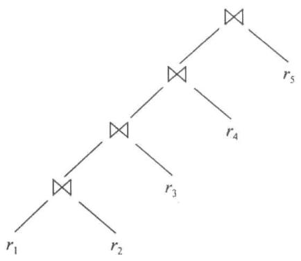


a) 左深连接树


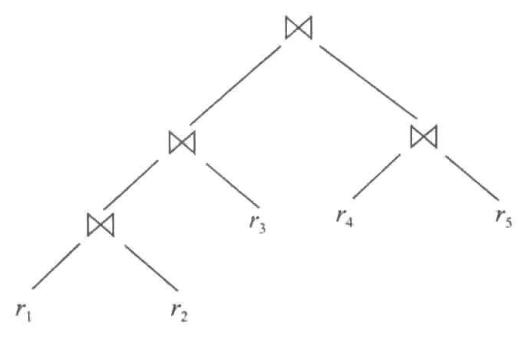


b) 非左深连接树


图 16-8 左深连接树


一种减少连接次序选择代价的启发式优化方法最初被 Oracle 的某些版本采用，该方法大体上是这样工作的：对于一个 n 路连接，它考虑 n 个执行计划。每个计划使用一种左深连接次序，并从 n 个关系中的一个不同的关系开始进行。通过基于对可用存取路径的排名反复选择参与下一个连接的“最佳”关系，该启发式方法为 n 个执行计划中的每一个都构造出连接次序。并基于可用的存取路径，为每个连接要么选择嵌套－循环连接，要么选择排序－归并连接。最后，该启发式方法基于使在内层关系上没有索引可用的嵌套－循环连接的次数最少并使排序－归并连接的次数最少的原则，以启发式方式从 n 个执行计划中选出一个。

一些系统已经采用了这样的查询优化方法：对于查询的某些部分采用启发式计划选择，而对于查询的另一些部分采用基于生成备选存取计划的基于代价的选择方式。在 System R 及其后续的 Starburst 项目中采用的方法是一个基于 SQL 嵌套块概念的层次化过程。这里描述的基于代价的优化技术被独立地应用到查询的每个块上。诸如 IBM DB2 和 Oracle 那样的一些数据库产品中的优化器就基于上述方法，并进行了扩展来处理诸如聚集那样的其他运算。对于复合 SQL 查询（使用了 $\cap$ 、 $\cup$ 或 - 运算），优化器单独处理每个组成部分，然后将它们的执行计划组合起来形成总体执行计划。

许多优化器允许为查询优化指定一个成本预算。当超过优化成本预算（optimization cost budget）时会终止对最优计划的搜索，并返回到那时为止所找到的最优计划。预算本身可以被动态设置，例如，如果为一个查询找到一个低开销的计划，则该预算会降低，其前提是：如果到目前为止所找到的最优计划的代价已经很低，那就没有理由再花费很多时间去优化查询。另一方面，如果到目前为止所找到的最优计划代价昂贵，那么投入更多的时间到优化中就是有意义的，这会带来执行时间的明显减少。为了更好地利用这一思想，优化器通常先采用代价低的启发式方法来找到一个计划，然后在基于启发式选择计划的预算下，开始基于代价的完全优化。

许多应用会反复执行同样的查询，不过查询中的常数值不一样。例如，一个大学的应用程序可能反复执行一个查询来查找一名学生所注册的课程，不过每次针对不同的学生使用学生ID的不同值。作为一种启发式方法，许多优化器只对查询进行一次优化并将该查询执行计划进行高速缓存，无论该查询最初提交的时候使用了什么样的常数值。每当该查询再次执行时，尽管可能对于常数使用的是新值，但被缓存的查询计划还是会被重用（对于常数使用新值）。虽然针对新的常数的最优计划可能不同于针对初始值的最优计划，但是作为启发式方法，被高速缓存的计划是可重用的 $^{①}$ 。查询计划的高速缓存和重用被称为计划高速缓存（plan caching）。

即使采用启发式方法，基于代价的查询优化仍会给查询处理带来相当的开销。然而，基于代价的查询优化所增加的开销通常被查询执行时间的节省所抵消，查询执行时间主要花费在慢速的磁盘存取上。好的计划与差的计划在执行时间方面的区别可能很大，这使得查询优化非常重要。在那些定期运行的应用程序中实现的节省更为显著，因为其中的查询可以只优化一次，而选中的查询计划可以在每次执行查询时使用。因此，大部分商用系统都包含了相对复杂的优化器。参考文献给出了对实际数据库系统的查询优化器进行描述的参考资料。

## 16.4.4 嵌套子查询的优化

SQL 在概念上将 where 子句中的嵌套子查询当成接受参数并且要么返回一个单独值要么返回一个值的集合（可能为空集）的函数。这些参数是在嵌套子查询中用到的来自外层查询的变量（这些变量称作相关变量（correlation variable））。例如，假设我们有下面的查询，来查找在 2019 年讲授一门课程的所有教师的姓名：

```sql
select name
from instructor
where exists (select *
    from teaches
    where instructor.ID = teaches.ID
    and teaches.year = 2019); 
```

从概念上讲，该子查询可视为一个函数，它接受一个参数（这里是 instructor.ID），并返回（具有同一 ID 的）教师在 2019 年讲授的所有课程的集合。

SQL（在概念上）通过以下方式来执行整个查询：计算外层查询的 from 子句中的关系的笛卡儿积，然后对结果中的每个元组用 where 子句中的谓词进行测试。在上述示例中，该谓词测试子查询运算结果是否为空。在实践中，where 子句中的谓词可以用作连接谓词，或者用作作为关系上选择的一部分来执行的选择谓词，或者用作为了避免笛卡儿积而执行的连接的选择谓词。随后，通过调用作为函数的子查询，执行 where 子句中涉及嵌套子查询的谓词，因为它们通常代价昂贵。

通过将嵌套子查询作为函数来调用的方式执行嵌套子查询的技术称为相关执行（correlated evaluation）。相关执行的效率不是很高，因为子查询对于外层查询中的每一个元组都进行单独的运算。这可能导致大量的随机磁盘 I/O 操作。

因此，SQL 优化器尽可能地试图将嵌套子查询转换成连接的形式。高效的连接算法有助于避免昂贵的随机 I/O。在不能进行转换的情况下，优化器将子查询当作一个单独的表达式，单独优化它们，然后再通过相关执行来执行它们。

作为将嵌套子查询转换为连接的一次尝试，前述示例中的查询可以在关系代数中重写为如下连接：

$$
\Pi_ {n a m e} (i n s t r u c t o r \bowtie_ {i n s t r u c t o r. I D = t e a c h e s. I D \wedge t e a c h e s. y e a r = 2 0 1 9} t e a c h e s)
$$

遗憾的是，上述查询不太正确，因为在 SQL 实现中使用的是关系代数算子的多重集版本，其结果是在关系代数查询的结果中，在 2019 年讲授多节课的一位教师会出现多次。尽管该教师在 SQL 查询结果中只会出现一次。使用关系代数算子的集合版本也无济于事，因为如果存在两位具有相同姓名的教师在 2019 年授过课，如果使用关系代数的集合版本，该姓名将只出现一次，但在 SQL 查询结果中会出现两次。（我们注意到：如果查询输出包含 instructor 的主码，即 ID，则关系代数的集合版本将给出正确的结果。）

为了正确地反映 SQL 的语义，结果中元组的重复次数不应该因为重写而改变。关系代数的半连接运算为这个问题提供了一种解决方案。半连接（semijoin）算子 $r \times_{\theta} s$ 的多重集版本定义如下：如果一个元组 $r_{i}$ 在 r 中出现 n 次，且至少有一个元组 $s_{j}$ 使得 $r_{i}$ 和 $s_{j}$ 一起满足谓词 $\theta$ ，则 $r_{i}$ 在 $r \times_{\theta}$ 的结果中出现 n 次，否则 $r_{i}$ 不会出现在结果中。半连接算子 $r \times_{\theta} s$ 的集合版本可以定义为 $\Pi_{R}(r \times_{\theta} s)$ ，其中 R 是 r 的模式中的属性集。半连接算子的多重集版本输出相同的元组，但在半连接结果中每个元组 $r_{i}$ 的重复次数与在 r 中 $r_{i}$ 的重复次数相同。

使用多重集半连接算子可将前面的 SQL 查询转换为以下等价的关系代数形式：

$$
\Pi_ {n a m e} (i n s t r u c t o r \ltimes_ {i n s t r u c t o r. I D = t e a c h e s. I D \land t e a c h e s. y e a r = 2 0 1 9} t e a c h e s)
$$

多重集关系代数中的上述查询给出了与 SQL 查询相同的结果，包括重复的计数。该查询可以等价地写成：

$$
\Pi_ {n a m e} (i n s t r u c t o r \ltimes_ {i n s t r u c t o r. I D = t e a c h e s. I D} (\sigma_ {t e a c h e s. y e a r = 2 0 1 9} (t e a c h e s)))
$$

下面使用 in 子句的 SQL 查询等价于使用 exists 子句的前述 SQL 查询，并且可以使用半连接将其转换为相同的关系代数表达式。

$$
\begin{array}{l} \text {select name} \\ \text {from instructor} \\ \text {where instructor.ID in (select teaches.ID} \\ \text {from teaches} \\ \text {where teaches.year = 2019);} \end{array}
$$

反半连接对于 not exists 查询是有用的。多重集反半连接（anti-semijoin）算子 $r \overline{\times}_{\theta} s$ 的定义如下：如果一个元组 $r_{i}$ 在 r 中出现 n 次，且 s 中不存在任何元组 $s_{j}$ 使得 $r_{i}$ 和 $s_{j}$ 满足谓词 $\theta$ ，则 $r_{i}$ 在 $r \overline{\times}_{\theta} s$ 的结果中出现 n 次，否则 $r_{i}$ 不出现在结果中。反半连接算子也被认为是反连接（anti-join）算子。

请考虑如下 SQL 查询：

$$
\begin{array}{l} \text {select name} \\ \text {from instructor} \\ \text {where not exists (select *} \\ \text {from teaches} \\ \text {where instructor.ID = teaches.ID} \\ \text {and teaches.year = 2019);} \end{array}
$$

776 

使用反半连接算子，可以将前面的查询转换为以下关系代数形式：

$$
\begin{array}{r l} & \Pi_ {n a m e} (i n s t r u c t o r \overline {{\times}} _ {i n s t r u c t o r. I D = t e a c h e s. I D} (\sigma_ {t e a c h e s. y e a r = 2 0 1 9} (t e a c h e s))) \\ & \text {一般来说，具有如下形式的查询：} \\ & \text {select A} \\ & \text {from r_{1}, r_{2}, \cdots, r_{n}} \\ & \text {where P_{1} and exists (select *} \\ & \text {from s_{1}, s_{2}, \cdots, s_{m}} \\ & \text {where P_{2} ^{1} and P_{2} ^{2});} \end{array}
$$

其中 $P_{2}^{1}$ 是仅引用子查询中的 $s_i$ 关系的谓词，且 $P_{2}^{2}$ 是引用来自外层查询的关系 $r_i$ 的谓词。上述查询可以转换为：

$$
\Pi_ {A} ((\sigma_ {P _ {1}} (r _ {1} \times r _ {2} \times \dots \times r _ {n})) \ltimes_ {P _ {2} ^ {2}} \sigma_ {P _ {2} ^ {1}} (s _ {1} \times s _ {2} \times \dots \times s _ {m}))
$$

如果使用 not exists 而不是 exists，则应该在关系代数查询中用反半连接去替换半连接。如果使用 in 子句来代替 exists，则可以通过在半连接谓词中添加一个相应的谓词来适当地修改该关系代数查询，正如我们前面的示例所示。

用带有连接、半连接或反半连接的查询去替换嵌套查询的过程称为去除相关（decorrelation）。正如在实践习题15.10中探究的，通过修改连接算法，可以高效地实现半连接和反半连接算子。

请考虑在标量子查询中使用聚集的下述查询，它找出在 2019 年讲授过一个以上课程段的教师。

$$
\begin{array}{l} \text {select name} \\ \text {from instructor} \\ \text {where 1 <   (select count(*)} \\ \quad \text {from teaches} \\ \quad \text {where instructor.ID = teaches.ID} \\ \quad \text {and teaches.year = 2019);} \end{array}
$$

上面的查询可以使用半连接来重写，如下所示：

$$
\Pi_ {n a m e} (i n s t r u c t o r \ltimes_ {(i n s t r u c t o r. I D = T I D) \wedge (1 <   c n t)} (_ {I D \text { as } T I D} \gamma_ {\text { count } (*) \text { as } c n t} (\sigma_ {\text { year } = 2 0 1 9} (\text { teaches })))
$$

请注意：子查询有一个谓词 instructor.ID=teaches.ID，并且聚集是没有分组子句的。去除相关查询将该谓词移到半连接条件中，并且聚集现在依照 ID 进行分组。谓词 1<(子查询)已变成半连接谓词。直观地说，该子查询为每个 instructor.ID 执行单独的计数；按 ID 分组可以确保对每个 ID 分别计算计数。

当嵌套子查询使用聚集时，或者当嵌套子查询被用作标量子查询时，去除相关显然更加复杂。事实上，对于子查询的特定情况是不可能去除相关的。例如，作为标量子查询使用的子查询只期望返回一个结果；如果它返回不止一个结果，则会出现运行时异常，这是去除相关查询不可能做到的。此外，在理想情况下是否去除相关应该以基于代价的方式来进行，这取决于去除相关是否降低了代价。一些查询优化器使用扩展的关系代数结构来表示嵌套子查询，并将从嵌套子查询到半连接、反半连接等的转换表示为等价规则。我们并不试图给出用于通用情况的算法，你可以在在线的参考文献里查看相关的项目。

可以从上述讨论中推断出，复杂的嵌套子查询的优化是一项困难的任务，并且许多优化器仅做了少量的去除相关工作。只要有可能，最好避免使用复杂的嵌套子查询，因为我们不能确信查询优化器会成功地将它们转换成一种可以高效执行的形式。

## 16.5 物化视图

当定义一个视图的时候，一般来说数据库只存储定义该视图的查询。与此相反，物化视图（materialized view）是一种其内容已经计算并存储过的视图。物化视图在这种意义下被认为是冗余数据：其内容可以通过视图定义和数据库内容的其他部分推导出来。然而在许多情况下，读一个物化视图的内容要比通过执行定义该视图的查询来计算出该视图的内容的代价要低得多。

在一些应用中，物化视图对于提高性能很重要。请考虑下面这个视图，它给出每个系的薪水总额：

create view department_total_salary(dept_name, total_salary) as select dept_name, sum (salary)
from instructor
group by dept_name; 

假设需要频繁地查询一个系的薪水总额。计算这个视图需要读取属于一个系的每个 instructor 元组，并累加薪水值，这是一项耗时的工作。相比而言，如果薪水总额的视图定义被物化了，则只要在物化视图中查找单个元组就可以得到薪水总额 $^{①}$ 。

## 16.5.1 视图维护

物化视图的一个问题是它们必须能够在视图定义所使用的数据变化时保持最新。例如，如果一位教师的 salary 值更新了，那么物化视图会变得与基础数据不一致，并且它必须进行更新。这种保持物化视图与基础数据同步更新的任务称作视图维护（view maintenance）。

视图可以通过人工编写的代码来进行维护：更新 salary 值的每段代码可以被修改为也对相应系的薪水总额进行更新。然而，这种方法比较容易出错，因为它很容易遗漏某些更新 salary 的地方，从而导致物化视图和基础数据不再匹配。

另一种维护物化视图的选择是对视图定义中每个关系的插入、删除和更新定义触发器。触发器必须考虑导致触发器触发的变化来对物化视图的内容进行修改。达到这个目的的一种简单方式就是在每次更新时，对该物化视图完全重新进行计算。

一种更好的选择是只对物化视图受到影响的部分进行修改，称为增量的视图维护（incremental view maintenance）。在 16.5.2 节中我们将描述如何执行增量的视图维护。

现代数据库系统对增量的视图维护提供了更直接的支持。数据库系统编程人员不再需要为了视图维护定义触发器。取而代之的是，一旦一个视图被声明为物化视图，数据库系统就计算该视图的内容并在基础数据变化时对其内容进行增量更新。

大多数数据库系统执行立即的视图维护（immediate view maintenance）；也就是说，只要发生更新，增量的视图维护就作为更新事务的一部分被立即执行。一些数据库系统还提供延迟的视图维护（deferred view maintenance），即视图维护被延迟到更晚的时候执行。例如，可能在白天收集更新，而在晚上进行物化视图更新。这种方法减少了更新事务的开销。但是，使用延迟视图更新的物化视图可能与定义它们所使用的基础关系不一致。

## 16.5.2 增量的视图维护

为了理解如何增量地维护物化视图，我们从考虑单个运算开始，然后看看如何处理一个完整的表达式。

可能导致一个物化视图变得过时的关系的改变操作包括插入、删除和更新。为了简化描述，我们将一个元组的更新操作替换为删除该元组，然后插入更新后的元组。这样我们就只需要考虑插入和删除。对一个关系或表达式的改变（插入和删除）称作它的差异（differential）。

## 16.5.2.1 连接运算

请考虑物化视图 $v = r \bowtie s$ 。假设对 $r$ 的修改是插入一组元组，记为 $i_r$ 。如果 $r$ 的旧值记为 $r^{old}$ ，且 $r$ 的新值记为 $r^{new}$ ，则有 $r^{new} = r^{old} \cup i_r$ 。现在，该视图的旧值 $v^{old}$ 由 $r^{old} \bowtie s$ 给出，且新值 $v^{new}$ 由 $r^{new} \bowtie s$ 给出。我们可以将 $r^{new} \bowtie s$ 重写为 $(r^{old} \cup i_r) \bowtie s$ ，再将它重写为 $(r^{old} \bowtie s) \cup (i_r \bowtie s)$ 。也就是：

$$
v ^ {n e w} = v ^ {o l d} \cup (i _ {r} \bowtie s)
$$

因此，为了更新物化视图 v，我们仅需将 $i_{r} \bowtie s$ 元组加入物化视图的旧的内容中去。对 s 的插入按完全对称的方式来进行处理。

现在，假设对 r 的修改是删除一组元组，记为 $d_{r}$ 。使用与上面同样的推理，我们得到：

$$
v ^ {n e w} = v ^ {o l d} - (d _ {r} \bowtie s)
$$

对 s 的删除按完全对称的方式来进行处理。

## 16.5.2.2 选择和投影运算

请考虑一个视图 $v = \sigma_{\theta}(r)$ 。如果对 r 的修改是插入一组元组，记为 $i_{r}$ ，则 v 的新值可以如下计算：

$$
v ^ {n e w} = v ^ {o l d} \cup \sigma_ {\theta} (i _ {r})
$$

类似地，如果对 r 的修改是删除一组元组 $d_{r}$ ，则 v 的新值可以如下计算：

$$
v ^ {n e w} = v ^ {o l d} - \sigma_ {\theta} (d _ {r})
$$

投影是一种处理起来更加困难的运算。请考虑一个物化视图 $v = \Pi_A(r)$ 。假设关系 $r$ 建立在模式 $R = (A, B)$ 上，它包含两个元组 $(a, 2)$ 和 $(a, 3)$ ，则 $\Pi_A(r)$ 只有单个元组 $(a)$ 。如果我们从 $r$ 中删除元组 $(a, 2)$ ，就不能从 $\Pi_A(r)$ 中删除元组 $(a)$ ：如果我们这样做，则结果将是一个空关系，而事实上 $\Pi_A(r)$ 仍有单个元组 $(a)$ 。其原因是相同的元组 $(a)$ 可由两条途径得到，从 $r$ 中删除一个元组只是去除了得到元组 $(a)$ 的其中一条途径，但另一条途径仍然存在。

这个理由也给了我们一种直观的解决方案：对于诸如 $\Pi_A(r)$ 那样的投影中的每个元组，我们将保留一个计数，记录该元组由几条途径得到。

780 

当从 r 中删除一组元组 $d_{r}$ 时，对于 $d_{r}$ 中的每个元组 t，我们做以下操作：令 t.A 表示 t 在属性 A 上的投影。我们在物化视图中找到 $(t.A)$ ，并对其存储的计数减 1；如果计数变为 0，则从物化视图中删除 $(t.A)$ 。

处理插入是相对直接的。当把一组元组 $i_{r}$ 插入 r 中时，对于 $i_{r}$ 中的每个元组 t，我们做以下操作：如果 $(t.A)$ 已经在物化视图中存在，则对其存储的计数加 1；如果不存在，则将 $(t.A)$ 加入物化视图中，同时将其计数值设置为 1。

## 16.5.2.3 聚集运算

聚集运算的处理过程在某种程度上与投影类似。SQL 中的聚集运算有 count、sum、avg、min 和 max。

- 计数（count）：请考虑一个物化视图 $v = G\gamma_{\text{count}(B)}(r)$ ，它按属性 $G$ 对 $r$ 进行分组，然后计算对属性 $B$ 的计数。

当把一组元组 $i_{r}$ 插入关系 r 中时，对于 $i_{r}$ 中的每个元组 t，我们做以下操作：我们在物化视图中查找分组 t.G，如果该分组不存在，则将 $(t.G,1)$ 加入物化视图中；如果分组 t.G 存在，则对该分组的计数值加 1。

当从 r 中删除一组元组 $d_{r}$ 时，对于 $d_{r}$ 中的每个元组 t，我们做以下操作：我们在物化视图中找到分组 t.G，并对该分组的计数值减 1；如果计数值变为 0，则从物化视图中删除分组 t.G 的元组。

- 求和（sum）：请考虑一个物化视图 $v = G\gamma_{sum(B)}(r)$ 。

当把一组元组 $i_{r}$ 插入 r 中时，对于 $i_{r}$ 中的每个元组 t，我们做以下操作：我们在物化视图中查找分组 t.G，如果该分组不存在，则将 $(t.G, t.B)$ 加入物化视图中；另外，与我们为投影所做的处理类似，我们存储一个与 $(t.G, t.B)$ 相关联的计数值 1。如果分组 t.G 存在，则将 t.B 的值加到该分组的聚集值上，并对该分组的计数值加 1。

当从 r 中删除一组元组 $d_{r}$ 时，对于 $d_{r}$ 中的每个元组 t，我们做以下操作：我们在物化视图中找到分组 t.G，并将该分组的聚集值减去 t.B 的值。我们还要将该分组的计数值减去 1，并且如果计数值变为 0，则从物化视图中删除分组 t.G。

如果不保留附加的计数值，我们就无法区分一个分组的总和值为 0 的情况与一个分组的最后一个元组被删除的情况。

- 平均 (avg): 请考虑一个物化视图 $v = _G \gamma_{avg(B)}(r)$ 。

781 

在一次插入或删除时直接更新平均值是不可能的，因为这不仅依赖于旧的平均值和被插入 / 删除的元组，而且还依赖于分组的元组数。

相反，为了处理 avg 这种情况，我们用如前所述的方式维护 sum 和 count 聚集值，并且用总和除以计数来得到平均值。

- 最小，最大（min, max）：请考虑一个物化视图 $v = G\gamma_{\min(B)}(r)$ 。（max 的情形完全类似。） $r$ 上的插入处理是直截了当的，这类似于 sum 的情况。在删除时维护聚集值 min 和 max 可能要更昂贵一些。例如，如果从 $r$ 中删除了一个分组中对应于最小值的元组 $t$ ，我们就必须查看同一个分组中 $r$ 的其他元组以找到新的最小值。在 $(G, B)$ 上创建有序索引是一个好主意，因为它可以帮助我们非常高效地找到一个分组的新的最小值。

## 16.5.2.4 其他运算

对集合运算交（intersection）的维护如下：给定物化视图 $v = r \cap s$ ，当插入一个元组到 r 中时，我们检查它是否出现在关系 s 中，如果是，就将它加入 v 中。当从 r 中删除一个元组时，如果它在交集中存在，我们就将其从交集中删除。对于并（union）和集差（set difference）那样的其他集合运算，可采用类似的方式进行处理；我们将处理细节留给读者。

外连接与连接的处理方式几乎完全一致，除了要做一些额外的工作。对于从 r 中删除的情况，我们必须处理 s 中不再同 r 中任何元组相匹配的元组；对于往 r 中插入的情况，我们必须处理 s 中原先不与 r 中任何元组相匹配的元组。我们再次将处理细节留给读者。

## 16.5.2.5 表达式的处理

到目前为止，我们已经明白了如何对单个运算的结果进行增量更新。为了处理一个完整的表达式，我们可以从最小的子表达式开始，推导出用于计算每一个子表达式结果的增量变化的表达式。

例如，当一组元组 $i_r$ 被插入关系 $r$ 中时，我们希望增量更新物化视图 $E_1 \bowtie E_2$ 。我们假设 $r$ 只在 $E_1$ 中使用，并假设要插入 $E_1$ 中的元组集由表达式 $D_1$ 给出，那么表达式 $D_1 \bowtie E_2$ 给出了要插入 $E_1 \bowtie E_2$ 中的元组集。

对于有关表达式的增量视图维护的更进一步细节请参见在线的参考文献。

## 16.5.3 查询优化和物化视图

通过将物化视图看作普通的关系可以执行查询优化。然而，物化视图为优化提供了更有利的机会。

- 重写查询以利用物化视图：

782 

假设有物化视图 $v = r \bowtie s$ 可用，而且用户提交了一个查询 $r \bowtie s \bowtie t$ 。与直接优化用户所提交的查询相比，将该查询重写为 $v \bowtie t$ 可以提供更高效的查询计划。因此，查询优化器的工作应该包括知道何时可以利用物化视图来提高查询速度。

- 将对物化视图的使用替换成该视图的定义：

假设有物化视图 $v = r \bowtie s$ 可用，但其上没有任何索引，并且用户提交了一个查询 $\sigma_{A=10}(v)$ 。还假设 s 在公共属性 B 上有索引，并且 r 在属性 A 上有索引。对于该查询最好的执行计划可能是将 v 替换成 $r \bowtie s$ ，这将导致查询计划 $\sigma_{A=10}(r) \bowtie s$ ；通过分别使用 r.A 和 s.B 上的索引可以高效地执行选择和连接。相比而言，直接在 v 上执行选择可能需要对 v 执行一次完全的扫描，这样的代价可能会更高。

在线的参考文献给出了有关如何利用物化视图高效地执行查询优化的研究的链接。

## 16.5.4 物化视图和索引选择

另外一个相关的优化问题是物化视图选择（materialized view selection），顾名思义，就是“物化哪组视图最好？”此决策必须基于系统的工作负载（workload），即反映系统通常负载的一系列查询和更新运算。一个简单的标准是：所选择的一组物化视图应能够使查询和更新的工作负载所耗费的总执行时间最短，包括维护物化视图所花费的时间。数据库管理员通常会修改这个标准，以考虑不同查询和更新的不同重要性：有些查询和更新可能需要快速响应，但其他查询和更新也可以接受慢速响应。

索引在这样的意义上就像物化视图一样：它们也是导出的数据，可以提高查询速度，也可能减慢更新速度。因此，尽管索引选择（index selection）的问题更简单一些，但它与物化视图选择的问题是密切相关的。我们将在25.1.4.1节和25.1.4.2节中更详细地讨论索引和物化视图选择的问题。

大多数数据库系统提供了一些工具来帮助数据库管理员进行索引和物化视图的选择。这些工具检查查询和更新的历史信息，并推荐索引和可进行物化的视图。Microsoft SQL Server Database Tuning Assistant、IBM DB2 Design Advisor 和 Oracle SQL Tuning Wizard 都是这种工具的示例。

## 16.6 查询优化中的高级主题

除了到目前为止我们已经介绍过的那些之外，还有许多优化查询的方法。在本节中我们介绍其中的几种。

果，这样做效率会非常低下，因为绝大部分计算出来的中间结果都要被舍弃。已经提出了一些技术来优化这类 top-K 查询（top-K querie）。一种方法是使用能够产生有序结果的流水线计划。另一种方法是估计将会出现在 top-K 输出中的、排序属性上的最大值，并且引入删除更大的值的选择谓词。如果产生了超过 top-K 的额外元组则丢弃它们，并且如果产生的元组过少则改变选择条件并重新执行查询。有关 top-K 优化工作方面的文献资料请参见参考文献。

## 16.6.2 连接最小化

当通过视图产生查询时，有时进行连接的关系数比计算该查询所必须进行连接的关系数要多。例如，一个视图 v 可能包含 instructor 和 department 的连接，但是对视图 v 的一次使用可能只涉及 instructor 的属性。instructor 的连接属性 dept_name 是引用 department 的外码。假设 instructor.dept_name 已经被声明为非空（not null），则可以去掉与 department 的连接而对查询不产生任何影响。因为在上述假设下，与 department 的连接既没有 instructor 中删除任何元组，也没有产生 instructor 元组的额外拷贝。

像上面这样从连接中去掉一个关系就是连接最小化的一个示例。事实上，连接最小化也可被运用到其他情况中。有关连接最小化的参考资料请参见参考文献。

## 16.6.3 更新的优化

更新查询通常涉及 set 和 where 子句中的子查询，这些子查询也必须在更新优化中考虑进去。必须仔细处理涉及一个被更新列上的选择的更新（例如，给工资大于或等于 $100 000 的所有职员加薪 10%）。如果更新是在通过索引扫描来执行选择的过程中完成的，那么一个被更新的元组可能会在扫描之前被再次插入索引中并再次被扫描遇到；这样相同职员的元组可能被不正确地更新多次（在这种情况下是无限多次）。如果更新涉及的子查询的结果被该更新所影响，也会出现类似的问题。

一次更新影响到与该更新相关联的查询的执行的问题被称为万圣节问题（Halloween problem）（因为 IBM 首次发现这个问题是在万圣节，所以以此命名）。这个问题可以通过这样的方式来避免：首先执行定义更新的查询，创建受到影响的元组列表，并在最后一步再更新元组和索引。然而，把执行计划以这种方式分割增加了执行的代价。更新计划可以通过检查万圣节问题是否会发生来进行优化，如果不会发生，则更新可以在查询被处理的时候执行，从而减少更新的开销。例如，如果更新并不影响索引属性，则万圣节问题就不会发生。即使影响索引属性，如果更新减小索引值，而索引扫描以升序扫描，更新过的元组在扫描期间就不会被再次遇到。在这种情况下，即使在执行查询的同时也可以更新索引，从而降低了总体代价。

导致大量更新的更新查询还可以通过这种方式来优化：将更新批量收集起来，然后分别对每个受影响的索引应用这批更新。当将批量的更新应用到一个索引上时，先按该索引的索引次序对这批更新进行排序，这种排序可以大大减少更新索引所需要的随机 I/O 数量。

这种更新优化在大多数数据库系统中都有实现。关于这类优化的参考资料请参见参考文献。

## 16.6.4 多查询优化和共享式扫描

当一批查询被一起提交时，查询优化器可能会利用不同查询之间共同的子表达式，仅执行它们一次并且在需要的时候重用它们。复杂的查询可能在查询的不同部分有重复的子表达式，可以利用类似的方法来降低查询执行的代价。这种优化称为多查询优化（multi-query

optimization)。 

消除公共子表达式（common subexpression elimination）通过这样的方式来优化一段程序中由不同表达式所共享的子表达式：计算并存储该子表达式的结果，并且在子表达式出现的任何地方重用该结果。消除公共子表达式是被编程语言的编译器应用于算术表达式上的一种标准的优化方法。利用为每一批查询所选择的执行计划中的公共子表达式的做法在数据库查询执行中也一样有用，并且在一些数据库中已有实现。然而，多查询优化在某些情况下可以做得更好：一个查询通常有一个以上的执行计划，相比于为每个查询选择代价最小的执行计划而付出的努力，明智地选择查询执行计划的集合可能会提供更多的共享和更低的代价。有关多查询优化的更多细节可以在参考文献所引用的文献中找到。

共享查询之间的关系扫描是一些数据库中实现的另一种受限形式的多查询优化。共享式扫描（shared-scan）优化的工作方式如下：并不是对于需要扫描一个关系的每一个查询，都一次性地从磁盘上反复读取该关系，而是从磁盘上读取一次数据，然后流水线地传递给每一个查询。共享式扫描优化在多个查询都扫描单个大型关系（“事实表”可作为一种典型）时特别有用。

## 16.6.5 参数化查询优化

我们在 16.4.3 节中看到的计划高速缓存是许多数据库中采用的一种启发式方法。请回想一下，在计划高速缓存的情况下，如果一个查询是带有一些常数被调用的，则优化器选择的计划被高速缓存，并且如果查询再次被提交，可以被重复使用，即使查询中的常数是不同的。例如，假设一个查询将系的名称作为参数，并检索该系的所有课程。在计划高速缓存的情况下，当查询第一次被执行时选中一个计划，比如针对音乐系的，如果再对其他任何系执行该查询，则该计划被重用。

如果最优查询计划受查询中常数的确切值的影响并不大，则通过计划高速缓存这样重用计划是合理的。然而，如果计划受到常数值的影响，则参数化查询优化是一种可替代的方案。

在参数化查询优化（parametric query optimization）中，查询在不为其参数提供具体值的情况下进行优化，例如前面示例中的 dept_name。然后，优化器输出几个计划，分别对于不同的参数值是最优的。一个计划只有在对于参数的一些可能的取值是最优的情况下才会被优化器输出。优化器输出的备选计划集合被存储起来。当一个带有其参数的具体值的查询被提交时会使用此前计算出的备选计划集合中的最低代价的计划，而不用执行一个完整的优化。找到这种最低代价的计划所需的时间通常要远远小于重新优化的时间。关于参数化查询优化的参考资料请参见参考文献。

## 16.6.6 自适应查询处理

正如我们在前面提到的，查询优化基于最接近的估计。因此，优化器有时可能会选择一个结果表现非常糟糕的计划。在执行时选择特定算子的自适应算子为这个问题提供了部分解决方案。例如，SQL Server 支持一个自适应的连接算法，该算法检查其外层输入的规模，并根据外层输入的规模要么选择嵌套－循环连接，要么选择散列－连接。

许多系统还包括在查询执行期间监控计划行为的能力，并相应地调整计划。例如，假设发现在计划执行（或计划的子部分的执行）的早期阶段系统收集的统计信息与优化器的估计值有很大不同，以至于所选计划明显是次优的。那么一个自适应的系统可以中止执行，使用在初始执行期间收集的统计信息选择一个新的查询执行计划，并使用新的计划重新开始执行；在旧计划执行期间收集的统计信息确保不再选出旧计划。此外，系统必须避免重复的中止和重新启动；在理想情况下，系统应该确保查询执行的总体代价接近于如果优化器有准确的统计信息将选出的计划。这种自适应查询处理的具体标准和机制是复杂的，在在线参考文献中有相关引用。

## 16.7 总结

- 给定一个查询，一般存在多种方法来计算结果。系统负责将用户输入的查询转换成能够更高效执行的等价查询。为处理查询找出一种好的策略的过程称为查询优化。

- 复杂查询的执行涉及多次的磁盘存取。由于从磁盘传输数据的速度相对于主存速度和计算机系统的 CPU 速度来说要慢，因此进行一定程度的处理来选择一种能够最小化磁盘存取次数的方法是值得的。

- 有很多等价规则可用于将一个表达式转化成等价的表达式。我们使用这些规则来系统地产生与给定查询等价的所有表达式。

- 每个关系代数表达式都代表一个特定的运算序列。选择查询处理策略的第一步就是找到一个关系代数表达式，使得它与给定的表达式等价并且据估计有更小的执行代价。

- 数据库系统为执行一种运算所选择的策略取决于每个关系的规模和列中取值的分布情况。数据库系统可以为每个关系 $r$ 存储统计信息，从而能够基于这些可靠的信息来进行策略选择。这些统计信息包括：

○ 关系 r 中的元组数；

○ 关系 r 中一条记录（元组）的字节数；

○ 关系 r 中出现的一个特定属性的不同取值的数量。

- 许多数据库系统使用直方图来存储一个属性在每一个取值区间内的取值个数。直方图通常使用采样来进行计算。

- 关于关系的统计信息使得我们可以估计各种运算的结果规模以及执行运算的代价。当有多个索引可用来辅助一个查询的处理过程时，这些统计信息特别有用。这些结构的存在在查询处理策略的选择上有很大影响。

- 对于每个表达式可以通过等价规则来产生可选的执行计划，然后跨所有表达式来选出代价最小的计划。有几种优化技术可用来减少需要产生的可选表达式和计划的数量。

- 我们使用启发式方法来减少要考虑的计划的数量，从而减少优化的代价。用于关系代数查询转换的启发式规则包括“尽早执行选择”“尽早执行投影”和“避免笛卡儿积”。

- 物化视图可以用来加速查询处理。当基础关系发生修改时，需要用增量视图维护来高效地更新物化视图。利用涉及一种运算的输入差异的代数表达式，可以计算该运算的差异。与物化视图相关的其他问题包括如何借助可用的物化视图进行查询优化以及如何选择需要物化的视图。

- 已经提出了许多先进的优化技术，比如 top-K 优化、连接最小化、更新优化、多查询优化和参数化查询优化。

## 术语回顾

- 查询优化

- 表达式的等价

- 表达式转换

- 等价规则

- 连接的交换律
- 连接的结合律
- 等价规则的最小集
- 等价表达式的枚举
- 统计信息的估计
- 目录信息
- 规模估计
  - 选择
  - 中选率
  - 连接
- 直方图
- 不同取值数的估计
- 随机样本
- 执行计划的选择
- 执行技术的相互作用
- 基于代价的优化
- 连接次序的优化
    - 动态规划算法
    - 左深连接次序
    - 有趣的排序次序

- 计划高速缓存
- 存取计划选择
- 相关执行
- 去除相关
- 半连接
- 反半连接
- 物化视图
- 物化视图的维护
  - 重新计算
  - 增量维护
  - 插入
  - 删除
  - 更新
- 使用物化视图的查询优化
- 索引的选择
- 物化视图的选择
- top-K 优化
- 连接最小化
- 万圣节问题
- 多查询优化

788 

## 实践习题

16.1 请从 dbbook.com 下载大学数据库模式和大型的大学数据集。在你喜欢的数据库上创建大学模式，并加载大型的大学数据集。请使用注释 16-1 中描述的 explain 功能来查看数据库在如下所述的不同情况下选择的计划。

a. 编写在 student.name（不带索引）上带相等条件的查询，并查看所选择的计划。

b. 在 student.name 属性上创建一个索引，并查看为上述查询所选择的计划。

c. 创建连接两个关系或三个关系的简单查询，并查看所选择的计划。

d. 创建一个计算带分组的聚集的查询，并查看所选择的计划。

e. 创建一个 SQL 查询，其所选计划使用了半连接运算。

f. 创建一个使用 not in 子句的 SQL 查询，带有一个使用聚集的子查询。请观察选择的是什么计划。

g. 创建一个查询，对其所选择的计划使用相关执行（相关执行的表达方式随不同数据库而异，但大多数数据库将显示一个带有子计划或子查询的过滤算子或投影算子）。

h. 创建一个 SQL 更新查询，它更新一个关系中的单个行。查看为该更新查询所选择的计划。

789 

i. 创建一个 SQL 更新查询，它更新一个关系中大量的行，并使用子查询来计算新值。查看为该更新查询所选择的计划。

16.2 试证明以下等价式成立。请解释如何应用它们来提高特定查询的效率：

a. $E_{1} \bowtie_{\theta}(E_{2}-E_{3}) \equiv (E_{1} \bowtie_{\theta} E_{2}-E_{1} \bowtie_{\theta} E_{3})$ 。 

b. $\sigma_{\theta}(A\gamma_{F}(E))\equiv_{A}\gamma_{F}(\sigma_{\theta}(E))$ ，其中 $\theta$ 仅使用 A 的属性。

c. $\sigma_{\theta}(E_1) \bowtie E_2) \equiv \sigma_{\theta}(E_1) \bowtie E_2$ ，其中 $\theta$ 仅使用 $E_1$ 的属性。

16.3 对于下面的每对表达式，请给出关系实例说明每对表达式是不等价的：

a. $\Pi_{A}(r-s)$ 与 $\Pi_{A}(r)-\Pi_{A}(s)$ 。

b. $\sigma_{B < 4}\big(A\gamma_{\max (B)\text{as} B}(r)\big)$ 与 $A\gamma_{\max (B)\text{as} B}\big(\sigma_{B < 4}(r)\big)$ 。

c. 在上述表达式中，若出现 max 的两个地方都用 min 去替换，表达式等价吗？

d. $(r \bowtie s) \bowtie t$ 与 $r \bowtie (s \bowtie t)$ 。换言之，自然右外连接不满足结合律。

e. $\sigma_{\theta}(E_{1} \bowtie E_{2})$ 与 $E_{1} \bowtie \sigma_{\theta}(E_{2})$ ，其中 $\theta$ 仅使用 $E_{2}$ 的属性。

16.4 SQL 允许关系有重复元组（见第 3 章）。并且关系代数的多重集版本在注释 3-1、注释 3-2 以及注释 3-3 中有定义。请检查等价规则 1～7.b 中哪些对于关系代数运算的多重集版本是满足的。

16.5 请考虑关系 $r_1(A, B, C)$ 、 $r_2(C, D, E)$ 和 $r_3(E, F)$ ，它们的主码分别为 $A$ 、 $C$ 和 $E$ 。假设 $r_1$ 有 1000 个元组， $r_2$ 有 1500 个元组， $r_3$ 有 750 个元组。请估计 $r_1 \bowtie r_2 \bowtie r_3$ 的规模，并给出一种高效的策略来计算该连接。

16.6 请考虑实践习题 16.5 中的关系 $r_1(A, B, C)$ 、 $r_2(C, D, E)$ 及 $r_3(E, F)$ 。假设除了整个模式外不存在主码。令 $V(C, r_1)$ 为 900， $V(C, r_2)$ 为 1100， $V(E, r_2)$ 为 50， $V(E, r_3)$ 为 100。假设 $r_1$ 有 1000 个元组， $r_2$ 有 1500 个元组， $r_3$ 有 750 个元组。请估计 $r_1 \bowtie r_2 \bowtie r_3$ 的规模，并给出一种高效的策略来计算该连接。

16.7 假设 department 关系在 building 上有 $\mathrm{B}^{+}$ 树索引可用，此外别无其他索引可用。那么处理下列涉及否定的选择的最佳方式是什么？

其中 “upper” 是一个函数，它将其输入参数中所有小写字母替换成相应的大写字母后返回。
a. 请找出你所使用的数据库系统为这个查询产生的计划。

b. 有些数据库系统对这个查询会采用可能非常低效的（块）嵌套循环连接。请简要解释对于这个查询如何使用散列连接或者归并连接。

16.9 请给出使下列表达式等价的条件：

$$
_ {A, B} \gamma_ {a g g (C)} (E _ {1} \bowtie E _ {2}) \quad \text {与} \quad (_ {A} \gamma_ {a g g (C)} (E _ {1})) \bowtie E _ {2}
$$

其中 agg 表示任何聚合运算。如果 agg 是 min 或 max 中的一个，那么上述条件可以如何放宽？

16.10 请考虑优化中的有趣次序问题。假设有一个查询，它计算一个关系集合 $S$ 的自然连接。给定 $S$ 的一个子集 $S1$ ，则 $S1$ 的有趣次序是什么？

16.11 请修改 FindBestPlan(S) 函数以创建 FindBestPlan(S, O) 函数，其中 O 是 S 所需的排序次序，并考虑有趣的排序次序。空（null）次序表示次序是不相关的。提示：一个算法 A 可以给出期望的次序 O；否则可能需要添加排序运算以获得期望的次序。如果 A 是归并－连接，则必须在两个输入上调用 FindBestPlan，并为输入指定所需的次序。

16.12 请说明对于 n 个关系存在 $(2(n-1))!/(n-1)!$ 种不同的连接次序。

提示：一棵完全二叉树（complete binary tree）中每个内部节点都正好有两个孩子节点。拥有 n 个叶节点的不同的完全二叉树的数量为：

$$
\frac {1}{n} \binom{2 (n - 1)}{(n - 1)}
$$

如果你愿意，你也可以从具有 $n$ 个节点的二叉树的数量公式推导出具有 $n$ 个节点的完全二叉树的数量公式。具有 $n$ 个节点的二叉树的数量为：

$$
\frac {1}{n + 1} \binom {2 n} {n}
$$

这个数字就是卡特兰数（Catalan number），并且它的衍生式可以在任何一本有关数据结构或算法的标准教材中找到。

16.13 请证明计算连接次序的最小时间代价是 $O(3^n)$ 。假设你可以在常量时间内存储和查找一个关系集合的有关信息（比如该集合的最佳连接次序以及该连接次序的代价）。（如果你感觉做本题有困难，至少证明更宽松的时间界限 $O(2^{2n})$ 。）

16.14 如果像在 System R 优化器中那样只考虑左深连接树，请证明找到最高效的连接次序所花费的时间大约为 $n2^n$ 。假定只存在一个有趣的排序次序。

16.15 请考虑图 16-9 的银行数据库，其中主码用下划线标识。请为这个关系数据库构建以下 SQL 查询。

a. 在 account 关系上写一个嵌套查询，对于每家名称以 B 打头的分行，找出该分行具有最大余额的所有账户。

b. 不使用嵌套子查询重写前面的查询；换言之，去除查询的相关性，但是使用 SQL。

c. 使用等价于该查询的半连接给出一个关系代数表达式。

d. 给出一个过程（类似于 16.4.4 节中描述的那样）用于去除此类查询的相关性。

```txt
branch(branch_name, branch_city, assets)
customer (customer_name, customer_street, customer_city)
loan (loan_number, branch_name, amount)
borrower (customer_name, loan_number)
account (account_number, branch_name, balance)
depositor (customer_name, account_number) 
```


图 16-9 银行数据库


## 习题

16.16 假设 department 关系在 (dept_name, building) 上有 B $^{+}$ 树索引可用。则处理下列选择的最佳方式是什么？

$$
\sigma_ {(b u i l d i n g <   \text {   "Watson"   })} \wedge (b u d g e t <   5 5 0 0 0) \wedge (d e p t \_ n a m e = \text {   "Music"   }) (d e p a r t m e n t)
$$

792 

16.17 请使用 16.2.1 节中的等价规则，说明如何通过一系列转换来推导出下列等价式：

a. $\sigma_{\theta_{1}\wedge\theta_{2}\wedge\theta_{3}}(E)\equiv\sigma_{\theta_{1}}(\sigma_{\theta_{2}}(\sigma_{\theta_{3}}(E)))$ 

b. $\sigma_{\theta_1 \wedge \theta_2}(E_1 \bowtie_{\theta_3} E_2) \equiv \sigma_{\theta_1}(E_1 \bowtie_{\theta_3} (\sigma_{\theta_2}(E_2)))$ ，其中 $\theta_2$ 仅使用 $E_2$ 的属性。

16.18 请考虑两个表达式 $\sigma_{\theta}(E_1 \bowtie E_2)$ 和 $\sigma_{\theta}(E_1 \bowtie E_2)$ 。
a. 请用一个示例来说明这两个表达式一般不等价。
b. 请给出谓词 $\theta$ 上的一个简单条件，如果满足该条件就确保这两个表达式是等价的。

16.19 如果只要两个表达式等价，都可以通过使用一系列等价规则从一个表达式推导出另一个，那么就称一个等价规则集是完备的。我们在16.2.1节中考虑的等价规则集是完备的吗？提示：请考虑等价式 $\sigma_{3=5}(r) \equiv \{\}$ 。

16.20 请解释如何使用直方图来估算形如 $\sigma_{A\leqslant v}(r)$ 的选择的规模。

16.21 假设两个关系 $r$ 和 $s$ 在属性 $r.A$ 和 $s.A$ 上分别有直方图，但是所取区间不同。请给出如何使用直方图来估计 $r \bowtie s$ 的规模的建议。提示：进一步细分每个直方图的区间。

16.22 请考虑如下查询：

请说明如何使用多重集版本的半连接运算来去除这个查询的相关性。

16.23 请从插入和删除两个方面描述如何增量维护下面运算的结果：

a. 并和集差。

b. 左外连接。

16.24 请给出一个定义物化视图的表达式的示例以及这样两种情况（存在有关输入关系与差异的统计信息集）：在一种情况下，增量视图维护要优于重新计算；而在另一种情况下，重新计算更优。

16.25 假设你希望得到 $r \bowtie s$ 在 $r$ 的一个属性上排序的结果，并且对于某个相对较小的 $K$ 值，只想要前 $K$ 个结果。请给出执行该查询的一种较好方式。

a. 当在引用 s 的关系 r 的外码上进行连接时，这里的外码属性被申明为非空。

b. 当不是在外码上进行连接时。

16.26 请考虑一个关系 $r(A, B, C)$ ，它在属性 $A$ 上有索引。请给出一个查询的示例，仅使用索引就能回答该查询，而不用查看关系中的元组。（仅使用索引而不必访问实际关系的查询计划称为仅用索引（index-only）的计划。）

16.27 假定你有一个更新查询 $U$ 。请给出一个 $U$ 上的简单充分条件，使得不论选择任何执行计划或者是否存在索引，它都能确保不会发生万圣节问题。

## 延伸阅读

[Selinger et al. (1979)] 的创造性工作描述了 System R 优化器中的存取路径选择，System R 优化器是最早的关系查询优化器之一。Starburst 中的查询处理在 [Haas et al. (1989)] 中描述，这构成了 IBM DB2 中查询优化的基础。

[Graefe and McKenna (1993)] 描述了 Volcano，它是一个基于等价规则的查询优化器。Volcano 与它的后继 Cascades ([Graefe (1995)]) 一起构成了 Microsoft SQL Server 中的查询优化的基础。[Moerkotte (2014)] 为查询优化提供了广泛的教科书式的介绍，包括用于连接次序优化以避免考虑笛卡儿积的动态规划算法的优化。避免生成具有笛卡儿积的计划可以大幅降低通用查询的优化代价。

本章的参考文献可在线获取，它为研究各种优化技术提供参考，包括带有聚集的查询优化、带有外连接的查询优化、嵌套子查询的优化、top-K 查询的优化、连接最小化的优化、更新查询的优化、物化视图维护和视图匹配、索引和物化视图选择、参数化查询优化以及多查询优化。

## 参考文献


[Graefe (1995)] G. Graefe, "The Cascades Framework for Query Optimization", Data Engineering Bulletin, Volume 18, Number 3 (1995), pages 19-29. 


[Graefe and McKenna (1993)] G. Graefe and W. McKenna, "The Volcano Optimizer Generator", In Proc. of the International Conf. on Data Engineering (1993), pages 209-218. 


[Haas et al. (1989)] L. M. Haas, J. C. Freytag, G. M. Lohman, and H. Pirahesh, "Extensible Query Processing in Starburst", In Proc. of the ACM SIGMOD Conf. on Management of Data (1989), pages 377-388. 


[Moerkotte (2014)] G. Moerkotte, Building Query Compilers, available online at http://pi3.informatik.uni-mannheim.de/~moer/querycompiler.pdf, retrieved 13 Dec 2018 (2014). 


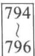


[Slinger et al. (1979)] P. G. Selinger, M. M. Astrahan, D. D. Chamberlin, R. A. Lorie, and T. G. Price, “Access Path Selection in a Relational Database System”, In Proc. of the ACM SIGMOD Conf. on Management of Data (1979), pages 23–34. 

