## 事务

通常，从数据库用户的角度来看，数据库中多个操作的集合被认为是一个独立的单元。例如，从顾客的角度来看，将资金从支票账户转移到储蓄账户是一次单一的操作；而在数据库系统中，这是由几个操作组成的。有一点是最基本的：这些操作要么全都发生，要么由于发生故障而全都不发生。资金从支票账户支出而未转入储蓄账户的情况是不可接受的。

构成单一逻辑工作单元的操作集合称作事务。即使有故障，数据库系统也必须保证事务的正确执行——要么执行整个事务，要么属于该事务的操作一个也不执行。此外，数据库系统必须以一种能避免引入不一致性的方式来管理事务的并发执行。在资金转账的示例中，一个计算顾客总金额的事务可能在资金转账事务从支票账户支出金额之前查看支票账户余额，而在资金存入储蓄账户之后查看储蓄账户余额。其结果是，它会得到不正确的结果。

本章介绍事务处理的基本概念。有关并发事务处理和故障恢复的详细情况分别在第18章和第19章中介绍。

## 17.1 事务的概念

事务（transaction）是访问并可能更新各种数据项的一个程序执行单元（unit）。事务通常由高级数据操纵语言（代表性的是 SQL）或编程语言（例如，C++ 或 Java）编写的用户程序发起，这种编程语言带有用 JDBC 或 ODBC 表示的嵌入式数据库访问。事务用形如 begin transaction 和 end transaction 的语句（或函数调用）来界定。事务由 begin transaction 与 end transaction 之间所执行的全部操作组成。

这些步骤的集合必须作为一个单一的、不可分割的单元出现。因为事务是不可分割的，要么执行其全部操作，要么就根本不执行。因此，如果一个事务开始执行，但是无论任何原因故障了，事务对数据库所做的任何可能的修改都必须被撤销。无论事务本身是否故障（例如，如果它除以零），或者操作系统崩溃，或者计算机本身停止运行，这项要求都要满足。正如我们将看到的，确保满足这一要求是困难的，因为对数据库的一些修改可能仅仅存放在事务的主存变量中，而另一些可能已经被写入数据库并存储在磁盘上。这种“全或无”的特性被称为原子性（atomicity）。

此外，由于事务是一个单一的单元，它的操作不能看起来是被不属于事务的其他数据库操作分隔开的。尽管希望表现这种用户级别的事务印象，但我们知道现实情况是完全不同的。即使单条 SQL 语句也会涉及对数据库的多次单独访问，而一个事务可能会由多条 SQL 语句构成。因此，数据库系统必须采取特殊操作来确保事务正常执行而不被来自并发执行的数据库语句所干扰。这种特性被称为隔离性（isolation）。

即使系统能保证一个事务的正确执行，如果此后系统崩溃，并导致系统“忘记”了该事务，那么这项工作的意义也不大。因此，即使发生系统崩溃，事务的操作也必须是持久的。这种特性被称为持久性（durability）。

因为上述三种特性，事务就成了构造与数据库交互的一种理想方式。这使我们必须加强对事务本身的一项要求。事务必须保持数据库的一致性——如果事务从一个一致的数据库开始以原子方式隔离地运行，那么该数据库在事务结束时必须重新保持一致。这种一致性要求超越了我们此前已看到过的数据完整性约束（比如主键约束、引用完整性、check约束以及诸如此类的约束）。相反，我们期望事务能超越完整性约束，以确保保留那些依赖于应用程序的一致性约束，这些约束太过复杂以至于无法使用SQL的数据完整性结构来声明。如何做到这一点则是编写事务代码的程序员的职责。这种特性被称为一致性（consistency）。

更简明地重申上述内容，即我们要求数据库系统维护事务的以下特性：

- 原子性。事务的所有操作在数据库中要么全部正确反映出来，要么完全不反映。

- 一致性。以隔离方式执行事务（即，没有其他事务的并发执行）以保持数据库的一致性。

- 隔离性。尽管多个事务可能并发执行，但系统保证：对于任何一对事务 $T_{i}$ 和 $T_{j}$ ，在 $T_{i}$ 看来， $T_{j}$ 要么在 $T_{i}$ 开始之前已经完成执行，要么在 $T_{i}$ 完成之后 $T_{j}$ 才开始执行。因此，每个事务都感觉不到系统中有其他事务在并发地执行。

- 持久性。在一个事务成功完成之后，它对数据库的改变必须是永久的，即使出现系统故障也是如此。

这些特性通常被称为 ACID 特性，ACID 这一缩写来源于四种特性的英文首字母。

正如我们此后将看到的，确保隔离性有可能对系统性能造成很大的不利影响。出于这种原因，一些应用在隔离性上妥协了。我们首先学习严格执行 ACID 特性，然后学习这些折中方案。

## 17.2 一个简单的事务模型

因为 SQL 是一种强大而复杂的语言，所以我们采用一种简单的数据库语言来开始学习事务，该语言关注数据何时从磁盘移动到主存以及何时从主存移动到磁盘。我们忽略 SQL 的插入（insert）和删除（delete）操作，并推迟到 18.4 节再去考虑它们。在简单语言中，对数据的实际操作仅限于算术运算。之后我们会在一个真实的、基于 SQL 的、具备更丰富运算集合的环境中讨论事务。在简单模型中的数据项只包含单个数据值（在示例中是一个数字）。每个数据项通过名称来标识（在示例中通常是一个字母，即 A、B、C 等）。

我们将采用由几个账户以及一个访问和更新这些账户的事务集合所构成的一个简单的银行应用来阐明事务的概念。事务采用以下两种操作来访问数据：

- read(X)，从数据库把数据项 X 传送给一个也称为 X 的变量，X 位于属于执行 read 操作的事务的主存缓冲区中。

- write(X)，从执行write的事务的主存缓冲区中把变量X的值传送给数据库中的数据项X。

知道一个数据项的变化是否只出现在主存中或者是否已经被写入磁盘上的数据库中是很重要的。在实际的数据库系统中，write 操作不一定导致立即更新磁盘上的数据。write 操作的结果可以临时存储在其他地方，以后再写到磁盘上。但是对于目前来说，我们假设 write 操作是立即更新数据库的。我们将在 17.3 节中进一步讨论存储问题，并在第 19 章中讨论当将主存中的数据库数据写入磁盘上的数据库中时所存在的问题。

令 $T_i$ 是从账户 A 转账 \$50 到账户 B 的事务。这个事务可以被定义为：

$T_{i}$ : $\text{read}(A)$ ;
A := A - 50;
write(A);
read(B);
B := B + 50;
write(B). 

现在让我们逐个考虑 ACID 特性（为了便于讲解，我们不按 A-C-I-D 的次序来讲述它们）。

- 一致性：这里的一致性要求是事务的执行不改变 $A$ 和 $B$ 的总和。如果没有一致性要求，金额可能会被事务凭空创造或销毁！容易验证，如果数据库在一个事务执行之前是一致的，那么在该事务执行之后数据库仍将保持一致性。

确保单个事务的一致性是编写该事务的应用编程人员的责任。完整性约束的自动测试给这项任务带来了便利，正如我们已经在4.4节中讨论过的那样。

- 原子性: 假设就在事务 $T_{i}$ 执行之前, 账户 $A$ 和 $B$ 分别有 $1000 和 $2000。现在假设在事务 $T_{i}$ 执行的过程中发生了故障, 导致 $T_{i}$ 的执行没有成功完成。进一步假设故障发生在 write( $A$ ) 操作执行之后 write( $B$ ) 操作执行之前。在这种情况下, 数据库中反映出来账户 $A$ 和 $B$ 分别有 $950 和 $2000。这次故障导致系统丢失了 $50。特别地, 我们注意到 $A+B$ 的和不再维持原状。

这样，由于该故障，系统的状态不再反映数据库本应描述的现实世界的真实状态。我们把这种状态称为不一致状态（inconsistent state）。必须保证这种不一致性在数据库系统中是不可见的。但是请注意，系统必然会在某些时刻处于不一致状态。即使事务 $T_i$ 能成功执行，仍然存在一个时刻使得账户 $A$ 的金额是 \$950 且账户 $B$ 的金额 \$2000，这显然是一个不一致的状态。然而这一状态最终会被账户 $A$ 的金额是 \$950 且账户 $B$ 的金额是 \$2050 这个一致性状态所取代。这样，如果一个事务从未开始或者保证完成，那么除了在该事务的执行期间，这样的不一致状态应该是不可见的。这就是需要原子性的原因：如果具有原子性，那么事务的所有操作要么在数据库中全部反映出来，要么根本不反映。

保证原子性背后的基本思想如下：数据库系统（在磁盘上）记录事务要执行写操作的任何数据项的旧值。这种信息记录在一个称为日志（log）的文件中。如果该事务没能完成它的执行，数据库系统从日志中恢复出旧值，使得看上去好像该事务从未执行过一样。我们将在17.4节中进一步讨论这些想法。保证原子性是数据库系统的责任，具体来说，这项工作由称作恢复系统（recovery system）的数据库组件处理，这将在第19章中详细讲述。

- 持久性：一旦事务成功执行，并且发起事务的用户被告知资金转账已经发生，系统就必须保证任何系统故障都不会导致与这次资金转账相关的数据丢失。持久性保证一旦事务成功完成，该事务对数据库所做的所有更新就都是持久的，即使在事务执行完成后出现了系统故障也是如此。

现在我们假设计算机系统的故障可能导致主存中数据的丢失，但已写入磁盘的数据决不会丢失。第19章将讨论如何防止磁盘上的数据丢失。我们可以通过确保以下两条中的任何一条来保证持久性：

1. 由事务所执行的更新在事务结束前已经写入磁盘。

2. 有关事务已执行的更新的信息被写入磁盘，并且这些信息足以使数据库在故障后

重新启动数据库系统时重建这些更新。

第19章将介绍的数据库恢复系统负责除了保证原子性之外还保证持久性。

- 隔离性：如果几个事务并发地执行，那么即使每个事务都能确保一致性和原子性，它们的操作也会以某种不希望的方式交叉执行，导致不一致的状态。

正如我们先前看到的，例如，在事务将资金从 A 转账到 B 的执行过程中，当扣款总额已经写入 A 且加款总额尚未写入 B 时，数据库暂时是不一致的。如果第二个并发运行的事务在这个中间时刻读取 A 和 B 并计算 $A+B$ ，那么它将看到不一致的值。进一步来说，如果第二个事务随后基于它读取的不一致的值对 A 和 B 执行更新，那么即使两个事务都完成了，数据库仍可能处于不一致的状态。

一种避免事务并发执行而产生问题的途径是串行地执行事务，即一个接一个地执行事务。然而，正如我们将在17.5节中所看到的那样，事务的并发执行能显著地改善性能。因此，人们提出了另一些解决方案，它们允许多个事务并发地执行。

我们将在 17.5 节中讨论由事务的并发执行所引起的问题。事务的隔离性确保事务并发执行所得到的系统状态与这些事务以某种次序一次执行一个后所得到的状态是等价的。我们将在 17.6 节中进一步讨论隔离性的原则。确保隔离性是数据库系统中称作并发控制系统（concurrency-control system）的部件的责任，对此我们将在第 18 章中讨论。

## 17.3 存储器结构

为了理解如何确保事务的原子性和持久性，我们必须更好地理解数据库中的各种数据项是如何存储和访问的。

在第 12 章中，我们看到存储介质可以通过它们的相对速度、容量以及从故障中快速恢复的能力来区分，可分为易失性存储器或非易失性存储器。这里回顾这些术语，并介绍另一类被称作稳定存储器的存储器。

- 易失性存储器（volatile storage）。驻留在易失性存储器中的信息通常在系统崩溃后不会幸存。这种存储器的示例包括主存储器和高速缓冲存储器。对易失性存储器的访问是相当快的，一方面是因为存储器本身的访问速度快，另一方面是因为可以直接访问易失性存储器中的任何数据项。

- 非易失性存储器（non-volatile storage）。驻留在非易失性存储器中的信息会在系统崩溃后幸免于难。非易失性存储器的示例包括用于在线存储的、诸如磁盘和闪存那样的二级存储设备，以及用于存档存储的、诸如光介质和磁带那样的三级存储设备。根据目前的技术水平，非易失性存储器比易失性存储器慢，特别是对于随机访问。然而，二级存储设备和三级存储设备都容易受到故障的影响，可能导致信息丢失。

- 稳定存储器（stable storage）。驻留在稳定存储器中的信息永远不会丢失（应该对永远不会持有保留态度，因为理论上的永远不会是不能保证的。例如，尽管可能性非常小，也有可能出现黑洞吞噬地球从而永久地销毁所有数据！）。尽管稳定存储器在理论上是不可能得到的，但是可以通过技术的高精度近似使得数据丢失的可能性微乎其微。为了实现稳定存储器，我们可以将信息复制到几个非易失性存储器介质（通常是磁盘）中，这些介质采用独立的故障模式。更新必须小心以保证在对稳定存储器更新的过程中所发生的故障不会导致信息丢失。19.2.1节将讨论稳定性存储器的实现。

各种存储类型之间的区别在实际中没有我们介绍的这么明显。例如，某些系统（如RAID控制器）提供备用电池，使得一些主存可以在系统崩溃和电源故障中幸免于难。

为了保持事务的持久性，需要将它的修改写入稳定存储器。类似地，为了保持事务的原子性，在对磁盘上的数据库进行任何更改之前需要先将日志记录写入稳定存储器。一个系统所能保证的持久性和原子性的程度取决于它的稳定存储器的实现到底有多么稳定。在某些情况下，磁盘上的单个备份就足够了，但是对于其数据非常有价值和事务非常重要的应用程序来说需要多个备份，或者换句话说，需要更接近于理想化的稳定存储器概念。

## 17.4 事务的原子性和持久性

正如我们先前所注意到的，事务并非总能成功地执行。这种事务被称为中止（aborted）了。如果要确保原子性，中止的事务必须对数据库的状态不造成影响。因此，中止的事务对数据库所做过的任何改变必须撤销。一旦中止的事务造成的变更已被撤销，我们就说该事务已回滚（rolled back）。管理事务中止是恢复机制职责的一部分。这么做的典型方式是维护一个日志（log）。事务对数据库所做的每个修改都会首先被记录到日志中。我们记录执行修改的事务标识、被修改的数据项标识以及数据项的旧值（修改前的）和新值（修改后的）。然后数据库本身才会被修改。对日志的维护提供了通过重做修改来保证原子性和持久性的可能，以及在事务执行期间发生故障的情况下通过撤销修改来保证原子性的可能。第19章将会讨论关于基于日志的恢复的详细信息。

成功完成其执行的事务被称为已提交（committed）了。一个执行过更新的已提交事务使数据库进入一种新的一致性状态，即使出现系统故障，这个状态也必须保持。

一旦事务已经提交,我们不能通过中止它来撤销其造成的影响。撤销已提交事务所造成的影响的唯一方式是执行一个补偿事务(compensating translation)。例如,如果一个事务给一个账户增加了$20,其补偿事务应当从该账户减去$20。然而,并非总是能够创建这样的补偿事务。因此,编写和执行补偿事务的责任就留给了用户,而不是通过数据库系统来处理。

我们需要更准确地定义一个事务的成功完成意味着什么。为此我们建立了一个简单的抽象事务模型。事务必须处于以下状态之一：

- 活跃（active）状态，为初始状态，当事务执行时就处于这种状态。

- 部分提交（partially committed）状态，在最后一条语句被执行之后。

- 失效（failed）状态，在发现正常执行不能再继续之后。

- 中止（aborted）状态，在事务已回滚并且数据库已被恢复到它在事务开始前的状态之后。

- 提交（committed）状态，在成功完成之后。

事务相应的状态图如图 17-1 所示。只有在一个事务已进入提交状态后，我们才说该事务已提交。类似地，仅当一个事务已进入中止状态，我们才说该事务已中止。如果一个事务要么是提交的要么是中止的，它就被称为是已经终止（terminated）的。

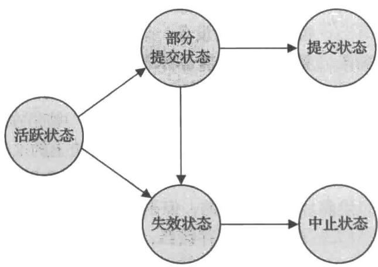


图 17-1 事务状态图


在系统判定一个事务不能继续进行其正常执行后（例如，由于硬件或逻辑错误），该事务就进入失效状态。这种事务必须回滚。这样，该事务就进入中止状态。此刻，系统有两种选择：

- 它可以重启（restart）事务，但仅当引起事务中止的原因是某些硬件错误或不是由于事务的内部逻辑而产生的软件错误。重启的事务被看成一个新事务。

- 它可以杀死（kill）事务，这样做通常是由于某些内部的逻辑错误，只有通过重写应用程序才能改正这种错误，或者是由于输入错误，或者是由于所需数据在数据库中没有找到。

在处理可见的外部写（observable external write），比如写到用户的屏幕或者发送电子邮件时，我们必须要小心。由于写的结果可能已经在数据库系统的外部看到过，所以一旦发生这种写操作，就不能再被抹去。大多数系统只允许这种写操作在事务进入提交状态后发生。实现这种模式的一种方式是为数据库系统将与这种外部写相关的任何值都临时存储在数据库中的一个特殊关系里，并且仅当事务进入提交状态后才执行真正的写操作。如果在事务已进入提交状态而外部写操作尚未完成之前，系统出现了故障，那么数据库系统将在系统重启时（使用非易失性存储器中的数据）执行外部写操作。

在某些情况下处理外部写操作会更加复杂，例如，假设外部动作是在自动取款机上提取现金，并且系统恰好在现金被实际提取之前发生故障（我们假定现金能够自动提取）。当系统重新启动时再提取出现金是没有意义的，因为用户可能已经离开了取款机。在这种情况下，需要在系统重新启动时执行一个补偿事务，比如将现金存回到用户的账户中。

作为另一个示例，考虑一个用户在 Web 上进行预订。有可能在预订事务刚刚提交后数据库系统或应用服务器就发生崩溃。也有可能在预订事务刚刚提交后跟用户的网络连接就发生丢失。在任何一种情况下，即使事务已经提交，但外部写并没有发生。为了处理这种情况，应用程序必须被设计成这样的：当用户重新连接到网络应用程序时，他可以看到他的事务是否成功执行。

对于特定应用来说，允许活跃事务向用户显示数据也可能是所期望的，特别是运行数分钟或数小时的长周期事务。遗憾的是，除非愿意牺牲事务的原子性，否则我们不能允许这种可见的数据输出。

## 17.5 事务的隔离性

事务处理系统通常允许多个事务并发地执行。正如我们先前所看到的，允许多个事务并发更新数据会引起许多数据一致性的复杂问题。在存在事务并发执行的情况下保证一致性需要额外的工作。如果坚持事务是串行地（serially）执行的话将简单得多——即一次执行一个事务，每个事务仅当前一个事务执行完后才开始。然而，对于允许并发来说有两条很好的理由：

- 提高吞吐量和资源利用率。一个事务由多个步骤组成。一些步骤涉及 I/O 活动，而另一些步骤涉及 CPU 活动。计算机系统中的 CPU 与磁盘可以并行运作。因此，I/O 活动可以与 CPU 的处理并行进行，从而可以利用系统的 CPU 与 I/O 并行性来并行运行多个事务。当一个事务在一张磁盘上进行读或写时，另一个事务可以在 CPU 中运行，而第三个事务又可以在另一张磁盘上执行读或写。所有这些情况都增加了系统的吞吐量——即在一段给定时间内所执行的事务的数量。相应地，处理器与磁盘的利用率也提高了，换句话说，处理器与磁盘花在空闲上或者没有执行任何有用的工作上的时间减少了。

- 减少等待时间。一个系统上可能混杂运行着各种事务，一些是短事务，一些是长事务。如果这些事务串行地运行，那么短事务可能得等待前面的长事务完成，这可能导致在事务运行中难以预测的延迟。如果各事务是运行在数据库的不同部分上，那么让它们并发运行会更好，这样就可以在它们之间共享CPU周期和磁盘存取。并发执行减少了在事务运行中难以预测的延迟。此外，它还减少了平均响应时间（average response time）：一个事务从它提交到完成所需的平均时间。

在数据库中使用并发执行的动机本质上与操作系统中使用多道程序（multiprogramming）的动机是一样的。

当多个事务并发运行时，隔离性可能被违背，这导致即使每个单独的事务都是正确的，但数据库的一致性也可能被破坏。在这一节中，我们提出调度的概念以帮助识别哪些执行是可以保证隔离性并进而保证数据库一致性的。

数据库系统必须控制并发事务之间的交互，以防止它们破坏数据库的一致性。系统通过称为并发控制机制（concurrency-control scheme）的一系列机制来做到这一点。我们将在第18章中学习并发控制机制，目前我们主要关注正确的并发执行的概念。

请再次考虑 17.1 节中的简化银行系统, 其中有多个账户以及一组存取和更新这些账户的事务。令 $T_{1}$ 和 $T_{2}$ 是将资金从一个账户转移到另一个账户的两个事务。事务 $T_{1}$ 从账户 $A$ 转 $50 到账户 $B$ , 它被定义为:

$$
\begin{array}{l} T _ {1}: \text { read } (A); \\ A := A - 5 0; \\ \text { write } (A); \\ \text { read } (B); \\ B := B + 5 0; \\ \text { write } (B). \end{array}
$$

事务 $T_{2}$ 从账户 A 将存款余额的 10% 转到账户 B。它被定义为：

$T_{2}$ : $\text{read}(A)$ ;
temp := A * 0.1;
A := A - temp;
write(A);
read(B);
B := B + temp;
write(B). 

## 注释 17-1 并发性趋势

计算领域的一些当前趋势带来了大量可能的并发性的增长。随着数据库系统利用这种并发性来提高系统的整体性能，并发运行事务的数量可能越来越多。

早期的计算机只有一个处理器。因此，在那样的计算机中没有任何真正意义上的并发性。唯一的并发性是操作系统创建的表面并发性，它在几个不同的任务或进程之间共享处理器。现代计算机可能有很多个处理器。每个处理器称为一个核，单个处理器芯片可能包含多个核，并且几个这样的芯片可能在单个系统中连接在一起，使得所有芯片共享一个公共的系统内存。此外，并行数据库系统可能包含多个这样的系统。并行数据库体系结构将在第20章中讨论。

由多个处理器和多核提供的并行性有两种用途。一种是并行执行单个长时间运行的查询的不同部分，以加快查询执行的速度。另一种是允许大量查询（通常是较小的查询）并发地执行，例如支持大量的并发用户。第21章到第23章将描述用于构建并行数据库系统的算法。

假设账户 A 和 B 的当前值分别是 $1000 和 $2000。还假设这两个事务以 $T_1$ 后接 $T_2$ 的次序一次一个地执行。该执行顺序如图 17-2 所示。在图中，指令步骤的次序自顶向下按时间顺序排列， $T_1$ 的指令出现在左栏中，而 $T_2$ 的指令出现在右栏中。在图 17-2 中的执行发生之后，账户 A 与 B 的最终值分别为 $855 与 $2145。因此，在账户 A 与 B 中的资金总数（即 $A+B$ 的总和）在两个事务执行之后保持不变。

类似地,如果这些事务按照 $T_{2}$ 后接 $T_{1}$ 的次序一次一个地执行,那么相应的执行顺序如图 17-3 所示。同样,正如所预期的, $A+B$ 之和保持不变,并且账户 $A$ 与 $B$ 的最终值分别为 $850 与 $2150。

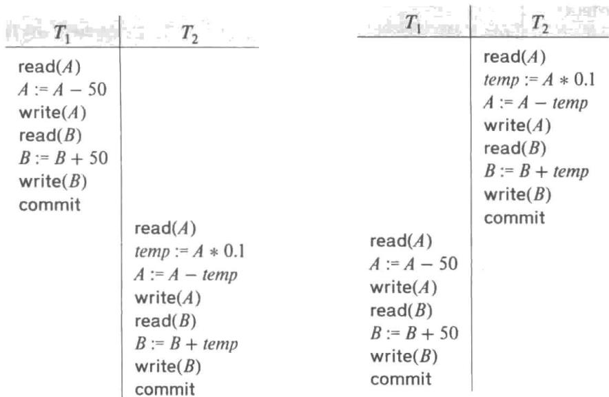


图 17-2 调度 1：一个串行调度，


图 17-3 调度 2：一个串行调度，


其中 $T_{2}$ 跟在 $T_{1}$ 之后


其中 $T_{1}$ 跟在 $T_{2}$ 之后


刚才描述的执行顺序称为调度（schedule）。它们表示指令在系统中执行的时间顺序。显然，一组事务的一个调度必须包含这些事务的全部指令，并且这些指令必须保持它们在每个单独事务中出现的顺序。例如，在任何一个有效调度中，事务 $T_{1}$ 中的write(A)指令必须出现在 read(B) 指令之前。请注意，我们在调度中包括了 commit 操作以表示事务已经进入提交状态。在下面的讨论中，我们将称第一种执行顺序（ $T_{2}$ 跟在 $T_{1}$ 之后）为调度 1，而称第二种执行顺序（ $T_{1}$ 跟在 $T_{2}$ 之后）为调度 2。

这些调度是串行的：每个串行调度由来自各个事务的指令序列组成，其中属于一个单独事务的指令在该调度中是一起出现的。请回顾来自组合数学的一个众所周知的公式，我们知道，对于有 $n$ 个事务的一个集合，存在 $n$ 的阶乘 $(n!)$ 种不同的有效串行调度。

当数据库系统并发执行多个事务时，相应的调度就不再是串行的。若有两个并发执行的事务，操作系统可能先对一个事务执行一小段时间，然后切换上下文环境，对第二个事务执行一段时间，接着又切换回第一个事务执行一段时间，等等。在多个事务的情形下，所有事务之间是共享 CPU 时间的。

因为来自两个事务的各种指令现在可能是交叉的，所以多种执行顺序是有可能的。一般而言，在 CPU 切换到另一个事务之前准确预测将要执行一个事务的多少条指令是不可能的 $^{①}$ 。

回到前面的示例，假设两个事务是并发执行的。一种可能的调度如图 17-4 所示。当它执行完成后，我们到达的状态与事务按照 $T_{1}$ 后接 $T_{2}$ 的次序串行执行的状态一样。 $A+B$ 之和的确是保持不变的。

并非所有的并发执行都能得到正确的状态。举例说来，请考虑如图17-5所示的调度，在该调度执行之后，我们到达的状态是账户A与B的最终值分别为$950与$2100。这个最终状态是一个不一致状态，因为我们在并发执行的过程中多出了$50。实际上，通过两个事务的执行A+B之和未能保持不变。

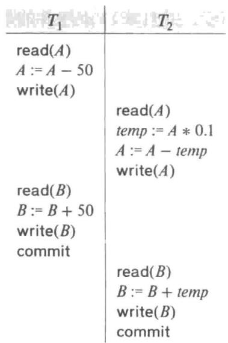


图 17-4 调度 3: 等价于调度 1


的一个并发调度


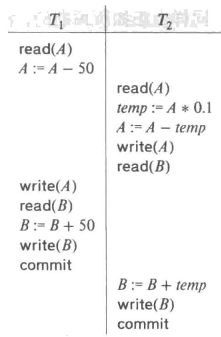


图 17-5 调度 4：一个导致不


一致状态的并发调度


如果并发执行的控制完全由操作系统负责，那么许多调度都是可能的，包括像刚才描述的那种使数据库处于不一致状态的调度也是可能的。保证所执行的任何调度都能使数据库处于一致性状态是数据库系统的任务。数据库系统中负责完成此项任务的是并发控制（concurrency-control）部件。

在并发执行的情况下，我们通过保证所执行的任何调度的效果都与没有任何并发执行的调度效果一样来确保数据库的一致性。也就是说，调度应该在某种意义上等价于一个串行调度。这种调度被称为可串行化的（serializable）调度。

## 17.6 可串行化

在考虑数据库系统的并发控制部件如何保证串行化之前，我们先考虑如何确定一个调度是可串行化的。显然，串行调度是可串行化的，但是如果多个事务的步骤交错执行，则很难确定一个调度是否是可串行化的。由于事务就是程序，要准确地确定一个事务执行哪些操作以及不同事务的操作如何交互是有困难的。出于这种原因，我们将不会考虑一个事务在一个数据项上能够执行的不同类型的操作，而只考虑两种操作 read 和 write。我们假设：在一个数据项 Q 上的 $\text{read}(Q)$ 指令和 $\text{write}(Q)$ 指令之间，一个事务可以对驻留在该事务本地缓冲区中的 Q 的拷贝上执行任意的操作序列。按这种模式，从调度的角度来看，一个事务的重要操作就仅仅在于它的 read 与 write 指令。commit 操作尽管也是相关的，但是我们将在 17.7 节才考虑它。因此，我们在调度中可能只展示 read 与 write 指令，

在本节中，我们讨论不同形式的等价调度，但是重点关注一种称为冲突可串行化（conflict serializability）的特殊形式。

让我们考虑一个调度 S，S 中含有分别属于事务 $T_{i}$ 与 $T_{j}$ （ $i \neq j$ ）的两条连续指令 I 与 J。如果 I 与 J 引用不同的数据项，则交换 I 与 J 不会影响调度中任何指令的结果。然而，若 I 与 J 引用相同的数据项 Q，则这两条指令步骤的次序可能是重要的。由于只处理 read 与 write 指令，我们需要考虑的情况有四种：

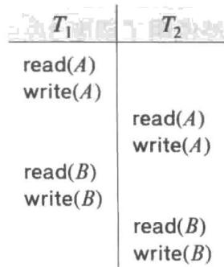


图17-6 调度3：只展示read与write指令


1. $I = \text{read}(Q)$ , $J = \text{read}(Q)$ 。I 与 J 的次序无关紧要，因为不论该次序如何， $T_{i}$ 与 $T_{j}$ 读取的 Q 值总是相同的。

2. $I = \operatorname{read}(Q)$ , $J = \operatorname{write}(Q)$ 。若 $I$ 先于 $J$ , 则 $T_{i}$ 不会读取到由 $T_{j}$ 在指令 $J$ 中所写入的 $Q$ 值。若 $J$ 先于 $I$ , 则 $T_{i}$ 读取到由 $T_{j}$ 所写入的 $Q$ 值。因此, $I$ 与 $J$ 的次序是重要的。

3. $I = \text{write}(Q)$ , $J = \text{read}(Q)$ 。I 与 J 的次序是重要的，其原因与前一种情况类似。

4. $I = \operatorname{write}(Q)$ , $J = \operatorname{write}(Q)$ 。由于两条指令均为 write 操作, 这些指令的次序对 $T_{i}$ 与 $T_{j}$ 并没有什么影响。然而, $S$ 的下一条 $\operatorname{read}(Q)$ 指令所读取的值将受到影响, 因为数据库里只保留两条 write 指令中后一条的结果。如果在 $S$ 的指令 $I$ 与 $J$ 之后再没有其他的 $\operatorname{write}(Q)$ 指令, 则 $I$ 与 $J$ 的次序直接影响由调度 $S$ 所产生的数据库状态中 $Q$ 的最终值。

因此，只有在 $I$ 与 $J$ 全为read指令的情况下，两条指令执行的相对顺序才是无关紧要的。

如果 $I$ 与 $J$ 是由不同事务在相同数据项上执行的操作，并且其中至少有一条指令是write操作，那么我们说 $I$ 与 $J$ 是冲突的。

为了说明冲突指令的概念，我们考虑图17-6中的调度3。 $T_{1}$ 的write(A)指令与 $T_{2}$ 的read(A)指令相冲突。然而， $T_{2}$ 的write(A)指令与 $T_{1}$ 的read(B)指令不冲突，因为这两条指令访问的是不同的数据项。

令 $I$ 与 $J$ 是调度 $S$ 的连续指令。若 $I$ 与 $J$ 是属于不同事务的指令且 $I$ 与 $J$ 并不冲突，则

可以交换 I 与 J 的次序来产生一个新的调度 $S'$ 。S 与 $S'$ 是等价的，因为除了 I 与 J 外，在两个调度中所有其他指令出现的次序都是相同的，而 I 与 J 的顺序则无关紧要。

在图 17-6 的调度 3 中，由于 $T_{2}$ 的 write(A) 指令与 $T_{1}$ 的 read(B) 指令并不冲突，我们可以交换这些指令来产生一个等价的调度，即图 17-7 中所示的调度 5。不管系统初始状态如何，调度 3 与调度 5 都产生出相同的最终系统状态。

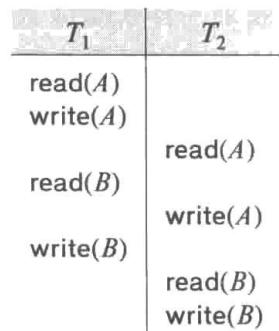


我们继续交换非冲突的指令：

- 将 $T_{1}$ 的 $\operatorname{read}(B)$ 指令与 $T_{2}$ 的 $\operatorname{read}(A)$ 指令进行交换。

图17-7 调度5：交换调度3的一对指令后的调度

- 将 $T_{1}$ 的write(B)指令与 $T_{2}$ 的write(A)指令进行交换。

- 将 $T_{1}$ 的write(B)指令与 $T_{2}$ 的read(A)指令进行交换。

经过这些交换的最终结果是一个串行调度，即图 17-8 所示的调度 6。请注意调度 6 和

调度 1 完全一样，但它只显示了 read 和 write 指令。因此，我们已经说明了调度 3 等价于一个串行调度。这种等价性意味着：不管初始系统的状态如何，调度 3 将与某个串行调度产生相同的最终状态。

如果调度 S 可以经过一系列非冲突指令的交换而转换成调度 $S'$ ，则称 S 与 $S'$ 是冲突等价的 $^{①}$ 。

并非所有的串行调度相互之间都是冲突等价的。例如，调度 1 和调度 2 就不是冲突等价的。

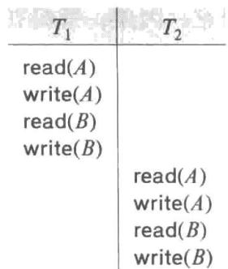


冲突等价的概念引出了冲突可串行化的概念：若一个调度


图17-8 调度6：与调度3等价的一个串行调度


S 与一个串行调度是冲突等价的，则称调度 S 是冲突可串行化的。因此，因为调度 3 冲突等价于串行调度 1，所以调度 3 是冲突可串行化的。

最后，请考虑图 17-9 所示的调度 7，该调度仅包含事务 $T_{3}$ 与 $T_{4}$ 中的重要操作（即 read 与 write 操作）。这个调度不是冲突可串行化的，因为它既不等价于串行调度 $\langle T_{3}, T_{4} \rangle$ ，也不等价于串行调度 $\langle T_{4}, T_{3} \rangle$ 。

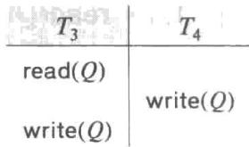


为了确定一个调度是否是冲突可串行化的，我们现在给出一种简单而有效的方法。请考虑一个调度 $S$ 。我们由 $S$ 构造出一个有向图，称为优先图（precedence graph）。该图由两部分组成 $G = (V, E)$ ，其中 $V$ 是顶点集，而 $E$ 是边集。顶点集由参与到调度中的所有事务组成，边集由满足下列三个条件之一的所有 $T_{i} \rightarrow T_{j}$ 的边组成：

1. 在 $T_{j}$ 执行 $\text{read}(Q)$ 之前， $T_{i}$ 执行 $\text{write}(Q)$ ;

2. 在 $T_{j}$ 执行 write(Q) 之前， $T_{i}$ 执行 read(Q);

3. 在 $T_{j}$ 执行 write(Q) 之前， $T_{i}$ 执行 write(Q)。

如果在优先图中存在一条 $T_{i} \rightarrow T_{j}$ 的边，则在等价于 S 的任何串行调度 $S'$ 中， $T_{i}$ 必须出现在 $T_{j}$ 之前。

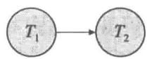


a)


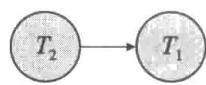


b)


例如，调度1的优先图如图17-10a所示，图中只有单条 $T_{1}\rightarrow T_{2}$ 的边，因为 $T_{1}$ 的所有指令均在执行 $T_{2}$ 的首

图 17-10 a）调度 1 的优先图；

b) 调度 2 的优先图

条指令之前执行。类似地，图 17-10b 表示的是调度 2 的优先图，该图仅有单条 $T_{2} \rightarrow T_{1}$ 的边，因为 $T_{2}$ 的所有指令均在执行 $T_{1}$ 的首条指令之前执行。

调度 4 的优先图如图 17-11 所示。因为 $T_{1}$ 执行 $\text{read}(A)$ 先于 $T_{2}$ 执行 $\text{write}(A)$ ，所以图中含有一条 $T_{1} \rightarrow T_{2}$ 的边。又因为 $T_{2}$ 执行 $\text{read}(B)$ 先于 $T_{1}$ 执行 $\text{write}(B)$ ，所以图中还含有一条 $T_{2} \rightarrow T_{1}$ 的边。

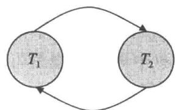


图 17-11 调度 4 的优先图


如果关于 S 的优先图中有环，则调度 S 是非冲突可串行化的；如果优先图中无环，则调度 S 是冲突可串行化的。

通过寻找与优先图的偏序相一致的线性次序可以得到事务的可串行化次序（serializability order）。该过程称为拓扑排序（topological sorting）。一般而言，通过拓扑排序可以得到几种可能的线性次序。例如，图 17-12a 中的优先图就有两种可接受的线性次序展示在图 17-12b 与图 17-12c 中。

因此，为了测试冲突可串行化性，我们需要构造优先图并调用一个环路检测算法。环路检测算法可在关于算法的标准教材中找到。诸如基于深度优先搜索的环路检测算法需要 $n^{2}$ 数量级的运算，其中n是图中的顶点数（即事务数） $^{①}$ 。

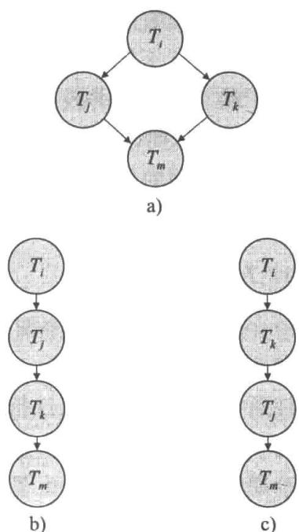


回顾之前的示例，请注意调度1与调度2的优先图（图17-10）的确不包含环路。而调度4的优先图（图17-11）却包含一个环路，这说明该调度不是冲突可串行化的。

有可能存在两个调度，它们产生相同的结果，但它们不是冲突等价的。例如，考虑事务 $T_5$ ，它从账户 $B$ 转账 \$10 到账户 $A$ 。将调度 8 定义为图 17-13 中所示的那样。我们说调度 8 不与串行

图 17-12 拓扑排序示例

调度 $<T_{1}$ , $T_{5}>$ 冲突等价,因为在调度8中, $T_{5}$ 的 write(B) 指令与 $T_{1}$ 的。这在优先图中产生了一条 $T_{5} \rightarrow T_{1}$ 的边。类似地,我们看到 $T_{1}$ 的 write(A) 指令与 $T_{5}$ 的 read 指令是冲突的,从而产生了一条 $T_{1} \rightarrow T_{5}$ 的边。这表示优先图中有环路,并且调度8不是可串行化的。然而,执行调度8或者执行串行调度 $<T_{1}$ , $T_{5}>$ 之后,账户A与B的最终值是相同的,即分别为 $960 与 $2040。

从这个示例可以看出，存在比冲突等价不那么严格的调度等价性定义。对于系统来说，为了确定调度8与串行调度 $< T_{1}, T_{5}>$ 产生的结果相同，系统必须分析 $T_{1}$ 与 $T_{5}$ 所执行的计算，而不只是分析read和write操作。通常说来，这种分析难以实现并且计算代价是昂贵的。在我们的示例中，最后的结果和串行调度是一样的，是因为这样的数学事实：加法和减法运算是可交换的。虽然这在我们

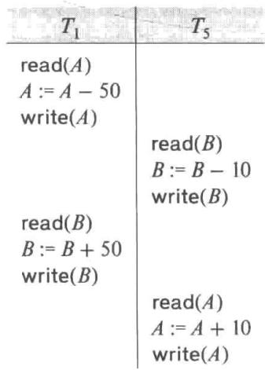


图17-13 调度8


的简单示例中可能很容易看出来，但是一般情况下并非如此容易，因为一个事务可能会被表示为一条复杂的 SQL 语句，一段具有 JDBC 调用的 Java 程序，等等。

不过，存在一些纯粹基于 read 与 write 操作的调度等价性的其他定义。其中一种这样的定义是视图等价（view equivalence），该定义引出了视图可串行化（view serializability）的概念。由于视图可串行化的计算复杂度很高，故在实践中并未使用 $^{①}$ 。因此，我们推迟到第18章中再讨论视图可串行化，但是为了表述的完整性，在这里请注意调度8的示例并不是视图可串行化的。

## 17.7 事务的隔离性和原子性

至此，我们隐含地假定在没有事务失效的前提下学习调度。现在我们讨论在并发执行过程中事务失效所产生的影响。

不论什么原因，如果一个事务 $T_{i}$ 失效了，我们需要撤销该事务的影响以确保该事务的原子性。在允许并发执行的系统中，原子性要求依赖于 $T_{i}$ 的任何事务 $T_{j}$ （即 $T_{j}$ 读取了 $T_{i}$ 写的数据）也要中止。为确保这一点，我们需要对系统中所允许的调度类型设置一些限制。

在下面的两小节中，我们从事务失效恢复的角度讲述什么样的调度是可接受的。我们将在第 18 章中讲述如何保证只产生这种可接受的调度。

## 17.7.1 可恢复调度

请考虑图 17-14 中调度 9 的一部分，其中事务 $T_{7}$ 只执行一条指令，即 $\text{read}(A)$ 。我们称其为一次部分调度（partial schedule），因为我们没有包括对 $T_{6}$ 的 commit 或 abort 操作。请注意 $T_{7}$ 在执行 $\text{read}(A)$ 指令后立即提交了。因此， $T_{7}$ 提交时 $T_{6}$ 仍处于活跃状态。现在假定 $T_{6}$ 在它提交前失效。 $T_{7}$ 已读取了由 $T_{6}$ 写过的数据项 A。因此，我们说 $T_{7}$ 依赖于 $T_{6}$ 。由于这个原因，我们必须中止 $T_{7}$ 以保证原子性。但是 $T_{7}$ 已经提交，不能再中止了。这样，我们就遇到了不能从 $T_{6}$ 的失效正确恢复的情形。

调度 9 是不可恢复（nonreconverable）调度的一个示例。一个可恢复调度是这样的调度：对于每对事务 $T_{i}$ 和 $T_{j}$ ，如果 $T_{j}$ 读取了由 $T_{i}$ 之前所写过的数据项，则 $T_{i}$ 的提交操作出现在 $T_{j}$ 的提交操作之前。为了使调度 9 的示例是可恢复的， $T_{7}$ 应该推迟到 $T_{6}$ 提交之后再提交。

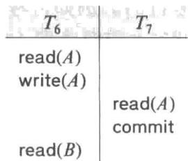


## 17.7.2 无级联调度


图17-14 调度9是一个不可恢复的调度


即使一个调度是可恢复的，要从事务 $T_{i}$ 的失效中正确恢复，我们可能需要回滚若干事即使一个调度是可恢复的，要从事务 $T_{i}$ 的失效中正确恢复。如果有事务读取了由事务 $T_{i}$ 所写的数据项就会发生这种情况。作为一个示例，请考虑图 17-15 所示的部分调度。事务 $T_{8}$ 写了 A 的值，随后事务 $T_{9}$ 读取了 A。事务 $T_{9}$ 写的 A 值又被事务 $T_{10}$ 读取。假定此时 $T_{8}$ 失效， $T_{8}$ 必须回滚。由于 $T_{9}$ 依赖于 $T_{8}$ ，则事务 $T_{9}$ 必须回滚。由于 $T_{10}$ 依赖于 $T_{9}$ ，则 $T_{10}$ 必须回滚。这种因单个事务失效而导致一系列事务回滚的现象称为级联回滚（cascading rollback）。

级联回滚导致要撤销大量的工作，因而是不希望发生的。

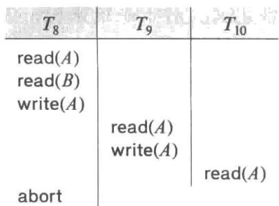


图17-15 调度10


对调度施加限制以避免发生级联回滚的情况是必要的。这样的调度称为无级联（cascadeless）

调度。规范地说，无级联调度是这样的一种调度：对于每对事务 $T_{i}$ 和 $T_{j}$ 都满足如果 $T_{j}$ 读取了先前由 $T_{i}$ 所写的一个数据项，则 $T_{i}$ 的提交操作必须出现在 $T_{j}$ 的这一读操作之前。容易验证每一个无级联调度都是可恢复的。

## 17.8 事务的隔离性级别

可串行性是一个有用的概念，因为当程序员编写事务代码时，它允许程序员忽略与并发性相关的问题。只要每个事务具有在单独执行时保持数据库一致性的性质，那么可串行性就能确保事务的并发执行是保持一致性的。然而，对于某些应用来说，需要保证可串行性的协议可能只允许极小的并发度。在这种情况下，可以采用较弱级别的一致性。为了保证数据库的正确性，使用较弱级别的一致性给程序员增加了额外的负担。

SQL 标准也允许一个事务被指定为：它可以以一种对其他事务来说是不可串行化的方式执行。例如，一个事务可能在未提交读（read uncommitted）的隔离性级别上执行，它甚至允许该事务读取被一个尚未提交的事务所写入的一个数据项。SQL 为那些并不要求精确结果的长事务提供这种特征。如果这些事务以可串行化的方式执行，它们就会干扰其他事务，造成其他事务的执行被延迟。

由 SQL 标准规定的隔离性级别（isolation level）如下所示：

- 可串行化（serializable）通常保证可串行化的执行。然而，正如我们将要简要解释的，一些数据库系统以在某些情况下可能允许非可串行化执行的方式来实现这种隔离性级别。

- 可重复读（repeatable read）只允许读取已提交的数据，并进一步要求在一个事务两次读取一个数据项期间，其他事务不得更新该数据项。但是，该事务对于其他事务来说可能不是可串行化的。例如，当一个事务在查找满足某些条件的数据时，它可能找到一些由一个已提交事务所插入的数据，但可能找不到由同一个事务所插入的其他数据。

- 已提交读（read committed）只允许读取已提交数据，但并不要求可重复读。例如，在事务两次读取一个数据项期间，另外的事务可以更新该数据项并提交。

- 未提交读（read uncommitted）允许读取未提交数据。这是 SQL 允许的最低隔离性级别。

以上所有的隔离性级别附带都不允许脏写（dirty write），即如果一个数据项已经被另外一个尚未提交或中止的事务写过，则不允许对该数据项再执行写操作。

许多数据库系统缺省情况下在已提交读的隔离性级别上运行。在 SQL 中，除了接受系统的缺省设置之外，还可以显式地设置隔离性级别。例如，语句

## set transaction isolation level serializable

将隔离性级别设置为可串行化，其他任何隔离性级别也都是可以设定的。Oracle、PostgreSQL 和 SQL Server 均支持上述语法。Oracle 使用如下语法：

$$
\text { alter   session   set   isolation\_level } = \text { serializable }
$$

而 DB2 使用语法 “change isolation level” 以及它自己提供的隔离性级别的缩写。修改隔离性级别必须作为事务的第一条语句来执行。

缺省情况下，大多数数据库在执行完单条语句后立即提交它们。必须关闭对单条语句的这种自动提交（automatic commit）以允许多条语句作为单个事务来运行。start transaction 命令确保在后面的 commit 或 rollback 之前，后续的 SQL 语句都作为单个事务来执行。如所预想的那样，commit 操作提交在其之前的 SQL 语句，而 rollback 回滚在其之前的 SQL 语句。（SQL Server 使用 begin transaction 来代替 start transaction，而 Oracle 和 PostgreSQL 将 begin 视为与 start transaction 相同。）

诸如 JDBC 和 ODBC 之类的 API 提供了关闭自动提交的功能。在 JDBC 中，Connection 接口的 setAutoCommit 方法（我们在 5.1.1.8 节中看到过）可以通过调用 setAutoCommit(false) 来关闭自动提交，或者通过调用 setAutoCommit(true) 来打开自动提交。此外，在 JDBC 中，Connection 接口的 setTransactionIsolation(int level) 方法可以使用以下任何一个参数来调用：

- Connection.TRNSACTION_SERIALIZABLE 

- Connection.TRNSACTION_REPEATABLE_READ 

- Connection.TRNSACTION_READ_COMMITTED 

- Connection.TRNSACTION_READ_UNCOMMITTED 

以便设置事务相应的隔离性级别。

822 

应用程序设计者可能会为了提高系统性能而决定接受较弱的隔离性级别。正如我们将在17.9节和第18章中所看到的，确保可串行化可能会迫使一个事务等待另一个事务，或者在某些情况下，由于该事务无法再作为可串行化执行的一部分来运行而中止。虽然为了性能而承担数据库一致性的风险可能看起来是短视的，但是如果我们可以确保可能出现的不一致性是和应用程序无关的，则这种权衡就是合理的。

有很多方法可以实现隔离性级别。只要这种实现能够确保可串行化，则数据库应用程序的设计者或者应用程序的用户就不需要知道这些实现的细节，除非需要处理性能问题。遗憾的是，尽管隔离性级别被设置为可串行化，一些数据库系统实际上实现的是较弱的隔离性级别，它并不排除所有非可串行化执行的可能性，我们将在17.9节中再次讨论这个问题。如果采用较弱的隔离性级别，无论是显式还是隐式，应用程序设计者都必须知晓一些实现细节，以避免或者最小化由缺乏可串行化而带来的不一致的可能性。

## 注释 17-2 现实世界中的可串行化

可串行化调度是保证一致性的理想方式，但是在日常生活中，我们不会强制实施如此严格的要求。一个提供商品销售的网站可能会列出一种有现货的商品，但是在用户选择该商品并结账的过程中，该商品可能不再可售。从数据库的角度来看，这应该就是一种不可重复读。

作为另一个示例，请考虑针对航空旅行的座位选择。假设一名旅客已经预订好行程，并且现在正在为每次航班选择座位。许多航空公司的网站允许用户浏览各次航班并选择座位，然后要求用户确认其选择。而与此同时，其他旅客也可能正在选择同一架航班的座位或者更改他们所选择的座位。因此，该旅客所看到的空余座位实际上是变化的，但是该旅客所看到的只是截止到当他开始座位选择流程时的空余座位的一个快照。

即使两名旅客同时选择座位，他们很可能选择不同的座位，如果是这样就不会发生真正的冲突。然而，事务是非可串行化的，因为每名旅客所读取的数据是其他旅客更新后的结果，这导致优先图中存在环路。如果两名旅客同时执行的座位选择事实上选择的是相同的座位，则其中一位将不会获得他所选择的座位。不过，这种情况很容易解决，只要在更新的空余座位信息上，要求这名旅客重新执行选择即可。

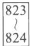


通过一个时刻只允许一名旅客选择一次特定航班的座位可以保证可串行化。然而，这样做可能会带来严重的延迟，因为旅客需要等待他们的航班变得可供选择座位，特别是一名旅客花费很长时间来做出选择的话，可能会给其他旅客带来严重的问题。取而代之的做法是，任何这类的事务通常可以拆分成一个需要用户交互的部分以及一个专门在数据库上运行的部分。在上述示例中，数据库事务将检查旅客选中的座位是否仍然可用，并且如果可用才更新数据库中的座位选择信息。可串行化是只针对在数据库上运行的事务而保证的，并不考虑用户交互的情况。

## 17.9 隔离性级别的实现

至此，我们已经知道调度必须具有什么样的性质才能保证数据库处于一致性状态，并允许以安全的方式来处理事务的失效。

我们可以使用多种并发控制策略来保证：即使在有多个事务并发执行时，不管操作系统在这些事务之间如何分配分时资源（例如 CPU 时间），都只产生可接受的调度。

作为并发控制策略的一个简单示例，请考虑如下情况：一个事务在它开始前获得整个数据库上的锁（lock），并在它提交之后释放这个锁。在一个事务持有锁的期间，其他任何事务都不允许获得这个锁，因此必须等待该锁被释放。由于采用了封锁策略，一次只能执行一个事务。所以只会产生串行调度。这样的调度很明显是可串行化的，并且容易验证它们也是可恢复的和无级联的。

像这样的并发控制策略会导致性能低下，因为它迫使事务等到前面的事务结束后才能开始。换句话说，它提供的并发程度很低（实际上，根本没有并发度）。正如我们在17.5节中看到过的那样，并发执行具有显著的性能优势。

并发控制策略的目标是提供高度的并发性，同时保证所产生的所有调度都是冲突或视图可串行化、可恢复并且无级联的。

在这里，我们概述一些最重要的并发控制机制是如何工作的，然后到第 18 章再介绍相关细节。

## 17.9.1 锁

事务可以只封锁它访问的那些数据项，而不用封锁整个数据库。在这种策略下，事务必须在足够长的时间内持有锁以保证可串行化，但是这一时期又要足够短以不会过度影响性能。麻烦的情况是数据项的访问取决于where子句的SQL语句，对此我们将在17.10节中讨论。在第18章中，我们将介绍两阶段封锁协议，这是一种简单但被广泛用来确保可串行化的技术。简单地说，两阶段封锁要求一个事务有两个阶段，在第一个阶段它获得锁但并不释放任何锁，在第二个阶段事务释放锁但并不获得锁。（实际上，通常只有当事务完成它的操作并且被提交或者被中止时才释放锁。）

如果我们有共享的和排他的两种类型的锁，则封锁的结果将进一步得到改进。共享锁用于事务读取的数据，而排他锁用于事务写的数据。许多事务可以同时持有相同数据项上的共享锁，但是只有当其他任何事务在一个数据项上不持有任何锁（无论是共享锁或是排他锁）的前提下，一个事务才允许持有该数据项上的排他锁。使用这两种锁模式以及两阶段封锁可以在仍然保证可串行化的同时允许数据的并发读取。

## 17.9.2 时间戳

另一类用来实现隔离性的技术是为每个事务分配一个时间戳（timestamp），通常是当事务开始的时候。对于每个数据项，系统维护着两个时间戳。数据项的读时间戳保留读取该数据的那些事务的最大（也就是最近的）时间戳。数据项的写时间戳保留写过该数据项当前值的事务的时间戳。时间戳用来确保在事务访问冲突的情况下，事务按照事务时间戳的次序来访问每个数据项。当不能访问时，违例事务将会被中止，并且分配一个新的时间戳重新开始。

## 17.9.3 多版本和快照隔离

通过维护数据项的多个版本，可以允许一个事务读取一个数据项的旧版本，而不是被另一个未提交事务或者在串行化次序中应该排在后面的事务所写的新版本。有很多的多版本并发控制技术，其中一个在实践中被广泛应用，是称为快照隔离（snapshot isolation）的技术。

在快照隔离中，我们可以想象每个事务在它开始时有其自己的数据库版本或者快照 $^{①}$ 。它从这个私有版本中读取数据，因此和其他事务所做的更新隔离开来。如果事务更新数据库的话，该更新只出现在其私有版本中，而不是在实际的数据库本身中。如果事务提交，则和这些更新有关的信息被保存，使得这些更新被应用到“真正的”数据库。

当一个事务 T 进入部分提交状态时，只有在没有其他并发事务修改了 T 想要更新的数据项的情况下，T 才能进入提交状态。其结果是，不能被提交的事务被中止。

快照隔离确保读数据的尝试永远无须等待（不像封锁的情况）。只读事务不会被中止，只有修改数据的那些事务有微小的被中止的风险。由于每个事务读取它自己的数据库版本或快照，读数据并不会导致此后其他事务的更新尝试需要等待（不像封锁的情况）。因为大部分事务是只读的（并且大多数其他事务读数据的情况多于它们的更新），这通常是与锁相比带来性能改善的一个主要原因。

可事与愿违的是，快照隔离的问题是它提供了太多的隔离。考虑两个事务 T 和 $T'$ 。在一个可串行化执行中，要么 T 看到 $T'$ 所做的所有更新，要么 $T'$ 看到 T 所做的所有更新，因为在可串行化次序中一个事务必须跟在另一个事务之后。在快照隔离的情况下，存在任何事务都不能看到对方更新的情况。这种情况在可串行化执行中是不会出现的。在许多（事实上是大多数）情况下，两个事务的数据访问并不会冲突，因此没有什么问题。然而，如果 T 读取 $T'$ 更新的某些数据项并且 $T'$ 读取 T 更新的某些数据项，则可能两个事务都无法读取对方所做的更新。正如我们将在第 18 章中所看到的那样，其结果可能会导致数据库的不一致状态，而这在任何可串行化执行中当然是不会出现的。

Oracle、PostgreSQL 和 SQL Server 提供快照隔离的选项。Oracle 和 PostgreSQL 9.1 之前的 PostgreSQL 版本使用快照隔离实现了可串行化隔离性级别。其结果是，它们的可串行化实现在特殊情况下会导致允许非可串行化的执行。而 SQL Server 在标准级别以外增加了一个称为快照的附加的隔离性级别，以提供快照隔离的选项。PostgreSQL 9.1 之后的版本实现了一种称为可串行化快照隔离的并发控制形式，它在确保可串行化的同时提供了快照隔离的优势。

## 17.10 事务的 SQL 语句表示

在 4.3 节中，我们介绍了指定事务开始和结束的 SQL 语法。现在我们已经看到了一些在保证事务的 ACID 特性时的问题，我们准备好来考虑在用一系列 SQL 语句表示事务时如何保证这些特性，而不是像到目前为止我们所考虑的简单读和写的受限模型。

在简单模型中,我们假设存在一个数据项的集合。虽然简单模型允许改变数据项的值,但是并不允许创建或删除数据项。然而在 SQL 中,insert 语句创建新的数据且 delete 语句删除数据。事实上,这两条语句都是 write 操作,因为它们改变了数据库,但是它们与其他事务操作的交互与我们在简单模型中看到的是不同的。作为一个示例,请考虑插入或删除会如何与下述 SQL 查询相冲突,该查询查找工资超过 $90 000 的所有教师:

$$
\begin{array}{l} \text {select ID, name} \\ \text {from instructor} \\ \text {where salary > 90000;} \end{array}
$$

采用 instructor 示例关系（见附录 A.3），我们发现只有 Einstein 和 Brandt 满足条件。现在假设在我们运行该查询的差不多同一时间，另外一个用户插入一条新的名为 “James” 的工资为 $100 000 的教师数据。

$$
\text { insert   into   instructor   values   ('11111', 'James', 'Marketing', 100000) };
$$

我们的查询结果取决于该插入是先于还是后于查询而运行的。在这两个事务的并发执行中，在直觉上很显然它们是冲突的，然而这种冲突通过简单模型无法捕捉。这种情况被称为幻象现象（phantom phenomenon），因为冲突可能存在于“幻象”数据上。

我们的简单事务模型要求提供一个具体的数据项作为操作的参数来执行在该数据项上的操作。在我们的简单模型中，只要查看 read 和 write 步骤就可以发现哪些数据项被引用。但是在 SQL 语句中，被引用的特定数据项（元组）可能是由 where 语句谓词来决定的。因此，如果在事务多次运行之间数据库中的值发生改变，那么即使是同一个事务，如果不止一次运行的话，也可能在它每次运行时引用不同的数据项。在我们的示例中，只有当查询在插入之后发生时，'James' 元组才会被引用。令 T 表示查询，并令 T' 表示插入。如果 T' 先发生，则在优先图中有一条 T' → T 的边。然而，在查询 T 先发生的情况下，尽管在幻象数据上的实际冲突强制 T 的串行化次序在 T' 之前，但在优先图中的 T 和 T' 之间是没有边的。

上面谈到的问题表明：并发控制仅考虑事务要访问的元组是不够的，出于并发控制的目的，还需要考虑事务用于找到待访问元组的信息。用于寻找元组的信息可能会被插入或删除所更新，或者在有索引的情况下，该信息甚至还可能由于搜索码属性的更新而更新。例如，如果采用封锁来进行并发控制，则用于追踪关系中元组的数据结构以及索引结构都必须被恰当地封锁。然而，这种封锁可能会在某些情况下导致较低的并发度。在插入、删除以及带有谓词的查询中都保证可串行化的同时，还能够最大化并发度的索引封锁协议将在18.4.3节中讨论。

让我们再次考虑查询：

$$
\begin{array}{l} \text {select ID, name} \\ \text {from instructor} \\ \text {where salary > 90000;} \end{array}
$$

以及以下 SQL 更新：

```sql
update instructor
set salary = salary * 0.9
where name = 'Wu'; 
```

827 我们在判断查询到底是否和该更新语句相冲突时面临一种有趣的现象。如果查询读取整个 instructor 关系，则它读取与 'Wu' 的数据相关的元组并与更新冲突。然而，如果存在可用的索引，使得查询可以直接访问 “salary > 90000” 的那些元组，则查询根本就不会访问 'Wu' 的数据，因为在示例关系中 'Wu' 的原始工资为 $90 000，且在更新后减少到 $81 000。

但是，使用上述方法，看起来好像一个冲突的存在依赖于系统的底层查询处理决策，而与两条 SQL 语句含义的用户层观点无关！并发控制的一种可替代方法是如果一次插入、删除或更新会影响一个谓词所选择的元组集，则将其视为与关系上的谓词相冲突。在上述查询示例中，谓词是“salary > 90000”，并且一个将‘Wu’的工资从$90 000 更新为一个比$90 000 更高的值的更新，或者一个将‘Einstein’的工资从高于$90 000 的值更新到低于或等于$90 000 的值的更新都会和该谓词相冲突。基于这种思想的封锁称为谓词锁（predicate locking），谓词锁经常使用索引节点上的锁来实现，我们将在18.4.3节中看到。

## 17.11 总结

- 事务是访问并可能更新各种数据项的程序执行单元。理解事务这个概念对于理解与实现数据库中的数据更新是很关键的，只有这样并发执行与各种形式的故障才不会导致数据库处于不一致状态。

- 事务需要具备 ACID 特性：原子性、一致性、隔离性和持久性。

- 原子性保证一个事务的所有效果在数据库中要么全部反映出来，要么根本不反映；故障不能让数据库处于某个事务部分执行过的状态。

一致性保证若数据库一开始是一致的，则事务（自身）执行后数据库仍处于一致性状态。

○ 隔离性保证并发执行的事务是相互隔离的，每个事务都感觉不到有其他事务在跟它一起并发执行。

- 持久性保证一旦事务提交，该事务的修改就不会丢失，即使出现了系统故障。

- 事务的并发执行可提高事务的吞吐量和系统的利用率，还减少事务的等待时间。

- 计算机中各种类型的存储介质包括易失性存储器、非易失性存储器和稳定存储器。诸如 RAM 之类的易失性存储器中的数据在计算机崩溃时会丢失。诸如磁盘之类的非易失性存储器中的数据在计算机崩溃时不会丢失，但是偶尔会由于诸如磁盘崩溃之类的故障而丢失。稳定存储器中的数据永远不会丢失。

- 必须支持在线访问的稳定存储器是用磁盘镜像或者其他形式的、提供冗余数据存储的 RAID 来近似模拟的。对于离线或归档的情况，稳定存储器可以由存储在物理上安全的位置中的数据的多个磁带备份所构成。

- 当多个事务在数据库上并发执行时，数据的一致性可能不再保持。因此，系统必须控制并发事务之间的交互。

○ 由于事务是保持一致性的单元，所以事务的串行执行能保证一致性。

○ 调度捕获影响事务并发执行的关键操作，如 read 和 write 操作，而忽略事务执行的内部细节。

- 我们要求通过一组事务的并发处理所产生的任何调度的执行效果等价于当这些事务按某种次序串行执行时的调度所产生的效果。

○ 保证这个特性的系统被称为保证了可串行化。

○ 存在几种不同的等价概念，从而引出了冲突可串行化与视图可串行化的概念。

- 由事务并发执行所产生的调度的可串行化可以通过多种称作并发控制机制中的一种来保证。

- 可以通过为一个给定调度构造优先图并搜索图中是否存在环路来测试该调度是否是冲突可串行化的。然而，存在更高效的并发控制策略可用来保证可串行化。

- 调度必须是可恢复的，以确保：若事务 $a$ 看到事务 $b$ 的影响，则当 $b$ 随后中止时，那么 $a$ 也要中止。

- 调度最好是无级联的，这样不会由于一个事务的中止而引发其他事务的级联中止。无级联性是通过只允许事务读取已经提交过的数据来保证的。

- 数据库的并发控制管理部件负责处理并发控制策略。相关技术包括封锁、时间戳排序和快照隔离。第18章阐述并发控制策略。

829 

- 数据库系统提供的隔离性级别比可串行化要弱，以允许对并发性的限制更少，并因而提升性能。这会引入一些应用程序认为可以接受的不一致性风险。

- 由于存在幻象现象，要确保在出现 SQL 的 update、insert 和 delete 操作的情况下的正确并发执行就需要格外仔细。

## 术语回顾

- 事务
- ACID特性
    - 原子性
    - 一致性
    - 隔离性
    - 持久性
- 不一致状态
- 存储器类型
    - 易失性存储器
    - 非易失性存储器
    - 稳定存储器
- 并发控制系统
- 恢复系统
- 事务状态
    - 活跃的
    - 部分提交的
    - 失效的
    - 中止的
    - 提交的
    - 终止的
- 补偿事务

- 事务
    - 重启
    - 杀死
- 可见的外部写
- 并发执行
- 串行执行
- 调度
- 操作冲突
- 冲突等价
- 冲突可串行化
- 可串行化测试
- 优先图
- 可串行化次序
- 可恢复调度
- 级联回滚
- 无级联调度
- 隔离性级别
    - 可串行化
    - 可重复读
    - 已提交读
    - 未提交读

- 脏写

- 时间戳次序

- 自动提交

- 快照隔离

- 并发控制

- 幻象现象

- 封锁

- 谓词锁

## 实践习题

17.1 假设存在一个永远不出现故障的数据库系统。这样的系统还需要恢复管理器吗？

17.2 请考虑一个文件系统，比如你最喜欢的操作系统上的文件系统。

a. 创建和删除文件分别包括哪些步骤，向文件中写数据呢？

b. 试说明原子性和持久性问题与创建和删除文件以及向文件中写数据有什么关系。

17.3 数据库系统实现者比文件系统实现者更注重 ACID 特性，为什么会这样？

17.4 可以使用哪种或哪些类型的存储器来确保持久性？为什么？

17.5 既然每一个冲突可串行化调度都是视图可串行化的，为什么还强调冲突可串行化而不是视图可串行化呢？

17.6 请考虑图 17-16 所示的优先图，相应的调度是冲突可串行化的吗？请解释你的答案。

17.7 什么是无级联调度？为什么要求无级联调度？是否存在要求允许级联调度的情况？请解释你的回答。

831 

17.8 丢失更新异常是指如果事务 $T_{j}$ 读取了一个数据项，然后另一个事务 $T_{k}$ 写该数据项（可能基于先前的读取），然后 $T_{j}$ 再写该数据项。于是 $T_{k}$ 所做的更新就丢失了，因为 $T_{j}$ 所做的更新忽视了 $T_{k}$ 所写的值。

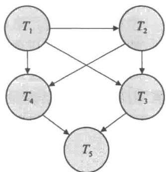


a. 请给出一个表明丢失更新异常的调度示例。


图17-16 实践习题17.6的优先图


b. 请给出一个表明在已提交读隔离性级别下可能发生丢失更新异常的调度示例。

c. 请解释为什么在可重复读隔离性级别下丢失更新异常不可能发生。

17.9 请考虑一个采用快照隔离的银行数据库。请描述一种特定场景，其中出现的非可串行化执行会给银行带来问题。

17.10 请考虑一个采用快照隔离的航空公司数据库。请描述一种特定场景，其中出现了非可串行化执行，但是航空公司可能为了获得更好的整体性能而愿意接受这种场景。

17.11 一个调度的定义假设操作是可以完全按时间排列的。请考虑一个在具有多个处理器的系统上运行的数据库系统，它并不总是能对于运行在不同处理器上的操作确定一种准确的次序。但是，一个数据项上的操作是完全可以排序的。

以上情况是否给冲突可串行化的定义带来问题？请解释你的答案。

## 习题

17.12 请列出 ACID 特性，并解释每种特性的用途。

17.13 在一个事务的执行期间会经过几种状态，直到它最后提交或终止。请列出一个事务可能经过的、所有可能的状态序列。请解释每种状态转换可能出现的原因。

17.14 请解释术语串行调度和可串行化调度之间的区别。

17.15 请考虑以下两个事务：

$$
\begin{array}{l} T _ {1 3}: \text { read } (A); \\ \text { read } (B); \\ \text { if   } A = 0 \text {   then   } B := B + 1; \\ \text { write } (B). \end{array}
$$

$$
\begin{array}{l} T _ {1 4}: \text { read } (B); \\ \text { read } (A); \\ \text { if   B = 0   then   A: = A + 1; } \\ \text { write } (A). \end{array}
$$

832 

令一致性需求为 $A=0 \lor B=0$ ，初值是 A=B=0。

a. 请说明包括这两个事务的每一个串行执行都保持了数据库的一致性。

b. 请给出 $T_{13}$ 和 $T_{14}$ 的一次并发执行，它产生了不可串行化的调度。

c. 存在产生可串行化调度的 $T_{13}$ 和 $T_{14}$ 的并发执行吗？

17.16 请给出具有两个事务的一个可串行化调度的示例，其中事务的提交次序与串行化的次序是不同的。

17.17 什么是可恢复的调度？为什么要求调度的可恢复性？存在需要允许出现不可恢复调度的情况吗？请解释你的回答。

17.18 为什么数据库系统的确支持事务的并发执行，尽管需要额外的开销来确保并发执行并不会引发任何问题？

17.19 请解释为何已提交读隔离性级别保证调度是无级联的。

17.20 对于以下每种隔离性级别，请给出一个满足指定的隔离性级别但并不是可串行化调度的示例：a. 未提交读。

b. 已提交读。

c. 可重复读。

17.21 假设除了 read 和 write 操作之外，我们还允许一个操作 pred_read(r, P)，它读取关系 r 中满足谓词 P 的所有元组。

a. 请给出一个使用 pred_read 操作的调度示例，它展示了幻象现象并且其结果是非可串行化的。

b. 请给出一个调度的示例，其中一个事务在关系 $r$ 上使用 pred_read 操作，另一个并发事务从 $r$ 中删除一个元组，但是该调度中没有出现幻象冲突。（为此，你需要给出关系 $r$ 的模式，并且显示待删除元组的属性值。）

833 

## 延伸阅读

[Gray and Reuter (1993)] 详细介绍了事务处理的概念、技术和实现细节，包括并发控制和恢复问题。[Bernstein and Newcomer (1997)] 讨论了事务处理的多个方面。

[Eswaran et al. (1976)] 对可串行化的概念进行了形式化描述，这同 System R 的并发控制方面的工作相关联。

事务处理所涵盖的具体方面（如并发控制和恢复）的参考文献见第18章和第19章。

## 参考文献


[Bernstein and Newcomer (2009)] P. A. Bernstein and E. Newcomer, Principles of Transaction Processing, 2nd edition, Morgan Kaufmann (2009). 


[Eswaran et al. (1976)] K. P. Eswaran, J. N. Gray, R. A. Lorie, and I. L. Traiger, "The Notions of Consistency and Predicate Locks in a Database System", Communications of the ACM, Volume 19, Number 11 (1976), pages 624–633. 


[Gray and Reuter (1993)] J. Gray and A. Reuter, Transaction Processing: Concepts and Techniques, Morgan Kaufmann (1993). 


834 