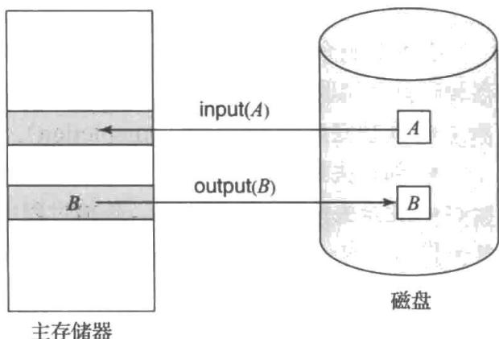
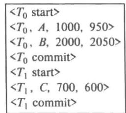
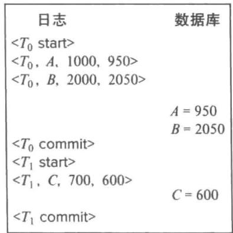
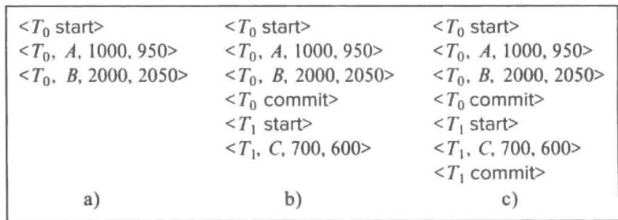
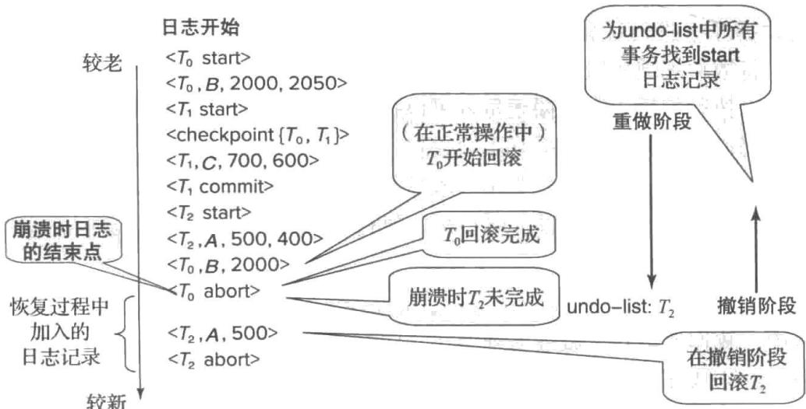
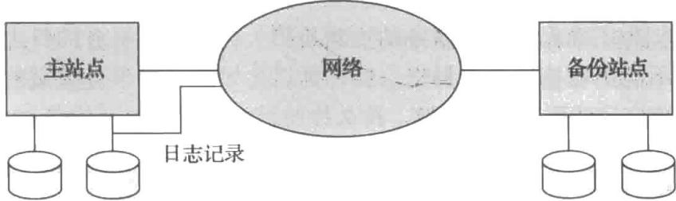
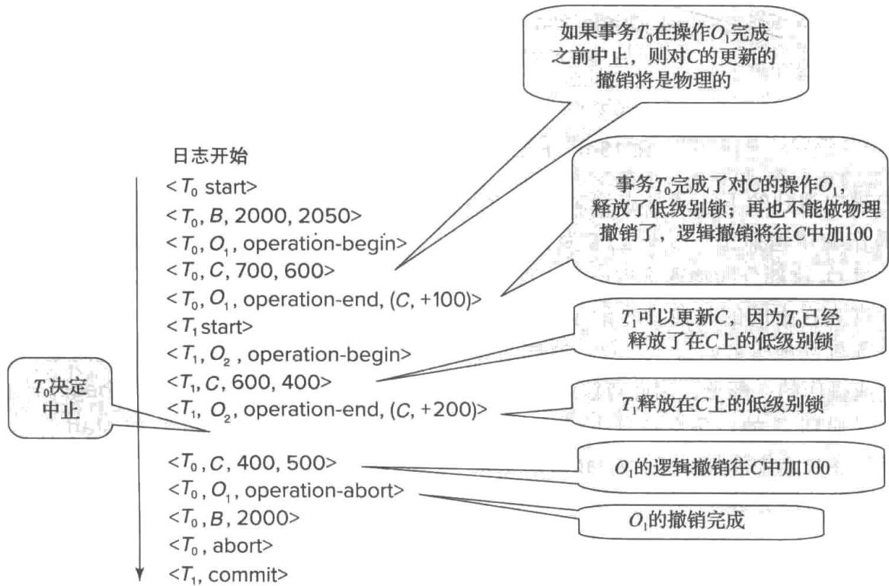
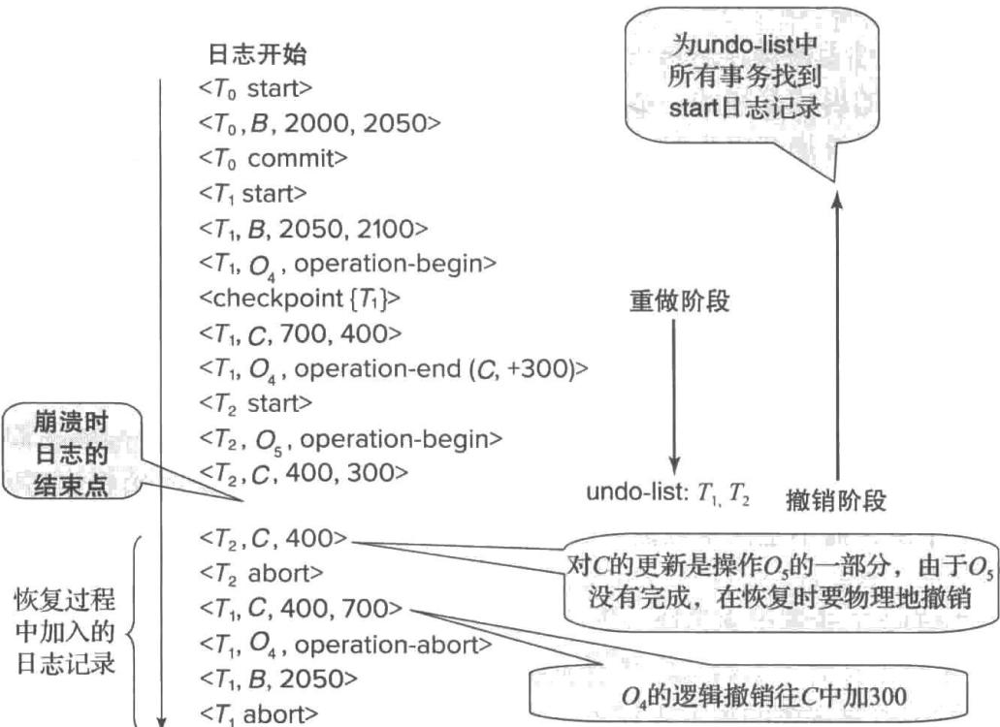
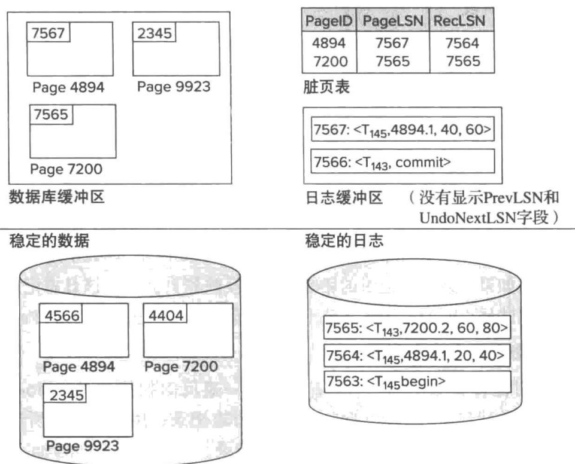
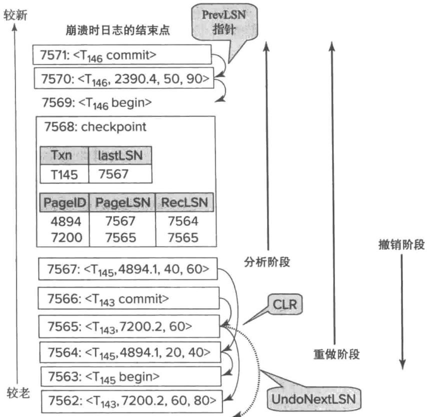

## 恢复系统

计算机系统像其他任何设备一样会发生故障。故障的原因多种多样，包括磁盘故障、电源故障、软件错误、机房失火，甚至人为破坏。一旦有任何故障发生，就可能丢失信息。因此，数据库系统必须预先采取措施，以确保第17章中介绍的事务的原子性和持久性能够保持。恢复机制（recovery scheme）是数据库系统必不可少的组成部分，它可以将数据库恢复到故障发生前的一致性状态。

恢复机制还必须提供高可用性（high availability），即数据库应该在很高的百分比时间内可用。为了在机器出现故障时（以及为硬件/软件升级和维护而计划的机器停机时）支持高可用性，恢复机制必须支持使数据库的备份拷贝与数据库主拷贝的当前内容保持同步的能力。如果具有主拷贝的计算机出现故障，则可以在备份拷贝上继续进行事务处理。

## 19.1 故障分类

系统可能发生的故障有很多种，每种故障需要不同的方式来处理。本章中，我们将只考虑如下类型的故障：

- 事务故障（transaction failure）。有两种错误可能造成事务执行失败：

○ 逻辑错误（logical error）。事务由于某些内部情况而无法继续其正常执行，这样的内部情况诸如非法输入、找不到数据、溢出或超出资源限制。

- 系统错误（system error）。系统进入一种不良状态（如死锁），其结果是事务无法继续其正常执行。但该事务可以在之后的某个时间重新执行。

- 系统崩溃（system crash）。硬件故障，或者是数据库软件或操作系统的漏洞，导致易失性存储器内容的丢失，并使得事务处理停止。但非易失性存储器内容完好无损且没被破坏。

硬件错误和软件漏洞致使系统终止，但不破坏非易失性存储器内容的假设被称为故障－停止假设（fail-stop assumption）。设计良好的系统在硬件和软件层有大量的内部检查，一旦有错误发生就会将系统停止。因此，故障－停止假设是合理的。

- 磁盘故障（disk failure）。在数据传输操作中由于磁头损坏或故障造成磁盘块上的内容丢失。其他磁盘上的数据拷贝，或三级介质（如 DVD 或磁带）上的归档备份可用于从这种故障中恢复。

要确定系统该如何从故障中恢复，我们需要识别用于存储数据的那些设备的故障方式。其次，我们必须考虑这些故障方式是如何影响数据库内容的。然后，我们可以提出在故障发生后仍保证数据库一致性以及事务原子性的算法。这些算法称为恢复算法，由两部分组成：

1. 在正常事务处理中采取措施，保证存在足够的信息可用于故障恢复。

2. 故障发生后采取措施，将数据库内容恢复到某个保证数据库一致性、事务原子性及持久性的状态。

## 19.2 存储器

正如我们在第 13 章中所看到的，数据库中的各种数据项可在多种不同存储介质上存储并访问。在 17.3 节中。我们看到存储介质可以按照它们的相对速度、容量和对故障的恢复性来划分。我们把存储器分为三类：

1. 易失性存储器（volatile storage）。

2. 非易失性存储器（non-volatile storage）。

3. 稳定存储器（stable storage）。

稳定存储器，或更准确地说是接近稳定的存储器，在恢复算法中起到至关重要的作用。908

## 19.2.1 稳定存储器的实现

要实现稳定存储器，我们需要在多个非易失性存储介质（通常是磁盘）中以独立的故障模式复制所需信息，并且以可控的方式更新信息，以保证在数据传输中发生的故障不会破坏所需信息。

回顾前面（从第 12 章开始）讲过 RAID 系统保证单个磁盘的故障（即使发生在数据传输中）不会导致数据丢失。最简单并且最快的 RAID 形式是镜像磁盘，即在不同的磁盘上为每个磁盘块保存两份拷贝。RAID 的其他形式代价低一些，但性能也差一些。

但是，RAID 系统不能防止由于诸如火灾或洪水之类的灾难而导致的数据丢失。许多系统通过将归档备份存储在磁带上并转移到其他地方来防止这种灾难。但是，由于磁带不能被连续不断地移至其他地方，最后一次磁带被移至其他地方以后所做的更新可能会在这样的灾难中丢失。更安全的系统在远程站点为稳定存储器的每个块保存一份拷贝，除在本地磁盘系统进行块存储外，还通过计算机网络写到远程去。由于在往本地存储器输出块的同时也要输出到远程系统，一旦输出操作完成，即使发生火灾或洪水那样的灾难，输出结果也不会丢失。我们将在 19.7 节学习这种远程备份（remote backup）系统。

在本节剩余的部分中，我们将讨论如何在数据传输中保护存储介质不受故障影响。在内存和磁盘存储器之间进行块传送有以下几种可能结果：

- 成功完成（successful completion）。被传输的信息安全到达其目的地。

- 部分失败（partial failure）。传输过程中发生故障，目的地块中有不正确信息。

- 完全失败（total failure）。传输过程中故障发生得足够早，目的地块未被写入任何信息。

我们要求，如果发生数据传输故障（data-transfer failure），系统能检测到并且调用恢复过程将块恢复到一致性状态。为满足这个要求，系统必须为每个逻辑数据库块维护两个物理块；在镜像磁盘的情况下，两个块在同一地点；在远程备份的情况下，一个块在本地，而另一个在远程站点。输出操作的执行如下：

1. 将信息写入第一个物理块。

2. 当第一次写成功完成时，将相同信息写入第二个物理块。

3. 只有第二次写成功完成后，输出才算完成。

如果在对块进行写的过程中系统发生故障，有可能一个块的两份拷贝互相之间不一致。在恢复过程中，对于每一个块，系统需要检查它的两份拷贝。如果它们相同并且没有检测到错误存在，则不需要采取进一步动作。（回顾前面，磁盘块中的某些错误（如部分写块）可由存储在每个块中的校验和检测到。）如果系统检测到一个块中有错误，则可以用另一个块的内容来替换这一块的内容。如果两个块都没有检测出错误，但它们的内容不一致，那么系统可以用第二块的值替换第一块的内容，或者用第一块的值替换第二块的内容。不管用哪种方法，恢复过程都保证，对稳定存储器的写要么完全成功（即更新所有拷贝），要么不产生任何变化。

在恢复过程中要求比较每一对相应块的开销太大。通过使用少量非易失性 RAM，跟踪正在进行的对块的写操作，我们可以大大降低开销。在恢复时，只需比较正在写的块。

将块写到远程站点的协议类似于将块写到镜像磁盘系统的协议，我们在第12章讨论过了，特别是在实践习题12.6中。

我们可以将这个过程很容易地扩展为允许为稳定存储器的每一个块使用任意多数量的拷贝。尽管使用大量拷贝比使用两份拷贝发生故障的可能性要低，但通常只用两份拷贝来模拟稳定存储器是合理的。

## 19.2.2 数据访问

正如我们在第 12 章中所看到的，数据库系统常驻留于非易失性存储器（通常是磁盘），在任何时候都只有数据库的部分内容在内存中。（在主存数据库中，整个数据库都驻留于内存，但拷贝仍驻留于非易失性存储器，以便当主存内容丢失时数据能够保存。）数据库被分成称为块（block）的定长存储单位。块是数据传输到磁盘或从磁盘输出的单位，可能包含多个数据项。我们假设没有数据项跨两个或多个块。这种假设对于大多数数据处理应用（例如银行或大学应用）来说都是现实的。

事务从磁盘向主存输入信息，然后将信息输出回磁盘。输入和输出操作以块为单位完成。驻留在磁盘上的块称为物理块（physical block），临时驻留在主存中的块称为缓冲块（buffer block）。内存中用于临时驻留块的区域称为磁盘缓冲区（disk buffer）。

磁盘和主存之间的块移动是由下面两种操作引发的：

1. input(A) 传送物理块 A 至主存。

2. output(B) 传送缓冲块 B 至磁盘，并替换磁盘上相应的物理块。

这一机制如图 19-1 所示。

概念上，每个事务 $T_{i}$ 有一个私有工作区，用于保存所访问及更新的数据项的拷贝。系统在事务初始化时创建该工作区；系统在事务提交或中止时删除它。事务的工作区中保存的每个数据项 X 记为 $x_{i}$ 。事务 $T_{i}$ 通过将数据从系统缓冲区移入其工作区或从其工作区移出数据到

图 19-1 块存储操作

系统缓冲区来与数据库系统进行交互。我们使用以下两个操作来传送数据。

1. read(X) 将数据项 X 的值赋予局部变量 $x_{i}$ 。该操作执行如下：

a. 若 X 所在块 $B_{X}$ 不在主存，则发指令执行 input( $B_{X}$ )。

b. 将缓冲块中 X 的值赋予 $x_{i}$ 。

2. write(X) 将局部变量 $x_{i}$ 的值赋予缓冲块中的数据项 X。该操作执行如下：

a. 若 X 所在块 $B_{X}$ 不在主存，则发指令执行 input( $B_{X}$ )。

b. 将 $x_{i}$ 的值赋予缓冲块 $B_{X}$ 中的 X。

注意，这两个操作都可能需要将块从磁盘传送到主存。但是，它们都没有特别指明需要将块

从主存传送到磁盘。

缓冲块被最终写到磁盘，要么是因为缓冲区管理器因其他用途需要内存空间，要么是因为数据库系统希望将 B 的变化反映到磁盘上。如果数据库系统发指令执行 output(B)，我们就称数据库系统对缓冲块 B 执行强制输出（force-output）。

当事务首次需要访问数据项 X 时，它必须执行 $\text{read}(X)$ 。然后，事务对 X 的所有更新都作用于 $x_{i}$ 。在事务执行中的任何时间点，事务都可以执行 $\text{write}(X)$ ，以在数据库中反映 X 的变化；在对 $x_{i}$ 进行最后的写之后，当然必须做 $\text{write}(X)$ 。

对 $X$ 所在的缓冲块 $B_{X}$ 的 output $(B_{X})$ 操作不需要在 write $(X)$ 执行后立即执行，因为块 $B_{X}$ 可能包含其他仍在被访问的数据项。因此，可能过一段时间后才真正执行输出。注意，如果在 write $(X)$ 操作执行后但在 output $(B_{X})$ 操作执行前系统崩溃， $X$ 的新值并未写入磁盘，于是就丢失了 $X$ 的新值。正如我们很快会看到的，数据库系统执行额外的动作来保证，即使发生了系统崩溃，由已提交事务所做的更新也不会丢失。

## 19.3 恢复与原子性

再来考虑我们简化的银行系统和事务 $T_{i}$ ，它将50美元从账户 $A$ 转到账户 $B$ ， $A$ 和 $B$ 的初始值分别为1000美元和2000美元。假设在 $T_{i}$ 执行过程中，在 $\text{output}(B_A)$ 之后，但在 $\text{output}(B_B)$ 执行之前，发生了系统崩溃，其中 $B_A$ 和 $B_B$ 表示 $A$ 和 $B$ 所在的缓冲块。由于内存的内容丢失，我们无法知道事务的结局。

当系统重新启动时，A 的值会是 950 美元，而 B 的值会是 2000 美元，这显然和事务 $T_{i}$ 的原子性需求不一致。遗憾的是，通过检查数据库状态没有办法来发现在系统崩溃发生前哪些块已经被输出，哪些块还没有。有可能事务已经完成了，对稳定存储器上的数据库初始状态 A 和 B 的值进行了更新，分别为 1000 美元和 1950 美元；也可能事务根本没有对稳定存储器产生任何影响，A 和 B 的值就是初始的 950 美元和 2000 美元；或者更新后的 B 已经输出了，而更新后的 A 还没有输出；或更新后的 A 已经输出了，而更新后的 B 还没有输出。

我们的目标是要么执行 $T_{i}$ 对数据库的所有修改，要么不执行其任何修改。但是，若执行多处数据库修改，就可能需要多个输出操作，并且故障可能发生于某些修改完成后而全部修改完成前。

为达到保持原子性的目标，我们必须在修改数据库本身之前，首先向稳定存储器输出信息，描述要做的修改。我们将看到，这种信息能帮助我们确保已提交事务所做的所有修改都反映到数据库中（或者在故障后的恢复过程中反映到数据库中）。如果执行修改的事务失败（中止），我们还需要存储有关被修改的任意项的旧值的信息。此信息可以帮助我们撤销失效事务所做的修改。

最常用的恢复技术是基于日志记录的，本章我们将详细描述基于日志的恢复（log-based recovery）。还有另一种被称为影子拷贝的方法，被用于文本编辑器但不用于数据库系统中；这种方法在注释 19-1 中进行了概述。

## 注释 19-1 影子拷贝和影子分页

在影子拷贝（shadow-copy）模式下，想要更新数据库的事务首先创建数据库的一个完整拷贝。所有更新在数据库的这个新拷贝上进行，而不去动那个原来的拷贝（影子拷贝）。如果在任何时间点上事务需要被中止，系统仅仅删除这个新拷贝。数据库的旧拷贝没有受到影响。数据库的当前拷贝由一个指针来标识，称作数据库指针，它存放在磁盘上。

如果事务部分提交（即，执行了它的最后一条语句），那么它按如下方式提交。首先，要求操作系统确保数据库新拷贝的所有页面都已写出到磁盘上。（UNIX系统使用fsync命令来达到此目的。）在操作系统将所有页面都写到磁盘上之后，数据库系统更新数据库指针，让它指向数据库的新拷贝；然后新拷贝变成数据库的当前拷贝。之后删掉数据库的旧拷贝。从更新后的数据库指针写到磁盘上这一时间点开始，事务才能说是已经提交了。

影子拷贝的实现实际上依赖于对数据库指针的写是原子的；也就是说，或者它的所有字节全部写出，或者没有任何字节写出。磁盘系统提供对整个块或至少是对一个磁盘扇区的原子更新。换句话说，只要我们确保数据库指针完全处于单个扇区中，磁盘系统就能保证原子地更新数据库指针。而我们通过将数据库指针存放在块的开头来保证数据库指针完全处于单个扇区中。

影子拷贝模式普遍用于文本编辑器（保存文件等价于事务提交，不保存文件就退出等价于事务中止）。影子拷贝可用于小的数据库，但拷贝一个大型数据库代价极其昂贵。影子拷贝的一个变种称作影子分页（shadow-paging），它采用如下方式来减少拷贝的代价：此种模式使用一个页表来保存指向所有页面的指针；页表自身和所有更新了的页面被拷贝到一个新的位置。事务没有更新的任何页面都不拷贝，而新的页表只存储一个指向原来页面的指针。当事务提交时，它原子地更新指向页表的指针去指向新的拷贝，这里页表的作用和数据库指针相同。

遗憾的是，影子分页对于并发事务效果不是很好，在数据库中没有被广泛使用。

## 19.3.1 日志记录

使用最为广泛的记录数据库修改的结构就是日志（log）。日志是日志记录（log record）的序列，它记录了数据库中的所有更新活动。

日志记录有几种。更新日志记录（update log record）描述一次数据库写操作，它具有以下字段：

- 事务标识（transaction identifier），是执行 write 操作的事务的唯一标识。

- 数据项标识（data-item identifier），是所写数据项的唯一标识。通常是数据项在磁盘上的位置，包括该数据项所驻留的块的块标识以及块内偏移量。

- 旧值（old value），是数据项的写前值。

- 新值（new value），是数据项写后应取的值。

我们将一条更新日志记录表示为 $<T_{i}, X_{j}, V_{1}, V_{2}>$ ，表明事务 $T_{i}$ 对数据项 $X_{j}$ 执行写操作。写之前 $X_{j}$ 的值是 $V_{1}$ ，写之后 $X_{j}$ 的值是 $V_{2}$ 。还有其他专门的日志记录用于记录事务处理过程中的重要事件，如事务的开始以及事务的提交或中止。如下是一些日志记录类型：

- $<T_{i}$ start>。事务 $T_{i}$ 开始。

- $<T_{i}$ commit>。事务 $T_{i}$ 提交。

- $<T_{i}$ abort>。事务 $T_{i}$ 中止。

后面我们将介绍几种其他类型的日志记录。

每次事务执行写操作时，在数据库被修改前创建该写操作的日志记录并把它加到日志中是非常关键的。一旦日志记录已存在，我们就可以根据需要将修改输出到数据库中。并且，我们有能力对已经输出到数据库的修改进行撤销，我们是利用日志记录中的旧值字段来进行撤销的。

为了从系统故障和磁盘故障中恢复时能使用日志记录，日志必须存放在稳定存储器中。现在我们假设每条日志记录创建后立即写入稳定存储器上日志的尾部。在19.5节中，我们将看到什么时候放宽这个要求是安全的，以便减少写日志带来的开销。注意，日志包含了所有数据库活动的完整记录，所以日志中存储的数据量会变得大得离谱，在19.3.6节中，我们将展示什么时候可以安全地清除日志信息。

## 19.3.2 数据库修改

正如我们前面已经注意到的，事务在对数据库进行修改前创建了一条日志记录。日志记录使得系统在事务必须被中止的情况下能够对事务所做的修改进行撤销；并且在事务已经提交但在修改被存放到磁盘上的数据库之前系统崩溃的情况下，还能够对事务所做的修改进行重做。为了使我们能够理解在恢复中这些日志记录所起的作用，我们需要考虑事务在进行数据项修改中所采取的步骤：

1. 事务在主存中自己私有的那部分空间执行某些计算。

2. 事务修改主存的磁盘缓冲区中包含该数据项的数据块。

3. 数据库系统执行 output 操作，将数据块写到磁盘中。

如果一个事务执行了对磁盘缓冲块或磁盘本身的更新，我们说这个事务修改了数据库；而事务在主存中私有部分所进行的更新不算数据库修改。如果一个事务直至提交时都没有修改数据库，就说它采用了延迟修改（deferred-modification）技术。如果在事务仍然活跃时就发生数据库修改，就说它采用了立即修改（immediate-modification）技术。延迟修改的开销是，事务需要做更新过的所有数据项的本地拷贝；并且，如果一个事务读它更新过的数据项，它必须从自己的本地拷贝中读。

我们在本章中描述的恢复算法支持立即修改。正如所描述的那样，即使对于延迟修改它们也能正确工作，但是当与延迟修改一起使用时可以进行优化来减少开销；我们将细节留作练习。

恢复算法必须考虑多种因素，包括：

- 有可能一个事务已经提交了，虽然它所做的某些数据库修改还仅仅存在于主存的磁盘缓冲区中，而不在磁盘上的数据库中。

- 有可能处于活跃状态的事务已经修改了数据库，而后来发生的故障导致这个事务需要中止。

由于执行所有的数据库修改之前必须先创建日志记录，所以系统可以使用数据项修改前的旧值和要写给数据项的新值。这就要求系统能够执行适当的撤销和重做操作。

- 撤销操作使用一条日志记录，将该日志记录中指定数据项置为日志记录中包含的旧值。

- 重做操作使用一条日志记录，将该日志记录中指定数据项置为日志记录中包含的新值。

## 19.3.3 并发控制与恢复

如果并发控制机制允许被一个事务 $T_{1}$ 修改过的数据项 X 在 $T_{1}$ 提交前进而被另一个事务 $T_{2}$ 修改，那么通过将 $X$ 重置为它的旧值（ $T_{1}$ 更新之前 $X$ 的值）来撤销 $T_{1}$ 的影响的同时也会撤销 $T_{2}$ 的影响。为避免这种情况，恢复算法通常要求如果一个数据项被一个事务修改了，那么在该事务提交或中止前不允许其他事务修改该数据项。

这一要求可以通过对被更新的任意数据项获取排他锁并且持有该锁直至事务提交来保证；换句话说，通过使用严格的两阶段封锁来保证。快照隔离性和基于有效性检查的并发控制技术在有效性检查时、在修改数据项之前，也要获取数据项上的排他锁，并持有该锁直至事务提交；其结果是，即使使用这些并发控制协议，上述要求也能得到满足。

我们将在 19.8 节中讨论在特定情况下该如何放松上述要求。

在采用快照隔离或有效性检测进行并发控制时，事务所做的数据库更新（概念上地）被延迟到事务部分提交时；延迟修改技术与这些并发控制机制自然吻合。然而，值得注意的是，快照隔离的某些实现采用了立即修改技术，但根据需要提供了一个逻辑快照：当事务需要读被并发的事务所更新的一个数据项时，就生成（已经更新了的）该数据项的一份拷贝，在数据项的这份拷贝上，并发事务所做的更新被回滚。类似地，数据库立即修改技术与两阶段封锁自然吻合，但延迟修改也可以和两阶段封锁一起使用。

## 19.3.4 事务提交

当一个事务的 commit 日志记录（这是事务的最后一条日志记录）被输出到稳定存储器后，我们就说这个事务提交了；此时所有更早的日志记录都已经被输出到稳定存储器。于是，在日志中就有足够的信息来保证：即使发生系统崩溃，事务所做的更新也可以被重做。如果系统崩溃发生在 $<T_{i}$ commit> 日志记录被输出到稳定存储器之前，事务 $T_{i}$ 将被回滚。这样，包含 commit 日志记录的块的输出是单个的原子动作，它导致一个事务的提交 $^{\ominus}$ 。

对于大多数基于日志的恢复技术，包括我们在本章中描述的技术，在一个事务提交时不是必须立即将包含被该事务修改了的数据项的块输出到稳定存储器，而是可以在以后的某个时候再输出。我们将在19.5.2节进一步讨论这个问题。

## 19.3.5 使用日志来重做和撤销事务

现在，我们概述如何使用日志来从系统崩溃中进行恢复以及在正常操作中对事务进行回滚。但是，我们将故障恢复和回滚过程的细节介绍推迟到19.4节。

考虑简化了的银行系统。令 $T_{0}$ 是一个事务，它从账户 A 转 50 美元到账户 B：

$$
\begin{array}{l} T _ {0}: \text {   read } (A); \\ A := A - 5 0; \\ \text { write } (A); \\ \text { read } (B); \\ B := B + 5 0; \\ \text { write } (B). \end{array}
$$

令 $T_{1}$ 是一个事务，它从账户 $C$ 中取出100美元：

$$
\begin{array}{l} T _ {1}: \text { read } (C); \\ C := C - 1 0 0; \\ \text { write } (C). \end{array}
$$

日志中包含的与这两个事务相关的信息部分如图 19-2 所示。

图 19-3 显示了一种可能的顺序，在这种顺序中，作为 $T_{0}$ 和 $T_{1}$ 的执行结果，对于数据库系统和日志都发生了实际输出 $^{①}$ 。

917 

图 19-2 系统日志中相应

于 $T_{0}$ 和 $T_{1}$ 的部分

图 19-3 相应于 $T_{0}$ 和 $T_{1}$ 的系统

日志与数据库状态

使用日志，系统可以应对任何故障，只要它不导致非易失性存储器中信息的丢失。恢复机制使用两个恢复过程，这两个过程都利用日志来找到被每个事务 $T_{i}$ 更新过的数据项的集合，以及它们相应的旧值和新值。

- redo( $T_i$ )。该过程将事务 $T_i$ 更新过的所有数据项的值都置成新值。通过重做来执行更新的顺序是非常重要的；当从系统崩溃中恢复时，如果对特定数据项的多次更新的执行顺序不同于它们原来的执行顺序，那么该数据项的最终状态将是一个错误的值。大多数的恢复算法，包括我们在 19.4 节中描述的算法，都没有把每个事务的重做单独地执行，而是对日志进行一次扫描，在扫描过程中每遇到一条日志记录就执行重做动作。这种方式能确保更新顺序被保持，并且效率更高，因为仅需要整体读一遍日志，而不是为每个事务读一遍日志。

- undo $(T_{i})$ 。该过程将事务 $T_{i}$ 更新过的所有数据项的值都恢复成旧值。我们在19.4节所描述的恢复机制中：

撤销操作不仅将数据项恢复成它们的旧值，而且作为撤销过程的一个部分，还写日志记录来记下所执行的更新。这些日志记录是特殊的 redo-only 日志记录，因为它们不需要包含所更新数据项的旧值。请注意，当在撤销过程中使用此类日志记录时，“旧值”实际上是正在回滚的事务写入的值，“新值”是正在通过撤销操作恢复的原始值。

与重做过程一样，执行撤销操作的顺序是非常重要的；我们还是将细节推迟到 19.4 节介绍。

○ 当对于事务 $T_{i}$ 的撤销操作完成后，写一条 $<T_{i} abort>$ 日志记录，表明 undo 完成了。

正如我们将在 19.4 节中看到的那样，如果事务在正常的处理中被回滚，或者在系统崩溃后的恢复中既没有发现事务 $T_{i}$ 的 commit 记录，也没有发现它的 abort 记录，那么 undo( $T_{i}$ ) 过程对于每个事务只执行一次。其结果是，每个事务在日志中最终都有一条 commit 记录，或者有一条 abort 记录。

发生系统崩溃之后，系统为保证原子性而查阅日志以确定哪些事务需要进行重做，哪些事务需要进行撤销。

- 如果日志中包括 $<T_{i}$ start>记录，但既不包括 $<T_{i}$ commit>，也不包括 $<T_{i}$ abort>记录，这样的事务 $T_{i}$ 需要进行撤销。

- 如果日志中包括 $<T_{i}$ start>记录，以及 $<T_{i}$ commit>或 $<T_{i}$ abort>记录，这样的事务 $T_{i}$ 需要进行重做。如果日志中包括 $<T_{i}$ abort>记录还要重做 $T_{i}$ ，看来比较奇怪。要明白这是为什么，请注意如果在日志中有 $<T_{i}$ abort>记录，日志中也会有撤销操作所写的那些 redo-only 日志记录。于是，这种情况下最终结果将是对 $T_{i}$ 所做的修改进行撤销。这一丁点儿冗余简化了恢复算法，并使得整个恢复时间变得更短。

作为例证，回到我们的银行示例，有事务 $T_{0}$ 和 $T_{1}$ ，按照 $T_{1}$ 跟在 $T_{0}$ 后面的顺序依次执行。假定在事务完成之前系统崩溃。我们将考虑三种情况。在图 19-4 中显示了各种情况下的日志状态。

图 19-4 在三种不同时间显示的同一份日志

首先，我们假定崩溃恰好发生在事务 $T_{0}$ 的

$$
\operatorname{write} (B)
$$

步骤的日志记录已经被写到稳定存储器之后（见图19-4a）。当系统重新启动时，它在日志中找到记录 $<T_{0}$ start>，但是没有相应的 $<T_{0}$ commit>或 $<T_{0}$ abort>记录。这样，事务 $T_{0}$ 必须被撤销，于是执行undo $(T_{0})$ 。其结果是，（磁盘上）账户 $A$ 和 $B$ 的值被分别恢复成1000美元和2000美元。

其次，我们假定崩溃恰好发生在事务 $T_{1}$ 的

$$
\operatorname{write} (C)
$$

步骤的日志记录已经被写到稳定存储器之后（见图 19-4b）。当系统重新启动时，需要采取两种恢复动作。因为 $<T_{1}$ start> 记录出现在日志中，但是没有 $<T_{1}$ commit> 或 $<T_{1}$ abort> 记录，所以必须执行 undo( $T_{1}$ )。因为日志中既包括 $<T_{0}$ start> 记录，又包括 $<T_{0}$ commit> 记录，所以必须执行 redo( $T_{0}$ )。在整个恢复过程结束时，账户 A、B 和 C 的值分别为 950 美元、2050 美元和 700 美元。

最后，我们假定崩溃恰好发生在日志记录

$$
<   T _ {1} \text {   commit } >
$$

已经被写到稳定存储器之后（见图19-4c）。当系统重新启动时，因为 $<T_{0}$ start>记录和 $<T_{0}$ commit>记录都在日志中，并且 $<T_{1}$ start>记录和 $<T_{1}$ commit>记录也都在日志中，所以 $T_{0}$ 和 $T_{1}$ 都必须重做。在系统执行 $\mathrm{redo}(T_0)$ 和 $\mathrm{redo}(T_1)$ 恢复过程后，账户 $A$ 、 $B$ 和 $C$ 的值分别为950美元、2050美元和600美元。

## 19.3.6 检查点

当发生系统故障时，我们必须查阅日志，决定哪些事务需要重做，哪些事务需要撤销。原则上，我们需要搜索整个日志来确定上述信息。这种方式有两个主要的困难：

1. 搜索过程太耗时。

2. 根据我们的算法，大多数需要重做的事务已经将其更新写入数据库中。尽管重做它们不会造成不良后果，但会使恢复过程变得更长。

为降低这种开销，我们引入检查点。

下面我们描述一种简单的检查点机制，它在检查点操作过程中不允许执行任何更新，在执行检查点的过程中将所有修改过的缓冲块都输出到磁盘。我们后面会讨论如何通过放松这两条要求来修改检查点和恢复过程，以提供更高的灵活性。

检查点的执行过程如下：

920 

1. 将当前位于主存的所有日志记录输出到稳定存储器。

2. 将所有修改过的缓冲块输出到磁盘。

3. 将一条形如 <checkpoint L> 的日志记录输出到稳定存储器，其中 L 是执行检查点时正活跃的事务的列表。

检查点执行过程中，不允许事务执行任何更新动作，如往缓冲块中写入或写日志记录。我们将在19.5.2节中会讨论如何强制满足这个要求。

日志中加入 <checkpoint L> 记录使得系统提高了其恢复过程的效率。考虑在检查点前已完成的事务 $T_{i}$ 。对于这样的事务，在日志中 $<T_{i}$ commit > 记录（或 $T_{i} < abort >$ 记录）出现在 <checkpoint> 记录之前。 $T_{i}$ 所做的任何数据库修改都必然已在检查点前或作为检查点本身的一部分写入数据库。因此，在恢复时就不必再对 $T_{i}$ 执行 redo 操作了。

在系统崩溃发生之后，系统检查日志以找到最后一条 <checkpoint L> 记录（这可以通过从日志尾端开始反向搜索日志，直至找到第一条 <checkpoint L> 记录来实现）。

只需要对 L 中的事务，以及 <checkpoint L> 记录写到日志中之后才开始执行的所有事务进行 redo 或 undo 操作。让我们把这个事务集合记为 T。

- 对 $T$ 中所有事务 $T_{k}$ ，若日志中既没有 $\langle T_{k} \text{ commit} \rangle$ 记录，也没有 $\langle T_{k} \text{ abort} \rangle$ 记录，则执行 $\text{undo}(T_{k})$ 。

- 对 $T$ 中所有事务 $T_{k}$ ，若日志中有 $\langle T_{k} \text{ commit} \rangle$ 记录或 $\langle T_{k} \text{ abort} \rangle$ 记录，则执行 $\operatorname{redo}(T_{k})$ 。

请注意，要找出事务集合 T，并确定 T 中的每个事务是否有 commit 或 abort 记录出现在日志中，我们只需要检查从最后一条 checkpoint 日志记录开始的日志部分。

作为一个示例，考虑事务集合 $\{T_{0}, T_{1}, \cdots, T_{100}\}$ 。假设最近的检查点发生在事务 $T_{67}$ 和 $T_{69}$ 执行的过程中，而 $T_{68}$ 和下标小于 67 的所有事务在检查点之前都已完成。于是，在恢复机制中只需要考虑事务 $T_{67}, T_{69}, \cdots, T_{100}$ 。其中已完成（即已提交或已终止）的需要重做；否则就是未完成的，需要撤销。

考虑检查点日志记录中的事务集合 L。对于 L 中的每一个事务 $T_{i}$ ，如果它没有提交，那么为了撤销该事务，可能需要出现在检查点日志记录之前的该事务的所有日志记录。然而，一旦检查点完成，位于最早出现的 $\langle T_{i} \text{start} \rangle$ 日志记录之前的所有日志记录就不再需要了，这里的 $T_{i}$ 是 L 中的事务。只要数据库系统需要回收被这些记录占用的空间，就可以清掉这些日志记录。

在检查点过程中不允许事务对缓冲块或日志执行任何更新，这一要求可能会引起麻烦，因为在检查点进行的过程中事务处理就必须停下来。模糊检查点（fuzzy checkpoint）是一种即使在缓冲块正在被写出时也允许事务执行更新的检查点。19.5.4节将对模糊检查点机制进行描述。在19.9节中，我们描述一种检查点机制，它不仅是模糊的，甚至不要求在做检查点时将所有修改过的缓冲块输出到磁盘中。

## 19.4 恢复算法

到目前为止，在对故障恢复的讨论中，我们确定了需要对哪些事务进行重做，对哪些事务进行撤销，但是我们没有给出执行这些动作的详细算法。现在我们来给出使用日志记录从事务故障中恢复的完整的恢复算法（recovery algorithm），以及将最近的检查点与日志记录结合起来以从系统崩溃中进行恢复的算法。

本节描述的恢复算法要求被未提交事务更新过的数据项不能被任何其他事务修改，直至更新它的事务要么提交要么中止。这一限制我们在19.3.3节中曾经讨论过。

## 19.4.1 事务回滚

首先考虑正常操作时（即，不是从系统崩溃中恢复时）的事务回滚。事务 $T_{i}$ 的回滚执行如下：

1. 从后往前扫描日志，对于所发现的 $T_{i}$ 的每条形如 $\langle T_{i}, X_{j}, V_{1}, V_{2} \rangle$ 的日志记录：

a. 将值 $V_{1}$ 写到数据项 $X_{j}$ 。

b. 往日志中写一条特殊的 redo-only 日志记录 $<T_{i}, X_{j}, V_{1}>$ ，其中 $V_{1}$ 是在本次回滚中数据项 $X_{j}$ 被恢复成的值。有时这种日志记录被称作补偿日志记录（compensation log record）。这种日志记录中不需要 undo 信息，因为我们根本不需要去撤销这样的 undo 操作。后面我们会解释如何使用这些日志记录。

2. 一旦发现了 $<T_{i}$ start> 日志记录, 就停止反向扫描, 并往日志中写一条 $<T_{i}$ abort> 日志记录。

请注意，事务所做的或者我们为事务做的每个更新动作，包括将数据项恢复成其旧值的动作，现在都记录到日志中了。在19.4.2节中，我们将看到为什么这是个好办法。

## 19.4.2 系统崩溃后的恢复

当崩溃发生后数据库系统重启时，恢复动作分两阶段进行：

1. 在重做阶段，系统通过从最后一个检查点开始正向扫描日志来重演所有事务的更新。被重演的日志记录包括在系统崩溃之前已被回滚的事务的日志记录，以及在系统崩溃发生时还没有提交的事务的日志记录。

这个阶段还确定在崩溃发生时未完成从而必须被回滚的所有事务。这种未完成事务要么在检查点时是活跃的，因而会出现在检查点记录的事务列表中，要么是在检查点之后开始的；而且，这种未完成事务在日志中既没有 $<T_{i}$ abort>记录，也没有 $<T_{i}$ commit>记录。

扫描日志的过程中所采取的具体步骤如下：

a. 将待回滚事务的列表 undo-list 初始化设定为 <checkpoint L> 日志记录中的列表 L。
b. 一旦遇到形为 $\langle T_{i}, X_{j}, V_{1}, V_{2} \rangle$ 的正常日志记录，或形为 $\langle T_{i}, X_{j}, V_{2} \rangle$ 的 redo-only 日志记录，就执行重做操作；也就是说，将值 $V_{2}$ 写给数据项 $X_{j}$ 。

c. 一旦发现形为 $<T_{i}$ start> 的日志记录，就把 $T_{i}$ 加到 undo-list 中。

d. 一旦发现形为 $<T_{i}$ abort> 或 $<T_{i}$ commit> 的日志记录，就把 $T_{i}$ 从 undo-list 中去掉。

2. 在撤销阶段，系统回滚 undo-list 中的所有事务。它通过从尾端开始反向地扫描日志来执行回滚。

a. 一旦发现属于 undo-list 中的事务的日志记录，就执行撤销动作，就像在一个失败事务的回滚过程中发现了该日志记录一样。

b. 当系统发现 undo-list 中的事务 $T_{i}$ 的 $\langle T_{i} \text{ start} \rangle$ 日志记录，它就往日志中写一条 $\langle T_{i} \text{ abort} \rangle$ 日志记录，并把 $T_{i}$ 从 undo-list 中去掉。

c. 一旦 undo-list 变为空，即系统已经找到了初始位于 undo-list 中的所有事务的 $<T_i$ start> 日志记录，则撤销阶段结束。

当恢复过程的撤销阶段结束之后，就可以重新开始正常的事务处理了。

请注意，在重做阶段从最近的检查点记录开始重演每一条日志记录。换句话说，重启恢复的这个阶段重复检查点之后执行并且其日志记录已经存到稳定存储器中的日志的所有更新动作。这些动作包括未完成事务的动作和为回滚失败事务而执行的动作。这些动作按照它们原先执行的次序被重复执行；因此，这一过程称作重复历史（repeating history）。虽然这看起来很浪费，但即使对失败事务也重复历史，这种做法简化了恢复机制。

图 19-5 展示了在正常操作中由日志所记录的动作，以及在故障恢复中执行的动作的一个示例。在图中展示的日志中，在系统崩溃之前，事务 $T_{1}$ 已提交，事务 $T_{0}$ 已被完全回滚。请注意，在 $T_{0}$ 的回滚中如何恢复数据项 B 的值。还请注意检查点记录，它的活跃事务列表中包含 $T_{0}$ 和 $T_{1}$ 。

图 19-5 记录在日志中的动作和恢复中的动作示例

当从崩溃中恢复时，在重做阶段，系统对最后一个检查点记录之后的所有操作执行重做。在这个阶段中，undo-list 列表中初始时包含 $T_{0}$ 和 $T_{1}$ ；当 $T_{1}$ 的 commit 日志记录被发现时，先从列表中去掉 $T_{1}$ ，而当 $T_{2}$ 的 start 日志记录被发现时， $T_{2}$ 被加到列表中。当事务 $T_{0}$ 的 abort 日志记录被发现时， $T_{0}$ 从 undo-list 中去掉，只剩 $T_{2}$ 在 undo-list 中。撤销阶段从

924 尾端开始反向扫描日志，当发现 $T_{2}$ 更新 $A$ 的日志记录时，就将 $A$ 恢复成旧值，并往日志中写一条redo-only 日志记录。当发现 $T_{2}$ 的 start 记录时，就为 $T_{2}$ 添加一条 abort 记录。由于 undo-list 中不再包含任何事务了，撤销阶段终止，恢复完成。

## 19.4.3 提交处理的优化

提交事务需要将其日志记录强制写到磁盘。如果对每个事务分别进行日志刷新，则每次提交都会产生大量的写日志开销。使用组提交（group-commit）技术可以提高事务提交的速率。使用这种技术，系统不会在事务一完成就试图立即强制写日志，而是等待几个事务完成，或者事务完成执行后经过一段时间，然后统一提交正在等待的一组事务。写入稳定存储器上日志的块将包含多个事务的记录。通过谨慎选择组的规模和最长等待时间，系统可以确保在写入稳定存储器时块被写满，且不会使事务过度等待。这种技术使得每个提交事务的平均输出操作更少。

如果将日志记录到硬盘，则写入数据块可能需要5到10毫秒。因此，如果没有组提交，每秒最多可以提交100到200个事务。如果10个事务的记录占用一个磁盘块，则组提交允许每秒提交1000到2000个事务。

如果将日志记录到闪存，不使用组提交时，写入一个块可能需要大约100微秒，每秒可提交10 000个事务。如果10个事务的记录占用一个磁盘块，那么组提交允许在闪存上每秒提交100 000个事务。使用闪存时组提交的另一个好处是，它可以使同一页面的写入次数最少，从而使擦除操作的次数最少，而擦除操作可能是很昂贵的。（回忆一下，闪存存储系统将逻辑页重新映射到预擦除的物理页，从而避免在写入页时延迟。但作为旧版本页的垃圾回收的一部分，擦除操作最终必须执行。）

尽管组提交减少了日志带来的开销，但它会导致执行更新的事务的提交稍有延迟。当提交速率较低时，这种延迟与收益相比是不值当的，但是当事务提交速率较高时，实际上使用组提交可以使提交总延迟减少。

除了在数据库中进行优化之外，程序员还可以采取一些措施来提升事务提交性能。例如，考虑一个将数据加载到数据库中的应用程序。如果该程序将每次插入作为单独的事务执行，则每秒可以执行的插入数受限于每秒可以执行的块写入数。如果应用程序在启动下一次插入之前等待当前插入完成，组提交不会提供任何好处，实际上可能会降低系统速度。但是在这种情况下，通过将一批插入作为单个事务执行，则性能会显著提升。对应于多次插入的日志记录就可以一起写入一个页面。每秒可以执行的插入数会相应增加。

## 19.5 缓冲区管理

在本节中，我们考虑几个微妙的细节，它们对实现确保数据一致性且只增加少量与数据库交互开销的故障恢复机制非常重要。

## 19.5.1 日志记录缓冲

到目前为止，我们假设每条日志记录在创建时都被输出到了稳定存储器。该假设增加了大量系统执行的开销，其原因有几个。通常，向稳定存储器的输出是以块为单位进行的。在大多数情况下，一条日志记录比一个块要小得多。因此，每条日志记录的输出被转化成为在物理层面大得多的输出。另外，正如我们在19.2.1节中所看到的，向稳定存储器输出一个块

可能涉及在物理层上的好几个输出操作。

将一个块输出到稳定存储器的代价非常大，因此最好是一次输出多条日志记录。为了达到这个目的，我们将日志记录写到主存的日志缓冲区中，日志记录在输出至稳定存储器以前临时保存在那儿。在日志缓冲区中可以集中多条日志记录，然后再用一次输出操作输出到稳定存储器中。稳定存储器中的日志记录顺序必须与它们被写入日志缓冲区的顺序完全一致。

由于使用了日志缓冲区，日志记录在被输出到稳定存储器之前可能有相当长一段时间只存在于主存（易失性存储器）中。由于系统发生崩溃时这种日志记录会丢失，我们必须对恢复技术增加一些额外要求以保证事务的原子性：

- 在日志记录 $< T_{i}$ commit> 输出到稳定存储器后，事务 $T_{i}$ 进入提交状态。

- 在日志记录 $< T_{i}$ commit> 输出到稳定存储器前，与事务 $T_{i}$ 有关的所有日志记录必须已经输出到稳定存储器。

- 在主存中的数据块输出到数据库（非易失性存储器）前，与该块中数据有关的所有日志记录必须已经输出到稳定存储器。

这一条规则称为先写日志（Write-Ahead Logging，WAL）规则。（严格地说，WAL规则只要求日志中的undo信息已经被输出到了稳定存储器中，而redo信息允许以后再写。这一区别与undo信息和redo信息分别存储在不同的日志记录中的系统是相关的。）

以上三条规则表明，在某些情况下特定的日志记录必须已经输出到了稳定存储器中。提前输出日志记录不会造成任何问题。因此，当系统发现需要将一条日志记录输出到稳定存储器时，如果主存中有足够的日志记录填满整个日志记录块，就将该块整个输出。如果没有足够的日志记录填充该块，那么就将主存中的所有日志记录合并填入一个部分填满的块，并输出到稳定存储器。

将缓冲的日志写到磁盘有时被称为强制日志（log force）。

## 19.5.2 数据库缓冲

在19.2.2节中，我们描述了两层存储结构的使用。系统将数据库存储在非易失性存储器（磁盘）中，并且在需要时将数据块调入主存。由于主存通常比整个数据库小得多，所以有可能在需要将块 $B_{2}$ 调入内存的时候覆盖主存中的块 $B_{1}$ 。如果 $B_{1}$ 已经被修改过，那么 $B_{1}$ 必须在输入 $B_{2}$ 前就先输出。与13.5.1节中讨论的一样，这种存储层次类似于操作系统中标准的虚拟内存概念。

人们可能期望事务在提交时会强制将修改过的所有块都输出到磁盘。这样的策略称作强制策略。另一种是非强制策略，即使一个事务修改过的某些块还没有写回到磁盘，也允许它提交。本章所描述的所有恢复算法即使在非强制策略的情况下也能正确工作。非强制策略使得事务能更快地提交；而且它允许在一个块输出到稳定存储器之前可以将多次更新积聚起来，这可以大大减少频繁更新的块的输出操作数量。因此，大多数系统所采用的标准方式是非强制策略。

类似地，人们可能期望被一个仍然活跃的事务修改过的块都不应该被写出到磁盘。这一策略被称作非抢占策略。另一种是抢占策略，允许系统将修改过的块写到磁盘，即使做这些修改的事务还没有完全提交。只要遵守先写日志规则，即使采用抢占策略，我们在本章中学习的所有恢复算法也都能正确工作。而且，非抢占策略不适合于执行大量更新的事务，因为缓冲区可能被已更新过但又不能被移出到磁盘的页面所占满，以致事务不能继续进行。因此，大多数系统所采用的标准方式是抢占策略。

为阐明先写日志要求的必要性，我们考虑银行示例中的事务 $T_{0}$ 和 $T_{1}$ 。假设日志的状态是：

$$
\begin{array}{l} <   T _ {0} \text {   start> } \\ <   T _ {0}, A, 1 0 0 0, 9 5 0 > \end{array}
$$

并假设事务 $T_{0}$ 发指令执行 $\operatorname{read}(B)$ 。假如 $B$ 所在的块不在主存中，并且主存已满。假设选择将 $A$ 所在的块输出到磁盘上。如果将该块输出到磁盘后发生系统崩溃，数据库中账户 $A$ 、 $B$ 和 $C$ 的值分别是950美元、2000美元和700美元，这是不一致的数据库状态。但是，由于有WAL要求，日志记录

$$
<   T _ {0}, A, 1 0 0 0, 9 5 0 >
$$

必须在 A 所在块输出之前先输出到稳定存储器中。系统可以在恢复时使用该日志记录将数据库恢复到一致性状态。

当要将块 $B_{1}$ 输出到磁盘时，与 $B_{1}$ 中的数据相关的所有日志记录必须在 $B_{1}$ 输出之前先被输出到稳定存储器中。重要的是，在块 $B_{1}$ 正在输出时，不能往块 $B_{1}$ 中执行写，因为这样的写会违反先写日志规则。我们可以通过使用特殊方式的封锁来保证没有正在进行的写：

- 在事务对一个数据项执行写操作之前，它要获得数据项所在块上的排他锁。该锁在更新执行完后被立即释放。

- 当一个块要被输出时，采取以下动作序列：

- 获得该块上的排他锁，以确保没有任何事务正在对该块执行写操作。

- 将日志记录输出到稳定存储器，直至与块 $B_{1}$ 相关的所有日志记录都输出完成。

○ 将块 $B_{1}$ 输出到磁盘。

- 一旦块输出完成，就释放锁。

缓冲块上的锁与用于事务并发控制的锁无关，按照非两阶段的方式释放这样的锁对于事务可串行性没有任何影响。这种锁（以及其他类似的短期持有的锁）通常称作闩锁。

缓冲块上的锁还可以用来保证在检查点进行的过程中缓冲块不被更新，而且不产生日志记录。可以通过要求在检查点操作开始执行之前必须获得在所有缓冲块上的排他锁以及在日志上的排他锁来实施这一限制。一旦检查点操作完成就可以释放这些锁。

数据库系统通常有一个在缓冲块间不断循环、将修改过的缓冲块输出回磁盘的进程。在输出缓冲块时当然必须遵循上述封锁协议。由于不断输出修改过的缓冲块，缓冲区中脏块（dirty block）（即在缓冲区中被修改过，但还没有输出的块）的数目被减到最小。于是，在检查点过程中需要输出的块的数目被减到最小；而且，当需要从缓冲区中移出一个块时，很可能就有不脏的块可以被移出，使得输入马上就可以进行，而不必等待输出的完成。

## 19.5.3 操作系统在缓冲区管理中的作用

我们可以用下面两种方法之一来管理数据库缓冲区：

1. 数据库系统保留部分主存作为缓冲区，并对它进行管理，而不是让操作系统来管理。数据库系统按照 19.5.2 节中的那些要求来管理数据块的传输。

这种方法的缺点是限制了主存使用的灵活性。缓冲区必须足够小，使其他应用有足够满足其需要的主存。但是，即使其他应用并未运行，数据库也不能使用所有可用的内存。类似地，非数据库应用也不能使用为数据库缓冲区保留的那部分内存，即使数据库缓冲区的一些页面并未使用。

2. 数据库系统在操作系统提供的虚拟内存中实现其缓冲区。由于操作系统知道系统中所有进程的内存需求，所以理想情况是由它决定哪些缓冲块在什么时候必须被强制输出到磁盘中。但是，为保证 19.5.1 节中介绍的先写日志要求，不应由操作系统自己来写出数据库缓冲页，而应由数据库系统强制输出缓冲块。数据库系统在将相关日志记录写入稳定存储器后，强制输出缓冲块至数据库中。

遗憾的是，几乎所有当今的操作系统都完全控制虚拟内存。操作系统保留了磁盘空间用来存储当前不在主存的那些虚拟内存页，这些空间称为交换区（swap space）。如果操作系统决定输出一个块 $B_{X}$ ，该块就被输出到磁盘上的交换区中，并且没有办法让数据库系统去控制缓冲块的输出。

因此，如果数据库缓冲区在虚拟内存中，在数据库文件和虚拟内存中的缓冲区之间的数据传输必须由数据库系统管理，它可以确保满足我们讨论的先写日志的要求。

这种方法可能导致数据到磁盘的额外输出。如果块 $B_{X}$ 由操作系统输出，则那个块不是输出到数据库中，而是输出到用于操作系统虚拟内存的交换区中。当数据库系统需要输出 $B_{X}$ ，操作系统可能需要先从它的交换区输入 $B_{X}$ 。因此，可能需要不止一次 $B_{X}$ 输出，而是两次 $B_{X}$ 输出（一次是由操作系统进行，另一次是由数据库系统进行）和一次额外的 $B_{X}$ 输入。

尽管两种方法都有一些缺点，但总要择其一，除非把操作系统设计成满足数据库日志的要求。

## 19.5.4 模糊检查点

19.3.6 节中所描述的检查点技术要求在检查点执行过程中，对数据库的所有更新暂缓执行。若缓冲区中页面的数量很大，则完成一个检查点的时间会很长，这会导致事务处理中难以接受的中断。

为避免这种中断，可以修改检查点技术，使之允许在 checkpoint 记录写入日志后、但在修改过的缓冲块写到磁盘前就开始做更新。这样产生的检查点称为模糊检查点。

由于只有在写入 checkpoint 记录之后才把页面输出到磁盘，系统有可能在所有页面写完之前崩溃。这样，磁盘上的检查点可能是不完全的。一种处理不完全检查点的方法是：将最后一个完全检查点记录在日志中的位置存在磁盘上固定的位置 last_checkpoint 上。系统在写入 checkpoint 记录时不更新该信息。而在写 checkpoint 记录前，创建所有修改过的缓冲块的列表。只有在修改过的缓冲块列表中的所有缓冲块都输出到磁盘上之后，last_checkpoint 信息才会更新。

即使使用模糊检查点，正在输出到磁盘的缓冲块也不能更新，尽管其他缓冲块可以被并发地更新。必须遵守先写日志协议，使得与一个块相关的（undo）日志记录在该块输出前已先写到稳定存储器中。

## 19.6 非易失性存储器上数据丢失的故障

到目前为止，我们只考虑了一种情况，就是故障导致了驻留在易失性存储器中的信息丢失，而非易失性存储器中的内容保持完整无损。尽管导致非易失性存储器中内容丢失的故障极少，我们仍然需要准备好对这种类型的故障加以处理。在本节中，我们只讨论磁盘存储器。这些讨论也适用于其他类型的非易失性存储器。

基本的机制是周期性地将整个数据库的内容转储（dump）到稳定存储器中，比如一天一次。例如，我们可以将数据库转储到一个或多个磁带。如果发生了一种故障导致物理的数据库块丢失，系统就可以用最近的转储来将数据库复原到之前的一致性状态。一旦这种复原完成，系统再利用日志将数据库系统恢复到最近的一致性状态。

一种数据库转储的方式要求在转储过程中不能有事务处于活跃状态，并且执行一个类似于检查点的过程：

1. 将当前位于主存的所有日志记录输出到稳定存储器中。

2. 将所有缓冲块输出到磁盘中。

3. 将数据库的内容拷贝到稳定存储器中。

4. 将 <dump> 日志记录输出到稳定存储器中。

第 1、2 和 4 步对应于 19.3.6 节中检查点采用的那三个步骤。

为从非易失性存储器数据丢失中恢复，系统通过利用最近一次转储将数据库复原到磁盘中。然后，根据日志，重做自最近一次转储发生后所做的所有动作。注意，不必执行任何撤销操作。

在非易失性存储器部分故障的情况下，例如单个块或少数块故障，则只需要对那些块进行复原，并只对那些块执行重做。

数据库内容的转储也称为归档转储（archival dump），因为我们可以将转储归档，以后可以用它们来查看数据库的旧状态。数据库转储和缓冲区的检查点很类似。

大多数的数据库系统还支持 SQL 转储（SQL dump），它将 SQL DDL 语句和 SQL 插入语句写到文件中，这些语句可以被重执行，以重新创建数据库。当将数据移植到数据库的不同实例中或数据库软件的不同版本中时，这样的转储非常有用，因为在另一个数据库实例或数据库软件版本中，物理位置或布局可能是不同的。

这里描述的简单转储过程开销较大，原因有以下两个。首先，整个数据库必须拷贝到稳定存储器中，这导致大量的数据传输。其次，由于在转储过程中要中止事务处理，这样就浪费了CPU周期。研制了模糊转储（fuzzy dump）机制以允许在转储过程中事务仍处于活跃状态。这类似于模糊检查点机制；详细描述可参见参考文献。

## 19.7 使用远程备份系统的高可用性

传统的事务处理系统是集中式或客户-服务器系统。这类系统容易受到诸如火灾、洪水或地震之类的环境灾害的影响。如今的应用程序需要可以在系统故障或环境灾难的情况下正常工作的事务处理系统，这样的系统必须提供高可用性。也就是说，系统不可用的时间必须非常短。

我们可以在一个称为主站点（primary site）的站点上执行事务处理，并用一个远程备份（remote backup）站点来复制主站点的所有数据，以此实现高可用性。远程备份站点有时也称为辅助站点（secondary site）。在主站点执行更新时，远程站点必须与主站点保持同步。我们通过将所有日志记录从主站点发送到远程备份站点来实现同步。远程备份站点必须与主站点物理隔离。例如，我们可以将其放在不同的地方，以便主站点遭受火灾、洪水或地震灾难时不会损坏远程备份站点 $^{①}$ 。图 19-6 显示了远程备份系统的体系结构。

图 19-6 远程备份系统的体系结构

当主站点出现故障时，远程备份站点将接管处理。但首先，它使用来自主站点的数据拷贝（可能已过时）和从主站点接收的日志记录来执行恢复。实际上，远程备份站点所执行的恢复动作就是当主站点恢复时将在主站点上执行的动作。在远程备份站点上，可以使用标准恢复算法（稍做修改）进行恢复。一旦执行完恢复，远程备份站点将开始处理事务。

远程备份系统相比单站点系统的可用性大大提高，因为即使主站点上的所有数据都丢失了，系统也可以恢复。

在设计远程备份系统时，必须解决以下几个问题：

- 故障检测。当主站点失效时，远程备份系统能够检测到是非常重要的。通信线路故障可能会欺骗远程备份系统，使其误以为主站点已发生故障。为了避免这个问题，我们在主站点和远程备份站点之间维护几个具有独立故障模式的通信链路。例如，可以使用几个独立的网络连接，可能包括电话线上的调制解调器连接。这些连接可以通过操作员的手动干预进行备份，操作员可以通过电话系统进行通信。

- 控制权移交。当主站点发生故障时，备份站点将接管处理并成为新的主站点。移交控制权的决定可以手动完成，也可以使用数据库系统供应商提供的软件自动完成。

此时，查询必须被发送到新的主站点。为了自动完成此转变，许多系统会将旧主站点的 IP 地址分配给新主站点。现有的数据库连接将失效，但当应用程序尝试重新打开连接时，它将连接到新的主站点。有些系统使用高可用性代理机作为代替。应用程序客户端不直接连接到数据库，而是通过代理进行连接。该代理将应用程序请求透明地路由到当前主站点。（可以同时有多台机器作为代理，以处理代理机出现故障的情况。请求可以通过任何活跃代理机来路由。）

当原始主站点恢复时，它既可以扮演远程备份站点的角色，也可以重新接管主站点的角色。在这两种情况下，旧主站点都必须接收在旧主站点关闭时由备份站点所执行的更新日志。旧的主站点必须通过在本地执行更新来赶上日志中的更新。之后，旧的主站点可以充当远程备份站点。如果必须将控制权转移回原主站点，则新的主站点（即旧的备份站点）可以假装故障，导致旧的主站点来接管。

- 恢复时间。如果远程备份站点的日志增长到很大，恢复就会花很长时间。远程备份站点可以定期处理它已接收的 redo 日志记录，并可以执行检查点，以便删除日志的早期部分。这样，可以显著缩短远程备份站点接管之前的延迟。

热备份配置（hot-spare configuration）可以使被备份站点接管的过程几乎在瞬间完成。在此配置中，远程备份站点会在 redo 日志记录到达时持续处理它们，并在本地执行更新。一旦检测到主站点故障，备份站点就通过回滚未完成的事务来完成恢复，然后即可做好处理新事务的准备。

- 提交时间。为了确保已提交事务的更新是持久化的，在事务的日志记录到达备份站点之前，不能声明该事务已提交。这种延迟会导致等待事务提交的时间更长，因此某些系统允许较低程度的持久性。持久性的程度可以按如下分类：

- 一方保险（one-safe）。事务在其 commit 日志记录写入主站点的稳定存储器后立即提交。

此机制的问题在于，当备份站点接管处理时，已提交事务的更新可能没有到达备份站点。因此，这些更新看起来好像丢失了。当主站点恢复时，无法直接合并丢失的更新，因为更新可能与在备份站点上执行的后续更新相冲突。因此，可能需要人为干预才能使数据库回到一致性状态。

- 两方强保险（two-very-safe）。事务在其 commit 日志记录写入主站点和备份站点的稳定存储器后立即提交。

此机制的问题是，如果主站点或备份站点故障，则无法继续进行事务处理。因此，尽管数据丢失的概率要小得多，但可用性实际上比单站点情况下的要小。

- 两方保险（two-safe）。如果主站点和备份站点都处于活跃状态，则此机制与两方强保险相同。如果只有主站点是活跃的，则只要将事务的 commit 日志记录写入主站点的稳定存储器中，就允许该事务提交。

此机制提供了比两方强保险机制更好的可用性，同时避免了一方保险机制所面临的事务丢失问题。它会导致比一方保险机制的提交速度慢，但好处通常大于成本。

大多数数据库系统现在都支持复制备份拷贝，并支持热备份和从主站点到备份站点的快速切换。许多数据库系统还允许复制多个备份，这种功能可用于提供处理计算机故障的本地备份，以及应对灾难的远程备份。

尽管更新事务不能在备份服务器上执行，但许多数据库系统允许在备份服务器上执行只读查询。通过在备份服务器上起码执行一些只读事务，可以减少主站点上的负载。快照隔离可以在备份服务器上使用，以便为读者提供数据的事务一致性视图，同时确保不会阻止在备份服务器上执行更新。

远程备份也得到文件系统级别的支持，通常由网络文件系统或 NAS 来实现，而在磁盘级别的支持通常由存储区域网络（SAN）来实现。通过确保在主站点上执行的所有块写入也在备份站点上复制，可使远程备份站点与主站点保持同步。文件系统级和磁盘级备份可用于复制数据库数据和日志文件。如果主站点发生故障，备份系统可以使用其数据和日志文件的副本来恢复。但是，为了确保在备份站点上恢复能正确工作，文件系统级的复制必须按照始终确保遵守先写日志（WAL）规则的方式进行。为此，如果数据库强制输出一个块到磁盘，然后在主站点上执行其他更新动作，则在备份系统上执行后续更新之前，也必须在备份站点强制输出相应块到磁盘。

实现高可用性的另一种方式是使用分布式数据库（distributed database），在多个站点复制数据。然后需要事务来更新它们所更新的任意数据项的所有副本。我们在第23章研究分布式数据库，包括复制。如果实现恰当，分布式数据库可以提供比远程备份系统更高的可用性级别，但是实现和维护起来更复杂、更昂贵。

终端用户通常与应用程序交互，而不是直接与数据库交互。为了确保应用程序的可用性，并支持每秒处理大量请求，应用程序可以在多个应用程序服务器上运行。来自客户端的请求在服务器之间进行负载均衡（load-balanced）。负载均衡器确保只要单个应用服务器正常工作，就将来自特定客户机的所有请求都发送到该应用服务器。如果应用服务器出现故障，客户端请求将路由到其他应用服务器，从而用户可以继续使用该应用程序。尽管用户可能会注意到这个小的中断，但是应用服务器可以通过跨应用服务器共享会话信息来确保用户不会被强制再次登录。

## 19.8 锁的提前释放与逻辑撤销操作

在事务处理中使用到的任何索引（例如 $\mathbf{B}^{+}$ 树）都可以被当作正常的数据来对待，但是为了提高并发度，我们可以采用18.10.2节描述的 $\mathbf{B}^{+}$ 树并发控制算法，允许按非两阶段的方式提前释放锁。作为提前释放锁的结果，有可能一个 $\mathbf{B}^{+}$ 树节点的值被事务 $T_{1}$ 更新过，插入了项 $(V_{1}, R_{1})$ ，然后又被另一个事务 $T_{2}$ 更新，它在同一个节点中插入项 $(V_{2}, R_{2})$ ，使得项 $(V_{1}, R_{1})$ 甚至在 $T_{1}$ 执行完成之前就被改变了。在这种情况下，我们不能通过用 $T_{1}$ 执行其插入前的旧值代替节点内容的方式来撤销事务 $T_{1}$ ，因为这也会撤销事务 $T_{2}$ 所执行的插入；事务 $T_{2}$ 可能仍然会提交（或者可能已经提交了）。在这个示例中，对 $(V_{1}, R_{1})$ 插入的影响进行撤销的唯一方式是执行一个相应的删除操作。

在本节的其余部分，我们讨论如何扩展 19.4 节中的恢复算法，来支持锁的提前释放。

## 19.8.1 逻辑操作

有一类操作由于提前释放锁，因此需要逻辑撤销操作，这类操作的示例是插入和删除操作；我们把这样的操作称作逻辑操作（logical operation）。这种提前的锁释放不仅对索引很重要，而且对于频繁存取和更新的其他系统数据结构上的操作也很重要；这样的示例包括追踪包含一个关系中各条记录的块、一个块中的自由空间以及一个数据库中的空闲块的数据结构。如果在这样的数据结构上执行操作后不提前释放锁，事务就倾向于串行执行，影响系统性能。

基于哪些操作与哪些其他操作有冲突，冲突可串行化理论被扩展到操作中。例如，如果 $\mathbf{B}^{+}$ 树的两个插入操作插入不同的码值，即使它们都更新相同索引页中重叠的区域，它们互相也不冲突。但是，如果使用相同的码值，则插入和删除操作与其他的插入和删除操作冲突，也与读操作冲突。关于这一主题的更多信息请参阅参考文献。

操作在执行时需要获得低级别锁（lower-level lock），操作完成就释放它们；然而，相应事务必须按两阶段方式持有高级别锁（higher-level lock），以防止并发事务执行冲突动作。例如，当在一个 $B^{+}$ 树页面上执行插入操作时，就获取在该页面上的一个短期锁，以允许该页中的项在插入过程中在页内挪动；一旦页面更新完成，就释放这个短期锁。这样的提前释放锁使得第二个插入可以在同一页面上执行。但是，每个事务必须获得在待插入或删除的码值上的锁，并按两阶段方式持有该锁，以防止并发的事务在相同码值上执行冲突的读、插入或删除操作。

一旦释放了低级别锁，就不能用被更新数据项的旧值来对操作进行撤销，而必须通过执行一个补偿操作来撤销；这样的操作称作逻辑撤销操作（logical undo operation）。重要的是，在操作中获得的低级别锁要足以执行后来对操作的逻辑撤销，其理由在后面的19.8.4节中解释。

## 19.8.2 逻辑撤销日志记录

为了允许操作的逻辑撤销，在执行修改索引的操作之前，事务先创建一条 $<T_{i}, O_{j}$ , operation-begin>日志记录，其中 $O_{j}$ 是操作实例的唯一标识 $^{\ominus}$ 。当系统执行这个操作时，它按正常方式为这个操作所执行的所有更新创建更新日志记录。于是，对于该操作所执行的每次更新，通常的旧值和新值信息照样写出；需要记录旧值信息以防在该操作完成之前事务需要回滚。当操作结束时，它写一条形如 $<T_{i}, O_{j}$ , operation-end, $U>$ 的 operation-end 日志记录，其中 $U$ 表示撤销（undo）信息。

例如，如果操作往 $\mathbf{B}^{+}$ 树中插入了一个项，则 undo 信息 $U$ 会指出要执行的是删除操作，并指明是哪一棵 $\mathbf{B}^{+}$ 树，以及从树中删除哪个项。记录关于操作信息的这类日志被称作逻辑日志。与此相对，记录关于旧值和新值信息的日志被称作物理日志，对应的日志记录称作物理日志记录。

注意在上述机制中，逻辑日志仅用于撤销，不用于重做；重做操作完全使用物理日志记录来执行。这是因为系统故障之后的数据库状态可能反映一个操作的某些更新，但不反映其他操作的更新，这取决于在故障之前哪些缓冲块已被写到磁盘。像 $\mathbf{B}^{+}$ 树这样的数据结构会处于不一致的状态，逻辑重做和逻辑撤销操作都不能在不一致的数据结构上执行。要执行逻辑重做或撤销，磁盘上的数据库状态必须是操作一致的，即不应该存在任何操作的部分影响。然而，正如我们将要看到的，在逻辑撤销操作执行之前、恢复机制的重做阶段中，物理重做处理以及使用物理日志记录的撤销处理都确保逻辑撤销操作所访问的数据库部分处于操作一致的状态。

如果一个操作在一行上执行多次与执行一次的结果相同，则称该操作是幂等的（idempoent）。往 $\mathbf{B}^{+}$ 树中插入一个项这样的操作可能不是幂等的，因此恢复算法必须保证已经执行过的操作不能再被执行。另一方面，物理日志记录是幂等的，因为无论所记录的更新被执行一次或多次，相应数据项都会是同样的值。

## 19.8.3 有逻辑撤销的事务回滚

当回滚事务 $T_{i}$ 时，从后往前扫描日志，按如下方式处理对应于事务 $T_{i}$ 的日志记录：

1. 在扫描中遇到的物理日志记录像以前描述的那样处理，除了下面马上要简短描述的需跳过的那些记录。使用操作生成的物理日志记录对未完成的逻辑操作进行撤销。

2. 由 operation-end 记录标记的已完成的逻辑操作的回滚是不同的。一旦系统发现一条 $<T_{i}, O_{j},$ operation-end, $U>$ 日志记录，就做以下特殊动作：

a. 它通过使用日志记录中的 undo 信息 U 来回滚该操作。在对操作的回滚中，它将所执行的更新记入日志，就像操作首次被执行时所进行的更新一样。

在操作回滚的最后，数据库系统不产生 $<T_{i}, O_{j}$ , operation-end, $U>$ 日志记录，而是产生 $<T_{i}, O_{j}$ , operation-abort>日志记录。

b. 随着对日志反向扫描的继续进行，系统跳过事务 $T_{i}$ 的所有日志记录，直至遇到 $<T_{i}, O_{j}, operation-begin>$ 日志记录。在系统找到 operation-begin 日志记录之后，就重新按正常的方式处理事务 $T_{i}$ 的日志记录。

请注意，系统在回滚中将所执行更新的物理 undo 信息记入日志，而不是使用 redo-only 补偿日志记录。这是因为在逻辑撤销执行的过程中可能发生系统崩溃，当恢复时系统必须完成逻辑撤销；要做到这一点，重启的恢复将使用物理 undo 信息去撤销之前undo的部分影响，然后再重新执行逻辑撤销。

还请注意，在回滚中当遇到 operation-end 日志记录时就跳过物理日志记录能够保证，一旦操作完成，物理日志记录中的旧值就不会被用来进行回滚。

3. 如果系统遇到一条 $<T_{i}, O_{j}$ , operation-abort> 日志记录, 它就跳过前面所有的记录 (包括 $O_{j}$ 的 operation-end 记录), 直至它找到 $<T_{i}, O_{j}$ , operation-begin> 记录。

仅在要回滚的事务事先已经部分回滚了的情况下才会遇到 operation-abort 日志记录。回忆一下，逻辑操作可能不是幂等的，因此逻辑撤销操作不能被多次执行。在前面的回滚过程中发生崩溃，并且事务已经被部分回滚的情况下，前面那些日志记录必须被跳过，以防止同一操作的多次回滚。

4. 与前面一样，当遇到 $<T_{i}$ start> 日志记录时，事务回滚就完成了，系统在日志中添加一条 $<T_{i}$ abort> 记录。

如果在逻辑操作进行的过程中发生故障，则当事务回滚时不会找到该操作的 operation-end 日志记录。但是，对于该操作所执行的每一次更新，在日志中都有其 undo 信息，是以物理日志记录中的旧值的形式存在的。物理日志记录将被用来回滚未完成的操作。

现在，假设当系统崩溃发生时一个操作的撤销正在进行中，如果崩溃发生时一个事务正在回滚，就可能发生这样的事情。那么就会找到在操作 undo 过程中所写的物理日志记录，使用这些物理日志记录就能撤销此部分的 undo 操作本身。继续进行日志的反向扫描，会遇到原来操作的 operation-end 记录，于是会再次执行 undo 操作。使用物理日志记录回滚之前 undo 操作的部分影响使数据库进入一致性状态，从而使得逻辑撤销操作可以重新执行。

图 19-7 显示了由两个事务所产生的日志的示例，这些事务对一个数据项的值进行增加或减少。事务 $T_{0}$ 在操作 $O_{1}$ 完成后提前释放数据项 C 上的锁使得事务 $T_{1}$ 能够用 $O_{2}$ 去更新该数据项，甚至不用等到 $T_{0}$ 完成，但这就使逻辑撤销成为必要。逻辑撤销操作需要对数据项增加或减少一个值，而不是恢复数据项的旧值。

图 19-7 有逻辑撤销操作的事务回滚

图中的注释说明，在操作完成之前，回滚可以执行物理撤销；在操作完成并释放低级别锁之后，undo 必须通过减少或增加一个值来执行，而不是恢复旧值。在图中的示例中， $T_{0}$ 通过给 C 增加 100 来回滚操作 $O_{1}$ ；另一方面，对于数据项 B，它没有受锁提前释放的影响，可以进行物理的撤销。请注意， $T_{1}$ 对 C 执行过更新并提交了，它的更新 $O_{2}$ （给 C 增加 200）在 $O_{1}$ 的撤销之前就执行了，尽管 $O_{1}$ 被撤销，这个更新仍被保持下来。

图 19-8 显示了一个使用逻辑撤销日志从系统崩溃中恢复的示例。在这个示例中，做检查点时，事务 $T_{1}$ 是活跃的，正在执行操作 $O_{4}$ 。在重做阶段， $O_{4}$ 在检查点日志记录之后的动作被重做。当系统崩溃时， $T_{2}$ 正在执行操作 $O_{5}$ ，但是操作尚未完成。在重做阶段结束时，undo-list 中包含 $T_{1}$ 和 $T_{2}$ 。在撤销阶段，使用物理日志记录中的旧值对操作 $O_{5}$ 进行撤销，将 C 置成 400；使用 redo-only 日志记录将此操作记到日志中。接下来遇到 $T_{2}$ 的 start 记录，导致将 $<T_{2}$ abort > 记到日志中，并将 $T_{2}$ 从 undo-list 中去掉。

图 19-8 有逻辑撤销操作的故障恢复动作

扫描中遇到的下一条日志记录是 $O_4$ 的 operation-end 记录；通过给 $C$ 增加 300 来执行这个操作的逻辑撤销，并被记录为物理日志，然后增加一条 $O_4$ 的 operation-abort 日志记录。跳过 $O_4$ 这部分的物理日志记录，直至遇到 $O_4$ 的 operation-begin 日志记录。在这个示例中，没有夹在中间的其他日志记录，但一般说来，在我们到达 operation-begin 日志记录之前可能遇到其他事务的日志记录；这样的日志记录当然不应该被跳过（除非它们是相应事务的已完成操作的一部分，因此算法跳过了这些记录）。在遇到 $O_4$ 的 operation-begin 日志记录之后，又遇到 $T_1$ 的一条物理日志记录，对它进行物理回滚。最后遇到 $T_1$ 的 start 日志记录；其结果是往日志中添加一条 $<T_1$ abort> 记录，并将 $T_1$ 从 undo-list 中删掉。这时候 undo-list 为空，撤销阶段完成。

## 19.8.4 逻辑撤销中的并发问题

正如前面已经提到过的，操作中获取的低级别锁要足以支持后来对该操作的逻辑撤销的执行，这一点很重要；否则，在正常处理中执行的并发操作可能导致撤销阶段中的问题。例如，假设对事务 $T_{1}$ 的操作 $O_{1}$ 的逻辑撤销与并发执行的事务 $T_{2}$ 的操作 $O_{2}$ 会在数据项层次冲突， $O_{2}$ 没完成时 $O_{1}$ 已完成了。还假设系统崩溃时两个事务都没提交。 $O_{2}$ 的物理更新日志记录可能出现在 $O_{1}$ 的 operation-end 记录之前或之后，在恢复过程中 $O_{1}$ 的逻辑撤销中所做的更新可能会完全或部分地被 $O_{2}$ 的物理撤销中所写的旧值所覆盖。如果 $O_{1}$ 已获得了 $O_{1}$ 逻辑撤销所需的所有低级别锁，上述问题就不会发生，因为这样的话，就不会有上述并发执行的 $O_{2}$ 了。

如果原始操作和它的逻辑撤销操作都访问同一个页面（这样的操作被称作物理逻辑操作，将在19.9节中讨论），则上述封锁要求容易满足。否则，在决定需要获得什么样的低级别锁时，要考虑具体操作的细节。例如， $\mathbf{B}^{+}$ 树上的更新操作可以获得对根节点的短期锁，以确保操作的串行执行。关于采用逻辑撤销日志的 $\mathbf{B}^{+}$ 树并发控制与恢复的文献，请参阅参考文献。在参考文献中还有文献是关于另外的方法（称作多级恢复），该方法放松了这种封锁要求。

## 19.9 ARIES

ARIES 恢复方法是最新恢复方法的最好示例。我们在 19.4 节中描述的恢复技术以及 19.8 节中描述的逻辑撤销日志技术都是仿效 ARIES 的，但为了突出关键概念和便于理解已被大大简化了。不同的是，ARIES 使用了好些缩短恢复时间并减少检查点开销的技术。特别地，ARIES 能够避免重做许多已执行过的日志操作，并减少日志信息量。其代价是增加了复杂度，但物有所值。

在 ARIES 和我们先前介绍的恢复算法之间有四个主要区别，ARIES:

1. 使用日志序列号（Log Sequence Number，LSN）来标识日志记录，并将 LSN 存储在数据库页中，以标识哪些操作已经在数据库页面上执行过了。

2. 支持物理逻辑重做（physiological redo）操作，它是物理的是指受影响的页被物理地标识出来，但在页内可以是逻辑的。

例如，如果采用分槽的页结构（见 13.2.2 节），从页中删除一条记录会导致该页中许多其他记录的变动。采用物理重做日志，必须为该页中受记录变动影响的所有字节记录日志，而采用物理逻辑日志，可以记录下删除操作，其结果是日志记录会小得多。重做该删除操作将删除那条记录并根据需要变动其他记录。

3. 使用脏页表（dirty page table）来最大程度减少恢复时不必要的重做。正如前面所说的，脏页是那些在内存中已更新而磁盘上的版本到现在为止还未更新的页。

4. 使用模糊检查点机制，只记录脏页信息和相关的信息，甚至不需要将脏页写到磁盘。它不是在检查点时将脏页写入磁盘，而是连续地在后台刷新脏页面。

我们将在本节剩下的部分给出 ARIES 的概览。参考文献中列出了一些参考文献，它们提供了对 ARIES 的完整描述。

## 19.9.1 数据结构

ARIES 中每条日志记录都有一个唯一标识该记录的日志序列号（LSN）。该标号概念上只是一个逻辑标识，日志中记录产生越晚，其标号的值越大。实际上，LSN 是以一种也可用于定位磁盘上日志记录的方式产生的。典型地，ARIES 将一份日志分成多个日志文件，其中每个文件有一个文件号。当一个日志文件增长到某种限度，ARIES 将后面的日志记录添加到一个新的日志文件中；该新日志文件的文件号比前面日志文件的大 1。这样，LSN 就由一个文件号以及在该文件中的偏移量组成。

每个页也维护一个叫日志页序列号（PageLSN）的标识。每当在页面上执行（无论是物理的还是物理逻辑的）更新操作时，该操作将其日志记录的LSN存储在该页的PageLSN字段中。在恢复的重做阶段，LSN值小于或等于该页的PageLSN值的任何日志记录将不在该页上执行，因为它们的动作已经反映在该页上了。稍后我们会讲到，通过结合将记录PageLSN作为检查点过程的一部分这样的机制，ARIES甚至能够避免去读许多所记录的操作已经反映在磁盘上的页。这样，恢复时间被大大缩短了。

要在物理逻辑重做操作中保证幂等性，PageLSN 是必不可少的，因为对一个已实施过物理逻辑重做操作的页面再次实施会造成对页面的错误更改。

页面正在执行更新时不应往磁盘上写，因为在磁盘上的页面处于部分更新状态的情况下，物理逻辑操作不能被重做。因此，ARIES 使用缓冲页上的闩锁来防止页面在正在更新时被写入磁盘。只有在更新完成并且更新的日志记录已被写入日志之后，才释放缓冲页闩锁。

每条日志记录也包含同一事务的前一条日志记录的LSN，该值存放在PrevLSN字段中，使得一个事务的日志记录能够被由后往前获取，而不必读整个日志。在事务回滚过程中会产生一些特殊的redo-only日志记录，在ARIES中称为补偿日志记录（Compensation Log Record,CLR)，它们和我们前面讲的恢复机制中的redo-only日志记录的作用相同。而且这些CLR还起到我们机制中operation-abort日志记录的作用。CLR有一个额外的字段，叫作UndoNextLSN，它记录当事务被回滚时，下一个需要被撤销的日志的LSN。该字段和我们早先讲的恢复机制中的operation-abort日志记录中操作标识的作用相同，它有助于跳过那些已经被回滚的日志记录。

脏页表（DirtyPageTable）包含一个在数据库缓冲区中已更新过的页面的列表。它为每一页保存其 PageLSN 和一个称为 RecLSN 的字段，RecLSN 有助于标识已经实施于该页在磁盘上的版本的日志记录。当一个页面被插入脏页表（当它在缓冲池中被首次修改）时，RecLSN 的值被设置成日志的当前末尾。只要页被写入磁盘，该页就从脏页表中移除。

检查点日志记录包含脏页表和活跃事务的列表。检查点日志记录也为每个事务记录其LastLSN，即该事务所写的最后一条日志记录的LSN。磁盘上一个固定的位置还记录了最后一条（完成的）检查点日志记录的LSN。

图 19-9 描述了 ARIES 中使用的一些数据结构。图中显示的日志记录前面加上了其 LSN 作为前缀；在实际实现中，这可能并不显式存储，而是通过在日志中的位置推断出来。日志记录中的数据项标识分两部分显示，例如 4894.1；第一部分标明页号，第二部分标明页内的一条记录（我们假定页内记录组织采用分槽的页结构）。请注意对日志的显示是最新的记录在顶部，在磁盘上较老的日志记录在图中较低的位置显示。

每个页面（无论在缓冲区中还是在磁盘上）有一个相关联的 PageLSN 字段。你可以验证，最后一条日志记录是对页面 4894 进行更新，它的 LSN 是 7567。通过将缓冲区中页面的 PageLSN 与稳定存储器中对应页面的 PageLSN 进行比较，你可以看到脏页表包含了缓冲区中从稳定存储器取来后被修改过的所有页面的条目。脏页表中的 RecLSN 条目反映出当页面被加到脏页表中时日志末端的 LSN，它应该大于或等于稳定存储器上该页的 PageLSN。

图 19-9 ARIES 中使用的数据结构

## 19.9.2 恢复算法

ARIES 从系统崩溃中恢复的过程经历三个阶段。

- 分析阶段：这一阶段决定哪些事务要撤销，哪些页在崩溃时是脏页，以及重做阶段应从哪个LSN开始。

- 重做阶段：这一阶段从分析阶段决定的位置开始，执行重做，重复历史，将数据库恢复到崩溃发生前的状态。

- 撤销阶段：这一阶段回滚在崩溃发生时所有未完成的事务。

## 19.9.2.1 分析阶段

分析阶段找到最后的、已完成的检查点日志记录，并从该记录读入脏页表。然后将RedoLSN设置为脏页表中那些页的RecLSN的最小值。如果没有脏页，就将RedoLSN设置为检查点日志记录的LSN。重做阶段从RedoLSN开始扫描日志，该点之前的日志记录已经反映到磁盘上的数据库页中。分析阶段将待撤销的事务列表undo-list初始设置为检查点日志记录中的事务列表。分析阶段也为undo-list中的每个事务从检查点日志记录中读取其最后一条日志记录的LSN。

分析阶段从检查点开始继续正向扫描。只要找到一条不在 undo-list 中的事务的日志记录，就把该事务添加到 undo-list。只要找到一个事务的 end 日志记录，就把该事务从 undo-list 中删除。到分析阶段结束时，留在 undo-list 中的所有事务将在后面的撤销阶段中被回滚。分析阶段也记录 undo-list 中每个事务的最后一条记录，留待撤销阶段中

使用。

一旦分析阶段发现一条在页面上更新的日志记录，它还更新脏页表。如果该页不在脏页表中，分析阶段就将它添加进脏页表，并设置该页的 RecLSN 为该日志记录的 LSN。

## 19.9.2.2 重做阶段

重做阶段通过重演未反映在磁盘页中的每个动作来重复历史。重做阶段从 RedoLSN 开始正向扫描日志，只要找到一条更新日志记录，它就执行如下动作：

- 如果该页不在脏页表中，或者该更新日志记录的LSN小于脏页表中该页的RecLSN，那么重做阶段就跳过该日志记录。

- 否则，重做阶段就从磁盘调出该页，如果其 PageLSN 小于该日志记录的 LSN，就重做该日志记录。

注意，只要上述两个测试中的任何一个是否定的，那么该日志记录的作用已经反映到页面中；否则，日志记录的作用就还没有反映到页面中。由于 ARIES 允许非幂等的物理逻辑日志记录，所以如果一条日志记录的影响已经被反映到页面中，该日志记录就不应该被重做。如果第一个测试是否定的，那么甚至不必从磁盘取出该页去检查它的 PageLSN。

## 19.9.2.3 撤销阶段与事务回滚

撤销阶段相对比较直截了当。它对日志进行一遍反向扫描，对 undo-list 中的所有事务进行撤销。撤销阶段仅检查 undo-list 中事务的日志记录；用分析阶段所记录的最后一个 LSN 来找到 undo-list 中每个日志的最后一条日志记录。

每当找到一条更新日志记录，就用它来执行一次撤销（无论是在正常处理过程的事务回滚中，还是在重启动的撤销阶段中）。撤销阶段产生一个包含撤销执行动作（必须是物理逻辑的）的 CLR，并将该 CLR 的 UndoNextLSN 设置为该更新日志记录的 Prev-LSN 值。

如果遇到一个 CLR，则它的 UndoNextLSN 值指明了该事务需要撤销的下一条日志记录的 LSN；该事务在其后面的日志记录已经被回滚了。对于除 CLR 之外的其他日志记录，其 PrevLSN 字段指明该事务需要撤销的下一条日志记录的 LSN。在撤销阶段中的每一步，要执行的下一条日志记录都是在 undo-list 的所有事务中的下一条日志记录 LSN 值最大的。

图 19-10 描述了 ARIES 基于一个日志样例所执行的恢复动作。我们假设磁盘上最后一个完成的检查点指针指向 LSN 为 7568 的检查点日志记录。在图中用箭头指示日志记录中的 PrevLSN 值，用虚线箭头指示 LSN 为 7565 的一条补偿日志记录的 UndoNextLSN 值。分析阶段从 LSN 7568 开始，当分析阶段完成时，RedoLSN 应为 7564。于是，重做阶段必须从 LSN 为 7564 的日志记录开始。请注意，该 LSN 小于检查点日志记录的 LSN，因为 ARIES 检查点算法不把修改过的页面刷新到稳定存储器。在分析阶段结束时脏页表中会包含页面 4894、来自检查点日志记录中的页面 7200，以及被 LSN 为 7570 的日志记录修改过的页面 2390。在本例中分析阶段结束时，需要被撤销的事务列表中仅包括 $T_{145}$ 。

945 上述示例的重做阶段从LSN7564开始，对其页面出现在脏页表中的日志记录进行重做。撤销阶段仅需要对事务 $T_{145}$ 进行撤销，因此从它的LastLSN值7567开始一直反向扫描，直至在LSN7563处遇到 $< T_{145}$ start>记录。

图 19-10 ARIES 中的恢复动作

## 19.9.3 其他特性

ARIES 提供的其他关键特性包括：

- 嵌套的顶层动作（nested top action）。ARIES 允许对即使事务回滚也不应该被撤销的那些操作记日志；例如，如果一个事务给一个关系分配一个页面，那么即使该事务回滚，此页面分配也不能被撤销，因为其他事务可能已经在这个页面上存储记录了。这种不能被回滚的操作称作嵌套的顶层动作。这样的操作可以建模为其撤销动作是什么都不做的操作。在 ARIES 中，这种操作通过创建一个虚拟的 CLR 来实现，通过设置其 UndoNextLSN 使得事务回滚时跳过由此操作产生的日志记录。

- 恢复独立性（recovery independence）。有些页面能够独立于其他页面进行恢复，所以它们甚至能够在别的页面正在恢复时使用。如果一个磁盘的某些页面出错，则无须停止其他页面的事务处理就能恢复这些页面。

- 保存点（savepoint）。事务能够记录保存点，并能部分回滚到一个保存点。这对于死锁处理特别有用，因为事务能够被回滚到某个点以允许释放必要的锁，然后从那个点重新开始。

程序员还可以使用保存点来部分地撤销一个事务，然后继续执行；对于处理在事务执行中检测出的特定类型的错误，这种方法会是很有用的。

- 细粒度封锁（fine-grained locking）。ARIES 恢复算法可以和允许在索引中元组级封锁而不是页级封锁的索引并发控制算法一起使用。这显著提高了并发度。

- 恢复最优化（recovery optimization）。脏页表能被用于在重做时预先提取页，而不是仅当系统找到一条要被应用到页面的日志记录时才去获取该页。重做也可能是不按顺序的：当页面正在从磁盘提取时，重做可以被推迟，在页面被取出来后，重做再执行。同时，可以继续处理其他日志记录。

总之，ARIES算法是最先进的恢复算法，它综合运用了为提高并发度、减少日志开销和缩短恢复时间所设计的多种优化技术。

## 19.10 主存数据库的恢复

主存数据库支持快速查询和更新，因为主存支持非常快速的随机访问。但是，在系统故障和系统关闭时，主存储器的内容会丢失。因此，数据必须另外存储在持久或稳定的存储器上，以便在系统恢复时恢复数据。

传统的恢复算法可以用于主存数据库。更新的日志记录必须输出到稳定存储器。在恢复时，从用于恢复数据库状态的磁盘和日志记录中重新加载数据库。已提交事务修改过的数据块仍必须写入磁盘，并且必须执行检查点，以便减少恢复时必须重演的日志量。

但是，对于主内存数据库存在一些可能的优化。

- 在主存数据库中，在将底层关系引入内存并对其进行恢复之后，可以很快地重建索引。因此，许多系统不会对索引更新执行任何重做日志动作。为了支持事务中止，仍然需要 undo 日志记录，但这种 undo 日志记录可以保存在内存中，不需要写入稳定存储上的日志中。

- 一些主存数据库通过只执行 redo 日志记录来减小日志开销。检查点是定期进行的，既可以确保未提交数据不会写入磁盘，还可以通过创建多个记录版本来避免对记录进行原地更新。恢复包括重新加载检查点，然后执行重做操作。（由未提交事务创建的记录版本最终必须被垃圾回收掉。）

- 快速恢复对于主存数据库至关重要，因为在完成任何事务处理之前，必须加载整个数据库并执行恢复动作。

因此，几种主存数据库使用多核来并行执行恢复，以最小化恢复时间。为此，可以对数据和日志记录进行分区，一个分区的日志记录只影响相应数据分区中的数据。然后，每个核负责执行特定分区的恢复操作，它可以与其他核并行执行恢复操作。

## 注释19-2 非易失性RAM

一些新推出的非易失性存储系统支持对单个字的直接访问，而不是要求必须读取或写入整个页面。这种非易失性 RAM 系统也称为存储级内存（Storage Class Memory, SCM），支持非常快的随机访问，其延迟和带宽与 RAM 访问相当。这种非易失性 RAM 的内容可以在电源故障下保存下来，像闪存一样；但又像 RAM 那样提供直接访问。就容量和每兆字节的成本而言，当代非易失性存储器位于 RAM 和闪存之间。

为处理NVRAM存储已经专门研制了恢复技术。特别是可以避免redo日志，尽管可以使用undo日志来处理事务中止。在设计这种恢复技术时，必须考虑到诸如NVRAM的原子性更新那样的问题。

## 19.11 总结

- 计算机系统与其他机械或电子设备一样容易发生故障。造成故障的原因有很多，包括磁盘故障、电源故障和软件错误。这些情况都造成了数据库系统的信息丢失。

- 除系统故障外，事务也可能因各种原因而失败，例如破坏了完整性约束或发生死锁。

- 数据库系统的一个不可或缺的组成部分就是恢复机制，它负责检测故障并将数据库

恢复至故障发生前的某一状态。

- 计算机中的各种存储器类型有易失性存储器、非易失性存储器和稳定存储器。易失性存储器（如 RAM）中的数据在计算机死机时会丢失。非易失性存储器（如磁盘）中的数据在计算机死机时不会丢失，只是偶尔由于诸如磁盘崩溃之类的故障才会丢失。稳定存储器中的数据从不丢失。

- 必须联机访问的稳定存储器用镜像磁盘或 RAID 的其他形式来模拟，它们提供冗余数据存储。脱机或归档的稳定存储器可能由数据的多个磁带备份组成，并存放在物理上安全的地方。

- 一旦发生故障，数据库系统的状态可能不再一致，即它不能反映数据库应该描述的现实世界状态。为保持一致性，我们要求每个事务都必须是原子的。恢复机制的责任就是要确保原子性和持久性。

- 在基于日志的机制中，所有的更新都记入日志，并被存放在稳定存储器中。当事务的最后一条日志记录（即该事务的 commit 日志记录）被输出到稳定存储器时，就认为这个事务已提交。

- 日志记录中包括所有更新过的数据项的旧值和新值。当系统崩溃后需要对更新进行重做时，就使用新值。如果在正常操作中事务中止，回滚事务所做的更新时需要用到旧值；在事务提交之前发生系统崩溃的情况下，回滚事务所做的更新也需要用到旧值。

- 在延迟修改机制中，事务执行时所有 write 操作要延迟到事务提交时才执行，那时，系统在执行延迟写的过程中会用到日志中与该事务有关的信息。延迟修改机制的日志记录中不需要包含被更新数据项的旧值。

- 为减少搜索日志和重做事务的开销，我们可以使用检查点技术。

- 现代恢复算法基于重复历史的概念，在恢复的重做阶段重演（自最后一个已完成的检查点以来）正常操作中所执行的所有动作。重复历史的做法将系统状态恢复到系统崩溃之前最后一条日志记录输出到稳定存储器时的状态。然后从这个状态开始通过执行撤销阶段来进行撤销，撤销阶段反向处理未完成事务的日志记录。

- 未完成事务的撤销写出特殊的 redo-only 日志记录和一条 abort 日志记录。然后，就可以认为该事务已完成，不必再次对它进行撤销。

- 在事务处理所基于的存储模型中，主存储器中有一个日志缓冲区、一个数据库缓冲区和一个系统缓冲区。系统缓冲区中有系统对象代码的页面和事务的本地工作区。

- 恢复系统的高效实现需要尽可能减少向数据库和稳定存储器写入的次数。日志记录在开始时可以保存在易失性的日志缓冲区中，但是当下述情况之一发生时必须写到稳定存储器：

○ 在 $<T_{i}, \text{commit}>$ 日志记录可以被输出到稳定存储器之前，与事务 $T_{i}$ 相关的所有日志记录必须已经被输出到稳定存储器。

○ 在主存中的一个数据块输出到（非易失性存储器中的）数据库之前，与该块中的数据相关的所有日志记录必须已经被输出到稳定存储器。

- 远程备份系统提供了很高程度的可用性，即使在主站点遭受火灾、洪水或地震的破坏时也允许事务处理继续进行。主站点上的数据和日志记录连续不断地备份到远程备份站点。如果主站点发生故障，远程备份站点就执行特定的恢复动作，然后接管事务处理。

- 现代恢复技术支持高并发封锁技术，例如那些用于 $\mathbf{B}^{+}$ 树并发控制的封锁技术。这些技术允许提前释放通过插入或删除这样的操作获得的低级别锁，从而允许别的事务执行其他的这类操作。低级别锁被释放之后，不能进行物理撤销，而需要进行逻辑撤销，比如用删除来对插入做撤销。事务持有高级别锁以确保并发的事务不会执行可能导致一个操作的逻辑撤销无法完成的动作。

- 为从造成非易失性存储器中数据丢失的故障中恢复，我们必须周期性地将整个数据库的内容转储到稳定存储器——例如每天一次。如果发生了导致物理数据库块丢失的故障，我们使用最近的一次转储将数据库恢复至之前的某个一致性状态。一旦完成该恢复，我们再用日志将数据库系统恢复至最近的一致性状态。

- ARIES 恢复机制是技术水平最先进的机制，它支持好些能够提供更高并发度、削减日志开销以及最小化恢复时间的特性。它也是基于重复历史的，并允许逻辑撤销操作。该机制连续不断地刷新页面，从而不需要在检查点发生时刷新所有页面。它使用日志序列号（LSN）来实现各种优化以减少恢复所花的时间。

## 术语回顾

- 恢复机制
- 故障分类
    ○ 事务故障
    ○ 逻辑错误
    ○ 系统错误
    ○ 系统崩溃
    ○ 数据传输失败
- 故障 - 停止假设
- 磁盘故障
- 存储器类型
    ○ 易失性存储器
    ○ 非易失性存储器
    ○ 稳定存储器
- 块
    ○ 物理块
    ○ 缓冲块
- 磁盘缓冲区
- 强制输出
- 基于日志的恢复
- 日志
- 日志记录
- 更新日志记录
- 延迟修改
- 立即修改
- 未提交修改
- 检查点
- 恢复算法
- 重启动恢复

- 事务回滚
- 物理撤销
- 物理日志
- 事务回滚
- 重做阶段
- 撤销阶段
- 重复历史
- 缓冲区管理
- 日志记录缓冲
- 先写日志（WAL）
- 强制日志
- 数据库缓冲
- 闩锁
- 操作系统与缓冲区管理
- 模糊检查点
- 高可用性
- 远程备份系统
    ○ 主站点
    ○ 远程备份站点
    ○ 辅助站点
- 故障检测
- 控制权移交
- 恢复时间
- 热备份配置
- 提交时间
    ○ 一方保险
    ○ 两方强保险
    ○ 两方保险

- 锁提前释放

○ 页面序列号（PageLSN）

- 逻辑操作

○ 物理逻辑重做

- 逻辑日志

○ 补偿日志记录（CLR）

- 逻辑撤销

○ 脏页表

- 非易失性存储器数据丢失

检查点日志记录

- 归档转储

○ 分析阶段

- 模糊转储

○ 重做阶段

• ARIES 

○ 撤销阶段

○ 日志序列号（LSN）

## 实践习题

19.1 请解释为什么 undo-list 中事务的日志记录必须由后往前处理，而执行重做时日志记录则由前往后处理。

19.2 请解释检查点机制的目的。应该间隔多长时间执行一次检查点？执行检查点的频率对以下各项有何影响：
- 无故障发生时的系统性能？
- 从系统崩溃中恢复所需的时间？
- 从介质（磁盘）故障中恢复所需的时间？

19.3 某些数据库系统允许系统管理员在正常日志（用于从系统崩溃中恢复）和归档日志（用于从介质（磁盘）故障中恢复）这两种日志形式之间进行选择。采用19.4节中的恢复算法，对于每种情况，一条日志记录在什么时候可以被删除？

19.4 请描述如何对 19.4 节的恢复算法进行修改，以实现保存点和执行到保存点的回滚。（保存点在 19.9.3 节中描述。）

19.5 假设在数据库中使用延迟修改技术。

a. 更新日志记录的旧值部分还需要吗？为什么？

952 

b. 如果没有将旧值存放在更新日志记录中，则显然无法对事务进行撤销。其结果是需要对恢复的重做阶段做怎样的修改？

c. 通过将更新过的数据项保存在事务的本地存储中，并且直接从数据库缓冲区中读没有更新过的数据项，可以实行延迟的修改。请给出如何高效地实现对数据项的读，要保证事务看到它自己的更新。

d. 如果事务执行大量的更新，那么上述技术会带来什么问题？

19.6 影子分页方案需要对页表进行拷贝。假设页表表示成 $B^{+}$ 树形式。

a. 假设更新仅对叶节点的项进行，并且没有插入或删除，请说明如何在 B $^{+}$ 树的新拷贝和影子拷贝之间共享尽可能多的节点。

b. 即使做了上述优化，对于执行少量更新的事务，日志方案仍然比影子拷贝方案开销小得多。请解释这是为什么。

19.7 假设我们（错误地）修改了 19.4 节的恢复算法，对于事务回滚中执行的动作不记日志。于是当从系统崩溃中恢复时，早先已经回滚了的事务就会被放到 undo-list 中，并且被再次回滚。请给出一个示例，说明在恢复的撤销阶段执行的动作怎么会导致不正确的数据库状态。（提示：考虑一个数据项，它被已中止事务更新过，然后又被一个提交了的事务更新。）

19.8 一个事务执行时分配给一个文件的磁盘空间不应该被释放，即使该事务被回滚了。请解释这是为什么，并解释 ARIES 如何保证这样的动作不被回滚。

19.9 假设一个事务删除了一条记录，甚至在这个事务提交之前，所产生的自由空间就被分配给了另

一个事务插入的一条记录。

a. 如果需要回滚第一个事务的话，会产生什么问题？

b. 如果使用页级别封锁，而不是元组级别封锁，那么还会出现这个问题吗？

953 

c. 如果支持元组级别封锁，请建议如何通过在特殊的日志记录中记下提交后的动作并在提交后执行它们，来解决这个问题。要确保在你给出的方案中这样的动作恰好被执行一次。

19.10 请解释为什么交互式事务的恢复比批处理事务的恢复更难处理。是否有简单的方法来处理这个难题？（提示：考虑用于提取现金的自动取款机事务。）

19.11 有时事务在完成提交之后不得不撤销，因为它被错误地执行了，比如由于银行出纳员的错误输入。a. 举例说明采用通常的事务撤销机制来撤销这样的事务会导致不一致状态。

b. 处理这种情况的一种途径是使整个数据库回到错误事务提交前的状态（称作及时点（point-in-time）恢复）。在这种方案中，及时点之后提交的事务回滚其影响。
请对 19.4 节的恢复算法加以修改，使用数据库转储来实现及时点恢复。

c. 及时点之后的无错误事务可以在逻辑上重新执行，但不能使用它们的日志记录重新执行，为什么？

19.12 我们描述的恢复技术中假设块是被原子地写入磁盘的。然而，当发生电源故障时，一个块可能被部分写入：其中一些扇区被写入，而另一些尚未写入。

a. 部分块写入会导致什么问题？

b. 可以使用类似于那些用于验证扇区读取的技术去检测部分块写入。请解释原因。

c. 请解释如何使用 RAID 1 来对部分写入的块进行恢复，将块要么恢复为其旧值，要么恢复为其新值。

19.13 Oracle数据库系统使用undo日志记录来提供快照隔离下的数据库的快照视图。事务 $T_{i}$ 所看到的快照视图反映了当 $T_{i}$ 开始时所有已提交事务的更新，以及 $T_{i}$ 的更新；所有其他事务的更新对 $T_{i}$ 是不可见的。

954 

请描述一种缓冲处理机制，它能给事务提供缓冲区中页面的一个快照视图。说明如何使用日志来生成快照视图的细节。你可以假设操作及其撤销动作只影响单个页面。

## 习题

19.14 从 I/O 开销的角度解释易失性存储器、非易失性存储器和稳定存储器这三种存储器之间的区别。

19.15 稳定存储器是不可能实现的。
a. 请解释为什么不能。
b. 请解释数据库系统如何处理这个问题。

19.16 如果与某块有关的某些日志记录没有在该块输出到磁盘之前先被输出到稳定存储器中，请解释数据库可能会变得怎样不一致。

19.17 请概述非窃取的和强制的缓冲区管理策略的缺点。

19.18 假设使用了两阶段封锁，但排他锁是提前释放的，也就是说，封锁不是以严格的两阶段方式实现的。举例说明当使用基于日志的恢复算法时，事务回滚为什么会导致错误的最终状态。

19.19 物理逻辑撤销日志可以显著减小日志开销，特别是对于分槽的页结构这种记录组织形式。请解释这是为什么。

19.20 请解释为什么逻辑撤销日志被广泛使用，而逻辑重做日志（除了物理逻辑重做日志）很少使用。

19.21 考虑图 19-5 中的日志。假设恰好在 $<T_{0}$ abort> 日志记录被写出之前系统崩溃。请解释在系统恢复时会发生什么。

19.22 假设有一个事务已运行了很长时间，但仅做了很少的更新。

a. 如果使用 19.4 节的恢复算法，该事务对恢复时间的影响有多大？如果用 ARIES 恢复算法呢？
b. 该事务对于删除旧的日志记录的影响是什么？

19.23 考虑图 19-7 中的日志。假设在恢复中、恰好在操作 $O_{1}$ 的 operation abort 日志记录被写出之前发生了崩溃，请解释当系统再次恢复时会发生什么。

19.24 请对于下述情况，从开销的角度，对基于日志的恢复和影子拷贝机制进行比较：数据要被加入新分配的磁盘页中（换句话说，如果事务中止的话，没有旧值需要被恢复）。

19.25 在 ARIES 恢复算法中:

955 

a. 如果在分析阶段开始时，某个页面不在检查点脏页表中，我们需要将任何重做记录应用于该页吗？为什么？

b. RecLSN 是什么，如何应用它来尽可能减少不必要的重做？

19.26 请解释系统崩溃和“灾难”之间的区别。

19.27 对于以下各项需求，给出在远程备份系统中持久性程度最合适的选择：

a. 必须避免数据丢失，但丧失一些可用性是可以接受的。

b. 事务提交必须迅速完成，甚至可以承受在灾难发生时丢失一些已提交事务的代价。

c. 要求高级别的可用性和持久性，但事务提交协议的运行时间较长是可以接受的。

## 延伸阅读

[Gray and Reuter (1993)] 是一本提供恢复相关信息的优秀教科书资料来源，书中包括有意思的实现和历史细节。[Bernstein and Goodman (1981)] 是关于并发控制与恢复的一本早期教科书资料来源。[Faerber et al. (2017)] 概述了主存数据库，包括其恢复技术。

[Gray (1978)] 和 [Gray et al. (2017)] 概述了 System R 的恢复机制（还包括对 System R 的并发控制和其他方面的全面介绍）。[Haerder and Reuter (1983)] 全面介绍了恢复的原则。[Mohan et al. (1992)] 描述了 ARIES 恢复方法。很多数据库都提供了高可用性特性；可以在它们的在线手册中查阅更多的相关细节。

## 参考文献

[Bayer et al. (1978)] R. Bayer, R. M. Graham, and G. Seegmuller, editors, Operating Systems: An Advanced Course, volume 60 of Lecture Notes in Computer Science, Springer Verlag (1978). 

[Bernstein and Goodman (1981)] P. A. Bernstein and N. Goodman, "Concurrency Control in Distributed Database Systems", ACM Computing Surveys, Volume 13, Number 2 (1981), pages 185-221. 

[Faerber et al. (2017)] F. Faerber, A. Kemper, P.-A. Larson, J. Levandoski, T. Neumann, and A. Pavlo, "Main Memory Database Systems", Foundations and Trends in Databases, Volume 8, Number 1-2 (2017), pages 1–130. 

[Gray (1978)] J. Gray. "Notes on Data Base Operating System", In [Bayer et al. (1978)], pages 393-481. Springer Verlag (1978). 

[Gray and Reuter (1993)] J. Gray and A. Reuter, Transaction Processing: Concepts and Techniques, Morgan Kaufmann (1993). 

[Gray et al. (1981)] J. Gray, P. R. McJones, and M. Blasgen, "The Recovery Manager of the System R Database Manager", ACM Computing Surveys, Volume 13, Number 2 (1981), pages 223–242. 

[Haerder and Reuter (1983)] T. Haerder and A. Reuter, "Principles of Transaction-Oriented Database Recovery", ACM Computing Surveys, Volume 15, Number 4 (1983), pages 287-318. 

[Mohan et al. (1992)] C. Mohan, D. Haderle, B. Lindsay, H. Pirahesh, and P. Schwarz, "ARIES: A Transaction Recovery Method Supporting Fine-Granularity Locking and Partial Rollbacks Using Write-Ahead Logging", ACM Transactions on Database Systems, Volume 17, Number 1 (1992), pages 94–162. 

The Ground Truth image displays a single, solid horizontal line. According to Rule 2 (UNDERSCORE & LINE RULES), this is a stylistic or background line, not a placeholder underscore. Therefore, the OCR result must ignore it. The provided OCR content is "____", which consists of four underscores. This is an incorrect interpretation of the line as a placeholder and violates the rule that stylistic lines must be ignored. The OCR has hallucinated text (underscores) where none should exist in the GT. This adheres to the strict requirement to ignore such lines. 