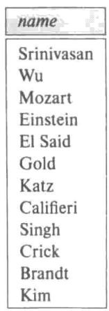
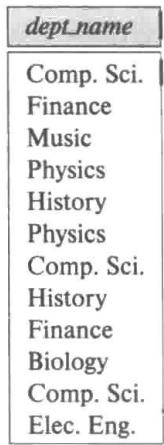
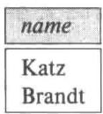
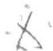
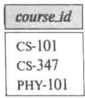
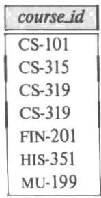
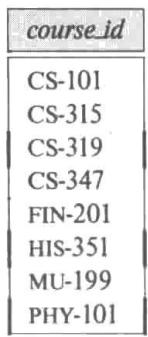
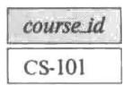
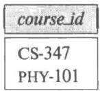
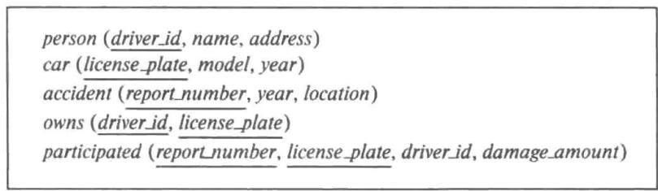

# SQL 介绍

在本章以及第 4～5 章，我们学习使用最为广泛的数据库查询语言：SQL。

尽管我们说 SQL 语言是一种 “查询语言”，但是除了查询数据库，它还具有很多别的功能。它可以定义数据结构、修改数据库中的数据以及定义安全性约束。

我们的目的并不是提供一个完整的 SQL 用户手册，而是介绍 SQL 的基本结构和概念。SQL 的各种实现可能在细节上有所不同，或者可能只支持整个语言的一个子集。

强烈建议你在实际数据库上尝试使用我们在此描述的 SQL 查询。有关可以使用哪些数据库系统以及如何创建模式、填充示例数据和执行查询的提示，请参阅本章末尾的工具部分。

## 3.1 SQL 查询语言概览

SQL 最早的版本是由 IBM 开发的，它最初被叫作 Sequel，在 20 世纪 70 年代早期作为 System R 项目的一部分。Sequel 语言从那时起一直发展至今，其名称已变为 SQL(Structured Query Language，结构化查询语言)。现在有许多产品支持 SQL 语言。SQL 已经明显确立了自己作为标准的关系数据库语言的地位。

1986 年，美国国家标准化组织（American National Standards Institute，ANSI）和国际标准化组织（International Organization for Standardization，ISO）发布了一个 SQL 标准：SQL-86。1989 年 ANSI 发布了一个 SQL 的扩充标准：SQL-89。该标准的下一个版本是 SQL-92 标准，接下来是 SQL:1999、SQL:2003、SQL:2006、SQL:2008、SQL:2011，最近的版本是 SQL:2016。

SQL 语言有几个部分:

- 数据定义语言（Data-Definition Language，DDL）。SQL DDL 提供定义关系模式、删除关系以及修改关系模式的命令。

- 数据操纵语言（Data-Manipulation Language，DML）。SQL DML 提供从数据库中查询信息以及在数据库中插入元组、删除元组、修改元组的能力。

- 完整性（integrity）。SQL DDL 包括定义完整性约束的命令，保存在数据库中的数据必须满足所定义的完整性约束。破坏完整性约束的更新是不允许的。

- 视图定义（view definition）。SOL DDL 包括定义视图的命令。

- 事务控制（transaction control）。SOL 包括定义事务的开始点和结束点的命令。

- 嵌入式 SQL（embedded SQL）和动态 SQL（dynamic SQL）。嵌入式和动态 SQL 定义 SQL 语句如何嵌入诸如 C、C++ 和 Java 这样的通用编程语言中。

- 授权（authorization）。SOL DDL 包括定义对关系和视图的访问权限的命令。

在本章中，我们给出对 SQL 的基本 DML 和 DDL 特性的概述。在此描述的特征自 SQL-92 以来就一直是 SQL 标准的部分。

在第 4 章中，我们将提供对 SQL 查询语言更详细的介绍，包括各种连接表达式、视图、事务、完整性约束、类型系统以及授权。

在第 5 章中，我们将介绍 SQL 语言更高级的特性，包括允许从编程语言中访问 SQL 的机制、SQL 函数和过程、触发器、递归查询、高级聚集特性以及为数据分析设计的一些特性。

尽管大多数 SQL 实现支持我们在此描述的标准特性，但不同实现之间还是存在差异。大多数实现还支持一些非标准的特性，但不支持一些更高级、更新的特性。万一你发现这里描述的某些语言特性在你使用的数据库系统中不起作用，请参考你的数据库系统用户手册，看看它究竟支持哪些特性。

## 3.2 SQL 数据定义

数据库中的关系集合是用数据定义语言（DDL）定义的。SQL DDL 不仅能够定义关系的集合，还能够定义有关每个关系的信息，包括：

- 每个关系的模式。
- 每个属性的取值类型。
- 完整性约束。
- 为每个关系维护的索引集合。
- 每个关系的安全性和权限信息。
- 每个关系在磁盘上的物理存储结构。

我们在此只讨论基本模式定义和基本类型，而把对 SQL DLL 其他特性的讨论延后到第 4 章和第 5 章进行。

## 3.2.1 基本类型

SQL 标准支持多种固有类型。

- `char(n)`: 具有用户指定长度 $n$ 的固定长度的字符串。也可以使用全称形式 character。
- `varchar(n)`: 具有用户指定的最大长度 n 的可变长度的字符串。等价的全称形式是 character varying。
- `int`：整数（依赖于机器的整数的有限子集），等价的全称形式是integer。
- `smallint`: 小整数（依赖于机器的整数类型的子集）。
- `numeric` $(p, d)$ ：具有用户指定精度的定点数。这个数有 $p$ 位数字（加上一个符号位），并且小数点右边有 $p$ 位中的 $d$ 位数字。那么，对于这种类型的字段，numeric(3,1)可以精确储存44.5，但不能精确存储444.5或0.32。

- real, double precision: 浮点数与双精度浮点数，精度依赖于机器。

- float(n): 精度至少为 $n$ 位数字的浮点数。

更多类型将在 4.5 节中介绍。

每种类型都可能包含一个被称作空（null）值的特殊值。空值表示一个缺失的值，该值可能存在但并不为人所知，或者可能根本不存在。我们马上将看到，在特定情况下，可能希望禁止加入空值。

char 数据类型存放固定长度的字符串。例如，属性 A 的类型是 char(10)。如果我们为此属性存入字符串 “Avi”，那么该字符串后会追加 7 个空格来使其达到 10 个字符的长度。但如果属性 B 的类型是 varchar(10)，并且我们在属性 B 中存入 “Avi”，则不会追加空格。当比较两个 char 类型的值时，如果它们的长度不同，在比较之前会自动在短值后面附加额外的空格以使它们的长度一致。

当比较一个char类型和一个varchar类型的时候，也许读者期望在比较之前会给varchar类型加上额外的空格以使长度一致，然而，这种情况可能发生也可能不发生，具体取决于数据库系统。其结果是，即便上述属性 $A$ 和 $B$ 中存放的是相同的值“Avi”， $A = B$ 的比较也可能返回假。我们建议你始终使用varchar类型而不是char类型来避免这样的问题。

SQL 还提供 nvarchar 类型来存放使用 Unicode 表示的多语言数据。然而，很多数据库甚至允许在 varchar 类型中存放 Unicode（采用 UTF-8 表示形式）。

## 3.2.2 基本模式定义

我们通过使用 create table 命令来定义 SQL 关系。下面的命令在数据库中创建了一个 department 关系：

```sql
create table department
(dept_name varchar (20),
building varchar (15),
budget numeric (12,2),
primary key (dept_name)); 
```

上面创建的关系具有三个属性，dept_name 是最大长度为 20 的字符串，building 是最大长度为 15 的字符串，还有 budget 是一个共 12 位的数字，其中小数点后有 2 位。create table 命令还指明了 dept_name 属性是 department 关系的主码。

create table 命令的通用形式是:

create table r $(A_{1} \quad D_{1}, A_{2} \quad D_{2}, \ldots, A_{n} \quad D_{n}, <完整性约束_{1}>, \ldots, <完整性约束_{k}>);$ 

其中 $r$ 是关系名，每个 $A_{i}$ 是关系 $r$ 的模式中的一个属性名， $D_{i}$ 是属性 $A_{i}$ 的域；也就是说， $D_{i}$ 指定了属性 $A_{i}$ 的类型以及可选的约束，用于限制所允许的 $A_{i}$ 取值的集合。

create table 语句最后出现了分号，本章后面的其他 SQL 语句的末尾也是如此，在很多 SQL 实现中，分号是可选的。

SQL 支持许多不同的完整性约束。在本小节我们只讨论其中少数几种。

- primary key $(A_{j1}, A_{j2}, \cdots, A_{jm})$ ：主码声明表示属性 $A_{j1}, A_{j2}, \cdots, A_{jm}$ 构成关系的主码。主码属性必须是非空且唯一的；也就是说，没有元组会在主码属性上取空值，并且关系中也没有两个元组会在所有主码属性上取值都相同。虽然主码声明是可选的，但为每个关系指定一个主码通常不失为一个好主意。

- foreign key $(A_{k1}, A_{k2}, \cdots, A_{kn})$ references s : 外码声明表示关系中任意元组在属性 $(A_{k1}, A_{k2}, \cdots, A_{kn})$ 上的取值必须对应于关系 s 中某元组在主码属性上的取值。

图 3-1 给出了我们在书中使用的大学数据库的部分 SQL DDL 定义。course 表的定义中有一个声明 “foreign key(dept_name) references department”。此外码声明表示对于每个课程元组来说，该元组中指定的系名必须存在于 department 关系的主码

- DEFAULT `<表达式>`
- UNIQE 

属性（dept_name）中。如果没有这个约束，就可能有某门课程指定了一个不存在的系名。图3-1还展示了表section、instructor和teaches上的外码约束。包括MySQL在内的一些数据库系统需要使用另一种语法“foreign key (dept_name) references department(dept_name)”，其中显式列出了被引用表中的被引用属性。

- not null：一个属性上的非空约束表明在该属性上不允许存在空值；换句话说，此约束把空值排除在该属性域之外。例如在图3-1中，instructor关系的name属性上的非空约束保证了教师的姓名不会为空。

有关外码约束以及 create table 命令可能包含的其他完整性约束的更多细节，将在后面 4.4 节中介绍。

<table><tr><td colspan="2">create table department</td></tr><tr><td>(dept_name</td><td>varchar(20),</td></tr><tr><td>building</td><td>varchar(15),</td></tr><tr><td>budget</td><td>numeric (12,2),</td></tr><tr><td colspan="2">primary key (dept_name));</td></tr><tr><td colspan="2">create table course</td></tr><tr><td>(course_id</td><td>varchar(7),</td></tr><tr><td>title</td><td>varchar(50),</td></tr><tr><td>dept_name</td><td>varchar(20),</td></tr><tr><td>credits</td><td>numeric (2,0),</td></tr><tr><td colspan="2">primary key (course_id),</td></tr><tr><td colspan="2">foreign key (dept_name) references department);</td></tr><tr><td colspan="2">create table instructor</td></tr><tr><td>(ID</td><td>varchar(5),</td></tr><tr><td>name</td><td>varchar(20) not null,</td></tr><tr><td>dept_name</td><td>varchar(20),</td></tr><tr><td>salary</td><td>numeric (8,2),</td></tr><tr><td colspan="2">primary key (ID),</td></tr><tr><td colspan="2">foreign key (dept_name) references department);</td></tr><tr><td colspan="2">create table section</td></tr><tr><td>(course_id</td><td>varchar(8),</td></tr><tr><td>sec_id</td><td>varchar(8),</td></tr><tr><td>semester</td><td>varchar(6),</td></tr><tr><td>year</td><td>numeric (4,0),</td></tr><tr><td>building</td><td>varchar(15),</td></tr><tr><td>room_number</td><td>varchar(7),</td></tr><tr><td>time_slot_id</td><td>varchar(4),</td></tr><tr><td colspan="2">primary key (course_id, sec_id, semester, year),</td></tr><tr><td colspan="2">foreign key (course_id) references course);</td></tr><tr><td colspan="2">create table teaches</td></tr><tr><td>(ID</td><td>varchar(5),</td></tr><tr><td>course_id</td><td>varchar(8),</td></tr><tr><td>sec_id</td><td>varchar(8),</td></tr><tr><td>semester</td><td>varchar(6),</td></tr><tr><td>year</td><td>numeric (4,0),</td></tr><tr><td colspan="2">primary key (ID, course_id, sec_id, semester, year),</td></tr><tr><td colspan="2">foreign key (course_id, sec_id, semester, year) references section,</td></tr><tr><td colspan="2">foreign key (ID) references instructor);</td></tr></table>


图 3-1 大学数据库的部分 SQL 数据定义


SQL 禁止破坏完整性约束的任何数据库更新。例如，如果关系中一个新插入或修改的元组在任意一个主码属性上有空值，或者元组在主码属性上的取值与关系中的另一个元组相同，那么 SQL 将标记一个错误并阻止更新。类似地，如果插入的 course 元组在 dept_name 上的取值没有出现在 department 关系中，就会破坏 course 上的外码约束，SQL 会阻止这种插入的发生。

一个新创建的关系最初是空的。向关系中插入元组、更新元组以及删除元组是通过数据操纵语句 insert、update 和 delete 来完成的，这些语句将在 3.9 节中介绍。

如果要从 SQL 数据库中去掉一个关系，我们使用 drop table 命令。drop table 命令从数据库中删除关于被去掉关系的所有信息。命令

`drop table r;` 

是比

`delete from r;`

更强的语句。后者保留关系 r，但删除 r 中的所有元组。前者不仅删除 r 中的所有元组，还删除 r 的模式。一旦 r 被去掉，除非用 create table 命令重新创建 r，否则没有元组可以插入 r 中。

我们使用 alter table 命令为已有关系增加属性。关系中的所有元组在新属性上的取值将被赋为 null。alter table 命令的格式为：

`alter table r add A D;` 

其中 r 是现有关系的名称，A 是待添加属性的名称，D 是待添加属性的类型。我们可以通过命令

`alter table r drop A;` 

从关系中去掉属性。其中 r 是现有关系的名称，A 是关系的一个属性的名称。很多数据库系统并不支持去掉属性，尽管它们允许去掉整张表。

## 3.3 SQL 查询的基本结构

SQL 查询的基本结构由三个子句构成：select、from 和 where。查询以在 from 子句中列出的关系作为其输入，在这些关系上进行 where 和 select 子句中指定的运算，然后产生一个关系作为结果。我们通过示例来介绍 SQL 的语法，并在后面描述 SQL 查询的通用结构。

## 3.3.1 单关系查询

让我们考虑使用大学数据库示例的一个简单查询：“找出所有教师的姓名。”教师的姓名可以在 instructor 关系中找到，因此我们把该关系放到 from 子句中。教师的姓名出现在 name 属性中，因此我们把它放到 select 子句中。

```sql
select name 
from instructor;
``` 

其结果是由属性名为 name 的单个属性构成的关系。如果 instructor 关系如图 2-1 所示，那么上述查询的结果关系如图 3-2 所示。

现在考虑另一个查询：“找出所有教师所在的系名。”此查询可写为：

```sql
select dept_name 
from instructor; 
```

因为一个系可以有不止一位教师，所以在 instructor 关系中，一个系的名称可能不止一次出现。上述查询的结果是一个包含系名的关系，如图 3-3 所示。



图 3-2 “select name from instructor” 的结果




图 3-3 “select dept_name from instructor”的结果


在关系模型的形式化数学定义中，关系是一个集合。因此，重复的元组不会出现在关系中。在实践中，去除重复是相当费时的。所以，SQL允许在数据库关系以及SQL表达式的结果中出现重复 $^{①}$ 。因此，对于instructor关系中出现的每个元组，上述SQL查询都会为其列出一次系名。

在某些情况下如果想强行去除重复，可以在 select 后插入关键字 distinct。如果我们想去除重复，可将上述查询改写为：

```sql
select distinct dept_name from instructor; 
```

72 在上述查询的结果中，每个系名最多只出现一次。

SQL 允许我们使用关键字 all 来显式指明不去除重复：

```sql
select all dept_name from instructor; 
```

既然保留重复元组是缺省选项，在示例中我们将不再使用 all。为了保证在示例查询的结果中去除重复元组，我们将在所有必要的地方使用 distinct。

select 子句还可带含有 +、-、*、/ 运算符的算术表达式，运算对象可以是常数或元组的属性。例如，查询：

```sql
select ID, name, dept_name, salary * 1.1 from instructor; 
```

返回一个与 instructor 关系一样的关系，只是 salary 属性的值是原来的 1.1 倍。如果我们给每位教师增长 10% 的工资，结果将如此所示。注意，这并不导致 instructor 关系发生任何改变。

SQL 还提供了特殊数据类型，如各种形式的日期（date）类型，并允许一些作用于这些类型上的算术函数。我们将在 4.5.1 节中进一步讨论这个问题。

where 子句允许我们只选出那些在 from 子句的结果关系中满足特定谓词的元组。考虑如下查询：“找出 Computer Science 系中工资超过 70 000 美元的所有教师的姓名。”该查询可以用 SQL 写为：

```sql
select name
from instructor
where dept_name = 'Comp. Sci.' and salary > 70000; 
```

如果 instructor 关系如图 2-1 所示，那么上述查询的结果关系如图 3-4 所示。




图 3-4 “找出 Computer Science 系中工资超过 70 000 美元的所有教师的姓名”的结果


SQL 允许在 where 子句中使用逻辑连词 and、or 和 not。逻辑连词的运算对象可以是包含比较运算符 `<`、`<=`、`>`、`>=`、`=` 和 `<>` 的表达式。SQL 允许我们使用比较运算符来比较字符串、算术表达式以及特殊类型，比如日期类型。

在本章的后面我们将学习 where 子句谓词的其他特性。

## 3.3.2 多关系查询

到此为止我们的查询示例都是基于单个关系的。通常查询需要从多个关系中获取信息。我们现在来学习如何编写这样的查询。

作为一个示例，假设我们想回答这样的查询：“找出所有教师的姓名，以及他们所在系的名称和系所在建筑的名称。”

考察 instructor 关系的模式，我们发现可以从 dept_name 属性得到系名，但是系所在建筑的名称是在 department 关系的 building 属性中给出的。为了回答上述查询，instructor 关系中的每个元组必须与 department 关系中的元组匹配，使得 department 元组在 dept_name 上的取值相配于 instructor 元组在 dept_name 上的取值。

为了在 SQL 中回答上述查询，我们把需要访问的关系都列在 from 子句中，并在 where 子句中指定匹配条件。上述查询可用 SQL 写为：

```sql
select name, instructor.dept_name, building
from instructor, department
where instructor.dept_name=department.dept_name; 
```

如果 instructor 和 department 关系分别如图 2-1 和图 2-5 所示，那么此查询的结果关系如图 3-5 所示。

注意，dept_name 属性既出现在 instructor 关系中，也出现在 department 关系中，用关系名作为前缀（在 instructor.dept_name 和 department.dept_name 中）来注明我们所指的是哪个属性。而 name 和 building 属性只出现在其中一个关系中，因而不需要将关系名作为前缀。

这种命名惯例需要出现在 from 子句中的关系具有不同的名称。在某些情况下此要求会引发问题，比如当需要组合来自同一个关系的两个不同元组的信息的时候。在 3.4.1 节，我们将看到如何使用更名运算来避免这样的问题。

<table><tr><td>name</td><td>dept_name</td><td>building</td></tr><tr><td>Srinivasan</td><td>Comp. Sci.</td><td>Taylor</td></tr><tr><td>Wu</td><td>Finance</td><td>Painter</td></tr><tr><td>Mozart</td><td>Music</td><td>Packard</td></tr><tr><td>Einstein</td><td>Physics</td><td>Watson</td></tr><tr><td>El Said</td><td>History</td><td>Painter</td></tr><tr><td>Gold</td><td>Physics</td><td>Watson</td></tr><tr><td>Katz</td><td>Comp. Sci.</td><td>Taylor</td></tr><tr><td>Califieri</td><td>History</td><td>Painter</td></tr><tr><td>Singh</td><td>Finance</td><td>Painter</td></tr><tr><td>Crick</td><td>Biology</td><td>Watson</td></tr><tr><td>Brandt</td><td>Comp. Sci.</td><td>Taylor</td></tr><tr><td>Kim</td><td>Elec. Eng.</td><td>Taylor</td></tr></table>


图3-5 “找出所有教师的姓名，以及他们所在系的名称和系所在建筑的名称”的结果


现在我们考虑涉及多个关系的 SQL 查询的通用形式。正如我们在前面已经看到的，一个 SQL 查询可以包括三种类型的子句：select 子句、from 子句和 where 子句。每种子句的作用如下：

- select 子句用于列出查询结果中所需要的属性。

- from 子句是在查询求值中需要访问的关系列表。

- where 子句是作用在 from 子句中的关系的属性上的谓词。

一个典型的 SQL 查询具有如下形式：

select $A_{1}, A_{2}, \ldots, A_{n}$ from $r_{1}, r_{2}, \ldots, r_{m}$ where P; 

每个 $A_{i}$ 代表一个属性，每个 $r_{i}$ 代表一个关系。P 是一个谓词。如果省略 where 子句，则谓词 P 为真。

尽管各子句必须以 select、from、where 的次序写出，但理解查询所代表的运算的最容易的方式是以运算的顺序来考察各子句：首先是 from，然后是 where，最后是 select $^{①}$ 。

通过 from 子句定义了一个在该子句中所列出关系上的笛卡儿积。它可以用关系代数来形式化地定义，但也可以理解为一个迭代过程，此过程可为 from 子句的结果关系产生元组。

for each 元组 $t_{1}$ in 关系 $r_{1}$ for each 元组 $t_{2}$ in 关系 $r_{2}$ ...
for each 元组 $t_{m}$ in 关系 $r_{m}$ 把 $t_{1}, t_{2}, \cdots, t_{m}$ 连接成单个元组 t
把 t 加入结果关系中

此结果关系具有来自 from 子句中所有关系的所有属性。由于在关系 $r_{i}$ 和 $r_{j}$ 中可能出现相同的属性名，正如我们此前所看到的，因此在属性名前面加上该属性所来自的那个关系的名称作为前缀。

例如，instructor 关系和 teaches 关系的笛卡儿积的关系模式为：

```txt
(instructor.ID, instructor.name, instructor.dept_name, instructor.salary, teaches.ID, teaches.course_id, teaches.sec_id, teaches.semester, teaches.year) 
```

有了这个模式，我们可以区分出 instructor.ID 和 teaches.ID。对于那些只出现在单个模式中的属性，我们通常去掉关系名前缀。这种简化并不会造成任何混淆。这样我们可以把关系模式写为：

```python
(instructor.ID, name, dept_name, salary, teaches.ID, course_id, sec_id, semester, year) 
```

为了说明这一点，考察图 2-1 中的 instructor 关系和图 2-7 中的 teaches 关系。它们的笛卡儿积如图 3-6 所示，图中只包括了构成笛卡儿积结果的一部分元组。

通过笛卡儿积把来自 instructor 和 teaches 中相互没有关联的元组组合在一起。instructor 中的每个元组和 teaches 中的所有元组都要进行组合，即使是那些代表不同教师的元组。其结果可能是一个非常庞大的关系，创建这样的笛卡儿积通常是没有意义的。

<table><tr><td>instructor_ID</td><td>name</td><td>dept_name</td><td>salary</td><td>teaches_ID</td><td>course_id</td><td>sec_id</td><td>semester</td><td>year</td></tr><tr><td>10101</td><td>Srinivasan</td><td>Comp. Sci.</td><td>65000</td><td>10101</td><td>CS-101</td><td>1</td><td>Fall</td><td>2017</td></tr><tr><td>10101</td><td>Srinivasan</td><td>Comp. Sci.</td><td>65000</td><td>10101</td><td>CS-315</td><td>1</td><td>Spring</td><td>2018</td></tr><tr><td>10101</td><td>Srinivasan</td><td>Comp. Sci.</td><td>65000</td><td>10101</td><td>CS-347</td><td>1</td><td>Fall</td><td>2017</td></tr><tr><td>10101</td><td>Srinivasan</td><td>Comp. Sci.</td><td>65000</td><td>12121</td><td>FIN-201</td><td>1</td><td>Spring</td><td>2018</td></tr><tr><td>10101</td><td>Srinivasan</td><td>Comp. Sci.</td><td>65000</td><td>15151</td><td>MU-199</td><td>1</td><td>Spring</td><td>2018</td></tr><tr><td>10101</td><td>Srinivasan</td><td>Comp. Sci.</td><td>65000</td><td>22222</td><td>PHY-101</td><td>1</td><td>Fall</td><td>2017</td></tr><tr><td>...</td><td>...</td><td>...</td><td>...</td><td>...</td><td>...</td><td>...</td><td>...</td><td>...</td></tr><tr><td>...</td><td>...</td><td>...</td><td>...</td><td>...</td><td>...</td><td>...</td><td>...</td><td>...</td></tr><tr><td>12121</td><td>Wu</td><td>Finance</td><td>90000</td><td>10101</td><td>CS-101</td><td>1</td><td>Fall</td><td>2017</td></tr><tr><td>12121</td><td>Wu</td><td>Finance</td><td>90000</td><td>10101</td><td>CS-315</td><td>1</td><td>Spring</td><td>2018</td></tr><tr><td>12121</td><td>Wu</td><td>Finance</td><td>90000</td><td>10101</td><td>CS-347</td><td>1</td><td>Fall</td><td>2017</td></tr><tr><td>12121</td><td>Wu</td><td>Finance</td><td>90000</td><td>12121</td><td>FIN-201</td><td>1</td><td>Spring</td><td>2018</td></tr><tr><td>12121</td><td>Wu</td><td>Finance</td><td>90000</td><td>15151</td><td>MU-199</td><td>1</td><td>Spring</td><td>2018</td></tr><tr><td>12121</td><td>Wu</td><td>Finance</td><td>90000</td><td>22222</td><td>PHY-101</td><td>1</td><td>Fall</td><td>2017</td></tr><tr><td>...</td><td>...</td><td>...</td><td>...</td><td>...</td><td>...</td><td>...</td><td>...</td><td>...</td></tr><tr><td>...</td><td>...</td><td>...</td><td>...</td><td>...</td><td>...</td><td>...</td><td>...</td><td>...</td></tr><tr><td>15151</td><td>Mozart</td><td>Music</td><td>40000</td><td>10101</td><td>CS-101</td><td>1</td><td>Fall</td><td>2017</td></tr><tr><td>15151</td><td>Mozart</td><td>Music</td><td>40000</td><td>10101</td><td>CS-315</td><td>1</td><td>Spring</td><td>2018</td></tr><tr><td>15151</td><td>Mozart</td><td>Music</td><td>40000</td><td>10101</td><td>CS-347</td><td>1</td><td>Fall</td><td>2017</td></tr><tr><td>15151</td><td>Mozart</td><td>Music</td><td>40000</td><td>12121</td><td>FIN-201</td><td>1</td><td>Spring</td><td>2018</td></tr><tr><td>15151</td><td>Mozart</td><td>Music</td><td>40000</td><td>15151</td><td>MU-199</td><td>1</td><td>Spring</td><td>2018</td></tr><tr><td>15151</td><td>Mozart</td><td>Music</td><td>40000</td><td>22222</td><td>PHY-101</td><td>1</td><td>Fall</td><td>2017</td></tr><tr><td>...</td><td>...</td><td>...</td><td>...</td><td>...</td><td>...</td><td>...</td><td>...</td><td>...</td></tr><tr><td>...</td><td>...</td><td>...</td><td>...</td><td>...</td><td>...</td><td>...</td><td>...</td><td>...</td></tr><tr><td>22222</td><td>Einstein</td><td>Physics</td><td>95000</td><td>10101</td><td>CS-101</td><td>1</td><td>Fall</td><td>2017</td></tr><tr><td>22222</td><td>Einstein</td><td>Physics</td><td>95000</td><td>10101</td><td>CS-315</td><td>1</td><td>Spring</td><td>2018</td></tr><tr><td>22222</td><td>Einstein</td><td>Physics</td><td>95000</td><td>10101</td><td>CS-347</td><td>1</td><td>Fall</td><td>2017</td></tr><tr><td>22222</td><td>Einstein</td><td>Physics</td><td>95000</td><td>12121</td><td>FIN-201</td><td>1</td><td>Spring</td><td>2018</td></tr><tr><td>22222</td><td>Einstein</td><td>Physics</td><td>95000</td><td>15151</td><td>MU-199</td><td>1</td><td>Spring</td><td>2018</td></tr><tr><td>22222</td><td>Einstein</td><td>Physics</td><td>95000</td><td>22222</td><td>PHY-101</td><td>1</td><td>Fall</td><td>2017</td></tr><tr><td>...</td><td>...</td><td>...</td><td>...</td><td>...</td><td>...</td><td>...</td><td>...</td><td>...</td></tr><tr><td>...</td><td>...</td><td>...</td><td>...</td><td>...</td><td>...</td><td>...</td><td>...</td><td>...</td></tr></table>


图 3-6 instructor 关系和 teaches 关系的笛卡儿积


取而代之的是在 where 子句中使用谓词来限制笛卡儿积所创建的组合，只留下那些对所需答案有意义的组合。我们希望有个涉及 instructor 和 teaches 的查询，使得 instructor 中的特定元组 t 只与 teaches 中那些与 t 表示同一位教师的元组进行组合。也就是说，我们希


望 teaches 中的元组只和与其具有相同 ID 值的 instructor 元组进行匹配。下面的 SQL 查询确保满足这个条件，并从这些匹配元组中输出教师姓名和课程标识。

```sql
select name, course_id
from instructor, teaches
where instructor.ID= teaches.ID; 
```

注意，上述查询只输出讲授了课程的教师，不会输出那些没有讲授任何课程的教师。如果我们希望输出那些元组，可以使用一种被称作外连接（outer join）的运算，外连接将在4.1.3节中讲述。

如果 instructor 关系如图 2-1 所示，并且 teaches 关系如图 2-7 所示，那么前述查询的结果关系如图 3-7 所示。注意，教师 Gold、Califieri 和 Singh 没有讲授任何课程，不会出现在图 3-7 的结果中。

<table><tr><td>name</td><td>course_id</td></tr><tr><td>Srinivasan</td><td>CS-101</td></tr><tr><td>Srinivasan</td><td>CS-315</td></tr><tr><td>Srinivasan</td><td>CS-347</td></tr><tr><td>Wu</td><td>FIN-201</td></tr><tr><td>Mozart</td><td>MU-199</td></tr><tr><td>Einstein</td><td>PHY-101</td></tr><tr><td>El Said</td><td>HIS-351</td></tr><tr><td>Katz</td><td>CS-101</td></tr><tr><td>Katz</td><td>CS-319</td></tr><tr><td>Crick</td><td>BIO-101</td></tr><tr><td>Crick</td><td>BIO-301</td></tr><tr><td>Brandt</td><td>CS-190</td></tr><tr><td>Brandt</td><td>CS-190</td></tr><tr><td>Brandt</td><td>CS-319</td></tr><tr><td>Kim</td><td>EE-181</td></tr></table>


图 3-7 “对于大学中所有讲授课程的教师，找出他们的姓名以及他们所讲授的所有课程的课程 ID”的结果


如果只希望找出 Computer Science 系的教师姓名和课程标识，我们可以给 where 子句增加额外的谓词，如下所示：

select name, course_id 

from instructor, teaches 

where instructor.ID= teaches.ID and instructor.dept_name='Comp. Sci.'; 

注意，既然 dept_name 属性只出现在 instructor 关系中，我们在上述查询中就可以只使用 dept_name 来替代 instructor.dept_name。

通常说来，一个 SQL 查询的含义可以理解如下：




1. 为 from 子句中列出的关系产生笛卡儿积。

2. 在步骤 1 的结果上应用 where 子句中指定的谓词。

3. 对于步骤 2 的结果中的每个元组，输出 select 子句中指定的属性（或表达式的结果）。上述步骤的顺序有助于理解一个 SQL 查询的结果应该是什么样的，而不是这个结果是怎样被执行的。在 SQL 的实际实现中不会执行这种形式的查询，它会通过（尽可能）只产生满足 where 子句谓词的笛卡儿积元素来进行优化执行。我们将在第 15～16 章中学习这类实现技术。

当编写查询时，需要小心设置合适的 where 子句条件。如果在前述 SQL 查询中省略 where 子句条件，它就会输出笛卡儿积，那将是一个相当大的关系。对于图 2-1 中的 instructor 关系示例和图 2-7 中的 teaches 关系示例，它们的笛卡儿积具有 $12 \times 13 = 156$ 个元组，元组数量过多，我们无法在书中全部展示！更糟的是，假设我们有比图中所示关系更现实的教师数量，比如 200 位教师，假使每位教师讲授 3 门课程，那么我们在 teaches 关系中就有 600 个元组，这样上述迭代过程就会在结果中产生 $200 \times 600 = 120\ 000$ 个元组。

## 注释 3-1 SQL 与多重集关系代数——第一部分

关系代数运算与 SQL 运算之间有着密切的联系。一个关键的区别是，不同于关系代数，SQL 允许重复。SQL 标准定义了在查询的输出中每个元组有多少份拷贝，这继而取决于在输入的关系中出现了多少份元组拷贝。

为了建模 SQL 的这种行为，定义了一种称为多重集关系代数（multiset relational algebra）的关系代数版本来处理多重集合——可能包含重复项的集合。多重集关系代数的基本运算定义如下：

1. 如果 $r_1$ 中的元组 $t_1$ 有 $c_1$ 份拷贝，且 $t_1$ 满足选择条件 $\sigma_0$ ，则在 $\sigma_0(r_1)$ 中有 $c_1$ 份 $t_1$ 的拷贝。

2. 对于 $r_1$ 中元组 $t_1$ 的每份拷贝，在 $\Pi_A(r_1)$ 中都有一份元组 $\Pi_A(t_1)$ 的拷贝，其中 $\Pi_A(t_1)$ 表示单个元组 $t_1$ 的投影。

3. 如果 $r_{1}$ 中的元组 $t_{1}$ 有 $c_{1}$ 份拷贝，且 $r_{2}$ 中的元组 $t_{2}$ 有 $c_{2}$ 份拷贝，则 $r_{1} \times r_{2}$ 中就有元组 $t_{1}, t_{2}$ 的 $c_{1} * c_{2}$ 份拷贝。

例如，假设模式为 $(A, B)$ 的关系 $r_1$ 与模式为 $(C)$ 的关系 $r_2$ 是如下的多重集合： $r_1 = \{(1, a), (2, a)\}$ ， $r_2 = \{(2), (3), (3)\}$ 。那么 $\Pi_B(r_1)$ 即为 $\{(a), (a)\}$ ，而 $\Pi_B(r_1) \times r_2$ 为：

$$
\{(a, 2), (a, 2), (a, 3), (a, 3), (a, 3), (a, 3) \}
$$

现在考虑如下形式的基本 SQL 查询：

select $A_{1}, A_{2}, \ldots, A_{n}$ from $r_{1}, r_{2}, \ldots, r_{m}$ where P 

每个 $A_{i}$ 代表一个属性，且每个 $r_i$ 代表一个关系。 $P$ 是谓词。如果省略where子句，则谓词 $P$ 为真。查询等价于多重集关系代数表达式：

$$
\Pi_ {A _ {1}, A _ {2}, \dots , A _ {n}} (\sigma_ {P} (r _ {1} \times r _ {2} \times \dots \times r _ {m}))
$$

关系代数的选择运算对应于 SQL 的 where 子句，而不是 SQL 的 select 子句；这种含义上的差异是一件遗憾的历史事实。我们将在注释 3-2 中讨论更复杂的 SQL 查询表示。

SQL 查询的关系代数表示有助于形式化定义 SQL 程序的含义。此外，数据库系统通常将 SQL 查询转换为基于关系代数的底层表示，并使用这种表示来执行查询优化和查询评估。

## 3.4 附加的基本运算

SQL 中还支持几种附加的基本运算。

## 3.4.1 更名运算

重新考察我们此前使用过的查询：

```sql
select name, course_id
from instructor, teaches
where instructor.ID= teaches.ID; 
```

此查询的结果是一个具有下列属性的关系：

```txt
name, course_id 
```

结果中的属性名来自 from 子句中的关系的属性名。

但我们不能始终用这种方式来派生名称，其原因有几点：首先，from 子句中的两个关系可能具有同名属性，在这种情况下，结果中就会出现重复的属性名；其次，如果我们在 select 子句中使用算术表达式，那么结果属性就没有名称；再次，尽管如上例所示，属性名可以由基关系导出，但我们也许想要改变结果中的属性名。因此，SQL 提供了一种重命名结果关系中的属性的方式。它使用如下形式的 as 子句：

```txt
old-name as new-name 
```

as 子句既可出现在 select 子句中，也可出现在 from 子句中 $^{①}$ 。

例如，如果我们想用 instructor_name 这个名称来代替属性名 name，我们可以重写上述查询如下：

```sql
select name as instructor_name, course_id from instructor, teaches where instructor.ID= teaches.ID; 
```

as 子句在重命名关系时特别有用。重命名关系的一个原因是把一个长的关系名替换成短的，这样在查询中的其他地方使用起来就更为方便。为了说明这一点，我们重写查询“对于大学中所有讲授课程的教师，找出他们的姓名以及他们所讲授的所有课程的课程 ID”：

```sql
select T.name, S.course_id
from instructor as T, teaches as S
where T.ID = S.ID; 
```

重命名关系的另一个原因是为了适用于需要比较同一个关系中的元组的情况。为此我们需要把一个关系跟它自身进行笛卡儿积运算，如果不重命名，就不可能把一个元组与其他元组区分开来。假设我们希望写出查询：“找出满足下面条件的所有教师的姓名，他们的工资至少比 Biology 系某一位教师的工资要高。”我们可以写出这样的 SQL 表达式：

```sql
select distinct T.name
from instructor as T, instructor as S
where T.salary > S.salary and S.dept_name = 'Biology'; 
```

注意，不能使用 instructor.salary 这样的写法，因为这样并不清楚到底希望引用哪一个 instructor。

在上述查询中，T 和 S 可以被认为是 instructor 关系的两份拷贝，但更准确地说，它们被声明为 instructor 关系的别名，也就是另外的名称。像 T 和 S 那样被用来重命名关系的标识在 SQL 标准中被称作相关名称（correlation name），但通常也被称作表别名（table alias），或相关变量（correlation variable），或元组变量（tuple variable）。

注意，用文字表达上述查询更好的方式是：“找出满足下面条件的所有教师的姓名，他们比 Biology 系教师的最低工资要高。”早先的表述更符合我们所写的 SQL，但后面的表述更直观，事实上它可以直接用 SQL 来表达，正如我们将在 3.8.2 节中看到的那样。

## 3.4.2 字符串运算

SQL 使用一对单引号来标示字符串，例如 'Computer'。如果单引号是字符串的组成部分，那就用两个单引号字符来表示，如字符串 “It's right” 可表示为 'It's right'。

在 SQL 标准中，字符串上的相等运算是大小写敏感的，所以表达式 “'comp. sci.' = 'Comp. Sci.'” 的结果是假。然而一些数据库系统，如 MySQL 和 SQL Server，在匹配字符串时并不区分大小写，所以在这些数据库中 “'comp. sci.' = 'Comp. Sci.'” 的结果可能是真。然而，这种缺省方式是可以在数据库级或特定属性级修改的。

SQL 还允许在字符串上作用多种函数，例如连接字符串（使用 “ || ”）、提取子串、计算字符串长度、大小写转换（用 upper(s) 函数将字符串 s 转换为大写，或用 lower(s) 函数将字符串 s 转换为小写）、去掉字符串后面的空格（使用 trim(s)）等。不同数据库系统所提供的字符串函数集是不同的。请参阅你的数据库系统手册来获得它所支持的实际字符串函数的详细信息。

在字符串上可以使用 like 运算符来实现模式匹配。我们使用两个特殊的字符来描述模式。

- 百分号（%）：%字符匹配任意子串。

- 下划线（_）：_字符匹配任意一个字符。

模式是大小写敏感的 $^{①}$ ，也就是说，大写字符与小写字符不匹配，反之亦然。为了说明模式匹配，我们考虑下列示例：

- 'Intro%' 匹配以 “Intro” 打头的任意字符串。

- '%Comp%' 匹配包含 “Comp” 子串的任意字符串，例如 'Intro. to Computer Science' 和 'Computational Biology'。

- ' '匹配只含三个字符的任意字符串。

- ' _ %' 匹配至少含有三个字符的任意字符串。

SQL 通过使用比较运算符 like 来表达模式。考虑查询 “找出所在建筑名称中包含子串 'Watson' 的所有系名”。该查询可以写成：

```sql
select dept_name
from department
where building like '%Watson%'; 
```

为使模式能够包含特殊的模式字符（即 % 和 _），SQL 允许定义转义字符。转义字符直接用在特殊的模式字符的前面，表示该特殊的模式字符被当成普通字符。我们在 like 比较运算中使用 escape 关键字来定义转义字符。为说明这一用法，考虑以下模式，其中使用反斜线（\）作为转义字符：

- like 'ab\%cd%' escape '\' 匹配以 “ab%cd” 开头的所有字符串。

- like 'ab\\cd%' escape '\\' 匹配以 “ab\cd” 开头的所有字符串。

SQL 允许我们通过使用 not like 比较运算符来搜索不匹配项。一些实现还提供 like 运算的变种，它不区分大小写。

一些 SQL 实现，特别是 PostgreSQL，提供了 similar to 运算，它具备比 like 运算更强大的模式匹配能力，其模式定义语法类似于 UNIX 中使用的正则表达式。

## 3.4.3 select 子句中的属性说明

星号 “*” 可以用在 select 子句中表示 “所有的属性”。因而，在如下查询的 select 子句中使用 instructor.*

```sql
select instructor.*
from instructor, teaches
where instructor.ID= teaches.ID; 
```

来表示 instructor 的所有属性都被选中。形如 select * 的 select 子句表示 from 子句的结果关系的所有属性都被选中。

## 3.4.4 排列元组的显示次序

SQL 为用户提供了对关系中元组显示次序的一些控制。order by 子句的可以让查询结果中的元组按排列顺序显示。为了按字母顺序列出物理系的所有教师，我们可写为：

```sql
select name
from instructor
where dept_name = 'Physics'
order by name; 
```

在缺省情况下，order by 子句按升序列出显示项。要说明排序顺序，我们可以用 desc 表示降序，或用 asc 表示升序。此外，排序可在多个属性上进行。假设我们希望按 salary 的降序列出整个 instructor 关系，如果有几位教师的工资相同，就将他们按姓名升序排列。我们用 SQL 将该查询表示如下：

```sql
select *
from instructor
order by salary desc, name asc; 
```

## 3.4.5 where 子句谓词

为了简化 where 子句, SQL 提供 between 比较运算符来说明一个值小于或等于某个值, 同时大于或等于另一个值。如果我们想找出工资值在 90 000 美元和 100 000 美元之间的教师的姓名, 可以使用 between 比较运算符来写出下面的查询:

```sql
select name
from instructor
where salary between 90000 and 100000; 
```

它可以取代：

```sql
select name
from instructor
where salary <= 100000 and salary >= 90000; 
```

类似地，我们还可以使用 not between 比较运算符。

SQL 允许我们用符号 $(v_{1}, v_{2}, \cdots, v_{n})$ 来表示一个包含值 $v_{1}, v_{2}, \cdots, v_{n}$ 的 n 维元组；该符号被称为行构造器（row constructor）。在元组上可以运用比较运算符，并按字典顺序进行比较运算。例如，当 $a_{1} <= b_{1}$ 且 $a_{2} <= b_{2}$ 时， $(a_{1}, a_{2}) <= (b_{1}, b_{2})$ 为真。类似地，当两个元组在所有属性上相等时，它们是相等的。这样，SQL 查询

```sql
select name, course_id
from instructor, teaches
where instructor.ID= teaches.ID and dept_name = 'Biology'; 
```

可被重写为如下形式 $^{①}$ :

```sql
select name, course_id
from instructor, teaches
where (instructor.ID, dept_name) = (teaches.ID, 'Biology'); 
```

## 3.5 集合运算

SQL 作用在关系上的 union、intersect 和 except 运算对应于数学集合论中的 U、∩ 和 - 运算。我们现在来构造涉及两个集合上的 union、intersect 和 except 运算的查询。

- 在 2017 年秋季学期开设的所有课程的集合：

```sql
select course_id
from section
where semester = 'Fall' and year = 2017; 
```

- 在 2018 年春季学期开设的所有课程的集合：

```sql
select course_id
from section
where semester = 'Spring' and year = 2018; 
```

在我们后面的讨论中，将用 $c_{1}$ 和 $c_{2}$ 分别指代作为以上查询结果的两个关系，并在图3-8和图3-9中给出这些查询运行在如图2-6所示的section关系上的结果。注意 $c_{2}$ 包含两个对应于course_id为CS-319的元组，因为该课程有两个课程段在2018年春季开课。

85 




图3-8 $c_{1}$ 关系，列出2017年秋季开设的课程





图3-9 $c2$ 关系，列出2018年春季开设的课程


## 3.5.1 并运算

为了找出 2017 年秋季开课，或 2018 年春季开课，或两个学期都开课的所有课程的集合，我们写出如下查询语句。注意，下面每条 select-from-where 语句上使用的括号是可省略的，但加上括号易于阅读。一些数据库不允许使用括号，在那样的情况下可以去掉括号。

```sql
(select course_id
from section
where semester = 'Fall' and year= 2017)
union
(select course_id
from section
where semester = 'Spring' and year= 2018); 
```

与 select 子句不同，union 运算自动去除重复。这样，使用如图 2-6 所示的 section 关系，其中 CS-319 在 2018 年春季开设两个课程段，CS-101 在 2017 年秋季和 2018 年春季学期各开设一个课程段，CS-101 和 CS-319 在结果中都只出现一次，如图 3-10 所示。

如果我们想保留所有重复项，就必须用 union all 代替 union:

```sql
(select course_id
from section
where semester = 'Fall' and year= 2017)
union all
(select course_id
from section
where semester = 'Spring' and year= 2018); 
```

结果中的重复元组数等于在 c1 和 c2 中都出现的重复元组数量的总和。因此在上述查询中，CS-319 和 CS-101 都将被列出两次。作为一个更深入的示例，如果存在这样一种情况：

ECE-101 在 2017 年秋季学期开设 4 个课程段，并且在 2018




图3-10 $c_{1}$ union $c_{2}$ 的结果关系


86 

年春季学期开设 2 个课程段，那么在结果中将有 6 个 ECE-101 元组。

## 3.5.2 交运算

为了找出在 2017 年秋季和 2018 年春季都开课的所有课程的集合，我们可写出：

```sql
(select course_id
from section
where semester = 'Fall' and year= 2017)
intersect
(select course_id
from section
where semester = 'Spring' and year= 2018); 
```

结果关系如图 3-11 所示，它只包括一个 CS-101 元组。

intersect 运算自动去除重复 $^{①}$ 。例如，如果存在这样的情况，ECE-101 在 2017 年秋季学期开设 4 个课程段，并且在 2018

年春季学期开设 2 个课程段，那么在结果中只有 1 个 ECE-87 101 元组。




图3-11 $c1$ intersect $c2$ 的结果关系


如果我们想保留所有重复项，就必须用 intersect all 代替 intersect:

```sql
(select course_id
from section
where semester = 'Fall' and year= 2017)
intersect all
(select course_id
from section
where semester = 'Spring' and year= 2018); 
```

结果中出现的重复元组数等于在 c1 和 c2 中都出现的重复元组数里较小的那个。例如，如果 ECE-101 在 2017 年秋季学期开设 4 个课程段，并且在 2018 年春季学期开设 2 个课程段，那么在结果中将有 2 个 ECE-101 元组。

## 3.5.3 差运算

为了找出在 2017 年秋季学期开课但不在 2018 年春季学期开课的所有课程，我们可写出：

```sql
(select course_id
from section
where semester = 'Fall' and year= 2017)
except
(select course_id
from section
where semester = 'Spring' and year= 2018); 
```

该查询结果如图 3-12 所示。注意，这正好是图 3-8 中的 c1 关系减去不出现的 CS-101 元组。

except 运算 $^{②}$ 从其第一个输入中输出不出现在第二个输入中的所有元组，即执行集差操作。

此运算在执行集差操作之前自动去除输入中的重复项。例如，如果 ECE-101 在 2017 年秋季学期开设 4 个课程段，并且在 2018 年春季学期开设 2 个课程段，那么在 except 运算的结果中将没有 ECE-101 的任何拷贝。




图3-12 $c_{1}$ except $c_{2}$ 的结果关系


如果我们想保留重复项，就必须用 except all 代替 except:


```sql
(select course_id
from section
where semester = 'Fall' and year= 2017)
except all
(select course_id
from section
where semester = 'Spring' and year= 2018); 
```

结果中的重复元组数等于在 c1 中出现的重复元组数减去在 c2 中出现的重复元组数（前提是此差为正）。因此，如果 ECE-101 在 2017 年秋季学期开设 4 个课程段，并且在 2018 年春季学期开设 2 个课程段，那么在结果中有 2 个 ECE-101 元组。然而，如果 ECE-101 在 2017 年秋季学期开设 2 个或更少的课程段，并且在 2018 年春季学期开设 2 个课程段，那么在结果中将没有 ECE-101 元组。

## 3.6 空值

空值（null value）给包括算术运算、比较运算和集合运算在内的关系运算带来了特殊的问题。

如果算术表达式的任一输入值为空，则该算术表达式（涉及诸如 +、-、* 或 /）结果为空。例如，如果查询中有一个表达式是 $r.A + 5$ ，并且对于某个特定的元组，r.A 为空，那么对此元组来说，该表达式的结果也为空。

涉及空值的比较运算问题更多。例如，考虑比较运算 “1 < null”。因为我们不知道空值代表的是什么，所以说上述比较为真可能是错误的。但是说上述比较为假也可能是错误的，如果我们认为比较为假，那么 “not (1 < null)” 就应该为真，但这是没有意义的。因而 SQL 将涉及空值的任何比较运算的结果视为 unknown（既不是谓词 is null，也不是 is not null，我们将在本节的后面介绍这两个谓词）。这创建了除 true 和 false 之外的第三种逻辑值。

由于 where 子句中的谓词可以对比较结果使用诸如 and、or 和 not 的布尔运算，因此这些布尔运算的定义也被扩展为可以处理 unknown 值。

- and: true and unknown 的结果是 unknown, false and unknown 的结果是 false，而 unknown and unknown 的结果是 unknown。

- or: true or unknown 的结果是 true, false or unknown 的结果是 unknown，而 unknown or unknown 的结果是 unknown。

- not: not unknown 的结果是 unknown。

可以验证，如果 r.A 为空，那么 “1 < r.A” 和 “not (1 < r.A)” 的结果都是 unknown。

如果 where 子句谓词对一个元组计算出 false 或 unknown，那么该元组不能被加入结果中。

SQL 在谓词中使用特殊的关键字 null 来测试空值。因此，为找出 instructor 关系中 salary 为空值的所有教师，我们可以写出：

```sql
select name
from instructor
where salary is null; 
```

如果谓词 is not null 所作用的值非空，那么谓词为真。

SQL 允许我们通过使用 is unknown 和 is not unknown 子句 $^{①}$ 来测试一个比较运算的结果是否为 unknown，而不是 true 或 false。例如：

```sql
select name
from instructor
where salary > 10000 is unknown; 
```

当一个查询使用 select distinct 子句时，重复元组必须被去除。为了达到这个目的，当比较两个元组对应的属性值时，如果这两个值都非空并且相等，或者都为空，那么它们被认为是相同的。所以，诸如 `{{(A',null),('A',null)}` 这样的元组的两份拷贝被认为是相同的，即使它们在某些属性上存在空值。使用 distinct 子句时仅保留这样的相同元组的一份拷贝。注意，上述对待空值的方式与谓词中对待空值的方式是不同的，在谓词中 “null = null” 会返回 unknown，而不是 true。

如果元组在所有属性上取值相等，那么它们就被当作相同的元组，即使某些值为空。这种方式还被用于集合的并、交和差运算。

## 3.7 聚集函数

聚集函数（aggregate function）是以值集（集合或多重集合）为输入并返回单个值的函数。SQL 提供了五个标准的固有聚集函数 $^{②}$ 。

- 平均值：avg。

- 最小值：min。

- 最大值：max。

- 总和：sum。

- 计数：count。

sum 和 avg 的输入必须是数字集，但其他运算符可以作用在非数字数据类型的集合上，比如字符串。

## 3.7.1 基本聚集

考虑查询：“找出 Computer Science 系教师的平均工资。”我们将该查询写为如下形式：

```sql
select avg (salary)
from instructor
where dept_name = 'Comp. Sci.'; 
```

该查询的结果是一个具有单属性的关系，其中只包含一个元组，这个元组的数值对应于

Computer Science 系教师的平均工资。数据库系统可以给由聚集产生的结果关系的属性取一个由表达式文本构成的不方便的名称，但我们可以用 as 子句给属性取个有意义的名称，如下所示：

```sql
select avg (salary) as avg_salary
from instructor
where dept_name = 'Comp. Sci.'; 
```

在图 2-1 的 instructor 关系中，Computer Science 系的工资值是 75 000 美元、65 000 美元和 92 000 美元。平均工资是 232 000/3=77 333.33 美元。

在计算平均值时保留重复项是很重要的。假设 Computer Science 系增加了第四位教师，其工资正好是 75 000 美元。如果去除重复，我们会得到错误的答案（232 000/4=58 000 美元），而正确的答案是 76 750 美元。

有时在计算聚集函数前必须先去重。如果确实想去除重复项，可在聚集表达式中使用关键字 distinct。比如这样一个查询示例：“找出在 2018 年春季学期授课的教师总数。” 在该例中，不论一位教师讲授了几个课程段，他都只应被计算一次。所需信息包含在 teaches 关系中，我们将此查询写为如下形式：

```sql
select count (distinct ID)
from teaches
where semester = 'Spring' and year = 2018; 
```

由于在 ID 前面有关键字 distinct，所以即使某位教师教了不止一门课程，在结果中他也仅被计数一次。

我们经常使用聚集函数 count 来计算一个关系中元组的数量。在 SQL 中该函数的写法是 count(*)。因此，要找出 course 关系中的元组数，可写成：

```sql
select count (*)
from course; 
```

SQL 不允许在用 count(*) 时使用 distinct。在用 max 和 min 时使用 distinct 是合法的，尽管结果并无差别。我们可以使用关键字 all 替代 distinct 来表明要保留重复项，但既然 all 是缺省的，就没必要这么做了。

## 3.7.2 分组聚集

有时候我们不仅希望将聚集函数作用在单个元组集上，而且希望将其作用在一组元组集上；在 SQL 中可使用 group by 子句实现这个愿望。group by 子句中给出的一个或多个属性是用来构造分组的。在分组（group by）子句中的所有属性上取值相同的元组将被分在一个组内。

考虑一个查询示例：“找出每个系的平均工资。”该查询可写为如下形式：

```sql
select dept_name, avg (salary) as avg_salary from instructor group by dept_name; 
```

图 3-13 显示了 instructor 关系中的元组按照 dept_name 属性进行分组的情况，分组是计算查询结果的第一步。在每个分组上都要进行指定的聚集计算，查询结果如图 3-14 所示。

<table><tr><td>ID</td><td>name</td><td>dept_name</td><td>salary</td></tr><tr><td>76766</td><td>Crick</td><td>Biology</td><td>72000</td></tr><tr><td>45565</td><td>Katz</td><td>Comp. Sci.</td><td>75000</td></tr><tr><td>10101</td><td>Srinivasan</td><td>Comp. Sci.</td><td>65000</td></tr><tr><td>83821</td><td>Brandt</td><td>Comp. Sci.</td><td>92000</td></tr><tr><td>98345</td><td>Kim</td><td>Elec. Eng.</td><td>80000</td></tr><tr><td>12121</td><td>Wu</td><td>Finance</td><td>90000</td></tr><tr><td>76543</td><td>Singh</td><td>Finance</td><td>80000</td></tr><tr><td>32343</td><td>El Said</td><td>History</td><td>60000</td></tr><tr><td>58583</td><td>Califieri</td><td>History</td><td>62000</td></tr><tr><td>15151</td><td>Mozart</td><td>Music</td><td>40000</td></tr><tr><td>33456</td><td>Gold</td><td>Physics</td><td>87000</td></tr><tr><td>22222</td><td>Einstein</td><td>Physics</td><td>95000</td></tr></table>


图 3-13 instructor 关系的元组按照 dept_name 属性分组


<table><tr><td>dept_name</td><td>avg_salary</td></tr><tr><td>Biology</td><td>72000</td></tr><tr><td>Comp. Sci.</td><td>77333</td></tr><tr><td>Elec. Eng.</td><td>80000</td></tr><tr><td>Finance</td><td>85000</td></tr><tr><td>History</td><td>61000</td></tr><tr><td>Music</td><td>40000</td></tr><tr><td>Physics</td><td>91000</td></tr></table>


图 3-14 查询 “找出每个系的平均工资” 的结果关系


另外，考虑查询“找出所有教师的平均工资”。我们把此查询写为如下形式：

```sql
select avg (salary) 
from instructor; 
```

在这种情况下省略了 group by 子句，因此整个关系被当作一个分组。


作为在元组分组上进行聚集操作的另一个示例，考虑查询：“找出每个系在2018年春季学期授课的教师人数。”有关每位教师在每个学期讲授每个课程段的信息在teaches关系中。但是，这些信息需要与来自instructor关系的信息进行连接，才能得到每位教师所在的系名。因此，我们把此查询写为如下形式：


```sql
select dept_name, count (distinct instructor.ID) as instr_count
from instructor, teaches
where instructor.ID= teaches.ID and
semester = 'Spring' and year = 2018
group by dept_name; 
```

其结果如图 3-15 所示。

当 SQL 查询使用分组时，一个很重要的事情是确保出现在 select 语句中但没有被聚集的属性只能是出现在 group by 子句中的那些属性。换句话说，任何没有出现在 group by 子句中的属性如果出现在 select 子句中，它只能作为聚集函数的参数，否则这样的查询就是错误的。例如，下述查询是错误的，因为 ID 没有出现在 group by 子句中，但它出现在了 select 子句中，而且没有被聚集：

<table><tr><td>dept_name</td><td>instr_count</td></tr><tr><td>Comp. Sci.</td><td>3</td></tr><tr><td>Finance</td><td>1</td></tr><tr><td>History</td><td>1</td></tr><tr><td>Music</td><td>1</td></tr></table>


图 3-15 查询 “找出每个系在 2018 年春季学期授课的教师人数” 的结果关系


```sql
/* 错误查询 */
select dept_name, ID, avg (salary)
from instructor
group by dept_name;
```

在上述查询中，一个特定分组（通过 dept_name 定义）中的每位教师都可以有一个不同的 ID，既然每个分组只输出一个元组，那就无法确定选哪个 ID 值作为唯一输出。其结果是，SQL 不允许这样的情况出现。

上述查询还展示了在 SQL 中用 “`/* */`” 包含文本的方式来编写注释，同样的注释也可以写为“`-- 错误查询`”。

## 3.7.3 having 子句

有时候，对分组限定条件比对元组限定条件更有用。例如，我们也许只对教师平均工资超过42 000美元的那些系感兴趣。该条件并不针对单个元组，而是针对 group by 子句构成的每个分组。为表达这样的查询，我们使用 SQL 的 having 子句。SQL 在形成分组后才应用 having 子句中的谓词，因此在 having 子句中可以使用聚集函数。我们用 SQL 表达该查询如下：

```sql
select dept_name, avg (salary) as avg_salary
from instructor
group by dept_name
having avg (salary) > 42000; 
```

其结果如图 3-16 所示。

<table><tr><td>dept_name</td><td>avg_salary</td></tr><tr><td>Physics</td><td>91000</td></tr><tr><td>Elec. Eng.</td><td>80000</td></tr><tr><td>Finance</td><td>85000</td></tr><tr><td>Comp. Sci.</td><td>77333</td></tr><tr><td>Biology</td><td>72000</td></tr><tr><td>History</td><td>61000</td></tr></table>


图 3-16 查询 “找出平均工资超过 42 000 美元的那些系的教师平均工资” 的结果关系


与 select 子句的情况类似，任何出现在 having 子句中，但没有被聚集的属性必须出现在 group by 子句中，否则查询就是错误的。

包含聚集、group by 或 having 子句的查询的含义可通过下述运算序列来定义：

1. 与不带聚集的查询情况类似，首先根据 from 子句来计算出一个关系。
2. 如果出现了 where 子句，where 子句中的谓词将应用到 from 子句的结果关系上。
3. 如果出现了 group by 子句，满足 where 谓词的元组通过 group by 子句被放入分组中。如果没有 group by 子句，满足 where 谓词的整个元组集被当成一个分组。
4. 如果出现了 having 子句，它将应用到每个分组上；不满足 having 子句谓词的分组将被去掉。
5. select 子句利用剩下的分组产生查询结果中的元组，即在每个分组上应用聚集函数来得到单个结果元组。

为了说明在同一个查询中同时使用 having 子句和 where 子句的情况，我们考虑查询：“对于在 2017 年讲授的每个课程段，如果该课程段有至少 2 名学生选课，找出选修该课程段的所有学生的总学分（tot_cred）的平均值。”

```sql
select course_id, semester, year, sec_id, avg (tot_cred)
from student, takes
where student.ID= takes.ID and year = 2017
group by course_id, semester, year, sec_id
having count (ID) >= 2; 
```

注意上述查询需要的所有信息来自 takes 和 student 关系，尽管此查询是关于课程段的，却并不需要与 section 进行连接。

## 3.7.4 对空值和布尔值的聚集

空值的存在给聚集运算的处理带来了麻烦。例如，假设 instructor 关系中有些元组在 salary 上取空值。考虑以下计算所有教师工资总额的查询：

```sql
select sum (salary) from instructor; 
```

由于我们假设某些元组在 salary 上取空值，上述查询待求和的值中就包含了空值。SQL 标准并不认为总和本身为 null，而是认为 sum 运算符应忽略其输入中的 null 值。

总而言之，聚集函数根据以下原则处理空值：除了 count(*) 之外所有的聚集函数都忽略其输入集合中的空值。由于空值被忽略，聚集函数的输入值集合有可能为空集。规定空集的 count 运算值为 0，并且当作用在空集上时，其他所有聚集运算返回一个空值。在一些更复杂的 SQL 结构中空值的影响会更难以琢磨。

在 SQL:1999 中引入了布尔（boolean）数据类型，它可以取 true、false 和 unknown 三种值。聚集函数 some 和 every 可应用于布尔值的集合，并分别计算这些值的析取（or）与合取（and）。

## 注释 3-2 SQL 与多重集关系代数——第二部分

正如我们早先在注释3-1中所看到的，使用多重集合版本的选择、投影与笛卡儿积运算能够将SQL的select、from和where子句表示为多重集关系代数。

关系代数的并、交和集差（U、∩和-）运算也可以参考我们在3.5节中看到的SQL中对union all、intersect all和except all的相关定义，用类似的方式扩展到多重集关系代数；SQL的union、intersect和except对应于集合版本的U、∩和-。

扩展的关系代数聚集运算 $\gamma$ 允许在关系属性上使用聚集函数。（还用符号 $C$ 来表示聚集运算，在本书的早期版本中也使用过该符号。）正如我们之前在3.7.2节中所看到的，运算 dept_name $\gamma_{\text{average(salary)}}$ (instructor) 将 instructor 关系按 dept_name 属性进行分组，并计算每个分组的平均工资。左边的下标可以省略，这会导致整个输入关系被分在同一个组内。因此， $\gamma_{\text{average(salary)}}$ (instructor) 计算所有教师的平均工资。聚集值并没有属性名；为方便起见，通过使用更名运算符 $\rho$ ，采用如下语法为其赋予一个名称：

```txt
dept_name γ_average(salary) as avg_salary (instructor) 
```

更复杂的 SQL 查询也可以用关系代数来改写。例如，如下查询：

select $A_{1}, A_{2}, \text{sum}(A_{3})$ from $r_{1}, r_{2}, \ldots, r_{m}$ where $P$ group by $A_{1}, A_{2}$ having count $(A_{4}) > 2$ 

等价于：

$$
\begin{array}{l} t 1 \leftarrow \sigma_ {P} (r _ {1} \times r _ {2} \times \dots \times r _ {m}) \\ \Pi_ {A _ {1}, A _ {2}, \text { SumA3 }} (\sigma_ {\text { countA4 }} > 2 (A _ {1}, A _ {2} \gamma_ {\text { sum } (A _ {3})} \text { as   SumA3,   count } (A _ {4}) \text { as   countA4 } (t 1)) \\ \end{array}
$$

from 子句中的连接表达式可以用关系代数中的等价连接表达式来编写，我们把细节留给读者作为练习。然而，where 或 select 子句中的子查询不能以这种直接的方式重写为关系代数，因为没有与子查询结构等价的关系代数运算。针对此任务已经提出了对关系代数的扩展，但它们超出了本书的范围。

## 3.8 嵌套子查询

SQL 提供嵌套子查询机制。子查询是嵌套在另一个查询中的 select-from-where 表达式。通过将子查询嵌套在 where 子句中，通常可以用子查询来执行对集合成员资格的测试、对集合的比较以及对集合基数的确定。从 3.8.1 节到 3.8.4 节，我们将学习在 where 子句中嵌套子查询的用法。在 3.8.5 节，我们将学习在 from 子句中嵌套子查询。在 3.8.7 节，我们将看到一类被称作标量子查询的子查询是如何出现在返回单个值的表达式可以出现的任何地方的。

## 3.8.1 集合成员资格

SQL 允许测试元组在关系中的成员资格。连接词 in 测试集合成员资格，这里的集合是由 select 子句产生的一组值构成的。连接词 not in 测试集合成员资格的缺失。

作为一个示例，考虑查询：“找出在2017年秋季和2018年春季学期都开课的所有课程。”先前，我们通过对两个集合进行交运算来编写该查询，这两个集合分别是：2017年秋季开课的课程集合与2018年春季开课的课程集合。我们可以采用另一种方式，查找在2017年秋季开课的所有课程，再看它们是否也是2018年春季开课的课程集合中的成员。这种表达方式得到的结果与前面的查询相同，但它让我们可以用SQL中的in连接词来编写该查询。我们从找出2018年春季开课的所有课程开始，写出子查询：

```txt
(select course_id
from section
where semester = 'Spring' and year= 2018) 
```

然后我们需要从子查询得到的课程集合中找出那些在 2017 年秋季开课的课程。为完成此项任务我们将子查询嵌入外部查询的 where 子句中。最后的查询语句是：

```sql
select distinct course_id
from section
where semester = 'Fall' and year = 2017 and
    course_id in (select course_id
    from section
    where semester = 'Spring' and year = 2018); 
```

注意，在这里我们需要使用 distinct，因为 intersect 运算在缺省情况下是去除重复项的。

该例说明在 SQL 中可以用多种方式编写同一个查询。这种灵活性是有好处的，因为它允许用户用看起来最自然的方式去考虑查询。我们将看到在 SQL 中有许多这样的冗余。

我们以与 in 结构类似的方式使用 not in 结构。例如，为了找出所有在 2017 年秋季学期开课但不在 2018 年春季学期开课的课程，之前我们使用 except 运算表达过此查询，我们还可写为：

```sql
select distinct course_id
from section
where semester = 'Fall' and year = 2017 and
course_id not in (select course_id
    from section
    where semester = 'Spring' and year = 2018); 
```

in 和 not in 运算符也能用于枚举集合。下面的查询是找出既不叫 “Mozart” 也不叫 “Einstein” 的教师的姓名：

```sql
select distinct name
from instructor
where name not in ('Mozart', 'Einstein'); 
```

在以上示例中，我们是在单属性关系中测试成员资格。在 SQL 中对任意关系进行成员资格测试也是可以的。例如，我们可以这样来表达查询“找出选修了 ID 为 10101 的教师所讲授的课程段的（不同）学生的总数”：

```sql
select count (distinct ID)
from takes
where (course_id, sec_id, semester, year) in (select course_id, sec_id, semester, year from teaches
where teaches.ID='10101'); 
```

然而，请注意一些 SQL 实现并不支持上面所用的行构建语法 “(course_id, sec_id, semester, year)”。我们将在 3.8.3 节中看到编写此查询的其他方式。

## 3.8.2 集合比较

作为一个说明嵌套子查询能够对集合进行比较的示例，考虑查询“找出工资至少比99 Biology系某位教师的工资要高的所有教师的姓名”，在3.4.1节，我们将此查询写作：

```sql
select distinct T.name
from instructor as T, instructor as S
where T.salary > S.salary and S.dept_name = 'Biology'; 
```

但是 SQL 提供另外一种方式编写上面的查询。“至少比某一个要大”在 SQL 中用 >some 表示。此结构允许我们用一种更贴近此查询的文字表达的形式重写上面的查询：

```sql
select name
from instructor
where salary > some (select salary
    from instructor
    where dept_name = 'Biology'); 
```

子查询

```python
(select salary
from instructor
where dept_name = 'Biology') 
```

产生 Biology 系所有教师的所有工资值的集合。当元组的 salary 值至少比 Biology 系教师的所有工资值集合中的某一个成员高时，外层 select 的 where 子句中的 >some 的比较为真。

SQL 也允许 `<some`、`<=some`、`>=some`、`=some` 和 `<>some` 的比较。作为练习，请验证 =some 等价于 in，然而 `<>some` 并不等价于 not in $^{①}$ 。

现在稍微修改一下我们的查询。找出所有这样的教师的姓名：他们的工资值比 Biology 系每位教师的工资都高。结构 `> all` 对应于 “比所有的都大”。使用该结构，我们写出如下查询：

```sql
select name
from instructor
where salary > all (select salary
    from instructor
    where dept_name = 'Biology'); 
```

类似于 some，SQL 也允许 `<all`、`<=all`、`>=all`、`=all` 和 `<>all` 的比较。作为练习，请验证 `<>all` 等价于 not in，但 =all 并不等价于 in。

作为集合比较的另一个示例，考虑查询“找出平均工资最高的系”。我们首先写一个查询来找出每个系的平均工资，然后把它作为子查询嵌套在一个更大的查询中，以找出那些平均工资大于或等于所有平均工资的系。

```sql
select dept_name
from instructor
group by dept_name
having avg (salary) >= all (select avg (salary)
    from instructor
    group by dept_name); 
```

## 3.8.3 空关系测试

SQL 包含一个特性，可测试一个子查询的结果中是否存在元组。exists 结构在作为参数的子查询非空时返回 true 值。使用 exists 结构，我们还能用另外一种方法编写查询“找出在 2017 年秋季学期和 2018 年春季学期都开课的所有课程”：

```sql
select course_id
from section as S
where semester = 'Fall' and year = 2017 and
    exists (select *
    from section as T
    where semester = 'Spring' and year = 2018 and
    S.course_id = T.course_id); 
```

上述查询还说明了 SQL 的一个特性：来自外层查询的相关名称（上述查询中的 S）可以用在 where 子句的子查询中。使用了来自外层查询的相关名称的子查询被称作相关子查询（correlated subquery）。

在包含了子查询的查询中，在相关名称上可以应用作用域规则。根据此规则，在一个子查询中只能使用此子查询本身定义的，或在包含此子查询的任何查询中定义的相关名称。如果一个相关名称既在子查询中局部定义，又在包含该子查询的查询中全局定义，则局部定义有效。这条规则类似于编程语言中常用的变量作用域规则。

我们可以通过使用 not exists 结构来测试子查询结果集中是否不存在元组。我们可以使用 not exists 结构来模拟集合包含（即超集）运算：可将“关系 A 包含关系 B”写成“not exists(B except A)”。（尽管 contains 运算符并不是当前 SQL 标准的一部分，但它曾出现在某些早期的关系系统中。）为了说明 not exists 运算符，考虑查询“找出选修了 Biology 系开设的所有课程的所有学生”。使用 except 结构，我们可以编写此查询如下：

```sql
select S.ID, S.name
from student as S
where not exists ((select course_id 
```

101 

```txt
from course
where dept_name = 'Biology')
except
(select T.course_id
from takes as T
where S.ID = T.ID)); 
```

这里，子查询

```txt
(select course_id
from course
where dept_name = 'Biology') 
```

找出 Biology 系开设的所有课程的集合。子查询

```txt
(select T.course_id from takes as T where S.ID = T.ID) 
```

找出学生 S.ID 选修的所有课程。这样，外层 select 对每名学生测试其选修的所有课程集合是否包含 Biology 系开设的所有课程集合。

在 3.8.1 节中，我们看到对应于 “找出选修了 ID 为 10101 的教师所讲授的课程段的（不同）学生的总数” 的一种 SQL 查询。该查询使用了部分数据库不支持的元组构造符语法。一种替代方式是使用 exists 结构将此查询写为如下形式：

```sql
select count (distinct ID)
from takes
where exists (select course_id, sec_id, semester, year
    from teaches
    where teaches.ID = '10101'
    and takes.course_id = teaches.course_id
    and takes.sec_id = teaches.sec_id
    and takes.semester = teaches.semester
    and takes.year = teaches.year
); 
```

## 3.8.4 重复元组存在性测试

SQL 提供一个布尔函数，用于测试在一个子查询的结果中是否存在重复元组。如果在作为参数的子查询结果中没有重复的元组，则 unique 结构返回 true 值。我们可以用 unique 结构编写查询 “找出在 2017 年最多开设一次的所有课程”：

```sql
select T.course_id
from course as T
where unique (select R.course_id
    from section as R
    where T.course_id = R.course_id and
    R.year = 2017); 
```

注意，如果某门课程不在 2017 年开设，那么子查询会返回一个空的结果，unique 谓词

就会在空集上计算并得到真值。

在不使用 unique 结构的情况下，上述查询的一种等价表达方式是：

```sql
select T.course_id
from course as T
where 1 >= (select count(R.course_id)
    from section as R
    where T.course_id = R.course_id and
    R.year = 2017); 
```

我们可以用 not unique 结构测试在一个子查询结果中是否存在重复元组。为了说明这一结构，考虑如下所示的查询“找出在 2017 年最少开设两次的所有课程”：

```sql
select T.course_id
from course as T
where not unique (select R.course_id
    from section as R
    where T.course_id = R.course_id and
    R.year = 2017); 
```

形式化地定义如下：当且仅当在关系中存在两个元组 $t_{1}$ 和 $t_{2}$ 使得 $t_{1}=t_{2}$ ，该关系上的 unique 测试被定义为假。如果 $t_{1}$ 或 $t_{2}$ 的某些域为空，因为对 $t_{1}=t_{2}$ 的测试为假，所以即使存在一个元组的多个副本，只要该元组至少有一个属性为空，那么 unique 测试结果就有可能为真。

103 

## 3.8.5 from 子句中的子查询

SQL 允许在 from 子句中使用子查询表达式。在此采用的主要观点是：任何 select-from-where 表达式返回的结果都是关系，因而可以被插入到另一个 select-from-where 中关系可以出现的任何位置。

考虑查询 “找出系平均工资超过 42 000 美元的那些系的教师平均工资”。在 3.7 节我们使用了 having 子句来编写此查询。现在我们可以不用 having 子句，而是通过如下这种在 from 子句中使用子查询的方式来重写这个查询：

```sql
select dept_name, avg_salary
from (select dept_name, avg(salary) as avg_salary
    from instructor
    group by dept_name)
where avg_salary > 42000; 
```

该子查询产生的关系包含所有系的名称和相应的教师平均工资。子查询的结果属性可以在外层查询中使用，正如上例中所看到的那样。

注意我们不需要使用 having 子句，因为 from 子句中的子查询计算出了每个系的平均工资，早先在 having 子句中使用的谓词现在出现在外层查询的 where 子句中。

我们可以使用 as 子句给此子查询的结果关系起个名称，并对属性进行重命名。如下所示：

```sql
select dept_name, avg_salary
from (select dept_name, avg(salary)
    from instructor
    group by dept_name)
    as dept_avg(dept_name, avg_salary)
where avg_salary > 42000; 
```

子查询的结果关系被命名为 dept_avg，具有 dept_name 和 avg_salary 属性。

大多数（但并非全部）的 SQL 实现都支持在 from 子句中嵌套子查询。请注意，某些 SQL 实现（特别是 MySQL 和 PostgreSQL）要求 from 子句中的每个子查询的结果关系必须被命名，即使此名称从未被引用；Oracle 允许（以省略关键字 as 的方式）对子查询的结果关系命名，但不支持对此关系的属性更名。对此问题的一种简单的应对措施是在子查询的 select 子句中对属性进行更名；对于上述查询，子查询的 select 子句将被替换为：

104 

```txt
select dept_name, avg(salary) as avg_salary 
```

而

```txt
"as dept_avg (dept_name, avg_salary)" 
```

将被替换为：

```txt
"as dept_avg". 
```

作为另一个示例，假设我们希望在所有系中找出所有教师工资总额最大的系。having 子句于此是无能为力的，但我们可以用 from 子句中的子查询来轻易地写出如下查询：

```sql
select max (tot_salary)
from (select dept_name, sum(salary)
    from instructor
    group by dept_name) as dept_total (dept_name, tot_salary); 
```

我们注意到在 from 子句嵌套的子查询中不能使用来自同一 from 子句的其他关系的相关变量。然而，从 SQL:2003 开始的 SQL 标准允许 from 子句中的子查询用关键字 lateral 作为前缀，以便访问同一个 from 子句中在它前面的表或子查询的属性。例如，如果我们想打印每位教师的姓名，以及他们的工资和他们所在系的平均工资，可以编写如下查询：

```sql
select name, salary, avg_salary
from instructor I1, lateral (select avg(salary) as avg_salary
    from instructor I2
    where I2.dept_name= I1.dept_name); 
```

如果没有 lateral 子句，子查询就不能访问来自外层查询的相关变量 I1。只有最新的 SQL 实现才支持 lateral 子句。

## 3.8.6 with 子句

with 子句提供了一种定义临时关系的方式，这个定义只对包含 with 子句的查询有效。考虑下面的查询，它找出具有最大预算值的那些系。

```sql
with max_budget(value) as
(select max-budget)
from department)
select budget
from department, max_budget
where department.budget = max_budget.value; 
```

105 

该查询中的 with 子句定义了临时关系 max_budget，此关系包含定义了此关系的子查询的结果元组。此关系只能在同一查询的后面部分中使用 $^{①}$ 。with 子句是在 SQL:1999 中引入的，有许多（但并非所有）数据库系统都提供了支持。

我们也能使用 from 子句或 where 子句中的嵌套子查询来编写上述查询。但是，用嵌套子查询会使得查询更加晦涩难懂。with 子句使查询在逻辑上更加清晰，它还允许在一个查询内的多个地方使用这种临时关系。

例如，假设要找出工资总额大于所有系平均工资总额的所有系，我们可以利用 with 子句写出如下查询：

```sql
with dept_total (dept_name, value) as
(select dept_name, sum(salary)
from instructor
group by dept_name),
dept_total_avg(value) as
(select avg(value)
from dept_total)
select dept_name
from dept_total, dept_total_avg
where dept_total.value > dept_total_avg.value; 
```

我们也可以不用 with 子句来建立等价的查询，但是那样会复杂很多，而且也不易理解。作为练习，你可以写出这个等价的查询表示。

## 3.8.7 标量子查询

SQL 允许子查询出现在返回单个值的表达式能够出现的任何地方，只要该子查询只返回一个包含单个属性的元组；这样的子查询称为标量子查询（scalar subquery）。例如，一个子查询可以被用到下面示例的 select 子句中，这个示例列出所有的系以及每个系中的教师总数：

```sql
select dept_name,
(select count(*)
from instructor
where department.dept_name = instructor.dept_name)
as num_instructors
from department; 
```

106 

上面示例中的子查询保证只返回单个值，因为它使用了不带 group by 的 count(*) 聚集函数。此例也说明了对相关变量的使用，即使用外层查询的 from 子句中的关系的属性，例如上例中的 department.dept_name。

标量子查询可以出现在 select、where 和 having 子句中。也可以不使用聚集函数来定义标量子查询。在编译时并非总能判断一个子查询返回的结果中是否有多个元组；如果在子查询被执行后其结果中有不止一个元组，则产生一个运行时错误。

注意，从技术上讲标量子查询的结果类型仍然是关系，尽管其中只包含单个元组。然而，当在表达式中使用标量子查询时，它出现的位置是期望单个值出现的地方，SQL 就从该关系中包含单属性的单个元组中隐式地取出相应的值，并返回该值。

## 3.8.8 不带 from 子句的标量

某些查询需要计算，但不需要引用任何关系。类似地，某些查询可能有包含 from 子句的子查询，但高层查询不需要 from 子句。

作为一个示例，假设我们想要查找平均每位教师所讲授（无论是学年还是学期）的课程段数，其中由多位教师所讲授的课程段对每位教师计数一次。我们需要对 teaches 中的元组进行计数来找到所授课程段的总数，并对 instructor 中的元组进行计数来找到教师总数。然后一次简单的除法就能给出我们想要的结果。可能有人将此查询写为：

$$
(\text { select   count } (^ {*}) \text { from   teaches }) / (\text { select   count } (^ {*}) \text { from   instructor });
$$

尽管在一些系统中这样写是合法的，但其他系统会由于缺少 from 子句而报错 $^{①}$ 。在后一种情况下，可以创建一个特殊的虚拟关系，例如创建包含单个元组的 dual 关系。这使得前面的查询可以写为：

$$
\begin{array}{l} \text {select (select count (*) from teaches) / (select count (*) from instructor)} \\ \text {from dual;} \end{array}
$$

Oracle 针对上述用途提供了一个称作 dual 的预定义关系，它包含单个元组（此关系具有单个属性，但这与我们的用途无关）；如果使用任何其他的数据库，你也可以创建等效的关系。

由于上述查询是用一个整数除以另一个整数，因此在大多数数据库上，其结果也会是一个整数，这可能带来精度的损失。如果你希望得到浮点数形式的结果，可以在执行除法运算之前，将两个子查询结果中的一个乘以1.0，将其转换为浮点数。

## 注释 3-3 SQL 与多重集关系代数——第三部分

与我们在本章前面所学习的 SQL 集合和聚合运算不同，SQL 子查询在关系代数中并没有直接等价的运算。大多数涉及子查询的 SQL 查询都可以以不使用子查询的方式重写，因而它们就有等价的关系代数表达式。

重写为关系代数的过程可以得益于两种扩展的关系代数运算：一种称作半连接（semijoin），记为 $\times$ ；另一种称作反连接（antijoin），记为 $\overline{\times}$ 。这两种运算在许多数据库实现中都有内部支持（有时用符号 $\triangleright$ 代替 $\overline{\times}$ 来表示反连接）。例如，给定关系 $r$ 和 $s$ ， $r \times_{r,A = s.B} s$ 输出 $r$ 中所有这样的元组：这些元组满足在 $s$ 中至少有一个元组使得它在 $s.B$ 属性上的值与 $r$ 中上述元组在 $r.A$ 属性上的值相匹配。相反， $r \overline{\times}_{r,A = s.B} s$ 输出 $r$ 中那些在 $s$ 中没有任何这样的匹配元组的所有元组。这些运算符可用于重写使用 exists 和 not exists 连接词的许多子查询。

半连接和反连接可以使用其他关系代数运算来表示，因此它们并不增加任何表达能力，但由于它们能够非常高效地实现，因此在实践中非常有用。

然而，重写包含子查询的 SQL 查询的过程通常并不简单。因此，数据库系统的实现通过允许 $\sigma$ 和 $\Pi$ 运算符在其谓词和投影列表中调用子查询来对关系代数进行扩展。

## 3.9 数据库的修改

到目前为止我们的注意力都集中在对数据库信息的抽取上。现在我们将展示如何用SQL来增加、删除或修改信息。

## 3.9.1 删除

删除（delete）请求的表达方式与查询非常类似。我们只能删除整个元组，而不能只删除某些属性上的值。SQL用如下语句表示删除：

```sql
delete from r where P; 
```

其中 P 代表一个谓词，而 r 代表一个关系。delete 语句首先从 r 中找出使 $P(t)$ 为真的所有元组 t，然后把它们从 r 中删除。where 子句可以省略，在省略的情况下 r 中的所有元组都将被删除。

注意，一条 delete 命令只能作用于一个关系。如果我们想从多个关系中删除元组，必须为每个关系使用一条 delete 命令。where 子句中的谓词可以和 select 命令的 where 子句中的谓词一样复杂。在另一种极端情况下，where 子句可以为空，请求

```sql
delete from instructor; 
```

将删除 instructor 关系中的所有元组。instructor 关系本身仍然存在，但它变成空的了。

这里有 SQL 删除请求的一些示例。

- 从 instructor 关系中删除属于 Finance 系的教师的所有元组。

```sql
delete from instructor
where dept_name = 'Finance'; 
```

- 删除工资在 13 000 美元到 15 000 美元之间的所有教师。

```sql
delete from instructor
where salary between 13000 and 15000; 
```

- 从 instructor 关系中删除所有这样的教师元组：他们在位于 Watson 大楼的系里工作。

```sql
delete from instructor
where dept_name in (select dept_name
    from department
    where building = 'Watson'); 
```

此 delete 请求首先找出位于 Watson 的所有系，然后将属于这些系的 instructor 元组全部删除。

注意，虽然我们一次只能从一个关系中删除元组，但是在 delete 的 where 子句中嵌套的 select-from-where 中，可以引用任意数量的关系。delete 请求可以包含嵌套的 select，该 select 引用待删除元组的关系。例如，假设我们想删除工资低于大学平均工资的所有教师记录，可以写出如下语句：

```sql
delete from instructor
where salary < (select avg (salary)
from instructor); 
```

该 delete 语句首先测试 instructor 关系中的每一个元组，检查其工资是否小于大学教师的平均工资。然后删除所有测试通过的元组，即所有低于平均工资的教师的元组。在执行任何删除之前先进行所有元组的测试是至关重要的，如果有些元组在另一些元组未被测试前先被删除，那么平均工资将会改变，这样 delete 的最后结果将依赖于元组被处理的顺序！

## 3.9.2 插入

要往关系中插入数据，要么指定待插入的元组，要么写一条查询语句来生成待插入的元组集合。待插入元组的属性值必须在相应属性的域中存在。类似地，待插入元组的属性数量也必须是正确的。

最简单的 insert 语句是插入一个元组的请求。假设我们想要插入这样一条信息：Computer Science 系开设的名为 “Database Systems” 的课程 CS-437 有 4 个学时。我们可写为：

```sql
insert into course
values ('CS-437', 'Database Systems', 'Comp. Sci.', 4); 
```

```txt
此时可省略
```

在此例中，元组属性值的排列顺序和关系模式中对应属性的排列顺序一致。为了方便那些可能不记得关系属性排列顺序的用户，SQL 允许在 insert 语句中指定属性。例如，下列 SQL insert 语句与前述语句的功能相同：

```sql
insert into course (course_id, title, dept_name, credits)
values ('CS-437', 'Database Systems', 'Comp. Sci.', 4); 
```

```sql
insert into course (title, course_id, credits, dept_name)
values ('Database Systems', 'CS-437', 4, 'Comp. Sci.'); 
```

更常见的情况是，我们可能想在查询结果的基础上插入元组。假设我们想让 Music 系每个修满 144 学时的学生成为 Music 系的教师，其工资为 18000 美元。我们可写为：

```sql
insert into instructor
select ID, name, dept_name, 18000
from student
where dept_name = 'Music' and tot_cred > 144; 
```

和本小节前面的示例不同的是，我们用 select 指定了一个元组的集合，而不是指定一个元组。SQL 首先执行这条 select 语句，求出将要插入 instructor 关系中的元组集合。每个元组都有 ID、name、dept_name（Music）和 18000 美元的工资。

系统在执行任何插入之前先执行完 select 语句是非常重要的。如果在执行 select 语句的同时执行某些插入动作，像

```sql
insert into student select *
from student; 
```

只要在 student 上没有主码约束，这样的请求就可能会插入无数元组。如果没有主码约束，上述请求会重新插入 student 中的第一个元组，产生该元组的第二份拷贝。由于这第二份拷贝现在成为 student 的一部分，select 语句可能找到它，于是第三份拷贝被插入 student 中。这第三份拷贝又可能被 select 语句发现，于是又插入第四份拷贝，如此等等，无限循环。在执行插入之前先完成 select 语句的执行可以避免这样的问题。这样，如果在 student 关系上没有主码约束，那么上述 insert 语句就只是把 student 关系中的每个元组都复制一遍。

我们对 insert 语句的讨论只考虑了这样的示例：给定了待插入元组的每个属性的值。有可能对待插入元组只给出了模式中某些属性的值，其余属性将被赋空值，用 null 表示。考虑请求：

```sql
insert into student
values ('3003', 'Green', 'Finance', null); 
```

此请求所插入的元组代表了一个在 Finance 系、ID 为 “3003” 的学生，但该生的 tot_cred 值是未知的。

大部分关系数据库产品都有特殊的 “bulk loader” 工具，它可以向关系中插入一个非常大的元组集合。这些工具允许从格式化的文本文件中读出数据，并且它们的执行速度比等价的插入语句序列要快得多。

## 3.9.3 更新

在某些情况下，我们可能希望在不改变一个元组所有值的情况下改变其某个属性的值。为达到这一目的，可以使用 update 语句。与使用 insert、delete 类似，我们可以通过使用查询来选出待更新的元组。

假设要进行年度工资增长，所有教师的工资将增长 $5\%$ 。我们写为：

111 

```sql
update instructor
set salary= salary * 1.05; 
```

上面的更新语句将在 instructor 关系的每个元组上各执行一次。

如果只给工资低于 70 000 美元的教师涨工资，我们可以这样写：

```sql
update instructor
set salary = salary * 1.05
where salary < 70000; 
```

总之，update 语句的 where 子句可以包含 select 语句的 where 子句中的任何合法结构（包括嵌套的 select）。和 insert、delete 类似，update 语句中嵌套的 select 可以引用待更新的关系。同样，SQL 首先检查关系中的所有元组，看它们是否应该被更新，然后才执行更新。例如，我们可以将请求“给工资低于平均值的教师涨 5% 的工资”写为如下形式：

```sql
update instructor  
set salary = salary * 1.05  
where salary < (select avg (salary) from instructor); 
```

我们现在假设给工资超过 100 000 美元的教师涨 3% 的工资，而给其余教师涨 5%。我们可以写两条 update 语句：

```sql
update instructor
set salary = salary * 1.03
where salary > 100000; 
```

```sql
update instructor
set salary = salary * 1.05
where salary <= 100000; 
```

注意，这两条 update 语句的顺序很重要。假如我们改变这两条语句的顺序，工资略少于 100 000 美元的教师将增长超过 8% 的工资。

SQL 提供 case 结构，我们可以利用它在单条 update 语句中执行前面的两种更新，以避免更新次序引发的问题：

```txt
update instructor
set salary = case 
```

112 

```txt
when salary <= 100000 then salary * 1.05
else salary * 1.03
end 
```

case 语句的一般格式如下:

case
when $pred_{1}$ then $result_{1}$ when $pred_{2}$ then $result_{2}$ ...
when $pred_{n}$ then $result_{n}$ else $result_{0}$ end 

当 i 是第一个满足的 $pred_{1}, pred_{2}, \cdots, pred_{n}$ 时，此操作就会返回 $result_{i}$ ；如果没有一个谓词可以满足，则运算返回 $result_{0}$ 。case 语句可以用在应该出现值的任何地方。

标量子查询在 SQL 更新语句中非常有用，它们可以用在 set 子句中。我们用第 2 章中介绍的 student 关系和 takes 关系来说明这一点。考虑这样一种更新：我们把每个 student 元组的 tot_cred 属性值设为该生成功学完的课程学分的总和。我们假设如果一名学生在某门课程上的成绩既不是 'F' 也不是空，那么他就成功学完了这门课程。我们需要使用 set 子句中的子查询来写出这种更新，如下所示：

```sql
update student
set tot_cred = (
    select sum(credits)
    from takes, course
    where student.ID = takes.ID and
    takes.course_id = course.course_id and
    takes.grade <> 'F' and
    takes.grade is not null); 
```

如果一名学生没有成功学完任何课程，上述语句将把其 tot_cred 属性值置为空。如果想把这样的属性值置为 0，我们可以使用另一条 update 语句来把空值替换为 0。更好的替代方案是把上述子查询中的 “select sum(credits)” 子句替换为如下使用 case 表达式的 select 子句：

```sql
select case when sum(credits) is not null then sum(credits) else 0 end 
```

许多系统都支持 coalesce 函数，我们将在后面的 4.5.2 节中详细描述该函数，它提供了一种用其他值替换 null 的简洁方法。在上面的示例中，我们可以使用 coalesce(sum(credits), 0) 来代替 case 表达式；该表达式如果不为空，则返回聚集结果 sum(credits)，否则返回 0。

## 3.10 总结

- SQL是最有影响的商用市场化的关系查询语言。SQL语言包括几个部分：

○ 数据定义语言（DDL），它提供了定义关系模式、删除关系以及修改关系模式的命令。

○ 数据操纵语言（DML），它包括查询语言，以及往数据库中插入元组、从数据库中删除元组和修改数据库中元组的命令。

- SQL 的数据定义语言用于创建具有特定模式的关系。除了声明关系属性的名称和类型之外，SQL 还允许声明完整性约束，例如主码约束和外码约束。

- SQL 提供了多种用于查询数据库的语言结构，其中包括 select、from 和 where 子句。

- SQL 还提供了对属性和关系重命名，以及对查询结果按特定属性进行排序的机制。

- SQL 支持关系上的基本集合运算，包括并、交和差运算，它们对应于数学集合论中的 U、∩ 和 - 运算。

- SQL 通过在常用真值 true 和 false 外增加真值 “unknown”，来处理对包含空值的关系的查询。

- SQL 支持聚集，能够把关系进行分组，在每个分组上单独运用聚集。SQL 还支持分组上的集合运算。

- SQL 支持在外层查询的 where 和 from 子句中嵌套子查询。它还支持在一个表达式返回的单个值所允许出现的任何地方使用标量子查询。

- SQL 提供了用于更新、插入和删除信息的结构。

## 术语回顾

- 数据定义语言

- 数据操纵语言

- 数据库模式

- 数据库实例

- 关系模式

- 关系实例

- 主码

- 外码

○ 引用关系

○ 被引用关系

- 空值

- 查询语言

- SQL 查询结构

○ select 子句

- from 子句

○ where 子句

- 多重集关系代数

- as 子句

- order by 子句

- 表别名

- 相关名称（相关变量，元组变量）

- 集合运算

○ 并（union）

○ 交 (intersect)

○ 差 (except)

- 聚集函数

○ avg, min, max, sum, count 

○ group by 

○ having 

- 嵌套子查询

- 集合比较

○ `{<,<=,>,>=} {some,all} `

○ exists 

- unique 

- lateral 子句

- with 子句

- 标量子查询

- 数据库修改

○ 删除

○ 插入

○ 更新

## 实践习题

3.1 使用大学模式，用 SQL 写出如下查询。（建议在一个数据库上实际运行这些查询，使用我们在本书英文版的网站 db-book.com 上提供的样本数据。上述网站还提供了如何建立一个数据库和加载样本数据的说明。）

a. 找出 Comp. Sci. 系开设的、具有 3 个学分的课程的名称。

115 

b. 找出名叫 Einstein 的教师所教的所有学生的 ID，保证结果中没有重复。

c. 找出教师的最高工资。

d. 找出工资最高的所有教师（可能有不止一位教师具有相同的工资）。

e. 找出 2017 年秋季开设的每个课程段的选课人数。

f. 从 2017 年秋季开设的所有课程段中，找出最多的选课人数。

g. 找出在 2017 年秋季拥有最多选课人数的课程段。

3.2 假设给你一个关系 grade_points(grade, points)，它提供从 takes 关系中用字母表示的成绩等级到数字表示的得分之间的转换。例如，“A”等级可被指定为对应于 4 分，“A-”对应于 3.7 分，“B+”对应于 3.3 分，“B”对应于 3 分，等等。学生在某门课程（课程段）上所获得的绩点被定义为该课程段的学分乘以该生得到的成绩等级所对应的数字表示的得分。

给定上述关系和大学模式，用 SQL 写出下面的每个查询。为简单起见，你可以假设没有任何 takes 元组在 grade 上取 null 值。

a. 根据 ID 为 '12345' 的学生所选修的所有课程，找出该生所获得的总绩点。

b. 找出上述学生的平均绩点（Grade Point Average, GPA），即用总绩点除以相关课程学分的总和。

c. 找出每名学生的 ID 和平均绩点。

d. 现在假设某些成绩可能为空，重新考虑你对本习题前几问的回答。解释你的解决方案是否仍然有效，如果不行，请提供能够正确处理空值的版本。

3.3 使用大学模式，用 SQL 写出如下插入、删除和更新语句。

a. 给 Comp. Sci. 系的每位教师涨 10% 的工资。

b. 删除所有从未被开设过（即没有出现在 section 关系中）的课程。

c. 把每个在 tot_cred 属性上取值超过 100 的学生作为同系的教师进行插入，其工资为 10 000 美元。

3.4 考虑图 3-17 中的保险公司数据库，其中加下划线的是主码。为这个关系数据库构造出如下 SQL 查询：

a. 找出 2017 年其车辆出过交通事故的人员总数。

b. 删除 ID 为 '12345' 的人拥有的年份为 2010 的所有汽车。




图 3-17 保险公司数据库


3.5 假设我们有一个关系 marks(ID, score)，并且希望基于成绩按如下方式为学生评定等级：如果 $score<40$ 则为 F 级；如果 $40 \leqslant score < 60$ 则为 C 级；如果 $60 \leqslant score < 80$ 则为 B 级；如果 $80 \leqslant score$ 则为 A 级。写出 SQL 查询完成下列操作：

a. 基于 marks 关系显示每名学生的等级。

b. 找出每个等级的学生数量。

3.6 SQL 的 like 运算符（在多数系统中）是大小写敏感的，但字符串上的 lower() 函数可用来实现大小写不敏感的匹配。为了说明其用法，请写出这样一个查询：找出名称中包含了 “sci” 子串的系，忽略大小写。

3.7 考虑 SQL 查询：

```sql
select p.a1
from p, r1, r2
where p.a1 = r1.a1 or p.a1 = r2.a1 
```

116 

在什么条件下上述查询选出的 $p.a1$ 值要么在 $r1$ 中，要么在 $r2$ 中？请仔细考察 $r1$ 或 $r2$ 可能为空的情况。

3.8 考虑图 3-18 中的银行数据库，其中的主码被加了下划线。请为这个关系数据库构造出如下 SQL 查询：

a. 找出银行中有账户但无贷款的每位客户的 ID。

b. 找出与客户 '12345' 居住在同一个城市、同一个街道的每位客户的 ID。

c. 找出每个这样的支行的名称：在这些支行中至少有一位居住在“Harrison”的客户开设了账户。

<table><tr><td>branch(branch_name, branch_city, assets)</td></tr><tr><td>customer (ID, customer_name, customer_street, customer_city)</td></tr><tr><td>loan (loan_number, branch_name, amount)</td></tr><tr><td>borrower (ID, loan_number)</td></tr><tr><td>account (account_number, branch_name, balance)</td></tr><tr><td>depositor (ID, account_number)</td></tr></table>


图 3-18 银行数据库


3.9 考虑图 3-19 的雇员数据库，其中的主码被加了下划线。请为下面的每个查询写出 SQL 表达式：

a. 找出为 “First Bank Corporation” 工作的每位雇员的 ID、姓名及所居住城市。

b. 找出为 “First Bank Corporation” 工作且工资超过 10 000 美元的每位雇员的 ID、姓名及所居住城市。

c. 找出没为 “First Bank Corporation” 工作的每位雇员的 ID。

d. 找出工资高于 “Small Bank Corporation” 的所有雇员的每位雇员的 ID。

e. 假设一家公司可以位于好几个城市。找出位于 “Small Bank Corporation” 所有所在城市的每家公司的名称。

f. 找出雇员最多的公司名称（如果雇员最多的不止一家，则全部列出这些公司）。

g. 找出平均工资高于 “First Bank Corporation” 平均工资的每家公司的名称。

3.10 考虑图 3-19 的雇员数据库。请给出下列每个查询的 SQL 表达式：

```txt
employee (ID, person_name, street, city)
works (ID, company_name, salary)
company (company_name, city)
manages (ID, manager_id) 
```


图 3-19 雇员数据库


a. 修改数据库使 ID 为 '12345' 的雇员现在居住在 “Newtown”。

b. 为 “First Bank Corporation” 工资不超过 100 000 美元的每个经理增长 10% 的工资，对工资超过 100 000 美元的只增长 3%。

## 习题

3.11 使用大学模式，请用 SQL 写出如下查询。

a. 找出至少选修了一门 Comp. Sci. 课程的每名学生的 ID 和姓名，保证结果中没有重复的姓名。

b. 找出没有选修 2017 年之前开设的任何课程的每名学生的 ID 和姓名。

c. 找出每个系的教师的最高工资值。可以假设每个系至少有一位教师。

d. 从前述查询所计算出的每个系的最高工资中选出所有系中的最低值。

3.12 使用大学模式，请写出执行下列运算的 SQL 语句。

a. 创建一门新课程 “CS-001”，其名称为 “Weekly Seminar”，学分为 0。

b. 为该课程创建 2017 年秋季的一个课程段，sec_id 为 1，该课程段的地点暂不指定。

c. 为 Comp. Sci. 系的每名学生选修上述课程段。

d. 从上述课程段的选修信息中删除 ID 为 '12345' 的学生的信息。

117 

118 

e. 删除课程 CS-001。如果你在运行此 delete 语句之前，没有先删除这门课程的授课信息（课程段），会发生什么事情？

f. 删除课程名称中包含单词 “advanced” 的任意课程的任意课程段所对应的所有 takes 元组，在课程名与单词的匹配中忽略大小写。

3.13 请写出对应于图 3-17 中模式的 SQL DDL。在数据类型上做出合理的假设，并确保声明主码和外码。

3.14 考虑图 3-17 中的保险公司数据库，其中主码被加了下划线。请对这个关系数据库构造如下 SQL 查询。

a. 找出和名为 “John Smith” 的人的车有关的交通事故数量。

b. 将编号为 “AR2197” 的事故报告中、车牌是 “AABB2000” 的车辆的损失额度更新为 3000 美元。

3.15 考虑图 3-18 中的银行数据库，其中主码被加了下划线。请对这个关系数据库构造如下 SQL 查询。

a. 找出在位于 “Brooklyn” 的所有支行都有账户的每位客户。

b. 找出银行的所有贷款额的总和。

c. 找出资产比位于 “Brooklyn” 的至少一家支行要多的所有支行名称。

3.16 考虑图 3-19 中的雇员数据库，其中主码被加了下划线。请给出下面每个查询的 SQL 表达式。

a. 找出每位这样的雇员的 ID 和姓名：该雇员所居住的城市与其工作的公司所在城市一样。

b. 找出所居住的城市和街道与其经理相同的每位雇员的 ID 和姓名。

c. 找出工资高于其所在公司所有雇员平均工资的每位雇员的 ID 和姓名。

d. 找出工资总和最小的公司。

3.17 考虑图 3-19 中的雇员数据库。请给出下面每个查询的 SQL 表达式。

a. 为 “First Bank Corporation” 的所有雇员增长 10% 的工资。

b. 为 “First Bank Corporation” 的所有经理增长 10% 的工资。

c. 删除 “Small Bank Corporation” 的雇员在 works 关系中的所有元组。

3.18 请给出图 3-19 的雇员数据库的 SQL 模式定义。为每个属性选择合适的域，并为每个关系模式选择合适的主码。引入任何合理的外码约束。

3.19 请列出两个原因，说明为什么空值可能被引入数据库中。

3.20 证明在 SQL 中，◇all 等价于 not in。

3.21 考虑图 3-20 中的图书馆数据库。请用 SQL 写出如下查询。

a. 找出借阅了至少一本由 “McGraw-Hill” 出版的书的每位会员的会员编号与姓名。

b. 找出借阅了所有由 “McGraw-Hill” 出版的书的每位会员的会员编号与姓名。

c. 对于每家出版商，找出借阅了超过五本由该出版商出版的书的每位会员的会员编号与姓名。

d. 找出会员借阅书籍的平均数量。考虑这样的情况：如果某会员没有借阅任何书籍，那么该会员根本不会出现在 borrowed 关系中，但该会员仍应参与平均运算。

3.22 不使用 unique 结构，重写下面的 where 子句：

member(memb_no, name)
book(isbn, title, authors, publisher)
borrowed(memb_no, isbn, date) 

图 3-20 图书馆数据库

where unique (select title from course) 

3.23 考虑查询：

with dept_total (dept_name, value) as
(select dept_name, sum(salary)
from instructor
group by dept_name),
dept_total_avg(value) as
(select avg(value)
from dept_total) 

```sql
select dept_name
from dept_total, dept_total_avg
where dept_total.value >= dept_total_avg.value; 
```

不使用 with 结构，重写此查询。

3.24 使用大学模式，请编写 SQL 查询来找到由 Physics 系教师指导的那些 Accounting 系的学生的姓名和 ID。

3.25 使用大学模式，请编写 SQL 查询来找到预算高于 Philosophy 系预算的那些系的名称。将结果按字母顺序排列。

3.26 使用大学模式，请用 SQL 执行以下操作：对于至少重修过一门课程两次的每名学生（即该生至少修过这门课程三次），显示课程 ID 及学生 ID。

请按课程 ID 的顺序展示你的结果，不要展示重复的行。

3.27 使用大学模式，请编写 SQL 查询来找到重修过至少三门不同课程、每门课程至少重修过一次（即该生至少修过这门课程两次）的那些学生的 ID。

3.28 使用大学模式，请编写 SQL 查询来找到讲授其所在系开设的每门课程的那些教师的姓名及 ID（即出现在 course 关系中的每一门带有该教师所在系名的课程）。将结果按姓名排序。

3.29 使用大学模式，请编写 SQL 查询来找到姓名以字母 ‘D’ 打头且没选过至少五门 Music 课程的每位 History 系学生的姓名及 ID。

3.30 在大学模式上考虑如下的 SQL 查询：

select avg(salary)-(sum(salary) / count(*)) 

from instructor 

我们可能期望这个查询的结果为零，因为一组数字的平均值被定义为数字的和除以数字数量。事实上，对于图 2-1 中 instructor 关系的示例来说确实是这样。但是，对于该关系的其他可能的实例来说，此结果可能不是零。请给出一个这样的实例，并解释为什么结果不是零。

3.31 使用大学模式，请编写 SQL 查询来找到在其所教授的任何课程中都从未给过 A 等级成绩的每位教师的 ID 及姓名。（那些从未教授过任何课程的教师自然也满足此条件。）

3.32 重写上述查询，但还要确保你的结果中只包含那些至少给出过一次某门课程的非空等级成绩的教师。

3.33 使用大学模式，请编写 SQL 查询来找到 Comp. Sci. 系的每门课程的 ID 及名称，要求该课程至少有一个带有下午课时（即于 12:00 或晚于 12:00 结束）的课程段。（如有重复项应该去除。）

3.34 使用大学模式，请编写 SQL 查询来找到每个课程段的学生人数。结果关系的列按 “courseid, secid, year, semester, num” 的顺序给出。无须输出那些学生数为 0 的课程段。

3.35 使用大学模式，请编写 SQL 查询来找到选课人数最多的课程段。结果关系的列按 “courseid, secid, year, semester, num” 的顺序给出。（使用 with 结构可能较为方便。）

## 工具

很多关系数据库系统可以从市场上购得，包括 IBM DB2、IBM Informix、Oracle、SAP Adaptive Server Enterprise（以前名为 Sybase），以及 Microsoft 的 SQL Server。另外还有几个开源数据库系统可以从网上下载并免费使用，包括 PostgreSQL 和 MySQL（除几种特定的商业化使用外是免费的）。一些供应商还提供它们系统的免费版本，免费版本有一定的使用限制，其中包括 Oracle Express edition、Microsoft SQL Server Express 和 IBM DB2 Express-C。

sql.js 数据库是嵌入式 SQL 数据库 SQLite 的一个版本，它可以直接在 Web 浏览器中运行，允许在浏览器中直接执行 SQL 命令。所有数据都是临时的，并且当你关闭浏览器时数据就会消失，但它对于学习 SQL 很有用；请注意，sql.js 和 SQLite 所支持的 SQL 子集比其他数据库所支持的要小得多。www.w3schools.com/sql 网站提供了使用 sql.js 作为执行引擎的 SQL 教程。

本书英文版的网站 db-book.com 为本书提供了大量辅助材料。进入网站上名为 Laboratory Material 的链接，你可以访问到如下材料：

- 有关如何建立和访问一些流行数据库系统的说明，包括 sql.js（能够在你的浏览器中运行）、MySQL 和 PostgreSQL。

- 大学模式的 SQL 模式定义。

- 加载样例数据集的 SQL 脚本。

- 关于如何使用由 IIT Bombay 所开发的 XData 系统的建议，从而通过在系统生成的多个数据集上执行查询来测试其正确性；并且对于教师，有关于如何使用 XData 来对 SQL 查询自动打分的建议。

- 关于不同数据库上 SQL 变种的建议。

不同数据库对 SQL 特性的支持有所不同，大多数数据库还支持一些非标准的 SQL 扩展。请阅读系统手册以了解数据库所支持的具体 SQL 特性。

大多数数据库系统提供了命令行界面来提交 SQL 命令。此外，大多数数据库还提供了图形化的用户界面（Graphical User Interface，GUI），它们简化了浏览数据库、创建和提交查询，以及管理数据库的任务。pgAdmin 工具为 PostgreSQL 提供了 GUI 功能，而 phpMyAdmin 为 MySQL 提供了 GUI 功能。Oracle 提供了 Oracle SQL Developer，而 Microsoft SQL Server 则带有 SQL Server Management Studio。

NetBeans IDE 的 SQL Editor 提供了一个 GUI 前端，可以为多个不同的数据库工作，但其功能有限；而 Eclipse IDE 则通过 Data Tools Platform（DTP）来支持类似的功能。还有商品化的 IDE，支持跨多个数据库平台的 SQL 访问，包括 Embarcadero 的 RAD Studio 与 Aqua Data Studio。

## 延伸阅读

原先的 Sequel 语言后来发展为 SQL，Sequel 在 [Chamberlin et al. (1976)] 中有描述。

最重要的 SQL 参考可能是你所使用的特定数据库系统或供应商提供的在线文档。这些文档将标出与本章所描述的 SQL 标准特性有差别的任何特性。以下是一些常用数据库当前版本（截至 2018 年）的 SQL 参考手册的链接。

- MySQL 8.0: dev.mysql.com/doc/refman/8.0/en/。 

- Oracle 12c: docs.oracle.com/database/121/SQLRF/。 

- PostgreSQL: www.postgresql.org/docs/current/static/sql.html. 

- SQLite: www.sqlite.org/lang.html。 

- SQL Server: docs.microsoft.com/en-us/sql/t-sql。 

## 参考文献

[Chamberlin et al. (1976)] D. D. Chamberlin, M. M. Astrahan, K. P. Eswaran, P. P. Griffiths, R. A. Lorie, J. W. Mehl, P. Reisner, and B. W. Wade, "SEQUEL 2: A Unified Approach to Data Definition, Manipulation, and Control", IBM Journal of Research and Development, Volume 20, Number 6 (1976), pages 560–575. 