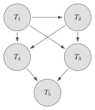

> 17.6 请考虑图 17-16 所示的优先图，相应的调度是冲突可串行化的吗？请解释你的答案。
> 
> 
> 
> 图17-16 实践习题17.6的优先图

**解答:**

是冲突可串行化的。

判断方法是看优先图中是否有环。图中的边都从图的上层指向下层，没有任何路径能回到已经经过的事务，因此优先图无环。根据教材中的判定准则，优先图无环时，相应调度是冲突可串行化的。

与该优先图一致的串行化次序可以是

$$
T_1,\ T_2,\ T_3,\ T_4,\ T_5
$$

也可以是

$$
T_1,\ T_2,\ T_4,\ T_3,\ T_5,
$$

因为 $T_3$ 和 $T_4$ 之间没有先后约束。

> 17.7 什么是无级联调度？为什么要求无级联调度？是否存在要求允许级联调度的情况？请解释你的回答。

**解答:**

无级联调度是指：对于任意两个事务 $T_i$ 和 $T_j$，如果 $T_j$ 读取了先前由 $T_i$ 写出的某个数据项，那么 $T_i$ 的提交操作必须出现在 $T_j$ 的这次读操作之前。也就是说，一个事务只能读取已经提交事务写出的数据。

要求无级联调度的原因是避免级联回滚。若 $T_j$ 读取了尚未提交的 $T_i$ 写出的数据，而后来 $T_i$ 中止，则 $T_j$ 也必须中止；如果又有其他事务读取了 $T_j$ 写出的数据，也可能继续引发更多事务回滚。这会撤销大量已经完成的工作，恢复过程复杂且代价高。无级联调度还一定是可恢复调度，因为读者只有在写者提交之后才读取其结果。

一般没有为了正确性而“必须允许”级联调度的情况。允许级联调度只可能是为了更高并发或更低等待时间而作出的性能折中，例如最低隔离性级别下允许读取未提交数据的场景。但这样会带来脏读和级联回滚风险，所以在通常事务处理中应避免；只有当应用明确能接受不精确结果或能处理这些回滚代价时，才可能允许这类调度。

> 17.12 请列出 ACID 特性，并解释每种特性的用途。

**解答:**

ACID 特性包括：

1. 原子性（Atomicity）：事务的操作要么全部反映到数据库中，要么完全不反映。它的用途是在事务执行过程中发生故障或中止时，系统能够撤销已经做出的部分修改，使数据库看起来好像该事务从未执行过。

2. 一致性（Consistency）：如果事务开始前数据库是一致的，并且事务在隔离状态下正确执行，那么事务结束后数据库仍应保持一致。它的用途是保证事务不会破坏数据库的完整性约束和应用语义约束；这部分主要依赖事务程序本身正确编写，并由数据库完整性约束辅助检查。

3. 隔离性（Isolation）：即使多个事务并发执行，每个事务也应感觉不到其他事务正在同时执行；并发执行的效果应等价于某个串行执行次序。它的用途是防止并发交错导致脏读、丢失更新、不一致读等问题，从而保证并发事务仍能保持数据库一致性。

4. 持久性（Durability）：事务一旦成功提交，它对数据库所做的改变就是永久的，即使随后发生系统故障也不能丢失。它的用途是保证提交结果可靠保存，通常由日志、恢复系统和稳定存储机制来实现。
