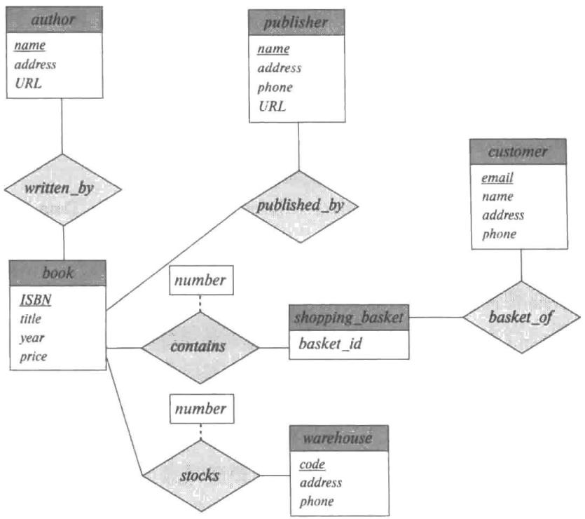
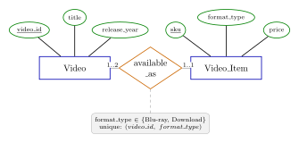
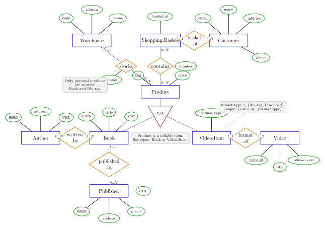

# 6.1

> 为车辆保险公司构建一张 E-R 图，其每位客户拥有一辆或多辆车。每辆车关联零次或任意多次事故的记录。每张保险单为一辆或多辆车投保，并与一次或多次保费支付相关联。每次支付只针对一段特定的时间，具有关联的到期日和缴费日。

# 6.2

> 考虑一个数据库，它包含来自大学模式的 student、course 和 section 实体集，并且另外还记录了学生在不同课程段的不同考试中所获得的分数。
> 
> a. 构建一张 E-R 图，将考试建模为实体，并使用三元联系作为设计的一部分。

> b. 构造一张可替代的 E-R 图，它只使用 student 和 section 之间的二元联系。保证在特定的 student 和 section 对之间只存在一个联系，而且可以表示出学生在不同考试中所得的分数。

# 6.21

> 考虑图 6-30 中的 E-R 图，它对一家网上书店进行建模。
> 
> a. 假设书店增加了蓝光光盘和可下载视频。相同的商品可能以一种格式或两种格式存在，对于不同格式具有不同的价格。绘制 E-R 图的一部分为这个新增需求建模，仅显示与视频相关的部分。
> 
> b. 现在对完整的 E-R 图进行扩展，从而对包含书、蓝光光盘或可下载视频的任意组合的购物篮的情况进行建模。
> 
> 
> 
> 图 6-30 用于在线书店建模的 E-R 图

**解答：**

a. 把视频本身建模为 `Video`，把某一视频的具体销售格式建模为 `Video_Item`。同一个 `Video` 可以有蓝光、下载两种销售条目，也可以只有其中一种；价格放在 `Video_Item` 上，因为同一视频不同格式价格可以不同。

b. 对完整图的扩展如下。将可销售商品抽象为 `Product`，原来的 `Book` 和新增的 `Video_Item` 都是 `Product` 的子类；购物篮与 `Product` 建立 `contains` 联系，因此同一购物篮可以任意混合包含书、蓝光光盘和可下载视频。库存联系只适用于实体商品，即书和蓝光光盘，不适用于下载视频。

# 6.22

> 为一家汽车公司设计一个数据库，用于给它的经销商提供协助以维护客户记录和经销商库存，并协助销售人员订购车辆。
> 
> 每辆车由车辆标识号（Vehicle Identification Number，VIN）来标识，每辆单独的车都是公司提供的特定品牌的特定模型（例如，XF 是塔塔汽车捷豹品牌车的模型）。每个模型都可以有各种选项，但是一辆车可能只有一些（或没有）可用的选项。数据库需要保存关于模型、品牌、选项的信息，以及每个经销商、客户和车的信息。
> 
> 你的设计应该包括 E-R 图、关系模式的集合，以及包括主码和外码约束在内的一系列约束。

**解答：**

E-R 图如下：

关系模式如下，其中下划线表示主码。

- Brand(<u>brand_id</u>, brand_name, country)
- Model(<u>model_id</u>, brand_id, model_name, model_year, base_price)
- Car_Option(<u>option_id</u>, option_name, category, option_price)
- Model_Option(<u>model_id</u>, <u>option_id</u>)
- Vehicle(<u>VIN</u>, model_id, color, manufacture_date, status)
- Vehicle_Option(<u>VIN</u>, <u>option_id</u>)
- Dealer(<u>dealer_id</u>, dealer_name, address, phone)
- Dealer_Inventory(<u>VIN</u>, dealer_id, stocked_since, list_price)
- Customer(<u>customer_id</u>, name, address, phone, email)
- Salesperson(<u>salesperson_id</u>, dealer_id, name, phone)
- Vehicle_Order(<u>order_id</u>, customer_id, salesperson_id, model_id, VIN, order_date, status)
- Order_Option(<u>order_id</u>, <u>option_id</u>, quoted_price)

主码和外码约束如下：

1. `Model.brand_id` 引用 `Brand.brand_id`。每个车型属于一个品牌，一个品牌可以有多个车型。
2. `Model_Option.model_id` 引用 `Model.model_id`，`Model_Option.option_id` 引用 `Car_Option.option_id`。该关系记录某车型可选择哪些选项。
3. `Vehicle.model_id` 引用 `Model.model_id`。每辆具体车辆属于且只属于一个车型。
4. `Vehicle_Option.VIN` 引用 `Vehicle.VIN`，`Vehicle_Option.option_id` 引用 `Car_Option.option_id`。此外应要求该选项也出现在该车辆车型对应的 `Model_Option` 中。
5. `Dealer_Inventory.VIN` 引用 `Vehicle.VIN`，`Dealer_Inventory.dealer_id` 引用 `Dealer.dealer_id`。以 `VIN` 为主码表示一辆车当前至多在一个经销商库存中。
6. `Salesperson.dealer_id` 引用 `Dealer.dealer_id`。每名销售人员隶属于一个经销商。
7. `Vehicle_Order.customer_id` 引用 `Customer.customer_id`，`Vehicle_Order.salesperson_id` 引用 `Salesperson.salesperson_id`，`Vehicle_Order.model_id` 引用 `Model.model_id`，`Vehicle_Order.VIN` 引用 `Vehicle.VIN`。`VIN` 可以为空，表示订单尚未分配到具体车辆；非空时应有 `unique(VIN)`，并要求该车辆的 `model_id` 与订单的 `model_id` 相同。
8. `Order_Option.order_id` 引用 `Vehicle_Order.order_id`，`Order_Option.option_id` 引用 `Car_Option.option_id`。此外应要求订单选项出现在该订单车型对应的 `Model_Option` 中。

# 6.24

> 为航空公司设计一个数据库。数据库必须追踪客户及他们的预订、航班及航班的状态、单次航班上的座位分配，以及未来航班的时刻表和飞行路线。
> 
> 你的设计应该包括 E-R 图、关系模式的集合，以及包括主码和外码约束在内的一系列约束。

**解答：**

E-R 图如下：

这里把 `Flight` 看作航班号对应的计划航班，把 `Flight_Instance` 看作某一日期真正执行的一次航班；航班状态保存在 `Flight_Instance` 中。一个预订可以包含多个航段，因此用 `Reservation_Leg` 表示预订中的单个航段。

关系模式如下，其中下划线表示主码。

- Airport(<u>airport_code</u>, name, city, country)
- Route(<u>route_id</u>, origin_airport, destination_airport, distance)
- Flight(<u>flight_no</u>, route_id, sched_departure_time, sched_arrival_time, operating_days)
- Aircraft(<u>aircraft_id</u>, model)
- Seat(<u>aircraft_id</u>, <u>seat_no</u>, cabin_class)
- Flight_Instance(<u>flight_no</u>, <u>flight_date</u>, aircraft_id, status, gate, actual_departure_time, actual_arrival_time)
- Customer(<u>customer_id</u>, name, email, phone)
- Reservation(<u>reservation_id</u>, customer_id, booked_at, status)
- Reservation_Leg(<u>reservation_id</u>, <u>leg_no</u>, flight_no, flight_date, fare_class, leg_status)
- Seat_Assignment(<u>flight_no</u>, <u>flight_date</u>, <u>seat_no</u>, aircraft_id, reservation_id, leg_no)

主码和外码约束如下：

1. `Route.origin_airport` 和 `Route.destination_airport` 都引用 `Airport.airport_code`，并要求二者不同。
2. `Flight.route_id` 引用 `Route.route_id`。一个航班号对应一条飞行路线和一组计划起降时间。
3. `Seat.aircraft_id` 引用 `Aircraft.aircraft_id`。`Seat` 的主码为 `(aircraft_id, seat_no)`。
4. `Flight_Instance.flight_no` 引用 `Flight.flight_no`，`Flight_Instance.aircraft_id` 引用 `Aircraft.aircraft_id`。`status` 可限制为 `scheduled`、`delayed`、`cancelled`、`departed`、`arrived` 等枚举值。
5. `Reservation.customer_id` 引用 `Customer.customer_id`。每个预订由一个客户创建。
6. `Reservation_Leg.reservation_id` 引用 `Reservation.reservation_id`，`(flight_no, flight_date)` 引用 `Flight_Instance(flight_no, flight_date)`。每个预订至少应有一个航段；这个全部参与约束通常需要断言或应用逻辑保证。
7. `Seat_Assignment(aircraft_id, seat_no)` 引用 `Seat(aircraft_id, seat_no)`，`(flight_no, flight_date)` 引用 `Flight_Instance(flight_no, flight_date)`，`(reservation_id, leg_no)` 引用 `Reservation_Leg(reservation_id, leg_no)`。
8. `Seat_Assignment` 以 `(flight_no, flight_date, seat_no)` 为主码，保证同一次航班中的同一座位至多分配给一个航段；再加 `unique(reservation_id, leg_no)`，保证一个航段至多有一个座位。还应要求 `Seat_Assignment.aircraft_id` 等于对应 `Flight_Instance.aircraft_id`，并要求座位分配的 `(flight_no, flight_date)` 与该 `Reservation_Leg` 预订的航班实例一致。

