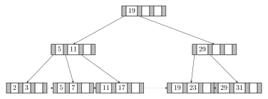
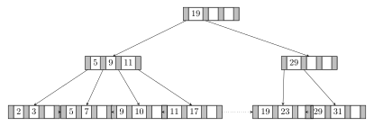
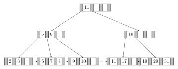
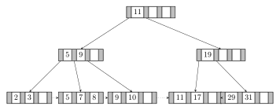

> 14.3 用下面的码值集合建立一棵 $\mathbf{B}^{+}$ 树：
> 
> $$
> (2,3,5,7,11,17,19,23,29,31) 
> $$
> 
> 假设树初始为空，按升序添加这些值。当一个节点所能容纳的指针数是下列情况时，请分别构造 $\mathbf{B}^{+}$ 树：
> 
> a.4  
> c.8

**解答：**

a. $n=4$。

c. $n=8$。

> 14.4 对于实践习题 14.3 中的每一棵 B $^{+}$ 树，请给出下列各操作后树的形状：
>
> a. 插入 9。  
> b. 插入 10。  
> c. 插入 8。  
> d. 删除 23。  
> e. 删除 19。

**解答：**

以下各操作按 a 到 e 的顺序连续执行，每一步都以上一步得到的树为基础。删除后若节点没有下溢，按教材删除算法不强制修改祖先节点中的分隔值，所以内部节点中可能保留已经不在叶节点中的搜索码值。

对于 $n=4$ 的树：

插入 9 后：

插入 10 后：

插入 8 后：

删除 23 后：

删除 19 后：

对于 $n=8$ 的树：

插入 9 后：

插入 10 后：

插入 8 后：

删除 23 后：

删除 19 后：

> 14.17 聚集索引和辅助索引之间有何区别?

**解答：**

聚集索引的搜索码顺序同时定义了数据文件中记录的物理存放顺序。也就是说，文件本身按照该搜索码排序存储，因此相邻的搜索码值通常对应相邻或接近的记录块。聚集索引也称为主索引，但它不一定建立在主码上。由于记录已经按搜索码排列，聚集索引可以是稀疏索引；范围查询和顺序扫描通常较高效。一个文件通常只能按一种顺序物理存放，所以一般只能有一个聚集索引。

辅助索引，也称非聚集索引，其搜索码顺序不决定数据文件的物理存放顺序。记录可能按照另一个搜索码排列，或者没有按该辅助索引的搜索码排列。因此，辅助索引必须是稠密的：它要为每个搜索码值建立索引项，并能找到所有具有该搜索码值的记录。若搜索码不是唯一的，辅助索引还必须保存指向所有匹配记录的指针，或通过桶等间接结构保存这些指针。辅助索引的好处是同一关系上可以建立多个辅助索引，以支持不同查询条件；缺点是访问匹配记录时可能产生较多随机 I/O。
