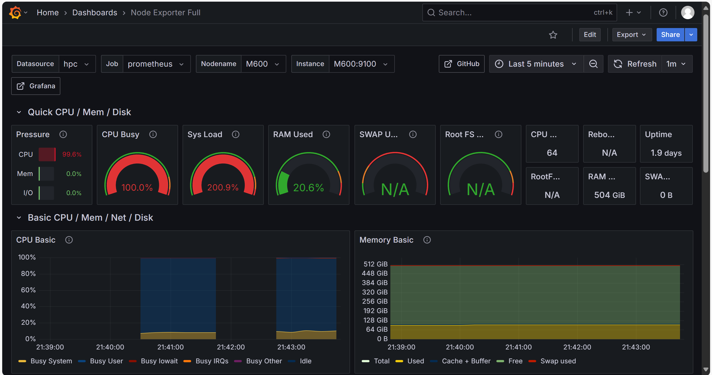

import Asciinema from '@/components/md-comp/AsciinemaWrapper.vue'
import Card from '@md-components/card.vue'

Update @ 2025-6-29 远离上世纪轻薄本：把两个任务挪到了阿里云/HPC101节点上，至少不用担心电脑发热了

# 任务一：从源码构建 OpenMPI 和 HPL

源码构建也是不得不吃的一环了

## OpenMPI

<Card title="任务" type="task">
- 构建并安装 OpenMPI：
  - 前往 OpenMPI 官网 下载最新版本源码。
  - 解压源码，进入源码目录，阅读 README.md。
  - 前往在线文档，查看构建和安装部分，按文档指示构建并安装 OpenMPI。
  - 验证安装是否成功。提示：运行 `ompi_info -all`。
</Card>

参见以下录屏：

import castCompileOpenMPI from "./casts/lab1-compile-from-code-OpenMPI.cast?url"

<Asciinema url={castCompileOpenMPI}/>

## BLAS和CBLAS

<Card title="任务" type="task">
- 构建 BLAS，CBLAS：
  - 下载指定版本 BLAS 源码: blas-3.12.0.tgz, 并完成构建。
  - 下载指定版本 CBLAS 源码: CBLAS.tgz。相应修改 `Makefile.in` 后完成构建。`我们希望你能解决所有报错。`
  - 如果没有错误，两个目录中都会生成一个 `.a` 文件，这是待会要用到的静态链接库。
</Card>

参见以下录屏：

import castCompileBlas from "./casts/lab1-code-compile-blas.cast?url"
import castCompileCblas from "./casts/lab1-code-compile-cblas.cast?url"

*BLAS*

<Asciinema url={castCompileBlas} />

*CBLAS*

<Asciinema url={castCompileCblas} />

## 没有sudo咋办

没有sudo的话是没办法`make install`到系统的`/usr/local`下的，但我们有退而求其次的方案：

在编译时指明`make prefix=$HOME/.local`可以将库弄到自己有权限的位置

这样的话动态链接库仍不会更新（显然我们也没办法`sudo ldconfig`），但是可以用`export LD_LIBRARY_PATH=$HOME/.local/lib:$LD_LIBRARY_PATH`解决

import castSolveXhplLink from "./casts/lab1-solve-xhpl-lib-link.cast?url"

<Asciinema url={castSolveXhplLink} />


<center> *\*解决`xhpl`动态链接库炸掉的问题\** </center>

此外，OpenMPI可以自行管理`PATH`和`LD_LIBRARY_PATH`，所以只要运行`mpirun ./xhpl`节点上动态链接库能用，所有节点上就都能用 (ref:[17.1.2. mpirun / mpiexec — Open MPI 5.0.x documentation](https://docs.open-mpi.org/en/v5.0.x/man-openmpi/man1/mpirun.1.html#remote-execution))

import TimeIcon from "@/assets/icons/mingcute~icon-line.vue"


<Card icon={TimeIcon} color="#88e4c2" title="这一节的原始版本">

## 编译OpenMPI

import cast1URL from "./casts/lab1-1.cast?url";

<Asciinema url={cast1URL} />

import cast2URL from "./casts/lab1-2.cast?url";

<Asciinema url={cast2URL} />

编译大成功

import cast9URL from "./casts/lab1-9.cast?url";

<Asciinema url={cast9URL} />

## 编译BLAS和CBLAS

import cast11URL from "./casts/lab1-11.cast?url";

<Asciinema url={cast11URL} />

编译BLAS的过程同样是畅通无阻

import cast12URL from "./casts/lab1-12.cast?url";

<Asciinema url={cast12URL} />

编译CBLAS的过程遇到了`Rank mismatch in argument ‘strue1’ at (1) (scalar and rank-1)`，小改一下`FFLAGS`(视频4:07处)就过了，整体上仍然畅通无阻


## 编译HPL

import cast6URL from "./casts/lab1-6.cast?url";

<Asciinema url={cast6URL} />

该录屏中展示了我们从忘改g99一直到最终编译成功的过程（虽然结尾的xhpl运行报错了 ~~（废话docker还没配呢能运行起来就有鬼了）~~ ）

</Card>

# 任务二：搭建集群并使用 HPL 测试性能

<Card title="关于运行环境的说明" type="info">

我们的 *搭建集群* 和 *HPL 性能调优* 不在同一个环境下 （Zen2的CPU跑这玩意可不是跟你闹着玩的）

- 使用docker在本机构建了一个具有4个节点的集群，实现了一直到 *调整 HPL.dat 参数优化性能* 往前的工作，该集群满足：
  - 至少有 4 个在线节点。
  - 节点之间能够通过 ssh 进行互联。MPI 能正常工作。
- 使用HPC101的计算节点完成了 *调整 HPL.dat 参数优化性能* 的工作

</Card>


## 配置集群！

<Card type="task" title="任务">

- 创建 Dockerfile：
  - 安装必要的依赖包和编译工具
  - 配置 SSH 服务用于容器间通信
  - 配置 SSH 密钥认证
  - 基于 Linux 镜像创建包含编译安装 MPI 和 HPL 的 Dockerfile
- 构建和运行容器：
  - 使用 docker-compose 创建多个容器实例
  - 配置容器网络实现互联
  - 设置容器主机名和 hosts 文件
- 运行 HPL 测试：
  - 在容器中配置 hostfile
  - 使用 mpirun 运行 HPL 测试

</Card>


```dockerfile
FROM dockerhub.zjusct.io/library/ubuntu:25.10 AS build
# 安装依赖
RUN apt-get update  && DEBIAN_FRONTEND=noninteractive apt-get install --no-install-recommends -y \
    build-essential \
    wget \
    openssh-server \
    openmpi-bin \
    libopenmpi-dev \
    libopenblas-dev \
        iputils-ping \
    net-tools \
    && rm -rf /var/lib/apt/lists/*

# 安装 HPL
WORKDIR /opt
COPY ./hpl-2.3.tar.gz .
RUN tar xvf hpl-2.3.tar.gz && rm hpl-2.3.tar.gz

# 编译 HPL
WORKDIR /opt/hpl-2.3
RUN ./configure --prefix=/usr/local/hpl LDFLAGS="-lm" LIBS="-lm" 
RUN make && make install

# 新用户
RUN useradd -m hpl && echo "hpl:hpl" | chpasswd
RUN chown -R hpl:hpl /usr/local/hpl

# 创建工作目录
WORKDIR /home/hpl
COPY entrypoint.sh .
RUN chmod +x entrypoint.sh #entrypoint将会处理ssh服务

COPY ./ssh /home/hpl/.ssh
RUN chmod 700 /home/hpl/.ssh && chmod 600 /home/hpl/.ssh/* && chown -R hpl:hpl /home/hpl/.ssh

EXPOSE 22
ENTRYPOINT ["./entrypoint.sh"]
```

当然还有我们的`docker-compose.yml`文件：

```yaml
version: '3'
services:
  node01:
    image: ${APPLIED_IMAGE}
    hostname: node01
    environment:
      - HOSTS=${HOSTS} 
    networks:
      hpl_net:
        ipv4_address: 172.20.0.2

  node02:
    image: ${APPLIED_IMAGE}
    hostname: node02
    environment:
      - HOSTS=${HOSTS} 
    networks:
      hpl_net:
        ipv4_address: 172.20.0.3

  node03:
    image: ${APPLIED_IMAGE}
    hostname: node03
    environment:
      - HOSTS=${HOSTS} 
    networks:
      hpl_net:
        ipv4_address: 172.20.0.4

  node04:
    image: ${APPLIED_IMAGE}
    hostname: node04
    environment:
      - HOSTS=${HOSTS} 
    networks:
      hpl_net:
        ipv4_address: 172.20.0.5

networks:
  hpl_net:
    driver: bridge
    ipam:
      config:
        - subnet: 172.20.0.0/16
```

按照实验文档给的方案，每个node都是`build: .`~~虽然我们知道docker有层缓存不会每次都重新编译，但启动的时候还是膈应的慌~~，总之我们先`docker build -t "5dbwat4/hpc101-lab1-hpl-openblas:1.0" . `（而且导出和分享也方便），名字配置到`.env`里面，然后再`docker-compose up -d`。

import cast14URL from "./casts/lab1-14.cast?url";

<Asciinema url={cast14URL} />

当然还有我们不得不提的权限问题（一开始忘了给`/home/hpl/.ssh`给权限了 ~~（相关片段已裁剪（其实上面那个录屏的后续就是`ssh node02`以及`cannot open directory '.ssh': Permission denied`））~~ ）


import cast15URL from "./casts/lab1-15.cast?url";

<Asciinema url={cast15URL} />

测试连通性！虽然过程不太顺利，但还是成功了

import cast16URL from "./casts/lab1-16.cast?url";

<Asciinema url={cast16URL} />

在虚拟机集群上使用 OpenMPI 运行 HPL 性能测试


## 性能调优

<Card title="任务" type="task">

在完成基本的 HPL 测试后，你可以尝试通过以下方法提高性能：

1. 调整 HPL.dat 参数：
   - 调整问题规模 N 以充分利用内存
   - 调整分块大小 NB 以优化计算效率
   - 调整 P×Q 进程网格布局以匹配集群拓扑
2. 编译优化：
   - 更换编译器
   - 修改编译优化选项
   - 尝试更换 BLAS 库
3. 运行环境优化：
   - 优化 OpenMP 绑核参数
   - 调整 MPI 进程绑定，rank 拓扑

请记录你尝试过的优化方法及其效果，分析性能提升的原因。性能的绝对值不作为评判依据，重要的是你通过哪些方法提高了性能，以及你对这些优化方法的理解。
</Card>

### 调整 HPL.dat 参数

ref: [HPL Tuning](https://www.netlib.org/benchmark/hpl/tuning.html)

ref: [HPL Frequently Asked Questions](https://www.netlib.org/benchmark/hpl/faqs.html)

测了一些数据

```plain
================================================================================
T/V                N    NB     P     Q               Time                 Gflops
--------------------------------------------------------------------------------
WR00R2C4        5120    32     4     4               1.99             4.4937e+01

================================================================================
T/V                N    NB     P     Q               Time                 Gflops
--------------------------------------------------------------------------------
WR00R2C4       10240    32     4     4              15.43             4.6394e+01

================================================================================
T/V                N    NB     P     Q               Time                 Gflops
--------------------------------------------------------------------------------
WR00R2C8       10240    48     4     4              15.35             4.6653e+01

================================================================================
T/V                N    NB     P     Q               Time                 Gflops
--------------------------------------------------------------------------------
WR00R2C8       10240    48     1    16              23.67             3.0244e+01

================================================================================
T/V                N    NB     P     Q               Time                 Gflops
--------------------------------------------------------------------------------
WR00R2C4       20480    32     4     4             126.13             4.5409e+01

```

得出大致在`N=10240`，`NB=48`，`P=4`，`Q=4`时性能较好

p.s. 交的HPL.out是后续用OpenBLAS调优之后测的，测出来最好的配置是：
```plain
================================================================================
T/V                N    NB     P     Q               Time                 Gflops
--------------------------------------------------------------------------------
WR00R2R2       10240    96     2     8               1.50             4.7675e+02
```

**对优化方法的理解**：

**1. 调整问题规模 N 以充分利用内存**

为了找出系统的最佳性能，应该选择适合内存的最大问题规模。如果选择的问题规模过大，就会发生交换，性能会下降。

通常来说，应该选择总内存的80%作为问题规模的上限。

> In order to find out the best performance of your system, the largest problem size fitting in memory is what you should aim for. The amount of memory used by HPL is essentially the size of the coefficient matrix. So for example, if you have 4 nodes with 256 Mb of memory on each, this corresponds to 1 Gb total, i.e., 125 M double precision (8 bytes) elements. The square root of that number is 11585. One definitely needs to leave some memory for the OS as well as for other things, so a problem size of 10000 is likely to fit. As a rule of thumb, 80 % of the total amount of memory is a good guess. If the problem size you pick is too large, swapping will occur, and the performance will drop. If multiple processes are spawn on each node (say you have 2 processors per node), what counts is the available amount of memory to each process. ([ref](https://www.netlib.org/benchmark/hpl/faqs.html#pbsize))

**2. 调整分块大小 $NB$ 以优化计算效率**  

NB是HPL中数据分布和计算粒度的关键参数。过小会导致计算性能受限（内存层次结构无数据重用），消息数量也会增加；过大则会影响负载均衡的效果。

> HPL uses the block size NB for the data distribution as well as for the computational granularity. From a data distribution point of view, the smallest NB, the better the load balance. You definitely want to stay away from very large values of NB. From a computation point of view, a too small value of NB may limit the computational performance by a large factor because almost no data reuse will occur in the highest level of the memory hierarchy. The number of messages will also increase. Efficient matrix-multiply routines are often internally blocked. Small multiples of this blocking factor are likely to be good block sizes for HPL. The bottom line is that "good" block sizes are almost always in the [32 .. 256] interval. The best values depend on the computation / communication performance ratio of your system. To a much less extent, the problem size matters as well. Say for example, you emperically found that 44 was a good block size with respect to performance. 88 or 132 are likely to give slightly better results for large problem sizes because of a slighlty higher flop rate.([ref](https://www.netlib.org/benchmark/hpl/faqs.html#blsize))


**3. 调整 PxQ 进程网格布局以匹配集群拓扑**


进程网格的 PxQ 比例直接影响通信效率。P 和 Q 应该大致相等，Q 略大于 P。（除了4x4的布局，也尝试了1x16的极端布局，可以显著看出性能的下降）
> This depends on the physical interconnection network you have. Assuming a mesh or a switch HPL "likes" a 1:k ratio with k in [1..3]. In other words, P and Q should be approximately equal, with Q slightly larger than P. Examples: 2 x 2, 2 x 4, 2 x 5, 3 x 4, 4 x 4, 4 x 6, 5 x 6, 4 x 8 ... If you are running on a simple Ethernet network, there is only one wire through which all the messages are exchanged. On such a network, the performance and scalability of HPL is strongly limited and very flat process grids are likely to be the best choices: 1 x 4, 1 x 8, 2 x 4 ... (  [ref](https://www.netlib.org/benchmark/hpl/faqs.html#grid) )


### 尝试更换 BLAS 库

换用OpenBLAS编译HPL

结果是：运行速度快多了，跑出来的Gflops更是直接上了个数量级

```plain
================================================================================
T/V                N    NB     P     Q               Time                 Gflops
--------------------------------------------------------------------------------
WR00R2C8       10240    48     4     4               1.94             3.6896e+02

================================================================================
T/V                N    NB     P     Q               Time                 Gflops
--------------------------------------------------------------------------------
WR00R2C8       20480    48     4     4              13.31             4.3040e+02
```

# Bonus任务

## 通过 NFS 或其他共享文件系统，实现集群间文件共享

对于docker，我们可以使用`volumes`来实现集群间文件共享

```yaml
version: '3'
services:
  node01:
    image: ${APPLIED_IMAGE}
    hostname: node01
    environment:
      - HOSTS=${HOSTS} 
    networks:
      hpl_net:
        ipv4_address: 172.20.0.2
    volumes:
      - ./hpl_data:/home/hpl/data
  node02:
    ...
    volumes:
      - ./hpl_data:/home/hpl/data


```

使用volumes将本机上的`./hpl_data`目录挂载到每个节点的`/home/hpl/data`目录下

ref: [Volumes | Docker Docs](https://docs.docker.com/engine/storage/volumes/)


## (*)选择你喜欢的节点指标，日志收集，监控等方法，并利用 grafana 等工具进行可视化

<Card type="info" title="Note 👉👈">
这个任务是在hpc101集群上完成的
</Card>

我们将使用**Prometheus**+**Grafana**实现该任务

### Step 1: 安装相关工具

参考[First steps with Prometheus | Prometheus](https://prometheus.io/docs/introduction/first_steps/)前往[Download | Prometheus](https://prometheus.io/download/)下载prometheus和node_exporter

参考[Install Grafana on Debian or Ubuntu | Grafana documentation](https://grafana.com/docs/grafana/latest/setup-grafana/installation/debian/)下载grafana

由于没有sudo，所以都是使用下载预编译二进制文件的方式

### Step 2: 配置Prometheus

先ssh到每个节点运行一下`node_exporter`

然后回到Prometheus，配置prometheus.yml，修改默认的scrape_configs为如下内容

```yaml
# A scrape configuration containing exactly one endpoint to scrape:
scrape_configs:
  # The job name is added as a label `job=<job_name>` to any timeseries scraped from this config.
  - job_name: "prometheus"
    static_configs:
      - targets:  
          - "M600:9100" 
          - "M601:9100"
          - "M602:9100"
          - "M603:9100"
```

我们打算监听四个节点，就配置这四个节点，9100是node_exporter暴露的端口

配完就直接运行`./prometheus --config.file=prometheus.yml`

import castRunPrometheus from './casts/lab1-run-prometheus.cast?raw'

<Asciinema cast={castRunPrometheus} />

ref: [First steps with Prometheus | Prometheus](https://prometheus.io/docs/introduction/first_steps/)

### Step 3: 配置Grafana

直接运行`grafana server`然后剩下的就到浏览器里操作了

import castRunGrafana from './casts/lab1-run-grafana.cast?raw'

<Asciinema cast={castRunGrafana} />

ref: [Grafana support for Prometheus | Prometheus](https://prometheus.io/docs/visualization/grafana/)

关于 *选择你喜欢的节点指标* 这个部分，我们直接偷了一个现成还不算难看的dashboard配置 [Node Exporter Full | Grafana Labs](https://grafana.com/grafana/dashboards/1860-node-exporter-full/)



<center> *\*此时有人在用xhpl炸节点（x\** </center>

