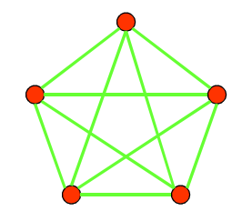
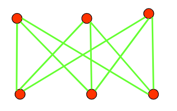

## Chapter 10.7 Planar Graphs

- **Kuratowski’s theorem**: A graph is nonplanar if and only if it contains a subgraph homeomorphic to $K_{3,3}$ or $K_5$.
- 库拉托夫斯基定理：一个图是非平面的当且仅当它包含一个与$K_{3,3}$或$K_5$同胚的子图。

$K_5$:

$K_{3,3}$: 

## Chapter 10.8 Graph Coloring

题型：find the number of colors needed to color the map / the chromatic number of the given

graph.

解法：map先画出dual graph，然后graph是K几的答案就是几
