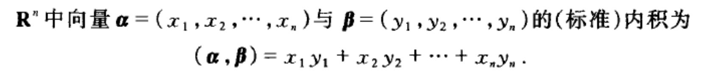

# 第1章 集合 关系 运算 结构

高斯消元法

# 第2章 线性空间 内积空间

## 2.1线性空间的定义及其简单性质 

## 2.2线性子空间 

## 2.3 线性相关性 

## 2.4 有限维线性空间的基和维数 向量组的秩

## 2.5 向量的坐标 

## 2.6 子空间的交与和 直和 

## 2.7 内积空间... 

## 2.8欧氏空间的单位正交基...... 

## 2.9 正交子空间 正交补 

# 

# 

# 第3章 线性映射

## 3.1 线性映射的定义及例

## 3.2 线性映射的像和核 

## 3.3线性映射的运算 空间{width="0.8076388888888889in" height="0.6305555555555555in"} 

## 3.4有限维线性空间的线性映射 线性陕射的秩 

## 3.5 线性空间的同构 

# 

# 第4章 矩阵

## 4.1 矩阵的定义

## 4.2线性映射的矩阵表示

## 4.3矩阵的加法与数量乘法

## 4.4矩阵的乘法

## 4.5 可逆矩阵

## 4.6矩阵的转置

## 4.7矩阵的初等变换和初等矩阵

## 4.8矩阵的秩 相抵标准形

## 4.9分块矩阵

## 4.10基的变换矩阵与坐标变换

# 

# 第5章 行列式

## 5.1 n阶行列式的定义 

## 5.2行列式按一列(行)的展开式 

## 5.3方阵乘积的行列式 

## 5.4 Cramer法则 

# 第6章 线性方程组与线性几何

## 6.1齐次线性方程组

## 6.2非齐次线性方程组

# 第7章 特征值与特征向量 矩阵的标准形

## 7.1 正交变换与正交矩阵 

## 7.2 二次曲线一般方程化为标准方程及其分类 

## 7.3 线性变换在不同基下的矩阵表示 相似矩阵 

## 7.4特征值与特征向量 

## 7.5可对角化的条件 相似标准形 

## 7.6实对称矩阵的对角化 

## 7.7双线性函数 二次型 

## 7.8实二次型的标准形 实对称矩阵的相合标准形

## 7.9正定二次型与正定矩阵 其它有定二次型
