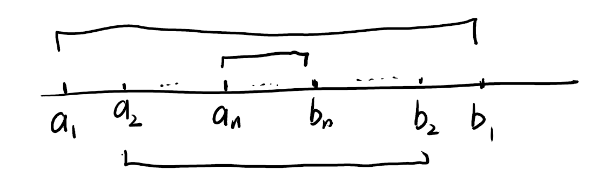

无穷小量和无穷大量

定义1
设f在某$U^{0}\left( x_{0} \right)$上有定义.若$\lim_{x \rightarrow x_{0}}f(x) = 0$，则称f为当$x \rightarrow x_{0}$时的无穷小量

若g在某$U^{0}\left( x_{0} \right)$上有界，则称g为当$x \rightarrow x_{0}$时的有界量

1.两个(相同类型的)无穷小量之和、差、积仍为无穷小量.

2.无穷小量与有界量的乘积为无穷小量.

若$\lim_{x \rightarrow x_{0}}\frac{f(x)}{g(x)} = 0$则称当$x \rightarrow x_{0}$时f为g的高阶无穷小量，或称g为f的低阶无穷小量，记作$f(x) = o\left( g(x) \right)$，特别的，无穷小量f也记作$f(x) = o(1)\left( x \rightarrow x_{0} \right)$

若存在正数K和L,使得在某U°(x₀)上有$k \leq \left| \frac{f(x)}{g(x)} \right| \leq L$,
则称f与g为当$x \rightarrow x_{0}$时的同阶无穷小量.特别当$\lim_{x \rightarrow x_{0}}\frac{f(x)}{g(x)} = c \neq 0$时f与g必为同阶无穷小量.

若$\lim_{x \rightarrow x_{0}}\frac{f(x)}{g(x)} = 1$，则称f与g是当$x \rightarrow x_{0}$时的等价无穷小量.记作$f(x)\sim g(x)\left( x \rightarrow x_{0} \right)$

并不是任何两个无穷小量都可以进行这种阶的比较.

定理3.12设函数f,g,h在U°(x₀)上有定义，且有$f(x)\sim g(x)\left( x \rightarrow x_{0} \right)$

i.  若$\lim_{x \rightarrow x_{0}}f(x)h(x) = A$则$\lim_{\pi \rightarrow x_{0}}g(x)h(x) = A$

ii. 若$\lim_{x \rightarrow x_{0}}\frac{h(x)}{f(x)} = B$则$\lim_{x \rightarrow x_{0}}\frac{h(x)}{g(x)} = B$

连续

设函数 *f* 在某 *U*(*x*0) 上有定义。若

lim

*x→x*0

*f*(*x*) = *f*(*x*0)

则称 *f* 在点 *x*0 连续。

导数和微分

我们知道函数 y=f(x)的一阶微分是 dy=f\'(x)dx

基本初等函数导数公式

$$\left( \sin x \right)^{'} = \cos x$$

$$\left( \cos x \right)^{'} = - \sin x$$

$$\left( \tan x \right)^{'} = \sec^{2}x = \frac{1}{\cos^{2}x}$$

$$\left( \cot x \right)^{'} = - \csc^{2}x = - \frac{1}{\sin^{2}x}$$

$$\left( \sec x \right)^{'} = \sec x\tan x$$

$$\left( \csc x \right)^{'} = - \csc x\cot x$$

$$\left( \arcsin x \right)^{'} = \frac{1}{\sqrt{1 - x^{2}}}$$

$$\left( \arccos x \right)^{'} = - \frac{1}{\sqrt{1 - x^{2}}}$$

$$\left( \arctan x \right)^{'} = \frac{1}{1 + x^{2}}$$

$$\left( {arccot}x \right)^{'} = - \frac{1}{1 + x^{2}}$$

含参求导数：$\frac{\mathbb{d}y}{\mathbb{d}x} = \frac{\mathbb{d}y}{\mathbb{d}t} \cdot \frac{\mathbb{d}t}{\mathbb{d}x} = \frac{\frac{\mathbb{d}y}{\mathbb{d}t}}{\frac{\mathbb{d}x}{\mathbb{d}t}} = \frac{\psi^{'}(t)}{\psi^{'}(t)}$

高阶导数莱布尼茨公式

$$(uv)^{(n)} = u^{(n)}v^{(0)} + C_{n}^{1}u^{(n - 1)}v^{(1)} + C_{n}^{2}u^{(n - 2)}v^{(2)} + \ldots + C_{n}^{k}u^{(n - k)}v^{(k)} + \ldots + u^{(0)}v^{(n)} = \sum_{k = 0}^{n}{C_{n}^{k}u^{(n - k)}v^{(k)}}$$

即函数的微分等于函数的导数与自变量微分的积.比如

第六章微分中值定理及其应用

定理6.1(罗尔(Rolle)中值定理) 若函数f满足如下条件：

(i)f在闭区间\[a,b\]上连续；

(ii)f在开区间(a,b)上可导；

(ii)f(a)=f(b),

则在(a,b)上至少存在一点ξ,使得

f\'(ξ)= 0.

罗尔定理的几何意义是说：在每一点都可导的一段连续曲线上，如果曲线的两端

点高度相等，则至少存在一条水平切线

定理6.2(拉格朗日(Lagrange)中值定理) 若函数f满足如下条件：

(i)f在闭区间\[a,b\]上连续；

(ii)f在开区间(a,b)上可导，

则在(a,b)上至少存在一点ξ,使得

$$f^{'}(\xi) = \frac{f(b) - f(a)}{b - a}$$

推论1 若函数f在区间I上可导，且f\'(x)=0,x∈I,则f为I上的一个常量函数.

推论2 若函数f和g均在区间1上可导，且f\'(x)=g\'(x),x∈I,则在区间 I上
f(x)与g(x)只相差某一常数，即 f(x)=g(x)+c(c为某一常数).

推论3(导数极限定理) 设函数f在点x0的某邻域 U(x0)上连续，在U°(x0)上可

导，且极限$\lim_{x \rightarrow x_{0}}f^{'}(x)$存在，则子在点x0可导，且
$f^{'}\left( x_{0} \right) = \lim_{x \rightarrow x_{0}}f^{'}(x)$

分段函数在间断点的导数：用导数极限定理求plo

（单调函数）定理 6.3
设f(x)在区间1上可导，则f(x)在I上递增(减)的充要条件是 f\'(x)≥0(≤0).

定理 6.4 若函数f在(a,b)上可导，则f在 (a,b)上严格递增(递减)的充要条件是：

(i)对一切x∈(a,b),有f\'(x)≥0(f\'(x)≤0);

(ii)在(a,b)的任何子区间上f\'(x)≠0.

定理 6.5(达布(Darboux)定理) 若函数f在\[a,b\]上可导，且f\'.(a)≠f\'(b),k
为介于f\'(a)f\'(b)之间任一实数，则至少存在一点$\xi \in (a,b)$,使得
$f^{'}(\xi) = k$.有时称上述定理为导函数的介值定理.

推论 设函数f(x)在区间1上满足f\'(x)≠0,那么f(x)在区间I上严格单调.

\## 柯西中值定理和不定式极限

定理 6.6(柯西中值定理) 设函数f和g满足：

(i)在\[a,b\]上都连续；

(ii)在(a,b)上都可导；

(iii)f\'(x)和g\'(x)不同时为零；

(iv)g(a)≠g(b),

则存在ξ∈(a,b),使得$\frac{f^{'}(\xi)}{g^{'}(\xi)} = \frac{f(b) - f(a)}{g(b) - g(a)}$

洛必达

泰 勒 公 式

1.  带有佩亚诺型余项的泰勒公式

对于一般函数f,设它在点x0存在直到 n阶的导数.由这些导数构造一个 n次多项式

$$T_{n}(x) = f\left( x_{0} \right) + \frac{f^{'}\left( x_{0} \right)}{1!}\left( \chi - x_{0} \right) + \frac{f^{''}\left( x_{0} \right)}{2!}\left( x - x_{0} \right)^{2} + \ldots + \frac{f^{(n)}\left( x_{0} \right)}{n!}\left( x - x_{0} \right)^{n}$$

称为函数f在点x。的泰勒(Taylor)多项式，

定理 6.9
若函数f在点x。存在直至n阶导数，则有$f(x) = T_{n}(x) + o\left( \left( x - x_{0} \right)^{n} \right)$，即

$$f(x) = f\left( x_{0} \right) + \frac{f^{'}\left( x_{0} \right)}{1!}\left( \chi - x_{0} \right) + \frac{f^{''}\left( x_{0} \right)}{2!}\left( x - x_{0} \right)^{2} + \ldots + \frac{f^{(n)}\left( x_{0} \right)}{n!}\left( x - x_{0} \right)^{n} + o\left( \left( x - x_{0} \right)^{n} \right)$$

该式称为函数f在x0的泰勒公式，$R_{n}(x) = f(x) - T_{n}(x)$称为泰勒公式的余项，形如$o\left( \left( x - x_{0} \right)^{n} \right)$的余项称为佩亚诺(Peano)型余项.所以(4)式又称为带有佩亚诺型余项的泰勒公式.

定理 6.10(泰勒定理) 若函数f在\[a,b\]上存在直至n阶的连续导函数，在(a,b)

上存在(n+1)阶导函数，则对任意给定的x,x0∈\[a,b\],至少存在一点ξ∈(a,b),使得

$$f(x) = f\left( x_{0} \right) + \frac{f^{'}\left( x_{0} \right)}{1!}\left( \chi - x_{0} \right) + \frac{f^{''}\left( x_{0} \right)}{2!}\left( x - x_{0} \right)^{2} + \ldots + \frac{f^{(n)}\left( x_{0} \right)}{n!}\left( x - x_{0} \right)^{n} + \frac{f^{(n + 1)}(\xi)}{(n + 1)!}\left( x - x_{0} \right)^{n + 1}$$

（拉格朗日型余项）

函数的极值与最大(小)值

定理6.11(极值的第一充分条件)
设f在点$x_{0}$连续，在某邻域$U^{o}\left( x_{0};\delta \right)$上可导

(i)若当$x \in \left( x_{0} - \delta,x_{0} \right)$时f\'(x)≤0,当$x \in \left( x_{0},x_{0} + \delta \right)$时f\'(x)≥0,则f在点$x_{0}$取

得极小值.

(ii)若当$x \in \left( x_{0} - \delta,x_{0} \right)$时f\'(x)≥0,当$x \in \left( x_{0},x_{0} + \delta \right)$时f\'(x)≤0,则f在点$x_{0}$取

得极大值.

定理 6.12(极值的第二充分条件)
设f在$x_{0}$的某邻域$U^{o}\left( x_{0};\delta \right)$上一阶可导，在$x = x_{0}$处二阶可导，且$f^{'}\left( x_{0} \right) = 0,f^{''}\left( x_{0} \right) \neq 0$.

(i)若$f^{''}\left( x_{0} \right) < 0$,则f在$x_{0}$取得极大值.

(ii)若$f^{''}\left( x_{0} \right) > 0$,则f在$x_{0}$取得极小值.

定理6.13(极值的第三充分条件) 设f在$x_{0}$的某邻域上存在直到n-1阶导函

数，在$x_{0}$处 n
阶可导，且$f^{(k)}\left( x_{0} \right) = 0,(k = 1,2,\ldots,n - 1),f^{(n)}(x) \neq 0$,则

(i)当 n 为 偶 数
时，f在$x_{0}$取得极值，且当$f^{(n)}\left( x_{0} \right) < 0$时取极大

值，$f^{(n)}\left( x_{0} \right) > 0$时取极小值.

(ii)当n为奇数时、f在$x_{0}$处不取极值

实数的完备性

§1 关于实数集完备性的基本定理

1： 区间套定理

定义1
设闭区间列$\left| \left\lbrack a_{n},b_{n} \right\rbrack \right|$具有如下性质：

(i)$\left\lbrack a_{n},b_{n} \right\rbrack \supset \left\lbrack a_{n + 1},b_{n + 1} \right\rbrack,n = 1,2,\cdots$;

(ii)$\lim_{n \rightarrow \infty}\left( b_{n} - a_{n} \right) = 0$

则$\left| \left\lbrack a_{n},b_{n} \right\rbrack \right|$称为闭区间套，或简称区间套

$a_{1} \leq a_{2} \leq \ldots \leq a_{n} \leq \ldots \leq b_{n} \leq \ldots \leq b_{2} \leq b_{1}$

定理 7.1(区间套定理) 若\|\[a。,b.\]}是一个区间套，则在实数系中存在唯一的

一点ξ,使得$\xi \in \left\lbrack a_{n},b_{n} \right\rbrack,n = 1,2,\cdots$,即

$$a_{n} \leq \xi \leq b_{n},n = 1,2,\cdots 2$$

二、聚点定理与有限覆盖定理

定义2
设S为数轴上的点集，ξ为定点(它可以属于S,也可以不属于S).若ξ的任何邻域都含有S中无穷多个点，则称ξ为点集S的一个聚点.

定义 2′ 对于点集 S,若点ξ的任何$\varepsilon$邻域都含有S
中异于ξ的点，即$U^{o}(\xi;\varepsilon) \cap S \neq \varnothing$,则称ξ为S的一个聚点.

定义2"
若存在各项互异的收敛数列$\left\{ x_{n} \right\} \subset S$,则其极限$\lim_{n \rightarrow \infty}x_{n} = \xi$称为S的一个
聚点

定义3 设S为数轴上的点集，H为开区间的集合(即 H的每一个元素都是形如
(α,β)的开区间).若S中任何一点都含在H中至少一个开区间内，则称 H为S的一个
开覆盖，或称
H覆盖S.若H中开区间的个数是无限(有限)的，则称H为S的一个无限开覆盖(有限开覆盖).

定理 7.2(魏尔斯特拉斯(Weierstrass)聚点定理) 实轴上的任一有界无限点集S
至少有一个聚点.

定理 7.3(海涅一博雷尔(Heine-Borel)有限覆盖定理)
设H为闭区间\[a,b\]的一个(无限)开覆盖，则从H中可选出有限个开区间来覆盖\[a,b\].

不定积分

积分表

1.  $\int 0\mathbb{d}x = C$

2.  $\int 1\mathbb{d}x = \int\mathbb{d}x = x + C$

3.  $\int x^{\alpha}\mathbb{d}x = \frac{x^{\alpha + 1}}{\alpha + 1} + C(\alpha \neq - 1,x > 0)$

4.  $\int\frac{1}{x}\mathbb{d}x = \ln|x| + C(x \neq 0)$

5.  $\int\mathbb{e}^{x}\mathbb{d}x = \mathbb{e}^{x} + C$

6.  $\int a^{x}\mathbb{d}x = \frac{a^{x}}{\ln a} + C(a > 0,a \neq 1)$

7.  $\int\cos{ax}\mathbb{d}x = \frac{1}{a}\sin{ax} + C(a \neq 0)$

8.  $\int\sin{ax}\mathbb{d}x = - \frac{1}{a}\cos{ax} + C(a \neq 0)$

9.  $\int\sec^{2}x\mathbb{d}x = \tan x + C$

10. $\int\csc^{2}x\mathbb{d}x = - \cot x + C$

11. $\int\sec x \cdot \tan x\mathbb{d}x = \sec x + C$

12. $\int\csc x \cdot \cot x\mathbb{d}x = - \csc x + C$

13. $\int\frac{\mathbb{d}x}{\sqrt{1 - x^{2}}} = arc\sin x + C = - \arccos x + C_{1}$

14. $\int\frac{\mathbb{d}x}{1 + x^{2}} = \arctan x + C = - {arccot}x + C$

$\varphi(J) \subseteq I$定理 8.1
若函数f在区间I上连续，则子在I上存在原函数 F,即 F\'(x)= f(x),x∈l.

定理 8.2 设F是f在区间I上的一个原函数，则

(i)F+C也是f在1上的原函数，其中C为任意常量函数①;

(ii)f在I上的任意两个原函数之间，只可能相差一个常数.

定义2
函数f在区间I上的全体原函数称为f在1上的不定积分，记作$\int f(x)\mathbb{d}x$

定理 8.3（线性法则）
若函数f与g在区间I上都存在原函数，$k_{1},k_{2}$为两个任意常数，则$k_{1}f + k_{2}g$在I上也存在原函数，且当k1和k2不同时为零时，有

$$\int\left\lbrack k_{1}f(x) + k_{2}g(x) \right\rbrack\mathbb{d}x = k_{1}\int f(x)\mathbb{d}x + k_{2}\int g(x)\mathbb{d}x$$

§2 换元积分法与分部积分法

定理 8.4 (第一换元积分法)( 凑微分法)
(这两个与复合函数求导法对应)设函数f(x)在区间I上有定义，φ(t)在区间J上可导，且.如果不定积分$\int f(x)\mathbb{d}x = F(x) + C$在1上存在，则不定积分$\int f\left( \varphi(t) \right)\varphi^{'}(t)\mathbb{d}t$在J上也存在，且

$$\int f\left( \varphi(t) \right)\varphi^{'}(t)\mathbb{d}t = F\left( \varphi(t) \right) + C$$

定理 8.5(第二换元积分法)
(代入换元法)设函数f(x)在区间1上有定义，φ(t)在区间J上
可导，φ(J)=I,且x=φ(t)在区间J上存在反函数1=φ1(x),x∈I.如果不定积分$\int f(x)\mathbb{d}x$在I上存在，则当不定积分$\int f\left( \varphi(t) \right)\varphi^{'}(t)\mathbb{d}t = G(t) + C$在J上存在时，在I上有

$$\int f(x)\mathbb{d}x = G\left( \varphi^{- 1}(x) \right) + C$$

定理8.6(分部积分法)(与乘积求导相对应)若u(x)与v(x)可导，不定积分
$\int u^{'}(x)v(x)\mathbb{d}x$存在，则$\int u(x)\nu^{'}(x)\mathbb{d}x$也存在，并有

$$\int u(x)v^{'}(x)\mathbb{d}x = u(x)\nu(x) - \int u^{'}(x)v(x)\mathbb{d}x$$

有理函数的不定积分

一般形式为$R(x) = \frac{p(x)}{Q(x)} = \frac{\alpha_{0}x^{n} + a_{1}x^{n - 1} +}{\beta_{0}x^{m} + \beta_{1}x^{m - 1} +}\frac{\ldots + a_{n}}{\ldots + \beta m}$

第一步 对分母Q(x)在实系数内作标准分解：（必为只有一次的和二次的）

第二步 根据分母的各个因式分别写出与之相应的部分分式：

第三步 确定待定系数：

定积分

定积分是值，不定积分是函数族

§2 牛顿一莱布尼茨公式

定理 9.1 若函数f在\[a,b\]上连续，且存在原函数
F,即$F^{'}(x) = f(x),x \in \lbrack a,b\rbrack$,

则f在\[a,b\]上可积，且

$$\int_{a}^{b}{f(x)\mathbb{d}x} = F(b) - F(a)$$

上式称为牛顿一莱布尼茨公式，它也常写成

$$\int_{a}^{b}{f(x)\mathbb{d}x} = {F\left. \ (x) \right|}_{a}^{b}$$

可积的必要条件

定理 9.2 若函数f在\[a,b\]上可积，则f在\[a,b\]上必定有界.

§3 可 积 条 件

可积的充要条件

定理9.3(可积准则) 函数f在\[a,b\]上可积的充要条件是：任给c\>0,总存在相应

的一个分割T,使得$S(T) - s(T) < \varepsilon$

定理9.3′ 函数f在\[a,b\]上可积的充要条件是：任给c\>0,总存在相应的某一分

割T,使得$\sum_{T}^{}{w_{i}\Delta x_{i}} < \varepsilon$

可积的充分条件

定理 9.4 若f为\[a,b\]上的连续函数，则f在\[a,b\]上可积.

定理9.5
若f是区间\[a,b\]上只有有限个间断点的有界函数，则f在\[a,b\]上可积.

定理9.6 若f是\[a,b\]上的单调函数，则f在\[a,b\]上可积.

§4 定积分的性质

一、定积分的基本性质

性质1 f在\[a,b\]上可积，k为常数，则kf在\[a,b\]上也可积，且

$$\int_{a}^{b}{kf(x)\mathbb{d}x} = k\int_{a}^{b}{f(x)\mathbb{d}x}$$

性质2 若f,g都在\[a,b\]上可积，则f±g在\[a,b\]上也可积，且

$$\int_{a}^{b}{\left\lbrack f(x) \pm g(x) \right\rbrack\mathbb{d}x} = \int_{a}^{b}{f(x)\mathbb{d}x} \pm \int_{a}^{b}{g(x)\mathbb{d}x}$$

性质3 若f,g 都在\[a,b\]上可积，则f·g在\[a,b\]上也可积.

性质4 f在\[a,b\]上可积的充要条件是：任给c∈(a,b),f在\[a,c\]与\[c,b\]上都

可积.此时又有等式$\int_{a}^{b}{f(x)\mathbb{d}x} = \int_{a}^{c}{f(x)\mathbb{d}x} + \int_{c}^{b}{f(x)\mathbb{d}x}$

性质5 设f为\[a,b\]上的可积函数.若f(x)≥0,x∈\[a,b\],则

$$\int_{a}^{b}{f(x)\mathbb{d}x} \geq 0$$

推论(积分不等式性)
若f与g为\[a,b\]上的两个可积函数，且$f(x) \leq g(x),x \in \lbrack a,b\rbrack$,则有

$$\int_{a}^{b}{f(x)\mathbb{d}x} \leq \int_{a}^{b}{g(x)\mathbb{d}x}$$

性质6 若f在\[a,b\]上可积，则\|f在\[a,b\]上也可积，且

$$\left| \int_{a}^{b}{f(x)\mathbb{d}x} \right| \leq \int_{a}^{b}{\left| f(x) \right|\mathbb{d}x}$$

二、积分中值定理

定理9.7(积分第一中值定理) 若f在\[a,b\]上连续，则至少存在一点ξ∈\[a,b\],
使得$\int_{a}^{b}{f(x)\mathbb{d}x} = f(\xi)(b - a)$

这里$f(\xi)$可以理解成为f(x)在区间\[a,b\]上所有函数值的平均值

定理9.8(推广的积分第一中值定理)
若f与g都在\[a,b\]上连续，且g(x)在\[a,b\]上不变号，则至少存在一点$\xi \in \lbrack a,b\rbrack$,使得

$$\int_{a}^{b}{f(x)g(x)\mathbb{d}x} = f(\xi)\int_{a}^{b}{g(x)\mathbb{d}x}$$

（$g(x) = 1$，即为定理9.7.)

**§5 微积分学基本定理·定积分计算（续**

一、变限积分与原函数的存在

定理 **9.9 若** J在\[a,b\]上可积，则由 **(l)**
式所定义的函数中在\[a,b\]上连续

定理 9.10 (原函数存在定理) 若f在\[a,b\]上连续，则由(1)式所定义的函数
φ在\[a,b\]上处处可导，且
