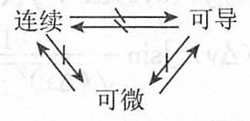

## 可微性与偏导数

### 1. 基本概念、性质

| 名称 | 定义 | 性质 |
| --- | --- | --- |
| 偏导数 | 设函数 $z = f(x, y), (x, y) \in D$. 若 $(x_0, y_0) \in D$, 且 $f(x, y)$ 在 $x_0$ 的某一邻域内有定义，则当 $\Delta x \to 0$ 时， $\lim_{\Delta x \to 0} \frac{\Delta f(x_0, y_0)}{\Delta x} = \lim_{\Delta x \to 0} \frac{f(x_0 + \Delta x, y_0) - f(x_0, y_0)}{\Delta x}$ 关于 $x$ 的偏导数，记作 $f_x(x_0, y_0)$ 或 $\frac{\partial f}{\partial x}\bigg\|_{(x_0, y_0)} = f_x(x_0, y_0)$ | (1) $z = f(x, y)$ 在点 $M_0[x_0, y_0]$ 处的切线 $T_x$, $l_1: \begin{cases} z = z_0 \\ y = y_0 \end{cases}$ 对 $x$ 的斜率. (2) 若 $z = f(x, y)$ 的两个混合偏导数 $f_{xy}(x, y)$ 和 $f_{yx}(x, y)$ 在点 $P_0(x_0, y_0)$ 处连续, 则必相等, 即 $f_{xy}(x_0, y_0) = f_{yx}(x_0, y_0)$ |
| 全微分 | 函数 $z = f(x, y)$ 在点 $(x_0, y_0)$ 的某一邻域内有定义, 给 $x_0, y_0$ 以改变量 $\Delta x, \Delta y$, 便得到 $z$ 的全改变量 $\Delta z = f(x_0 + \Delta x, y_0 + \Delta y) - f(x_0, y_0)$ | (1) 若 $z = f(x, y)$ 在 $(x_0, y_0)$ 可微, 则 $f(x, y)$ 在 $(x_0, y_0)$ 连续. (2) 若 $z = f(x, y)$ 在 $(x_0, y_0)$ 可微, 则 $f(x, y)$ 在 $(x_0, y_0)$ 的两个偏导数存在, 且 $f_x(x_0, y_0) = B, f_y(x_0, y_0) = B$. $A, B$ 仅与点 $(x_0, y_0)$ 有关, 而与 $\Delta x; \Delta y$ 无关. (3) 若 $z = f(x, y)$ 在 $(x_0, y_0)$ 的某邻域存在偏导数 $f_x, f_y$, 且它们在 $(x_0, y_0)$ 处连续, 则 $z = f(x, y)$ 在 $(x_0, y_0)$ 处可微 |

2. 连续、可导、可微三者的关系

二元函数 $z = f(x, y)$ 连续、可导(两个偏导数存在) 与可微三者关系如下:

3. 可微性条件

(1) 定理(必要条件) 若二元函数 $f$ 在定义域内一点 $(x_0, y_0)$ 处可微, 则 $f$ 在该点关于每个自变量的偏导数都存在, 且 $A = f_x(x_0, y_0), B = f_y(x_0, y_0)$, 因此函数 $f$ 在点 $(x_0, y_0)$ 的全微分可唯一地表示为 

$$
df\bigg|_{(x_0, y_0)} = f_x(x_0, y_0) \cdot \Delta x + f_y(x_0, y_0) \cdot \Delta y
$$ 

与一元函数的情况一样, 由于自变量增量等于自变量的微分, 即 $\Delta x = dx, \Delta y = dy$, 所以全微分又可写为 $dz = f_x(x_0, y_0) dx + f_y(x_0, y_0) dy$

(2) 定理(充分条件) 若函数 $z = f(x, y)$ 的偏导数在点 $(x_0, y_0)$ 的某邻域内存在, 且 $f_x$ 与 $f_y$ 在点 $(x_0, y_0)$ 处连续, 则函数 $f$ 在点 $(x_0, y_0)$ 可微.

(3) 函数 $f(x, y)$ 在 $P_0(x_0, y_0)$ 处可微的充要条件: 函数 $f$ 的两个偏导数 $f_x, f_y$ 在 $P_0(x_0, y_0)$ 处连续.

4. 可微性几何意义及应用

曲面 $z = f(x, y)$ 在点 $P_0(x_0, y_0, f(x_0, y_0))$ 存在不平行于 $z$ 轴的切平面的充要条件: 函数 $f$ 在点 $P_0(x_0, y_0)$ 处可微, 且该切平面和法线方程分别为
$$
\begin{aligned}

z - z_0 = f_x(x_0, y_0)(x - x_0) + f_y(x_0, y_0)(y - y_0) \\

\frac{x - x_0}{f_x(x_0, y_0)} = \frac{y - y_0}{f_y(x_0, y_0)} = \frac{z - z_0}{-1}

\end{aligned}
$$
其中, $n = (f_x(x_0, y_0), f_y(x_0, y_0), -1)$ 是曲面 $z = f(x, y)$ 在点 $P_0$ 处的法向量.