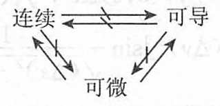

## 可微性与偏导数

### 1. 基本概念、性质

| 名称 | 定义 | 性质 |
| --- | --- | --- |
| 偏导数 | 设函数 $z = f(x, y), (x, y) \in D$. 若 $(x_0, y_0) \in D$, 且 $f(x, y)$ 在 $x_0$ 的某一邻域内有定义，则当 $\Delta x \to 0$ 时， $\lim_{\Delta x \to 0} \frac{\Delta f(x_0, y_0)}{\Delta x} = \lim_{\Delta x \to 0} \frac{f(x_0 + \Delta x, y_0) - f(x_0, y_0)}{\Delta x}$ 关于 $x$ 的偏导数，记作 $f_x(x_0, y_0)$ 或 $\frac{\partial f}{\partial x}\bigg\|_{(x_0, y_0)} = f_x(x_0, y_0)$ | (1) $z = f(x, y)$ 在点 $M_0[x_0, y_0]$ 处的切线 $T_x$, $l_1: \begin{cases} z = z_0 \\ y = y_0 \end{cases}$ 对 $x$ 的斜率. (2) 若 $z = f(x, y)$ 的两个混合偏导数 $f_{xy}(x, y)$ 和 $f_{yx}(x, y)$ 在点 $P_0(x_0, y_0)$ 处连续, 则必相等, 即 $f_{xy}(x_0, y_0) = f_{yx}(x_0, y_0)$ |
| 全微分 | 函数 $z = f(x, y)$ 在点 $(x_0, y_0)$ 的某一邻域内有定义, 给 $x_0, y_0$ 以改变量 $\Delta x, \Delta y$, 便得到 $z$ 的全改变量 $\Delta z = f(x_0 + \Delta x, y_0 + \Delta y) - f(x_0, y_0)$ | (1) 若 $z = f(x, y)$ 在 $(x_0, y_0)$ 可微, 则 $f(x, y)$ 在 $(x_0, y_0)$ 连续. (2) 若 $z = f(x, y)$ 在 $(x_0, y_0)$ 可微, 则 $f(x, y)$ 在 $(x_0, y_0)$ 的两个偏导数存在, 且 $f_x(x_0, y_0) = B, f_y(x_0, y_0) = B$. $A, B$ 仅与点 $(x_0, y_0)$ 有关, 而与 $\Delta x; \Delta y$ 无关. (3) 若 $z = f(x, y)$ 在 $(x_0, y_0)$ 的某邻域存在偏导数 $f_x, f_y$, 且它们在 $(x_0, y_0)$ 处连续, 则 $z = f(x, y)$ 在 $(x_0, y_0)$ 处可微 |

2. 连续、可导、可微三者的关系

二元函数 $z = f(x, y)$ 连续、可导(两个偏导数存在) 与可微三者关系如下:

3. 可微性条件

(1) 定理(必要条件) 若二元函数 $f$ 在定义域内一点 $(x_0, y_0)$ 处可微, 则 $f$ 在该点关于每个自变量的偏导数都存在, 且 $A = f_x(x_0, y_0), B = f_y(x_0, y_0)$, 因此函数 $f$ 在点 $(x_0, y_0)$ 的全微分可唯一地表示为 

$$
df\bigg|_{(x_0, y_0)} = f_x(x_0, y_0) \cdot \Delta x + f_y(x_0, y_0) \cdot \Delta y
$$ 

与一元函数的情况一样, 由于自变量增量等于自变量的微分, 即 $\Delta x = dx, \Delta y = dy$, 所以全微分又可写为 $dz = f_x(x_0, y_0) dx + f_y(x_0, y_0) dy$

(2) 定理(充分条件) 若函数 $z = f(x, y)$ 的偏导数在点 $(x_0, y_0)$ 的某邻域内存在, 且 $f_x$ 与 $f_y$ 在点 $(x_0, y_0)$ 处连续, 则函数 $f$ 在点 $(x_0, y_0)$ 可微.

(3) 函数 $f(x, y)$ 在 $P_0(x_0, y_0)$ 处可微的充要条件: 函数 $f$ 的两个偏导数 $f_x, f_y$ 在 $P_0(x_0, y_0)$ 处连续.

4. 可微性几何意义及应用

曲面 $z = f(x, y)$ 在点 $P_0(x_0, y_0, f(x_0, y_0))$ 存在不平行于 $z$ 轴的切平面的充要条件: 函数 $f$ 在点 $P_0(x_0, y_0)$ 处可微, 且该切平面和法线方程分别为
$$
\begin{aligned}

z - z_0 = f_x(x_0, y_0)(x - x_0) + f_y(x_0, y_0)(y - y_0) \\

\frac{x - x_0}{f_x(x_0, y_0)} = \frac{y - y_0}{f_y(x_0, y_0)} = \frac{z - z_0}{-1}

\end{aligned}
$$
其中, $n = (f_x(x_0, y_0), f_y(x_0, y_0), -1)$ 是曲面 $z = f(x, y)$ 在点 $P_0$ 处的法向量.

## 复合函数微分法

1. 链式法则

设函数 $x = \varphi(s,t), y = \phi(s,t)$ 在点 $(s,t) \in D$ 可微, $z = f(x,y)$ 在点 $(x,y) = (\varphi(s,t), \phi(s,t))$ 可微, 则复合函数

$$
z = f(\varphi(s,t), \phi(s,t))
$$

在点 $(s,t)$ 可微, 并且有链式法则

$$
\begin{cases}
\frac{\partial z}{\partial s} = \frac{\partial z}{\partial x} \cdot \frac{\partial x}{\partial s} + \frac{\partial z}{\partial y} \cdot \frac{\partial y}{\partial s} \\
\frac{\partial z}{\partial t} = \frac{\partial z}{\partial x} \cdot \frac{\partial x}{\partial t} + \frac{\partial z}{\partial y} \cdot \frac{\partial y}{\partial t}
\end{cases}
$$

2. 一阶全微分形式不变性

设函数 $x = \varphi(s,t), y = \phi(s,t)$ 在点 $(s,t) \in D$ 可微, $z = f(x,y)$ 在点 $(x,y) = (\varphi(s,t), \phi(s,t))$ 可微, 则 $z$ 无论是作为中间变量 $x, y$ 的函数, 还是作为自变量 $s, t$ 的函数, 都有

$$
dz = \frac{\partial z}{\partial x} dx + \frac{\partial z}{\partial y} dy.
$$

## 方向导数与梯度

| 名称 | 定义 | 性质 |
| --- | --- | --- |
| 方向导数 | 设三元函数 $f$ 在点 $P_0(x_0, y_0, z_0)$ 的某邻域 $U(P_0) \subset \mathbb{R}^3$ 内有定义，$l$ 为从点 $P_0$ 出发的射线，则极限 $\frac{\partial f}{\partial l} \bigg\verticleLine_{P_0} = \lim_{\rho \to 0^+} \frac{f(P) - f(P_0)}{\rho} = \lim_{\rho \to 0^+} \frac{\Delta f}{\rho}$ 为函数 $f$ 在点 $P_0$ 处沿射线 $l$ 方向的方向导数 | (1) 若 $f$ 在点 $P_0$ 存在关于 $x$ 的偏导数，则 $f$ 在点 $P_0$ 沿 $x$ 轴正向的方向导数恰为 $\frac{\partial f}{\partial l} \bigg\verticleLine_{P_0} = \frac{\partial f}{\partial x} \bigg\verticleLine_{P_0}$； 当 $l$ 的方向为 $x$ 轴的负方向时，则有 $\frac{\partial f}{\partial l} \bigg\verticleLine_{P_0} = -\frac{\partial f}{\partial x} \bigg\verticleLine_{P_0}$ (2) 若函数 $f$ 在点 $P_0(x_0, y_0, z_0)$ 可微，则 $f$ 在点 $P_0$ 处沿任一方向 $l$ 的方向导数都存在，且 $f_l(P_0) = f_x(P_0)\cos\alpha + f_y(P_0)\cos\beta + f_z(P_0)\cos\gamma$ 其中 $(\cos\alpha, \cos\beta, \cos\gamma)$ 为方向 $l$ 的方向导数 |
| 梯度 | 若 $f(x, y, z)$ 在点 $P_0(x_0, y_0, z_0)$ 存在对所有自变量的偏导数，则称向量 $\{f_x(P_0), f_y(P_0), f_z(P_0)\}$ 为函数 $f$ 在点 $P_0$ 的梯度。$\text{grad} f = (f_x(P_0), f_y(P_0), f_z(P_0))$ 向量 $\text{grad} f$ 的长度（或模）为 $\abs{\text{grad} f} = \sqrt{[f_x(P_0)]^2 + [f_y(P_0)]^2 + [f_z(P_0)]^2}$ | 若记 $l$ 方向的单位向量为 $l_0 = (\cos\alpha, \cos\beta, \cos\gamma)$，于是方向导数公式又可写成 $f_l(P_0) = \text{grad} f(P_0) \cdot l_0 = \abs{\text{grad} f(P_0)} \cos\theta$ 其中 $\theta$ 是梯度向量 $\text{grad} f(P_0)$ 与 $l_0$ 的夹角，因此当 $\theta = 0$ 时，$f(P_0)$ 取得最大值 $\abs{\text{grad} f(P_0)}$；当 $\theta = \pi$ 时，$f(P_0)$ 取最小值 $-\abs{\text{grad} f(P_0)}$ |

## 泰勒公式与极值问题

### 1. 高阶偏导数

如果函数 $f(x, y)$ 的偏导数 $f_x(x, y), f_y(x, y)$ 继续可求偏导数，则称 $f_x(x, y), f_y(x, y)$ 的偏导数为 $f(x, y)$ 的二阶偏导数；类似地可定义 $k (k \geq 3)$ 阶偏导数的概念。

以二阶偏导数为例，有如下 4 种情况：

$$
\frac{\partial}{\partial x}\left(\frac{\partial z}{\partial x}\right) = \frac{\partial^2 z}{\partial x^2} = f_{xx}(x, y);
$$

$$
\frac{\partial}{\partial y}\left(\frac{\partial z}{\partial x}\right) = \frac{\partial^2 z}{\partial x \partial y} = f_{xy}(x, y);
$$

$$
\frac{\partial}{\partial x}\left(\frac{\partial z}{\partial y}\right) = \frac{\partial^2 z}{\partial y \partial x} = f_{yx}(x, y);
$$

$$
\frac{\partial}{\partial y}\left(\frac{\partial z}{\partial y}\right) = \frac{\partial^2 z}{\partial y^2} = f_{yy}(x, y).
$$

混合偏导数相等的充分条件：$f_{xy}(x, y)$ 与 $f_{yx}(x, y)$ 都在 $(x_0, y_0)$ 处连续，则

$$
f_{xy}(x_0, y_0) = f_{yx}(x_0, y_0).
$$

### 2. 中值定理和泰勒公式

| 名称 | 内容 | 说明 |
| --- | --- | --- |
| 微分中值定理 | 设二元函数 $f$ 在凸开域 $D \subset \mathbb{R}^2$ 上连续，在 $D$ 的所有内点都可微，则对 $D$ 内任意两点 $P(a, b), Q(a+h, b+k) \in D$，存在某个 $\theta (0 < \theta < 1)$，使得 $f(a+h, b+k) - f(a, b) = f_x(a+\theta h, b+\theta k)h + f_y(a+\theta h, b+\theta k)k$ | (1) 如果 $D$ 是凸区域，$f$ 在 $D$ 上连续，在 int$D$ 内可微，且线段 $PQ$ 上除端点 $P, Q$ 外都是 $D$ 的内点，则等式同样成立。 (2) 若函数 $f(x, y)$ 在区域 $D$ 上存在偏导数，且满足 $f_x = f_y = 0$，则 $f$ 在区域 $D$ 上恒为一常数 |
| 泰勒公式 | 设 $z = f(x, y)$ 在包含点 $M_0(x_0, y_0)$ 的某个邻域 $D$ 内存在直到 $n+1$ 阶连续偏导数，$M(x_0 + \Delta x, y_0 + \Delta y) \in D$，且 $M_0M < D$，则有公式： $f(x_0 + h, y_0 + k) = f(x_0, y_0) + (h \frac{\partial}{\partial x} + k \frac{\partial}{\partial y})f(x_0, y_0) + \frac{1}{2!}(h \frac{\partial}{\partial x} + k \frac{\partial}{\partial y})^2 f(x_0, y_0) + \cdots + \frac{1}{n!}(h \frac{\partial}{\partial x} + k \frac{\partial}{\partial y})^n f(x_0, y_0) + \frac{1}{(n+1)!}(h \frac{\partial}{\partial x} + k \frac{\partial}{\partial y})^{n+1} f(x_0 + \theta h, y_0 + \theta k) \quad (0 < \theta < 1)$ 其中，$(h \frac{\partial}{\partial x} + k \frac{\partial}{\partial y})^m f(x_0, y_0) = \sum_{i=1}^{m} c_m^i \frac{\partial^m}{\partial x^i \partial y^{m-i}} f(x_0, y_0) h^i k^{m-i} $ |  |

### 3. 极值问题

| 名称 | 内容 | 说明 |
| --- | --- | --- |
| 极值定义 | 设函数 $f$ 在点 $P_0(x_0, y_0)$ 的某邻域 $U(P_0)$ 内有定义，若对 $\forall P(x, y) \in U(P)$ 有 $f(P) \leq f(P_0)$（或 $f(P) \geq f(P_0)$），则称 $f$ 在点 $P_0$ 取得极大（或极小）值，点 $P_0$ 称为函数 $f$ 的一个极大（或极小）值点 | 极值点必须是函数定义域的内点 |
| 极值必要条件 | 如果函数 $f(x, y)$ 在点 $P_0(x_0, y_0)$ 存在偏导数，且 $P_0$ 为 $f$ 的极值点，则 $f_x(P_0) = f_y(P_0) = 0$ | 偏导数等于零的点称为稳定点。因此，如果 $f$ 存在偏导数，则其极值点必为稳定点，而稳定点不一定为极值点 |
| 极值充分条件 | 设函数 $f(x, y)$ 在点 $P_0(x_0, y_0)$ 的某邻域内有连续的二阶偏导数，且 $P_0$ 为其稳定点，则 (1) 当 $H_f(P_0)$ 正定时，$f(P_0)$ 是 $f$ 的一个极小值。 (2) 当 $H_f(P_0)$ 负定时，$f(P_0)$ 是 $f$ 的一个极大值。 (3) 当 $H_f(P_0)$ 不定时，$f(P_0)$ 不是 $f$ 的极值 | (1) 对二阶实对称矩阵 $H = \begin{pmatrix} a & b \\ b & c \end{pmatrix}$。 (2) $H_f(P_0) = \begin{pmatrix} f_{xx} & f_{xy} \\ f_{yx} & f_{yy} \end{pmatrix}_{P_0}$。 ① $H$ 正定的充要条件：$a > 0, ac - b^2 > 0$。 ② $H$ 负定的充要条件：$a < 0, ac - b^2 > 0$。 ③ $H$ 不定的充要条件：$ac - b^2 < 0$。 |