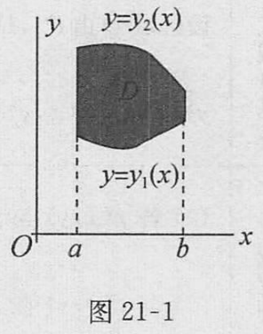
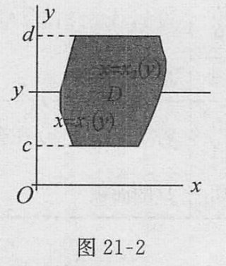
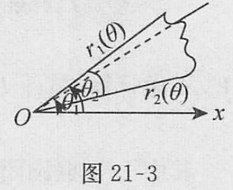
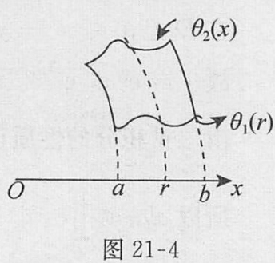

# 第二十一章 重积分

## 二重积分的概念

1. 平面图形的面积

平面图形 $P$ 的面积：若平面图形 $P$ 的内面积 $I_P$ 等于它的外面积 $I_F$，则称 $P$ 为可求面积，并称其共同值 $I_P = I_F = \overline{I}_P$ 为 $P$ 的面积。

**定理 1** 平面有界图形 $P$ 可求面积的充要条件是：对任给 $\varepsilon > 0$, 总存在直线网 $T$, 使得 $S_p(T) - S_p(T) < \varepsilon$。

推论 平面有界图形 $P$ 的面积为零的充要条件是它的外面积 $I_F = 0$，即对任给的 $\varepsilon > 0$, 存在直线网 $T$, 使得 $S_p(T) < \varepsilon$ 或对任给的 $\varepsilon > 0$, 平面图形 $P$ 能被有限个其面积总和小于 $\varepsilon$ 的小矩形所覆盖。

**定理 2** 平面有界图形 $P$ 可求面积的充要条件是：$P$ 的边界 $K$ 的面积为零。

重要结论：① 若曲线 $K$ 为定义在 $(a, b]$ 上的连续函数 $y = f(x)$ 的图像，则曲线 $K$ 的面积为零；② 由参数方程 $x = \varphi(t), y = \psi(t) (a \leq t \leq \beta)$ 所表示的平面光滑曲线段按段光滑曲线的面积为零。

2. 二重积分的概念

| 名称 | 内容 |
| --- | --- |
| 二重积分的定义 | 设 $f(x, y)$ 是定义在可求面积的有界闭区域 $D$ 上的函数。$J$ 是一个确定的数，若对任给的正数 $\varepsilon$，总存在某个正数 $\delta$，使对于 $D$ 的任何分割 $T$，当它的细度 $\|T\| < \delta$ 时，属于 $T$ 的所有积分和都有 $\left| \sum_{i=1}^{n} f(\xi_i, \eta_i) \Delta \sigma_i - J \right| < \varepsilon$，则称 $f(x, y)$ 在 $D$ 上可积，数 $J$ 称为函数 $f(x, y)$ 在 $D$ 上的二重积分，记作 $J = \iint_D f(x, y) \mathrm{d}a$ |
| $f(x, y)$ 在 $D$ 上可积的条件 | (1) $f(x, y)$ 在 $D$ 上可积的充要条件是 $\lim_{\|T\| \to 0} S(T) = \lim_{\|T\| \to 0} s(T)$。 (2) $f(x, y)$ 在 $D$ 上可积的充要条件是：对于任给的正数 $\varepsilon$，存在 $D$ 的某个分割 $T$，使得 $S(T) - s(T) < \varepsilon$ (3) 有界闭区域 $D$ 上的连续函数必可积。 (4) 设 $f(x, y)$ 是定义在有界闭区域 $D$ 上的有界函数，其中不连续点集 $E$ 是零面积集，则 $f(x, y)$ 在 $D$ 上可积 |
| 二重积分的几何意义 | (1) 当 $f(x, y) \geq 0$ 时，$\iint_D f(x, y) \mathrm{d}a$ 是以区域 $D$ 为底，以 $f(x, y)$ 为高，$S$ 为顶的曲顶柱体的体积。 (2) 当 $f(x, y) \leq 0$ 时，$\iint_D f(x, y) \mathrm{d}a$ 是以区域 $D$ 为底，以 $f(x, y)$ 为高，$S$ 为顶的曲顶柱体体积的相反数。 (3) 当 $f(x, y) = 1$ 时，$\iint_D \mathrm{d}a = S_D$ 为区域 $D$ 的面积 |
| 存在性 | 若 $f(x, y)$ 在区域 $D$ 内分片连续，则 $\iint_D f(x, y) \mathrm{d}a$ 存在 |

3. 二重积分的性质

| 名称 | 内容 |
| --- | --- |
| 线性性质 | $\iint_D k f(x, y) \mathrm{d}a = k \iint_D f(x, y) \mathrm{d}a, k$ 是常数。 $\iint_D [f(x, y) \pm g(x, y)] \mathrm{d}a = \iint_D f(x, y) \mathrm{d}a \pm \iint_D g(x, y) \mathrm{d}a$ |
| 区域可加性 | 设区域 $D$ 由 $D_1, D_2$ 组成，且 $D_1, D_2$ 除边界点处无其他公共点，则 $f(x, y)$ 在 $D_1 \cup D_2$ 上也可积，且 $\iint_D f(x, y) \mathrm{d}a = \iint_{D_1} f(x, y) \mathrm{d}a + \iint_{D_2} f(x, y) \mathrm{d}a$ |
| 比较定理 | (1) 若 $f(x, y)$ 与 $g(x, y)$ 在区域 $D$ 上可积，且有 $f(x, y) \leq g(x, y)$，则有 $\iint_D f(x, y) \mathrm{d}a \leq \iint_D g(x, y) \mathrm{d}a$。 (2) 若 $f(x, y)$ 在 $D$ 上可积，则函数 $|f(x, y)|$ 在 $D$ 上也可积，且 $\left| \iint_D f(x, y) \mathrm{d}a \right| \leq \iint_D |f(x, y)| \mathrm{d}a$ |
| 估值定理 | 设 $m, M$ 分别是 $f(x, y)$ 在闭区域 $D$ 上的最大值和最小值，则 $mS_D \leq \iint_D f(x, y) \mathrm{d}a \leq MS_D$，其中 $S_D$ 表示区域 $D$ 的面积 |
| 中值定理 | 若函数 $f(x, y)$ 在有界闭区域 $D$ 上连续，则存在 $(\xi, \eta) \in D$，使 $\iint_D f(x, y) \mathrm{d}a = f(\xi, \eta) \cdot S_D$，其中 $S_D$ 为区域 $D$ 的面积 |

小提示：不完全相等的两个函数其积分值也可能相同。例如：$f(x), g(x)$ 都是定义在 $[a, b]$ 上的有界函数，它们只在有限个点处函数值不相等。

## 二重积分的计算

| 名称 | - | 内容 | 图示 |
| --- | --- | --- | --- |
| 直角坐标系 | 先对 $y$ 积分再对 $x$ 积分 | 若 $D$ 为由 $x = a, x = b, y = y_1(x), y = y_2(x)$ 所围成的区域（图 21-1），即 $D: \begin{cases} a \leq x \leq b \\ y_1(x) \leq y \leq y_2(x) \end{cases}$ 则 $\iint_D f(x, y) \mathrm{d}a = \int_a^b \left[ \int_{y_1(x)}^{y_2(x)} f(x, y) \mathrm{d}y \right] \mathrm{d}x$ |  |
| | 先对 $x$ 积分再对 $y$ 积分 | 若 $D$ 为由 $y = c, y = d, x = x_1(y), x = x_2(y)$ 所围成的区域（图 21-2），即 $D: \begin{cases} c \leq y \leq d \\ x_1(y) \leq x \leq x_2(y) \end{cases}$ 则 $\iint_D f(x, y) \mathrm{d}a = \int_c^d \left[ \int_{x_1(y)}^{x_2(y)} f(x, y) \mathrm{d}x \right] \mathrm{d}y$ |  |
| 极坐标系 | 先对 $r$ 积分再对 $\theta$ 积分 | 若 $D$ 为由 $\theta = \theta_1, \theta = \theta_2, r = r_1(\theta), r = r_2(\theta)$ 所围成的区域（图 21-3），即 $D: \begin{cases} \theta_1 \leq \theta \leq \theta_2 \\ r_1(\theta) \leq r \leq r_2(\theta) \end{cases}$ 则 $\iint_D f(x, y) \mathrm{d}a = \int_{\theta_1}^{\theta_2} \left[ \int_{r_1(\theta)}^{r_2(\theta)} f(r \cos \theta, r \sin \theta) r \mathrm{d}r \right] \mathrm{d}\theta$ |  |
| | 先对 $\theta$ 积分再对 $r$ 积分 | 若 $D$ 为由 $\theta = \theta_1(\theta), \theta = \theta_2(r), r = a, r = b$ 所围成的区域（图 21-4），即 $D: \begin{cases} \theta_1(r) \leq \theta \leq \theta_2(r) \\ a \leq r \leq b \end{cases}$ 则 $\iint_D f(x, y) \mathrm{d}a = \int_a^b \left[ \int_{\theta_1(r)}^{\theta_2(r)} f(r \cos \theta, r \sin \theta) r \mathrm{d}\theta \right] \mathrm{d}r$ |  |
| 变量替换 | | 设函数 $f(x, y)$ 在区域 $D$ 上连续，变换 $\begin{cases} x = x(u, v) \\ y = y(u, v) \end{cases}$ 把直角坐标系 $uv$ 平面上的区域 $D'$ 一对一映射成直角坐标系 $xy$ 平面上的区域 $D$，并且变换函数 $x(u, v)$ 与 $y(u, v)$ 在 $D'$ 上有连续偏导数，而且 $J = \frac{\partial (x, y)}{\partial (u, v)} \neq 0$，则 $\iint_D f(x, y) \mathrm{d}a = \iint_{D'} f(x(u, v), y(u, v)) |J| \mathrm{d}u \mathrm{d}v$ | |

## 格林公式 · 曲线积分与路径的无关性

| 名称 | 内容 | 备注 |
| --- | --- | --- |
| Green公式（格林公式） | 设函数 $P(x, y), Q(x, y)$ 在有界闭区域 $D$ 上有一阶连续偏导数，$D$ 的边界 $\partial D$ 由一条或几条光滑曲线所组成，记为 $\partial D^+$ 为 $D$ 的正向边界，则 $\iint_D \left( \frac{\partial Q}{\partial x} - \frac{\partial P}{\partial y} \right) \mathrm{d}x \mathrm{d}y = \oint_{\partial D^+} P \mathrm{d}x + Q \mathrm{d}y$ | 注：所谓正向边界，是指在 $\partial D$ 上沿着这个方向行走，$D$ 始终落在行走方向的左侧 |
| $P \mathrm{d}x + Q \mathrm{d}y$ 的原函数 | 若 $P(x, y) \mathrm{d}x + Q(x, y) \mathrm{d}y$ 或 $P(x, y, z) \mathrm{d}x + Q(x, y, z) \mathrm{d}y + R(x, y, z) \mathrm{d}z$ 是某一函数 $u(x, y) [$或 $u(x, y, z)]$ 的全微分，即 $\mathrm{d}u(x, y) = P(x, y) \mathrm{d}x + Q(x, y) \mathrm{d}y$ 或 $\mathrm{d}u(x, y, z) = P(x, y, z) \mathrm{d}x + Q(x, y, z) \mathrm{d}y + R(x, y, z) \mathrm{d}z$，则称 $u(x, y)$ 是 $P \mathrm{d}x + Q \mathrm{d}y$ 的原函数，或 $u(x, y, z)$ 是 $P \mathrm{d}x + Q \mathrm{d}y + R \mathrm{d}z$ 的原函数 |
| 积分与路径无关的条件 | 设 $D$ 是单连通闭区域，若函数 $P(x, y), Q(x, y)$ 在 $D$ 内连续，且具有一阶连续偏导数，则以下 4 个条件等价：  ① 沿 $D$ 内任一按段光滑封闭曲线 $L$，有 $\oint_L P \mathrm{d}x + Q \mathrm{d}y = 0$；  ② 对 $D$ 中任一按段光滑曲线 $L$，曲线积分 $\int_L P \mathrm{d}x + Q \mathrm{d}y$ 与路径无关，只与 $L$ 的起点和终点有关；  ③ $P \mathrm{d}x + Q \mathrm{d}y$ 是 $D$ 内某一函数 $u(x, y)$ 的全微分，即在 $D$ 内有 $\mathrm{d}u = P \mathrm{d}x + Q \mathrm{d}y$；  ④ 在 $D$ 内处处成立 $\frac{\partial P}{\partial y} = \frac{\partial Q}{\partial x}$ | 在这个结论中，它重点强调条件 ④，因此要求函数 $P, Q$ 具有一阶连续偏导数。当 $D$ 不一定是单连通区域时，如果 $P, Q$ 上连续，则 ①⇒②⇒③ 仍成立 |

# 三重积分

1. 三重积分的概念

定义：设 $f(x, y, z)$ 是定义在三维空间可求体积的有界闭区域 $V$ 上的有界函数，$J$ 是一个确定的数，若对任给的正数 $\varepsilon$，总存在某一个正数 $\delta$，使得对于 $V$ 的任何分割 $T$，只要 $\|T\| < \delta$，属于分割 $T$ 的所有积分和都有 $\left| \sum_{i=1}^{n} f(\xi_i, \eta_i, \zeta_i) \Delta V_i - J \right| < \varepsilon$，则称 $f(x, y, z)$ 在 $V$ 上可积，数 $J$ 称为函数 $f(x, y, z)$ 在 $V$ 上的三重积分，记作 $J = \iiint_V f(x, y, z) \mathrm{d}V = \iiint_V f(x, y, z) \mathrm{d}x \mathrm{d}y \mathrm{d}z$。

注意：(1) 三重积分没有几何意义，若 $f(x, y, z) = 1$，则 $\iiint_V f(x, y, z) \mathrm{d}V = |V|$ 是区域 $V$ 的体积。 (2) 三重积分的存在性类似于二重积分。 (3) 三重积分的性质类似于二重积分。

2. 化三重积分为累次积分

设函数 $f(x, y, z)$ 在长方体 $V = [a, b] \times [c, d] \times [e, h]$ 上的三重积分存在，且对任何 $x \in [a, b]$，二重积分 $I(x) = \iint_D f(x, y, z) \mathrm{d}y \mathrm{d}z$ 存在，其中 $D = [c, d] \times [e, h]$，则积分 $\int_a^b \left[ \int_c^d \left[ \int_e^h f(x, y, z) \mathrm{d}z \right] \mathrm{d}y \right] \mathrm{d}x$ 也存在，且 $\iiint_V f(x, y, z) \mathrm{d}x \mathrm{d}y \mathrm{d}z = \int_a^b \mathrm{d}x \iiint_D f(x, y, z) \mathrm{d}y \mathrm{d}z$。

3. 三重积分的换元法

设变换 $T: x = x(u, v, w), y = y(u, v, w), z = z(u, v, w)$，把 $uvw$ 空间中的闭域 $V'$ 一对一映射成 $xyz$ 空间中的区域 $V$，并设函数 $x(u, v, w), y(u, v, w), z(u, v, w)$ 及它们的一阶偏导数在 $V'$ 内连续且函数行列式

$$
J(u, v, w) = \begin{vmatrix}
\frac{\partial x}{\partial u} & \frac{\partial x}{\partial v} & \frac{\partial x}{\partial w} \\
\frac{\partial y}{\partial u} & \frac{\partial y}{\partial v} & \frac{\partial y}{\partial w} \\
\frac{\partial z}{\partial u} & \frac{\partial z}{\partial v} & \frac{\partial z}{\partial w}
\end{vmatrix} \neq 0, (u, v, w) \in V' ,
$$

则 $\iiint_V f(x, y, z) \mathrm{d}x \mathrm{d}y \mathrm{d}z = \iiint_{V'} f(x(u, v, w), y(u, v, w), z(u, v, w)) \left| J(u, v, w) \right| \mathrm{d}u \mathrm{d}v \mathrm{d}w$，其中 $f(x, y, z)$ 在 $V$ 上可积。

| 名称 | 内容 |
| --- | --- |
| 柱面坐标变换 | 设 $f(x, y, z)$ 在有界闭区域 $V$ 上可积，在柱面坐标变换 $T: \begin{cases} x = r \cos \theta && 0 \leq r < +\infty \\ y = r \sin \theta && 0 \leq \theta \leq 2\pi \\ z = z && -\infty < z < +\infty\end{cases}$   $V$ 与 $r\theta z$ 空间中区域 $V'$ 相对应  则 $\iiint_V f(x, y, z) \mathrm{d}x \mathrm{d}y \mathrm{d}z = \iiint_{V'} f(r \cos \theta, r \sin \theta, z) r \mathrm{d}r \mathrm{d}\theta \mathrm{d}z$ |
| 球坐标变换 | 设 $f(x, y, z)$ 在有界闭区域 $V$ 上可积，在球面坐标变换 $T: \begin{cases} x = r \sin \varphi \cos \theta && 0 \leq r < +\infty \\ y = r \sin \varphi \sin \theta && 0 \leq \varphi \leq \pi \\ z = r \cos \varphi && 0 \leq \theta \leq 2\pi\end{cases}$   $\iiint_V f(x, y, z) \mathrm{d}x \mathrm{d}y \mathrm{d}z = \iiint_{V'} f(r \sin \varphi \cos \theta, r \sin \varphi \sin \theta, r \cos \varphi) r^2 \sin \varphi \mathrm{d}r \mathrm{d}\varphi \mathrm{d}\theta$ |

小提示：
① 三重积分化为累次积分的方法：“先二后一”法和“先一后二”法；
② 利用对称性简化三重积分的运算。