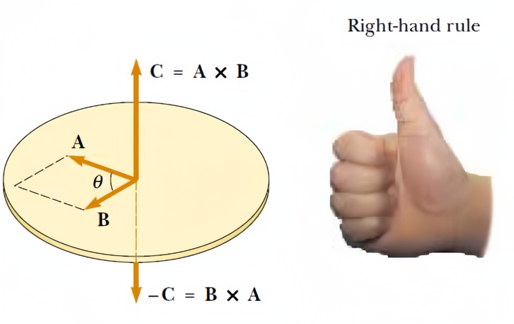

import ReciteHidden from "@/components/md-comp/Recite_Hidden.vue";

# 矢量运算

$$
\begin{matrix}
(a) & \quad\mathbf{a} \times \left( \mathbf{b} + \mathbf{c} \right) = \mathbf{a} \times \mathbf{b} + \mathbf{a} \times \mathbf{c}, \\
(b) & \quad\left( \alpha\mathbf{a} \right) \times \mathbf{b} = \alpha\left( \mathbf{a} \times \mathbf{b} \right), \\
(c) & \quad\mathbf{a} \cdot \left( \mathbf{b} \times \mathbf{c} \right) = \left( \mathbf{a} \times \mathbf{b} \right) \cdot \mathbf{c}, \\
(d) & \quad\mathbf{a} \times \left( \mathbf{b} \times \mathbf{c} \right) = \mathbf{b}\left( \mathbf{a} \cdot \mathbf{c} \right) - \mathbf{c}\left( \mathbf{a} \cdot \mathbf{b} \right), \\
(e) & \quad\mathbf{a} \times \mathbf{a} = \mathbf{0}, \\
(f) & \quad\mathbf{a} \cdot \left( \mathbf{a} \times \mathbf{b} \right) = 0.
\end{matrix}
$$

$\mathbf{a} \times \mathbf{a}$的方向是什么？

<ReciteHidden>

右手法则：用右手的四指指向第一个矢量$\mathbf{a}$的方向，弯曲四指使其指向第二个矢量$\mathbf{b}$的方向，则大拇指所指的方向就是$\mathbf{a} \times \mathbf{b}$的方向。

</ReciteHidden>

# 转动

在我们的推导中，我们发现，转动力学的结论与平动力学有着惊人的相似性。关注这份相似性既能体会物理的美感，又能加深对结论的记忆。

Angular speed $\omega = \frac{d\theta}{dt}$  
Linear speed $v = \frac{dx}{dt}$

Angular acceleration $\alpha = \frac{d\omega}{dt}$  
Linear acceleration $a = \frac{dv}{dt}$

Resultant torque $\sum \tau = I\alpha$  
Resultant force $\sum F = ma$

If $\alpha = \text{constant}, 
\begin{cases} 
\omega_f = \omega_i + \alpha t \\
\theta_f - \theta_i = \omega_i t + \frac{1}{2}\alpha t^2 \\
\omega_f^2 = \omega_i^2 + 2\alpha(\theta_f - \theta_i)
\end{cases}
$

If $a = \text{constant}, 
\begin{cases} 
v_f = v_i + at \\
x_f - x_i = v_i t + \frac{1}{2}at^2 \\
v_f^2 = v_i^2 + 2a(x_f - x_i)
\end{cases}
$

Work $W = \int_{\theta_i}^{\theta_f} \tau d\theta$  
Work $W = \int_{x_i}^{x_f} F_x dx$

Rotational kinetic energy $K_R = \frac{1}{2}I\omega^2$  
Kinetic energy $K = \frac{1}{2}mv^2$

Power $P = \tau \cdot \omega$  
Power $P = F \cdot v$

Angular momentum $L = I\omega$  
Linear momentum $p = mv$

Resultant torque $\sum \tau = \frac{dL}{dt}$  
Resultant force $\sum F = \frac{dp}{dt}$

转动惯量的定义是

<ReciteHidden>
$$
I_{z} = \sum_{i}^{}m_{i}\left( x_{i}^{2} + y_{i}^{2} \right) = \int\left( x^{2} + y^{2} \right)\, dm.
$$
</ReciteHidden>

Parallel Axis Theorem/Steiner Theorem(平行轴定理/施泰纳定理)：

记刚体 M 以过质心的轴 (简称质心轴) 为转动轴时的转动惯量为 ICM ，以任意平行于质心轴的轴为转动轴时的转动惯量为 I，这两条轴之间的距离为 h，则有

<ReciteHidden>
$$I=I_{CM}+Mh^2$$
</ReciteHidden>

| 物体                               |         轴         | $\mathbf{I}_{\mathbf{z}}$                         |
| ---------------------------------- | :----------------: | ------------------------------------------------- |
| 细棒，长为$L$                      | 与棒垂直，通过中心 | <ReciteHidden>$\frac{ML^{2}}{12}$</ReciteHidden>                               |
| 细同心圆环，半径为$r_{1}$和$r_{2}$ | 与环垂直，通过中心 | <ReciteHidden>$\frac{M\left( r_{1}^{2} + r_{2}^{2} \right)}{2}$</ReciteHidden> |
| 球，半径为$r$                      |      穿过球心      | <ReciteHidden>$\frac{2Mr^{2}}{5}$</ReciteHidden>                               |

# 流体力学

伯努利方程:  <ReciteHidden>$p + \frac{1}{2}\rho v^2 + \rho gy = \text{constant}$</ReciteHidden>，适用于沿同一流线的任意两点。

连续性方程:  <ReciteHidden>$\rho_1A_1v_1 = \rho_2A_2v_2$，表示流体在管道中的体积流量保持不变</ReciteHidden>

Torricelli's law（托里拆利定律）: 当流体从一个开口容器的底部小孔流出时，流体的流出速度 $v$与容器内流体的高度$h$(**从暴露的液面到出口处**)之间的关系为：<ReciteHidden>$ v = \sqrt{2gh} $</ReciteHidden>